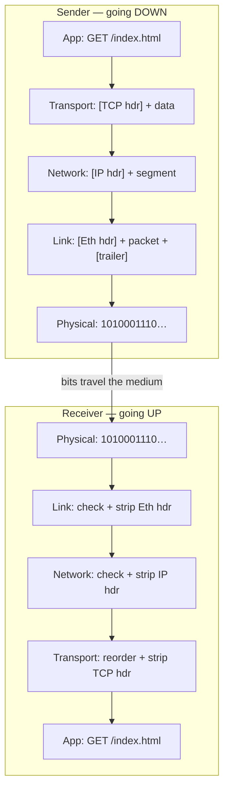

# Module 01 — The Layered Model

> **The one idea to keep:** A network is not one giant machine. It's a stack of small,
> independent problem-solvers, each doing one job and handing the result to the layer
> below it. Every layer talks *as if* it's speaking directly to its twin on the other
> machine, even though the real data physically travels all the way down and back up.

This module is the **map**. Every later module zooms into one region of it. If you
internalize this module, everything else has a place to hang.

---

## 1. Why layers exist at all (the software-engineer version)

You already know this pattern. It's the same reason you don't write a web app as one
10,000-line function.

Imagine you had to send a message to a friend across the world and you had to solve
*everything at once*:

- How do I turn "hello" into voltage/light/radio?
- How do I make sure the cable/air didn't corrupt it?
- How do I find *which* machine, out of billions, is my friend's?
- How do I make sure nothing got lost or arrived out of order?
- How does the *app* (say, WhatsApp) know this message is for it and not for the browser?

That's an impossible tangle if solved as one blob. So networking is designed as a
**stack of layers**, where each layer:

1. Solves exactly **one class of problem**.
2. Offers a **clean service** to the layer above ("give me your data, I'll get it to the
   right machine" — don't ask how).
3. Depends only on the **service of the layer below** (not its internals).

> This is just **abstraction + separation of concerns + dependency inversion** — the
> exact principles you use in code. A layer is an interface; you can swap the
> implementation underneath (Wi-Fi → Ethernet → 4G) without the layers above noticing.

**Why this matters practically:** it's why your Python `requests.get()` works identically
whether you're on fiber, hotel Wi-Fi, or a 4G phone. The app layer never changes. Only
the bottom layers swap out. That swappability *is* the whole point.

---

## 2. Two models: OSI (the teaching model) and TCP/IP (the real one)

There are two layer models you'll hear about. You need both, for different reasons.

### The OSI 7-layer model — the vocabulary everyone uses

Nobody's internet is *literally* built as 7 layers, but the whole industry uses OSI
**numbers and names** to talk. When someone says "that's a Layer 3 device" or "an L7
load balancer," they mean OSI. So learn it as vocabulary.

```
   OSI MODEL                          "What's its job?"                Example
 ┌────────────────────┐
 │ 7  Application      │   The actual app protocol                   HTTP, DNS, SMTP
 ├────────────────────┤
 │ 6  Presentation    │   Data format / encryption / compression    TLS, JPEG, UTF-8
 ├────────────────────┤
 │ 5  Session         │   Start/stop/resume a conversation          (rarely its own layer)
 ├────────────────────┤
 │ 4  Transport       │   End-to-end delivery between programs       TCP, UDP, QUIC
 ├────────────────────┤
 │ 3  Network         │   Find the right MACHINE across networks     IP, ICMP, routing
 ├────────────────────┤
 │ 2  Data Link       │   Get a frame across ONE hop/link           Ethernet, Wi-Fi, ARP
 ├────────────────────┤
 │ 1  Physical        │   Actual bits as signals                    copper, fiber, radio
 └────────────────────┘
```

**Memory hooks (top→bottom):** "All People Seem To Need Data Processing."
(Application, Presentation, Session, Transport, Network, Data link, Physical.)

### The TCP/IP model — how the internet is actually built

The real internet was designed around TCP/IP, which collapses OSI into **4 layers**.
This is the model that matches reality:

```
   TCP/IP MODEL              maps to OSI              What lives here
 ┌────────────────────┐
 │ Application         │  = OSI 5,6,7               HTTP, DNS, TLS, everything an app speaks
 ├────────────────────┤
 │ Transport          │  = OSI 4                    TCP, UDP, QUIC
 ├────────────────────┤
 │ Internet           │  = OSI 3                    IP, ICMP
 ├────────────────────┤
 │ Link (Net access)  │  = OSI 1 + 2                Ethernet, Wi-Fi, 4G radio + the wire
 └────────────────────┘
```

> **How to hold both in your head:** Use **OSI numbers to talk** ("L2 switch", "L4 load
> balancer", "L7 firewall") and the **TCP/IP 4-layer split to reason about how packets
> actually work**. When we get to cellular, the LTE stack (PDCP/RLC/MAC/PHY) is basically
> a very elaborate expansion of the TCP/IP **Link layer** — it's all the machinery to make
> "one hop" work over radio. Keep that in your pocket; it'll pay off in Module 11.

---

## 3. The core mechanic: encapsulation (this is *the* thing to understand)

Here is how data actually moves down the stack. Each layer takes the data from above and
**wraps it in its own header** (and sometimes a trailer) — like nesting envelopes.

Say your browser sends `GET /index.html`:

```
 Sender (your laptop)                              going DOWN the stack

 App layer:      [ GET /index.html ]                         ← the actual data ("payload")
                          │  hand down
 Transport (TCP):[TCP hdr][ GET /index.html ]                ← adds ports, seq numbers
                          │  hand down
 Network (IP):   [IP hdr][TCP hdr][ GET /index.html ]        ← adds source/dest IP address
                          │  hand down
 Link (Ethernet):[Eth hdr][IP hdr][TCP hdr][ data ][Eth trl] ← adds MAC addrs + checksum
                          │  hand down
 Physical:       101000111010101110100011...                 ← bits on the wire/air
```

Each wrapper is called a **header**. The whole wrapped thing has a name at each layer
(this vocabulary matters — people use it precisely):

| Layer          | What the unit is called (a **PDU**) |
|----------------|-------------------------------------|
| Application    | **data** / message                  |
| Transport      | **segment** (TCP) / **datagram** (UDP) |
| Network        | **packet**                          |
| Link           | **frame**                           |
| Physical       | **bits / symbols**                  |

(**PDU** = Protocol Data Unit = "the chunk of stuff a given layer deals with." Just
jargon for "the thing at this layer.")

On the receiving machine, the exact reverse happens — **decapsulation**. Each layer reads
*its own* header, strips it off, and hands the inside up to the next layer:

```
 Receiver (the server)                             going UP the stack

 Physical:       ...10100011...            → reconstruct bits
 Link:           reads Eth hdr → "is this frame for my MAC? checksum ok?" → strip → up
 Network:        reads IP hdr  → "is this packet for my IP?"              → strip → up
 Transport:      reads TCP hdr → "which port/program? in-order? reassemble" → strip → up
 App:            [ GET /index.html ]  → hand to the web server process
```

> **The killer insight — "virtual peer conversations":** Even though data physically goes
> all the way down to bits and back up, *each layer behaves as if it's talking straight to
> its counterpart on the other machine.* TCP on your laptop "talks to" TCP on the server
> (sequence numbers, acks). IP "talks to" IP (addresses). They ignore everything below
> them. This is why you can reason about one layer at a time — the abstraction genuinely
> holds. Draw it as horizontal dashed lines between twins:
>
> ```
>   App  <----- virtual conversation ----->  App
>   TCP  <----- virtual conversation ----->  TCP
>   IP   <----- virtual conversation ----->  IP
>   Link <-- real physical link (1 hop) -->  Link
> ```

### The same idea, as a diagram



*(This renders as a real diagram on the course site and on GitHub. Every module uses
diagrams like this — see [Contributing](CONTRIBUTING.md) if you want to add more.)*

**Why headers cost you (foreshadowing latency):** every header is *overhead* — bytes that
aren't your data. A tiny "hello" (5 bytes) rides inside ~54+ bytes of TCP/IP/Ethernet
headers. On constrained/IoT links this overhead ratio is a real design problem, and it's
exactly why cellular invents header *compression* (PDCP, Module 11).

---

## 4. What each layer's JOB is (the part you asked for: "each function")

Let's go layer by layer, top to bottom, and state the **one job** and the **key
questions** each answers. Later modules are entire deep-dives into each of these.

### L7/App — "Speak the language of the actual application"
- **Job:** define the *meaning* of the bytes for a specific application (a web request, a
  DNS lookup, an email).
- **Answers:** What does this message *mean*? What's the request/response grammar?
- **Doesn't care about:** how it gets there. It assumes a reliable pipe exists.
- Examples: HTTP, DNS, SMTP, gRPC. (Module 06.)

### L4/Transport — "Deliver reliably to the right *program*, end to end"
- **Job:** get data from a *program* on one machine to a *program* on another, and
  (for TCP) make it reliable, ordered, and flow-controlled.
- **Answers:** Which program? (via **ports** — e.g. 443 = HTTPS). Did everything arrive?
  In order? Am I sending too fast?
- **Key idea:** IP gets you to the *machine*; ports get you to the *program*. `TCP` adds
  reliability on top of unreliable IP; `UDP` doesn't (fast but lossy). (Module 05.)

### L3/Network — "Find the right machine, anywhere in the world"
- **Job:** move a packet across *many* networks from source machine to destination
  machine, choosing a path (**routing**) hop by hop.
- **Answers:** What's the destination **IP address**? Which direction (next hop) gets it
  closer? This is the only layer that thinks *globally*.
- **Key idea:** IP is **best-effort** — it does *not* guarantee delivery or order. That's
  deliberate; reliability is L4's job. (Module 04.)

### L2/Link — "Get a frame across ONE physical hop"
- **Job:** move a frame between two devices that share a *direct* link (your laptop ↔ your
  router; router ↔ next router). Local delivery only.
- **Answers:** Who's physically next to me on this link (via **MAC address**)? Did this
  frame arrive intact (**checksum**)? Whose turn is it to transmit (media access)?
- **Key idea:** L2 is *local*; it has no concept of "the internet." It just hands off to
  the next hop. Every hop across the internet re-does L2 with new MAC addresses while the
  IP addresses stay the same. (Modules 03, 08, and — for radio — 10/11.)

### L1/Physical — "Turn bits into signals and back"
- **Job:** actually transmit 1s and 0s as voltage (copper), light (fiber), or radio
  (Wi-Fi/cellular).
- **Answers:** How do I represent a bit? How fast? What frequency? How do I stay in sync?
- **Key idea:** This is where **modulation** lives — and where a **modem** ("modulator-
  demodulator") does its work. This is the beginning of the "modem" thread you care
  about. (Module 02, then deeply in 07/10.)

---

## 5. A concrete walk-through: what happens when you load a web page

Let's make it real. You type `example.com` and hit enter. Watch the layers cooperate.
(Each numbered step is a *whole module* later; here's the skeleton.)

```
 1. DNS (App/L7 over UDP/L4): "What's the IP for example.com?" → 93.184.216.34
 2. TCP handshake (L4): your laptop and the server exchange SYN / SYN-ACK / ACK
      → this is 1 round-trip BEFORE any data. (Remember this for latency!)
 3. TLS handshake (L6/L7): negotiate encryption keys (more round-trips).
 4. HTTP request (L7): "GET / HTTP/1.1 Host: example.com"
 5. Each of those messages is encapsulated down (TCP→IP→Ethernet/Wi-Fi→bits),
    travels hop by hop (each hop = fresh L2, same L3 addresses), and is
    decapsulated up on the server.
 6. Server responds; bytes come back up the reverse path.
```

⚡ **Latency note.** Look at steps 1–3: **before a single byte of the page is sent**, you
already paid for a DNS lookup + a TCP handshake + a TLS handshake — potentially **3+
round-trips**. If each round-trip is 50 ms (typical) that's 150 ms of pure "hello"
overhead. On 4G, the *first* packet also has to wake the radio from idle (RRC connection
setup — Module 12), which can add another 50–100 ms. **This is why "latency" is rarely
one number** — it's a sum across every layer, and later modules will let you attribute
every millisecond to a specific layer. That decomposition is the payoff you're building
toward.

---

## 6. Where "the modem" fits in this map

You asked to learn the *network/modem* from scratch. Here's the honest placement so you
have correct expectations:

- A **modem** is fundamentally an **L1 (Physical)** device: it *modulates* digital bits
  onto an analog medium (radio waves, DSL tones, cable RF) and *demodulates* them back.
  That's literally its name: **mo**dulator-**dem**odulator.
- But a modern **cellular modem** (the chip in your phone, a.k.a. the "baseband") is
  *far* more than L1. It implements an entire private stack — **PHY (L1), MAC, RLC, PDCP
  (all L2-ish), and RRC (control)** — to make radio behave like a usable link. That whole
  stack is essentially a hugely sophisticated version of the TCP/IP **Link layer**,
  purpose-built for the brutal physics of radio (interference, mobility, shared spectrum).
- So the journey is: understand the **generic layers first** (Modules 01–06), understand
  **radio physics** (07), then see how cellular **rebuilds the bottom two layers** in an
  elaborate way to survive radio (10–12). Concepts like **paging, RRC states, PDCP,
  page misses** all live in that cellular link-layer machinery.

> **Keep this thread:** every time we learn a generic concept (framing, addressing,
> retransmission, flow control), note it — because cellular re-implements *all* of them
> with radio-specific twists. You'll get the "aha, it's the same idea again" moment
> repeatedly. That's the fast path to hero.

---

## 7. Common misconceptions to kill now

- ❌ *"Data literally jumps from App on my machine to App on the server."* No — it goes
  all the way down to bits and back up. The peer-to-peer feeling is a useful *illusion*
  created by each layer only reading its own header.
- ❌ *"IP guarantees delivery."* No. IP is best-effort. Reliability is TCP's job (L4).
- ❌ *"MAC address / L2 gets my packet across the internet."* No — L2 is one hop only.
  MAC addresses change at every hop; the IP addresses are what stay constant end-to-end.
- ❌ *"OSI is what the internet runs on."* No — the internet runs on TCP/IP (4 layers).
  OSI (7 layers) is the shared *vocabulary*, not the implementation.
- ❌ *"More bandwidth = less latency."* No — different things. Bandwidth is how *wide* the
  pipe is; latency is how *long* the trip takes. A fat pipe doesn't shorten the road.
  (We formalize this in Module 02.)

---

## Check your understanding

Click an answer — you'll get instant feedback and an explanation. (Interactive on the
course site.)

<div class="quiz">
<p class="q">You send the string "hi" over TCP/IP. In what order does it get wrapped as it goes <em>down</em> the stack?</p>
<ul class="options">
<li>Ethernet header, then IP header, then TCP header</li>
<li data-correct="true">TCP header, then IP header, then Ethernet header</li>
<li>IP header, then TCP header, then Ethernet header</li>
</ul>
<div class="explain">Data flows down App → Transport → Network → Link, and each layer
wraps what it receives. So TCP wraps first, then IP wraps that, then Ethernet wraps that.
The receiver unwraps in the exact reverse order.</div>
</div>

<div class="quiz">
<p class="q">Which statement about IP (the Network layer) is true?</p>
<ul class="options">
<li>It guarantees your data arrives in order.</li>
<li>It identifies which <em>program</em> on a machine should get the data.</li>
<li data-correct="true">It's best-effort: it tries to deliver to the right machine but makes no guarantees.</li>
</ul>
<div class="explain">IP is best-effort — no delivery or ordering guarantee; that's TCP's
job (L4). Picking the program is done by <strong>ports</strong> (also L4), not IP.</div>
</div>

<div class="quiz">
<p class="q">As a packet crosses 5 routers between you and a server, what changes at every hop?</p>
<ul class="options">
<li>The source and destination IP addresses.</li>
<li data-correct="true">The L2 (MAC) addresses in the frame — a fresh pair for each hop.</li>
<li>Nothing changes until it reaches the server.</li>
</ul>
<div class="explain">L2 is one-hop-only, so the MAC addresses are rewritten at every hop
to reach the next device. The end-to-end IP addresses stay the same the whole way — that's
exactly the L2-vs-L3 division of labor.</div>
</div>

## Exercises

Do these. Networking becomes real the moment you *see* the layers on your own machine.

1. **See the layers with your own eyes.** Install Wireshark (free). Capture traffic while
   loading a simple site. Find a single packet and expand it — you'll literally see
   `Ethernet → IP → TCP → HTTP` nested exactly like Section 3. Note the header of each
   layer. *(This is your first `🔧 Project` — we'll go deep on Wireshark in Module 03.)*

2. **Trace the hops.** Run `traceroute example.com` (macOS/Linux) or `tracert` (Windows).
   Each line is one **L2 hop** where L3 (IP) stayed aimed at the same destination. Count
   the hops. Notice the latency (ms) climb.

3. **Prove ports route to programs.** Run `curl -v https://example.com` and read the
   verbose output. Identify: the DNS resolution, the TCP connection (to port 443), the
   TLS handshake, then the HTTP request/response. Map each line to a layer.

4. **Explain it back.** In your own words (write it in a note), answer: *Why can the same
   `curl` command work identically over Wi-Fi and 4G?* If your answer mentions "the app
   and transport layers don't change, only the link/physical layers swap," you've got it.

5. **Latency prediction.** Before Module 13, guess: for a page load, roughly how many
   round-trips happen *before the first byte of HTML arrives*? Write your guess down;
   we'll check it.

---

## Cheat-sheet (skim later)

```
LAYERS (OSI# / TCP-IP / unit / job / example)
 7 App    ┐
 6 Present ├ App    │ message  │ meaning of the bytes        │ HTTP, DNS, TLS
 5 Session ┘
 4 Transport│ Transport│ segment │ program-to-program, reliable│ TCP, UDP, QUIC
 3 Network  │ Internet │ packet  │ machine-to-machine, routing │ IP, ICMP
 2 Data Link┐          │ frame   │ one hop, local delivery     │ Ethernet, Wi-Fi, ARP
 1 Physical ┘ Link     │ bits    │ signals on the medium       │ copper, fiber, radio

ENCAPSULATION: App data → +TCP hdr → +IP hdr → +Eth hdr/trl → bits   (down)
               reverse on the way up (decapsulation)

MENTAL RULES
 • Each layer: one job, clean service up, depends only on service below.
 • IP → the machine.  Ports → the program.  MAC → the next hop.
 • IP = best-effort.  TCP = reliability on top.
 • L2 changes every hop; L3 addresses stay end-to-end.
 • Bandwidth ≠ latency.  Headers = overhead.
 • A modem = L1 (modulate/demodulate). A cellular modem = a whole L1+L2 stack for radio.
```

---

**Next up → Module 02: How data physically moves** — bits, signals, the real definitions
of bandwidth/latency/throughput/jitter, and what modulation (and therefore a modem)
actually does. That's where the "modem" thread truly starts.
