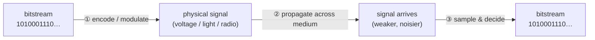

# Module 02 — How Data Physically Moves

> **The one idea to keep:** By the time data reaches the physical layer it's *already*
> a stream of 1s and 0s. The physical layer's real job isn't "turn data into bits" — it's
> "turn an existing bitstream into a **signal** (voltage, light, or radio) that survives a
> trip across a medium, and turn it back into bits on the far side." A **modem** is the
> device that does exactly that.

You asked two great questions:
1. *How does data get converted into 0s and 1s?*
2. *Once it's bits, how does it actually travel across?*

We'll answer both — but first we have to fix a hidden assumption in question 1.

---

## 1. Myth-buster: the data is *already* bits before L1 ever sees it

Here's the thing that trips everyone up. People imagine the physical layer takes your
"hello" or your photo and *converts it into 1s and 0s*. It doesn't. **Everything in a
computer is already binary long before it goes near a wire.** The conversion to bits
happened way up the stack — in fact, in how the data was stored in the first place.

Some concrete examples of "how real things become bits" (this all happens in software /
memory, *above* the network stack):

- **Text** → each character maps to a number via a **character encoding**. The letter
  `A` in ASCII is the number 65, which in binary is `01000001`. The word "Hi" is
  `01001000 01101001`. (Modern systems use UTF-8, same idea, more characters.)
- **Whole numbers** → plain base-2. `13` = `00001101`.
- **Images** → each pixel is 3 numbers (Red, Green, Blue), each 0–255 = 8 bits. A photo
  is millions of those numbers in a row.
- **Sound** → the analog waveform is **sampled** thousands of times per second and each
  sample is stored as a number (this is what "44.1 kHz, 16-bit" means). This analog→digital
  step is done by a chip called an **ADC** (analog-to-digital converter).

> **So the honest answer to "how does data become 0s and 1s?"** is: *it already is.* The
> application, the OS, and the file format already represent everything as bits. By the
> time Module 01's encapsulation finishes, your frame is just a long sequence of bits like
> `1010001110101...`. **The physical layer never sees "data" — it only ever sees bits.**

So the *real* question — the interesting one — is your question 2, plus a hidden question 2a:

- **2a. How do we turn those bits into something physical that can move?** (encoding /
  modulation)
- **2. How does that physical thing travel across the medium?** (propagation)

Let's do both.

---

## 2. The physical layer's actual job



Three sub-jobs:
1. **Encode/modulate** — represent each bit (or group of bits) as a physical state.
2. **Propagate** — let that physical state travel down copper / fibre / air.
3. **Recover** — on the far side, measure the signal at the right moments and *decide*
   whether each was a 1 or a 0, rebuilding the exact bitstream.

There are two big families of technique for step ①, depending on the medium:

- **Baseband — "line coding":** put the bits *directly* on the wire as voltage levels.
  Used on things like Ethernet copper.
- **Passband — "modulation":** ride the bits on top of a continuously oscillating
  **carrier wave**. Used whenever you can't just apply DC voltage — radio (Wi-Fi,
  cellular), DSL, cable. **This is what a modem does.**

---

## 3. Putting bits on a wire directly: line coding (baseband)

The simplest possible idea: **high voltage = 1, low voltage = 0.** Hold each voltage for a
fixed slice of time (the "bit time"). This is called **NRZ** (Non-Return-to-Zero).

```
 bits:    1   0   1   1   0   0   1
         ┌─┐   ┌─┐ ┌─┐     ┌─┐
 volts:  │ │   │ │ │ │     │ │        (high = 1, low = 0)
       ──┘ └───┘ └─┘ └─────┘ └──
```

Looks great — until you hit the **synchronization problem**, which is the whole reason
line coding is more than "high=1, low=0":

> **The clock problem.** The receiver samples the wire once per bit time. But how does it
> know *when* each bit time starts and ends? If you send `0000000000` (ten zeros), the
> voltage just sits flat. The receiver's clock drifts slightly, and after a while it can't
> tell whether it saw 9, 10, or 11 zeros. **Long runs of the same bit = lost sync = corrupt
> data.**

The fix: choose an encoding where the signal is *guaranteed* to change often, so the
receiver can continually re-sync its clock from the signal itself ("self-clocking"):

- **Manchester encoding** (classic Ethernet): every bit is a *transition* in the middle of
  its slot — low→high means 1, high→low means 0. There's always an edge every bit, so the
  clock never gets lost. Cost: you "spend" signal changes to buy timing, halving efficiency.
- **Block codes (4B/5B, 8b/10b, 64b/66b)**: map groups of data bits to slightly larger
  groups of transmitted bits chosen to guarantee frequent transitions and balance. Modern
  high-speed links use these — more efficient than Manchester.

> **Takeaway:** even the "simplest" physical layer isn't just voltages — it's voltages
> *plus a scheme to keep both ends' clocks locked together.* Timing is half the battle at L1.

---

## 4. Riding bits on a wave: modulation (passband) — *this is the modem*

For radio and many wired systems you can't just hold a DC voltage. Instead you start with
a **carrier**: a pure sine wave oscillating at some frequency (e.g. 2.4 GHz for Wi-Fi).
By itself a carrier carries no information — it's a steady hum. You encode bits by
**modulating** (deliberately varying) one of its three properties:

```
 A sine wave has exactly 3 things you can change:

   amplitude (height) ──►   how TALL the wave is
   frequency (rate)   ──►   how FAST it wiggles
   phase (timing)     ──►   WHERE in its cycle it is at a reference moment
```

Each gives a modulation scheme:

- **ASK** (Amplitude-Shift Keying): big wave = 1, small wave = 0.
- **FSK** (Frequency-Shift Keying): fast wave = 1, slow wave = 0.
- **PSK** (Phase-Shift Keying): shift the wave's phase to signal a bit.

```
 bit:      1        0        1
 ASK:   /\/\/\    ....    /\/\/\      (amplitude changes)
 FSK:   /\/\/\   /\/\/\/\  /\/\      (frequency changes)
 PSK:   /\/\/\   \/\/\/    /\/\/\     (phase flips)
```

<figure class="anim-fig">
<svg viewBox="0 0 720 270" role="img" aria-label="Animation: three modulated signals flowing along the wire — amplitude (ASK), frequency (FSK) and phase (PSK) modulation.">
<style>
.m2-lbl{font-size:12px;font-weight:700}
.m2-sub{font-size:10px;fill:#8595a7}
.m2-wave{fill:none;stroke-width:2.5}
.m2-scroll{animation:m2scroll 4s linear infinite}
@keyframes m2scroll{from{transform:translateX(0)}to{transform:translateX(-240px)}}
</style>
<defs>
<path id="m2ask" d="M0,0 q10 -36 20 0 q10 36 20 0 q10 -36 20 0 q10 36 20 0 q10 -36 20 0 q10 36 20 0 q10 -8 20 0 q10 8 20 0 q10 -8 20 0 q10 8 20 0 q10 -8 20 0 q10 8 20 0"/>
<path id="m2fsk" d="M0,0 q6 -28 12 0 q6 28 12 0 q6 -28 12 0 q6 28 12 0 q6 -28 12 0 q6 28 12 0 q6 -28 12 0 q6 28 12 0 q6 -28 12 0 q6 28 12 0 q15 -28 30 0 q15 28 30 0 q15 -28 30 0 q15 28 30 0"/>
<path id="m2psk" d="M0,0 q10 -28 20 0 q10 28 20 0 q10 -28 20 0 q10 28 20 0 q10 -28 20 0 q10 28 20 0 q10 28 20 0 q10 -28 20 0 q10 28 20 0 q10 -28 20 0 q10 28 20 0 q10 -28 20 0"/>
<clipPath id="m2clip"><rect x="70" y="40" width="560" height="210"/></clipPath>
</defs>
<text x="12" y="20" style="font-size:13px;font-weight:700;fill:#2c7be5">A modem imprints bits onto a carrier wave — the signal flows along the wire →</text>
<!-- left labels -->
<text class="m2-lbl" x="12" y="86" fill="#ef4444">ASK</text><text class="m2-sub" x="12" y="100">amplitude</text>
<text class="m2-lbl" x="12" y="156" fill="#16a34a">FSK</text><text class="m2-sub" x="12" y="170">frequency</text>
<text class="m2-lbl" x="12" y="226" fill="#7c3aed">PSK</text><text class="m2-sub" x="12" y="240">phase</text>
<g clip-path="url(#m2clip)">
<g class="m2-scroll">
<g transform="translate(70,86)">
<use href="#m2ask" x="0" class="m2-wave" stroke="#ef4444"/><use href="#m2ask" x="240" class="m2-wave" stroke="#ef4444"/><use href="#m2ask" x="480" class="m2-wave" stroke="#ef4444"/><use href="#m2ask" x="720" class="m2-wave" stroke="#ef4444"/>
</g>
<g transform="translate(70,156)">
<use href="#m2fsk" x="0" class="m2-wave" stroke="#16a34a"/><use href="#m2fsk" x="240" class="m2-wave" stroke="#16a34a"/><use href="#m2fsk" x="480" class="m2-wave" stroke="#16a34a"/><use href="#m2fsk" x="720" class="m2-wave" stroke="#16a34a"/>
</g>
<g transform="translate(70,226)">
<use href="#m2psk" x="0" class="m2-wave" stroke="#7c3aed"/><use href="#m2psk" x="240" class="m2-wave" stroke="#7c3aed"/><use href="#m2psk" x="480" class="m2-wave" stroke="#7c3aed"/><use href="#m2psk" x="720" class="m2-wave" stroke="#7c3aed"/>
</g>
</g>
</g>
<text class="m2-sub" x="350" y="264" text-anchor="middle">Same bits, three "knobs": ASK varies height, FSK varies how fast it wiggles, PSK flips where it is in its cycle.</text>
</svg>
<figcaption>This is literally what a <b>modem</b> (modulator-demodulator) does: vary one property of a carrier wave to carry bits. Combine <i>amplitude + phase</i> and you get <b>QAM</b> — many bits per symbol (next figure).</figcaption>
</figure>

**"Modulator–demodulator" = modem.** The transmitter's modulator imprints bits onto the
carrier; the receiver's demodulator reads the carrier's amplitude/frequency/phase back out
as bits. That's the literal definition of the word. Your DSL modem, cable modem, Wi-Fi
chip, and the cellular **baseband** in your phone are all doing this.

### Packing more bits per wave: symbols, QAM, and constellations

Sending one bit per wave-change is wasteful. So we combine amplitude *and* phase to define
many distinct signaling states. Each distinct state is called a **symbol**, and each symbol
can stand for *several bits at once*.

Engineers draw the possible symbols as points on a **constellation diagram** (amplitude =
distance from center, phase = angle):

```
   QPSK (4 symbols = 2 bits each)      16-QAM (16 symbols = 4 bits each)
            •   •                         •   •   •   •
                                          •   •   •   •
            •   •                         •   •   •   •
                                          •   •   •   •
   each point = a unique (amplitude,      more points = more bits per symbol
   phase) combo = a 2-bit pattern         but points are closer together
```

The number of bits per symbol grows with the number of points:

| Scheme    | Symbols | Bits per symbol |
|-----------|---------|-----------------|
| BPSK      | 2       | 1               |
| QPSK      | 4       | 2               |
| 16-QAM    | 16      | 4               |
| 64-QAM    | 64      | 6               |
| 256-QAM   | 256     | 8               |
| 1024-QAM  | 1024    | 10 (Wi-Fi 6)    |

**Two rates you must not confuse:**
- **Baud rate** = symbols per second (how fast you change the wave).
- **Bit rate** = baud rate × bits per symbol.

So `1024-QAM` at the same baud rate as `QPSK` carries **5× the data** — same wave changes,
more bits crammed into each. This is *the* trick behind ever-faster Wi-Fi and cellular.

<figure class="anim-fig">
<svg viewBox="0 0 720 320" role="img" aria-label="Animation: constellation diagrams. QPSK has 4 symbols (2 bits each); 16-QAM has 16 symbols (4 bits each). Points light up in sequence.">
<style>
.c1-ax{stroke:#cbd5e1;stroke-width:1.5}
.c1-t{font-size:12px;font-weight:700;fill:#1f2d3d}
.c1-s{font-size:10.5px;fill:#8595a7}
.c1-lab{font-size:9px;fill:#64748b}
.c1-p{animation:c1pulse 3.2s ease-in-out infinite}
.c1-q{animation:c1pulse 3.2s ease-in-out infinite}
@keyframes c1pulse{0%,100%{r:5;fill:#94a3b8}45%,55%{r:9;fill:#2c7be5}}
</style>
<text x="12" y="20" class="c1-t" fill="#2c7be5">Constellation: each point is one symbol = several bits at once</text>
<!-- QPSK panel -->
<text class="c1-t" x="160" y="52" text-anchor="middle">QPSK — 4 symbols</text>
<text class="c1-s" x="160" y="68" text-anchor="middle">2 bits / symbol</text>
<line class="c1-ax" x1="160" y1="90" x2="160" y2="270"/>
<line class="c1-ax" x1="70" y1="180" x2="250" y2="180"/>
<g>
<circle class="c1-q" cx="120" cy="140" r="5" style="animation-delay:0s"/><text class="c1-lab" x="120" y="128" text-anchor="middle">00</text>
<circle class="c1-q" cx="200" cy="140" r="5" style="animation-delay:.8s"/><text class="c1-lab" x="200" y="128" text-anchor="middle">01</text>
<circle class="c1-q" cx="120" cy="220" r="5" style="animation-delay:2.4s"/><text class="c1-lab" x="120" y="238" text-anchor="middle">10</text>
<circle class="c1-q" cx="200" cy="220" r="5" style="animation-delay:1.6s"/><text class="c1-lab" x="200" y="238" text-anchor="middle">11</text>
</g>
<!-- 16-QAM panel -->
<text class="c1-t" x="530" y="52" text-anchor="middle">16-QAM — 16 symbols</text>
<text class="c1-s" x="530" y="68" text-anchor="middle">4 bits / symbol → 2× the data</text>
<line class="c1-ax" x1="530" y1="90" x2="530" y2="270"/>
<line class="c1-ax" x1="440" y1="180" x2="620" y2="180"/>
<g>
<circle class="c1-p" cx="476" cy="126" r="5" style="animation-delay:0s"/>
<circle class="c1-p" cx="512" cy="126" r="5" style="animation-delay:.2s"/>
<circle class="c1-p" cx="548" cy="126" r="5" style="animation-delay:.4s"/>
<circle class="c1-p" cx="584" cy="126" r="5" style="animation-delay:.6s"/>
<circle class="c1-p" cx="476" cy="162" r="5" style="animation-delay:.8s"/>
<circle class="c1-p" cx="512" cy="162" r="5" style="animation-delay:1s"/>
<circle class="c1-p" cx="548" cy="162" r="5" style="animation-delay:1.2s"/>
<circle class="c1-p" cx="584" cy="162" r="5" style="animation-delay:1.4s"/>
<circle class="c1-p" cx="476" cy="198" r="5" style="animation-delay:1.6s"/>
<circle class="c1-p" cx="512" cy="198" r="5" style="animation-delay:1.8s"/>
<circle class="c1-p" cx="548" cy="198" r="5" style="animation-delay:2s"/>
<circle class="c1-p" cx="584" cy="198" r="5" style="animation-delay:2.2s"/>
<circle class="c1-p" cx="476" cy="234" r="5" style="animation-delay:2.4s"/>
<circle class="c1-p" cx="512" cy="234" r="5" style="animation-delay:2.6s"/>
<circle class="c1-p" cx="548" cy="234" r="5" style="animation-delay:2.8s"/>
<circle class="c1-p" cx="584" cy="234" r="5" style="animation-delay:3s"/>
</g>
<text class="c1-s" x="360" y="298" text-anchor="middle">More points = more bits per symbol = faster — but points sit closer, so noise smears them (Shannon's ceiling).</text>
</svg>
<figcaption>Each lit point is one transmitted <b>symbol</b>. QPSK packs 2 bits per symbol; 16-QAM packs 4. Cramming more points in is how speed grows — until they're so close that <b>noise</b> makes them indistinguishable.</figcaption>
</figure>

### Why not just use a billion points per symbol?

Because of **noise**. The more points you pack in, the closer together they sit, and the
easier it is for noise/interference to smear one point into looking like its neighbor →
wrong bits. There's a hard mathematical ceiling, **Shannon's capacity law**:

```
  max bits/sec  =  Bandwidth × log₂(1 + SNR)
                                       └── Signal-to-Noise Ratio
```

Plain English: **your maximum data rate depends on how much spectrum you have *and* how
clean the signal is.** Weak or noisy signal → you're forced down to a simpler, more robust
modulation (fewer bits/symbol) → lower speed.

> ⚡ **This is a huge real-world effect.** When your phone shows fewer bars, or your Wi-Fi
> is slow far from the router, the radio has *adaptively* dropped from, say, 256-QAM to
> QPSK to keep the link working. **Adaptive modulation and coding (AMC)** — picking the
> richest modulation the current signal can support, moment to moment — is a core job of
> the cellular modem, and we'll see it again in Module 10.

---

## 5. How the signal actually travels — the three media

Now the physical trip. Same principle everywhere (an **electromagnetic wave** carries the
energy), but three very different implementations:

### Copper (electrical) — twisted pair, coax
- Bits are changes in **voltage/current**; the disturbance propagates as an EM wave *guided
  along* the conductor at roughly **0.6–0.7× the speed of light**.
- **Enemies:** *attenuation* (signal weakens with distance), *noise*/EMI (motors, other
  cables), and *crosstalk* (adjacent wires interfering). Twisting the pairs cancels much of
  the interference — that's literally why "twisted pair" is twisted.
- **Consequence:** distance limits (e.g. ~100 m for Ethernet twisted pair) before you need
  a repeater/switch to regenerate the signal.

### Fiber optic (light)
- Bits are **pulses of light** from a laser/LED (light on = 1, off = 0, roughly), guided
  down a hair-thin glass core by **total internal reflection** (the light keeps bouncing
  off the core/cladding boundary and can't escape).
- **Why it's king:** extremely low attenuation (signals go tens of km without help),
  enormous bandwidth, and complete immunity to electromagnetic interference (it's light,
  not electricity). This is the backbone of the internet and undersea cables.

### Radio (wireless) — Wi-Fi, cellular, satellite
- Bits are **modulated onto a radio-frequency carrier** and **radiated from an antenna** as
  EM waves that travel through air/space at ≈ the speed of light.
- **Why it's hard** (the reason Modules 07–12 exist):
  - *Path loss:* signal energy spreads out and weakens rapidly with distance.
  - *Interference:* the air is a **shared medium** — everyone's signals overlap; you must
    take turns and tolerate others' noise.
  - *Multipath:* the signal bounces off buildings/walls and arrives multiple times, slightly
    offset, causing **fading** (echoes that add up or cancel out).
  - *Mobility:* you're moving, so the channel changes constantly.
  - This brutal environment is exactly why cellular builds such an elaborate lower-layer
    stack (Module 11) — retransmissions, error coding, adaptive modulation, scheduling.

At the receiver, whatever the medium, the job is the same: **amplify the (now weak) signal,
recover the clock, sample at the right instants, and decide 0 or 1** for each symbol —
rebuilding the exact bitstream that was sent.

---

## 6. What "travelling across" actually costs you: the delay budget

Here's where this connects straight to your latency interest. When people say "how long
does data take to get there," that time is a **sum of four different delays** — and they
have completely different causes:

```
  total delay per hop = transmission + propagation + processing + queuing
```

1. **Transmission delay** — time to *push* all the bits onto the wire.
   `= number_of_bits / link_bandwidth`.
   *This is the only one bandwidth affects.* Fatter pipe = you shove bits out faster.
   - Example: a 1500-byte packet (12,000 bits) on a 100 Mbps link =
     `12000 / 100,000,000 = 120 microseconds`.

2. **Propagation delay** — time for the signal to *physically travel* the distance, at the
   medium's propagation speed. `= distance / speed`. **Bandwidth cannot reduce this** —
   it's the length of the road, not the width.
   - Example: 3000 km of fiber at ~2×10⁸ m/s = `3,000,000 / 200,000,000 = 15 ms` one way
     (30 ms round-trip) — *before* any transmission, processing, or queuing.

3. **Processing delay** — time for a router/switch to inspect a packet and decide where to
   send it. Usually tiny (microseconds) but nonzero.

4. **Queuing delay** — time a packet waits in a buffer because the outgoing link is busy.
   **The wild card** — it's ~0 on an idle network and can balloon to hundreds of ms under
   congestion. Most "the internet feels laggy" pain is queuing.

> ⚡ **This is the master key to latency (your whole motivation).** Notice that
> **propagation delay is a floor set by physics and distance** — you literally cannot ping
> a server 10,000 km away faster than light allows (~50 ms one-way minimum), no matter how
> much bandwidth you buy. When we get to cellular you'll add *more* delay terms on top —
> waking the radio from idle (RRC setup), scheduling requests, retransmissions — and this
> exact framework (a budget of named, separable delays) is how you'll attribute every
> millisecond in Module 13.

<figure class="anim-fig">
<svg viewBox="0 0 720 210" role="img" aria-label="Animation: transmission delay is the time to push bits onto the wire; propagation delay is the time for them to travel the distance.">
<style>
.d1-box{fill:#eef5ff;stroke:#2c7be5;stroke-width:2}
.d1-t{font-size:12px;font-weight:700;fill:#1f4a7a}
.d1-l1{font-size:12px;font-weight:700;fill:#ef4444;animation:d1l1 6s linear infinite}
.d1-l2{font-size:12px;font-weight:700;fill:#16a34a;animation:d1l2 6s linear infinite}
.d1-pkt{animation:d1pkt 6s linear infinite}
.d1-rx{animation:d1flash 6s linear infinite}
@keyframes d1pkt{0%{width:0;transform:translateX(0);opacity:1}33%{width:80px;transform:translateX(0)}40%{width:80px;transform:translateX(0)}90%{width:80px;transform:translateX(410px)}94%{opacity:1}98%,100%{opacity:0;width:80px;transform:translateX(410px)}}
@keyframes d1l1{0%,36%{opacity:1}42%,100%{opacity:0}}
@keyframes d1l2{0%,40%{opacity:0}46%,92%{opacity:1}96%,100%{opacity:0}}
@keyframes d1flash{0%,86%{fill:#eef5ff}90%{fill:#bbf7d0}96%,100%{fill:#eef5ff}}
</style>
<text x="12" y="20" style="font-size:13px;font-weight:700;fill:#2c7be5">Two very different delays make up one trip</text>
<!-- wire -->
<line x1="110" y1="120" x2="610" y2="120" stroke="#cbd5e1" stroke-width="3"/>
<!-- boxes -->
<rect class="d1-box" x="20" y="98" width="90" height="46" rx="8"/><text class="d1-t" x="65" y="126" text-anchor="middle">Sender</text>
<rect class="d1-rx" x="610" y="98" width="90" height="46" rx="8" stroke="#2c7be5" stroke-width="2"/><text class="d1-t" x="655" y="126" text-anchor="middle">Receiver</text>
<!-- packet (grows, then travels) -->
<rect class="d1-pkt" x="110" y="108" width="0" height="24" rx="4" fill="#ef4444"/>
<!-- labels -->
<text class="d1-l1" x="150" y="70" text-anchor="middle">① transmission delay = bits ÷ bandwidth</text>
<text class="d1-l1" x="150" y="86" text-anchor="middle" style="font-size:10.5px;fill:#8595a7;font-weight:400">(time to push bits ONTO the wire — fatter pipe helps)</text>
<text class="d1-l2" x="380" y="70" text-anchor="middle">② propagation delay = distance ÷ speed</text>
<text class="d1-l2" x="380" y="86" text-anchor="middle" style="font-size:10.5px;fill:#8595a7;font-weight:400">(travel time across the distance — bandwidth CANNOT help)</text>
<text x="360" y="190" text-anchor="middle" style="font-size:11px;fill:#8595a7">Plus processing (router think-time) + queuing (waiting in buffers) at each hop.</text>
</svg>
<figcaption>First the sender <b>serializes</b> the packet onto the wire (transmission delay — the only part bandwidth shrinks), then it <b>travels</b> the distance (propagation delay — set by the speed of light, the latency floor).</figcaption>
</figure>

---

## 7. Three words people muddle: bandwidth vs latency vs throughput (vs jitter)

Now we can define these precisely, because you've seen where each comes from:

- **Bandwidth** — the link's *capacity*: max bits/sec it can carry. (A property of the pipe.)
  Determined at L1 by spectrum/medium and the modulation used (Section 4).
- **Latency** — the *delay* for data to get from A to B (Section 6). A property of distance
  and congestion, **not** of bandwidth.
- **Throughput** — the rate you *actually achieve* in practice. Always ≤ bandwidth, and
  often much less (limited by latency, congestion, protocol overhead, retransmissions).
- **Jitter** — the *variation* in latency from packet to packet. Steady 40 ms is fine for a
  video call; bouncing between 10 ms and 300 ms (high jitter) wrecks it even if the average
  is low.

> **The analogy that sticks:** think of a highway. **Bandwidth** = number of lanes.
> **Latency** = how long the road is. **Throughput** = how many cars actually arrive per
> minute. **Jitter** = how unpredictable each car's arrival time is. Adding lanes
> (bandwidth) does nothing to shorten the road (latency).

<figure class="anim-fig">
<svg viewBox="0 0 720 300" role="img" aria-label="Animation: bandwidth is the number of lanes (throughput); latency is the length of the road. A car on a longer road arrives later regardless of lanes.">
<style>
.b1-t{font-size:12.5px;font-weight:700;fill:#1f2d3d}
.b1-s{font-size:10.5px;fill:#8595a7}
.b1-road{fill:#e2e8f0}
.b1-dash{stroke:#fff;stroke-width:2;stroke-dasharray:14 12}
.b1-car{fill:#2c7be5;animation:b1flow 2s linear infinite}
.b1-short{fill:#16a34a;animation:b1short 2s linear infinite}
.b1-long{fill:#ef4444;animation:b1long 4.8s linear infinite}
@keyframes b1flow{from{transform:translateX(0)}to{transform:translateX(560px)}}
@keyframes b1short{0%{transform:translateX(0);opacity:1}92%{opacity:1}100%{transform:translateX(200px);opacity:1}}
@keyframes b1long{0%{transform:translateX(0);opacity:1}96%{opacity:1}100%{transform:translateX(480px);opacity:1}}
</style>
<!-- Panel A: bandwidth = lanes -->
<text class="b1-t" x="12" y="20" fill="#2c7be5">Bandwidth = number of lanes  →  how many bits/sec fit (throughput)</text>
<rect class="b1-road" x="60" y="34" width="600" height="70" rx="6"/>
<line class="b1-dash" x1="60" y1="57" x2="660" y2="57"/>
<line class="b1-dash" x1="60" y1="80" x2="660" y2="80"/>
<g><circle class="b1-car" cx="70" cy="45" r="6" style="animation-delay:0s"/><circle class="b1-car" cx="70" cy="45" r="6" style="animation-delay:-.7s"/><circle class="b1-car" cx="70" cy="45" r="6" style="animation-delay:-1.4s"/></g>
<g><circle class="b1-car" cx="70" cy="68" r="6" style="animation-delay:-.3s"/><circle class="b1-car" cx="70" cy="68" r="6" style="animation-delay:-1s"/><circle class="b1-car" cx="70" cy="68" r="6" style="animation-delay:-1.7s"/></g>
<g><circle class="b1-car" cx="70" cy="91" r="6" style="animation-delay:-.5s"/><circle class="b1-car" cx="70" cy="91" r="6" style="animation-delay:-1.2s"/><circle class="b1-car" cx="70" cy="91" r="6" style="animation-delay:-1.9s"/></g>
<text class="b1-s" x="360" y="126" text-anchor="middle">More lanes = more cars arrive per second. But it does NOT make any single car's trip shorter. ↓</text>
<!-- Panel B: latency = length -->
<text class="b1-t" x="12" y="158" fill="#ef4444">Latency = length of the road  →  how long one trip takes</text>
<!-- short road -->
<rect class="b1-road" x="60" y="176" width="200" height="26" rx="6"/>
<circle class="b1-short" cx="72" cy="189" r="7"/>
<text class="b1-s" x="278" y="194">short road → arrives soon ✓</text>
<!-- long road -->
<rect class="b1-road" x="60" y="230" width="480" height="26" rx="6"/>
<circle class="b1-long" cx="72" cy="243" r="7"/>
<text class="b1-s" x="556" y="248">long road → arrives later (same speed!)</text>
<text class="b1-s" x="360" y="286" text-anchor="middle">Both cars move at the same speed — the one with farther to go simply takes longer. Adding lanes wouldn't change that.</text>
</svg>
<figcaption><b>Bandwidth</b> (lanes) sets how much arrives per second; <b>latency</b> (road length) sets how long a single trip takes. They're independent — which is why a fat pipe to a distant server still has high ping.</figcaption>
</figure>

---

## 8. Where the modem sits in all this

- The **modem** is precisely the box doing Sections 3–4: **modulation/demodulation** — bits
  ↔ signal. That's L1.
- A **cellular modem / baseband** does the L1 modulation *plus* the whole survival stack for
  radio's hostile channel (Section 5): error-correction coding, adaptive modulation,
  retransmission, timing, scheduling. That extra machinery is the L2 stuff (MAC/RLC/PDCP)
  we'll meet in Module 11 — but it all sits on top of this same "bits ↔ radio wave" core.
- Every generation leap (3G→4G→5G) is largely about **squeezing more bits per second out of
  the same physics**: richer modulation (up to 256-QAM+), more spectrum, and clever tricks
  like OFDM and MIMO (Module 10) — all governed by Shannon's ceiling from Section 4.

---

## 9. Misconceptions to kill

- ❌ *"The physical layer converts my data into binary."* No — the data was already binary
  in memory. L1 converts **bits → signal**, not data → bits.
- ❌ *"More bandwidth makes my connection lower-latency."* No — bandwidth shortens
  *transmission* delay only; *propagation* delay (distance) is untouched. A 10 Gbps link to
  a server on another continent still has ~high ping.
- ❌ *"Bits travel down the wire like water in a pipe / marbles in a tube."* No — nothing
  physically moves end-to-end. A *disturbance* (EM wave) propagates; the electrons/photons
  barely move. Think "the wave in a stadium," not "a train."
- ❌ *"Digital means no analog."* No — the wire/air is analog. "Digital" means we only care
  about *deciding between a few defined states*; the actual signal is a messy analog wave we
  clean up and threshold.
- ❌ *"Higher-order modulation (256-QAM) is always better."* Only if the signal is clean.
  Noise forces you back down to robust schemes; that's adaptive modulation.

---

## Check your understanding

<div class="quiz">
<p class="q">Your app sends the text "Hi". Where does it become the bits <code>01001000 01101001</code>?</p>
<ul class="options">
<li>At the physical layer, right before hitting the wire.</li>
<li data-correct="true">Up in software, via character encoding — long before the physical layer.</li>
<li>At the router, during routing.</li>
</ul>
<div class="explain">Everything is already binary in memory. Character encoding (ASCII/UTF-8)
turned "Hi" into bits at the application level. The physical layer only ever deals with an
existing bitstream — its job is bits → signal, not data → bits.</div>
</div>

<div class="quiz">
<p class="q">You upgrade from a 100 Mbps to a 1 Gbps link, but you're pinging a server 8,000 km away. What happens to your ping (round-trip latency)?</p>
<ul class="options">
<li>It drops by about 10×.</li>
<li data-correct="true">It barely changes — propagation delay (distance ÷ speed) dominates and bandwidth doesn't affect it.</li>
<li>It doubles.</li>
</ul>
<div class="explain">Bandwidth only shrinks <em>transmission</em> delay (time to push bits out).
Ping is dominated by <em>propagation</em> delay over that huge distance, which is set by the
speed of light, not the pipe width. More lanes ≠ shorter road.</div>
</div>

<div class="quiz">
<p class="q">Why can't we just keep increasing bits-per-symbol (e.g. jump to 65536-QAM) to make every link faster?</p>
<ul class="options">
<li>The hardware can't oscillate that fast.</li>
<li data-correct="true">More constellation points sit closer together, so noise smears them into each other — Shannon's law caps rate by bandwidth and SNR.</li>
<li>It would use too much electricity.</li>
</ul>
<div class="explain">Packing more symbols means they're spaced closer; with real-world noise,
the receiver can't reliably tell them apart, causing bit errors. Capacity = B·log₂(1+SNR).
When the signal is weak/noisy, links adaptively drop to simpler, robust modulation.</div>
</div>

---

## Exercises

1. **Feel propagation delay.** Run `ping google.com` and note the ms. Then `ping` a server
   you know is far away (e.g. an Australian site if you're in the US). The difference is
   almost entirely **propagation delay** — physics, not bandwidth. Write down both numbers.

2. **Separate the delays.** Run `ping` to a nearby server (say your router: `ping <gateway>`)
   vs a distant one. The near one isolates processing/queuing; the far one adds propagation.

3. **See adaptive modulation in real life.** Walk your phone or laptop far from the
   router/window and watch the link speed / signal bars drop. You're watching the radio
   fall back to lower-order modulation (fewer bits/symbol) to survive weaker SNR.

4. **🔧 Project (peek at the physical world):** if you're curious and want hardware later,
   an **RTL-SDR** (~$30 USB dongle, Module 16) lets you literally *see* radio signals and
   even constellation diagrams on your screen. Note it now as a future build.

5. **Explain it back.** In one paragraph, answer a friend: *"Why does adding bandwidth not
   fix a laggy game on a distant server?"* If you mention propagation delay as a floor set
   by distance and light-speed, you've nailed this module.

---

## Cheat-sheet

```
THE PHYSICAL LAYER'S JOB
  bits  ──encode/modulate──►  signal  ──propagate──►  signal  ──sample/decide──►  bits
  (data is ALREADY bits before L1; L1 does bits↔signal, not data↔bits)

TWO WAYS TO PUT BITS ON A MEDIUM
  • Line coding (baseband): voltage levels directly (NRZ, Manchester, 8b/10b)
      - must stay self-clocking → force frequent transitions
  • Modulation (passband): vary a carrier wave  ← this is a MODEM
      - Amplitude (ASK), Frequency (FSK), Phase (PSK), Amplitude+Phase (QAM)

SYMBOLS
  symbol = one signaling state; more states = more bits/symbol
  BPSK 1b · QPSK 2b · 16-QAM 4b · 64-QAM 6b · 256-QAM 8b · 1024-QAM 10b
  bit rate = baud (symbols/sec) × bits/symbol
  ceiling: capacity = Bandwidth × log₂(1 + SNR)   (noise limits bits/symbol)

MEDIA
  copper  = voltage, ~0.6–0.7c, hurt by attenuation/noise/crosstalk (~100 m)
  fiber   = light pulses, total internal reflection, low loss + huge BW + no EMI
  radio   = modulated carrier from antenna, ≈c, hurt by path loss/interference/multipath

DELAY BUDGET (per hop)
  transmission = bits / bandwidth      (only this cares about bandwidth)
  propagation  = distance / speed      (the latency FLOOR; light-speed limited)
  processing   = router think time     (small)
  queuing      = waiting in buffers    (the congestion wild card)

FOUR WORDS
  bandwidth = lanes | latency = road length | throughput = cars/min | jitter = arrival unpredictability
```

---

**Next up → Module 03: The Link layer** — now that bits can cross *one* physical hop, how
do multiple devices share a wire/air without talking over each other, how do frames get
addressed to the right neighbor (MAC addresses), and what actually is a switch? That's where
"one hop" becomes a real local network.
