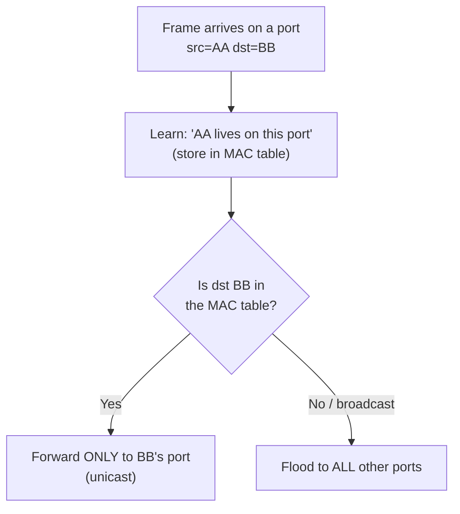

# Module 03 — The Link Layer

> **The one idea to keep:** The link layer is the *neighborhood*. Its entire world is the
> devices it can reach in **one hop** — no concept of "the internet." Its jobs: chop the
> bitstream into **frames**, address them to a **neighbor** (MAC address), make sure only
> one device talks at a time on a shared medium, and check each frame for corruption. The
> network layer (Module 04) handles "the world"; the link layer handles "the room you're in."

In Module 02, bits learned to cross **one physical link** as a signal. But raw bits aren't
enough: *where* does one message end and the next begin? *Who* on this wire is it for? *Whose
turn* is it to transmit? *Did it arrive intact?* Those four questions are the link layer.

📚 This module gives full treatment to the **ARP** and **MAC address** steps you met in the
[google.com deep-dive](deep-dive-loading-google.md) (Phase 4).

---

## 1. The link layer's four jobs

The link layer (OSI L2 / the lower half of TCP-IP's "Link" layer) sits directly on top of
the physical layer and turns "I can send bits" into "I can send an addressed, checked
message to a specific neighbor." Its responsibilities:

1. **Framing** — group the bitstream into discrete units (*frames*) with clear start/end.
2. **Addressing** — put a source and destination **MAC address** on each frame so the right
   neighbor picks it up.
3. **Media access control (MAC)** — decide *who transmits when* on a shared medium, so
   devices don't talk over each other.
4. **Error detection** — attach a checksum so the receiver can tell if the frame got
   corrupted in transit.

It's formally split into two sublayers:
- **LLC (Logical Link Control)** — a thin adapter to the layer above (identifies which L3
  protocol the payload is, e.g. IP).
- **MAC (Media Access Control)** — the hardware-specific part: addressing + who-talks-when.
  (Yes, "MAC" is overloaded: it's both the *sublayer* and the *address*. Context tells you.)

---

## 2. Framing: finding the edges in a river of bits

The physical layer hands up a continuous stream: `...101000111010100011...`. The receiver
must know **where each frame begins and ends** — otherwise it can't tell the header from the
payload from the next frame.

Ethernet solves this with:
- A **preamble**: 7 bytes of alternating `10101010…` that let the receiver lock onto the
  signal's clock (remember clock recovery from Module 02), followed by a 1-byte **Start
  Frame Delimiter** (`10101011`) meaning "the real frame starts *now*."
- A **length/type field** and a fixed minimum/maximum size, so the receiver knows how much
  to read.

Other link technologies use other tricks (special flag bytes with "bit stuffing," etc.), but
the goal is universal: **unambiguous frame boundaries.**

---

## 3. MAC addresses: how you name a neighbor

A **MAC address** is the link layer's identifier for a network interface. Key facts:

- **48 bits**, written as six hex bytes: `a4:83:e7:2b:19:0f`.
- **Globally unique and burned into the hardware** (the NIC) at manufacture — though it can
  be overridden in software ("MAC spoofing").
- The **first 3 bytes** are the **OUI (Organizationally Unique Identifier)** — assigned to
  the manufacturer. `a4:83:e7` → Apple, for instance. The last 3 bytes are the device serial
  within that vendor. (You can look up any OUI online to find the vendor.)

Three kinds of destination:
- **Unicast** — one specific interface.
- **Broadcast** — `ff:ff:ff:ff:ff:ff` = "everyone on this link" (used by ARP, below).
- **Multicast** — a defined group.

> **MAC vs IP — the distinction that unlocks everything (Module 01, revisited):**
> - A **MAC address** is *flat* and *local*: it identifies a device on **one link**, with no
>   structure that says *where* it is. It's like a person's name — unique, but it doesn't
>   tell you their address.
> - An **IP address** is *hierarchical* and *global*: its structure (network + host, Module
>   04) tells routers *which direction* to send it. It's like a postal address.
> - This is why **the MAC changes at every hop but the IP stays constant end-to-end**: at
>   each hop, the frame is re-addressed to the next neighbor's MAC, while the packet inside
>   still carries the final IP. The name of who-hands-it-next changes; the ultimate
>   destination doesn't.

---

## 4. The Ethernet frame, field by field

Here's what a frame actually looks like on the wire:

```
 ┌──────────┬─────┬─────────┬─────────┬──────────┬───────────────────┬──────┐
 │ Preamble │ SFD │ Dest MAC│ Src MAC │ Type/Len │      Payload      │ FCS  │
 │  7 bytes │ 1 B │  6 B    │  6 B    │   2 B    │   46–1500 bytes   │ 4 B  │
 └──────────┴─────┴─────────┴─────────┴──────────┴───────────────────┴──────┘
              └─ sync ─┘     └──── addressing ───┘  └── the IP packet ──┘  └ CRC
```

- **Dest / Src MAC** — the addressing from Section 3.
- **Type/Length (EtherType)** — what's inside the payload. `0x0800` = IPv4, `0x86DD` = IPv6,
  `0x0806` = ARP. This is how the receiving link layer knows which L3 protocol to hand the
  payload up to (that's the LLC job).
- **Payload** — the L3 packet (usually an IP packet). Note the range:
  - **Minimum 46 bytes** (short frames get padded — a quirk from collision detection timing).
  - **Maximum 1500 bytes** — this famous number is the **MTU (Maximum Transmission Unit)**.
    It's *why* higher layers chop data into ~1500-byte pieces, and why header overhead
    (Q05) is amortized over at most ~1500 bytes.
- **FCS (Frame Check Sequence)** — a 4-byte **CRC** (see next section).

---

## 5. Error detection: the CRC / FCS

The link layer can't stop corruption (noise flips bits, Module 02), but it can **detect** it
and discard bad frames. The **FCS** is a **CRC (Cyclic Redundancy Check)**: the sender runs
the whole frame through a polynomial-division algorithm to produce a 32-bit checksum and
appends it. The receiver recomputes the same checksum over the received bits; if it doesn't
match, the frame is corrupted and **silently dropped**.

> **Detect, not correct.** Ethernet's CRC only *detects* errors — it doesn't fix them, and it
> doesn't ask for a resend. It just drops the bad frame. Recovering the lost data is left to a
> higher layer (**TCP**, Module 05) that notices something's missing and retransmits. This is
> the layered division of labor again: L2 guarantees "the frames you receive are intact," not
> "you receive all frames." *(Cellular is different — its L2 (RLC, Module 11) does its own
> retransmission, because radio loses so much that waiting for TCP would be too slow. File
> that away.)*

---

## 6. The shared-medium problem: who gets to talk?

Early Ethernet connected everyone to a shared wire (via a **hub**), so only one device could
transmit at a time. If two transmitted at once, their signals overlapped — a **collision** —
and both messages were garbled.

The rulebook to manage this is **CSMA/CD** (Carrier Sense Multiple Access with Collision
Detection):
- **Carrier Sense:** listen first; don't transmit if someone else is.
- **Multiple Access:** everyone shares the medium.
- **Collision Detection:** if you detect a collision while sending, stop, send a jam signal,
  wait a **random backoff** time, and retry. (Randomness keeps the two colliders from
  colliding again immediately.)

The set of devices that can collide with each other is a **collision domain**.

> ⚡ **Latency note.** On a busy shared medium, collisions and exponential backoff add
> *random, unpredictable* delay — this is a source of **jitter** (Module 02). It's also why
> shared media don't scale: more talkers = more collisions = worse latency. This exact problem
> reappears, unavoidably, on wireless (you can't have collision *detection* on radio, so Wi-Fi
> uses collision *avoidance*, CSMA/CA — Module 08 — and cellular avoids the free-for-all
> entirely by having the tower **schedule** who talks when, Module 11).

---

## 7. Switches: how modern Ethernet eliminates collisions

A **hub** is dumb — it repeats every bit to every port (one big collision domain). A
**switch** is smart — it forwards each frame only to the port where the destination actually
lives. This changes everything:

**How a switch learns (MAC learning + forwarding):**



1. **Learn:** when a frame comes in, the switch records "source MAC AA is reachable via this
   port" in its **MAC address table (CAM table)**.
2. **Forward:** if it knows the destination's port, it sends the frame *only* there.
3. **Flood:** if the destination is unknown (or is broadcast), it sends to *all* other ports
   — and learns the answer when the reply comes back.

Consequences of switching:
- **Each switch port is its own collision domain** → with modern **full-duplex** links
  (separate send/receive paths), collisions essentially **disappear**. CSMA/CD is now
  historical on wired switched networks.
- **But broadcasts still go everywhere.** All ports on a switch (and across connected
  switches) form **one broadcast domain** — a frame sent to `ff:ff:ff:ff:ff:ff` reaches
  everyone. This is what a **VLAN** (802.1Q, Section 9) or a **router** breaks up.

> **The two "domains" — memorize the distinction:**
> - **Collision domain** = devices that can collide (shrunk to *one device per port* by
>   switches).
> - **Broadcast domain** = devices that receive each other's broadcasts (a switch is *one*
>   broadcast domain; a **router does not forward broadcasts**, so it's the boundary).

---

## 8. ARP: bridging L3 and L2 (the google.com Phase-4 step, in full)

Here's the puzzle from the deep-dive: your machine has the *IP* it wants to reach, but to
actually send a frame it needs a *MAC address* for the next hop. **ARP (Address Resolution
Protocol)** is the translator: **given an IPv4 address on my local link, find its MAC.**

How it works:

```
1. You want to send to 192.168.1.1 (your gateway). You don't know its MAC.
2. You BROADCAST an ARP request:
     "Who has 192.168.1.1? Tell a4:83:e7:2b:19:0f"   (dest MAC = ff:ff:ff:ff:ff:ff)
3. Every device on the link sees it; only 192.168.1.1 replies (unicast):
     "192.168.1.1 is at 34:98:b5:aa:bb:cc"
4. You cache that mapping in your ARP table and build your frame:
     dest MAC = 34:98:b5:aa:bb:cc  (the gateway, next hop)
     dest IP  = 142.250.190.78     (Google, final target)
```

Key details:
- The mapping is stored in the **ARP cache** (`arp -a`) with a timeout, so you don't ARP for
  every packet.
- ARP only resolves addresses **on your own subnet**. For anything off-subnet (like Google),
  you ARP for the **default gateway**, not the destination — the gateway takes it from there.
  This is the L2-local / L3-global split in action.
- **IPv6 doesn't use ARP** — it uses **NDP (Neighbor Discovery Protocol)** over ICMPv6, same
  idea, better design.

> 🔒 **Security preview.** ARP has no authentication — *anyone* can reply "I'm the gateway."
> That's **ARP spoofing / poisoning**, a classic man-in-the-middle attack on a LAN. And
> flooding a switch's MAC table until it fails open and floods everything (**MAC flooding**)
> is another. We'll revisit these when we get to the security/tooling modules — they're a
> direct consequence of L2 trusting whatever it's told.

---

## 9. A few more L2 realities (brief, for completeness)

- **VLANs (802.1Q):** you can slice one physical switch into several isolated **virtual
  LANs** by adding a 4-byte **VLAN tag** to frames. Each VLAN is a separate broadcast domain —
  it's how one switch serves, say, "guest" and "corporate" networks that can't see each other.
- **Spanning Tree Protocol (STP):** if you wire switches in a loop for redundancy, broadcasts
  would circulate forever (a **broadcast storm**) because L2 frames have no TTL to expire
  them. STP automatically detects loops and disables redundant links to keep the topology a
  loop-free tree.
- **Different media, different MAC layer:** Ethernet is one L2 technology. **Wi-Fi (802.11)**
  is another with the same *addressing* (MAC addresses) but a very different *media access*
  method (CSMA/CA, Module 08). **PPP** is a point-to-point L2 with no addressing needed.
  Cellular has its own entirely (Module 11). The L3 packet inside doesn't care which — that's
  the whole point of layering.

---

## 10. Where this maps onto the cellular modem

Keep the running thread alive — cellular re-implements *every* one of this module's jobs,
with radio-specific twists:

| Ethernet L2 concept | Cellular (LTE) equivalent | Why different |
|---|---|---|
| Framing | MAC/RLC framing over radio subframes | Time is scheduled in 1 ms slots |
| MAC address | **RNTI** (Radio Network Temporary ID) | Identity is assigned & temporary, not burned-in |
| CSMA/CD (who talks) | **The tower schedules** every transmission | No free-for-all; radio is too precious |
| CRC (detect, drop) | CRC **+ HARQ/RLC retransmission** | Radio loses so much, L2 *must* retransmit itself |
| ARP (IP→link addr) | Handled by RRC/bearer setup | No broadcast ARP on a scheduled link |

You'll meet all of these in Modules 10–12. The point: once you understand framing,
addressing, media access, and error handling *here*, cellular is "the same ideas, harder
environment."

---

## Misconceptions to kill

- ❌ *"MAC addresses are used to route across the internet."* No — MAC is one hop only.
  Routing across the internet is IP (L3). MACs are rewritten at every hop.
- ❌ *"A switch and a hub are basically the same."* No — a hub floods everything (one
  collision domain); a switch learns and forwards selectively (a collision domain per port).
- ❌ *"Ethernet guarantees delivery."* No — it detects corruption and *drops* bad frames.
  Reliable delivery is TCP's job (L3/L4).
- ❌ *"A switch breaks up broadcast domains."* No — a **router** (or VLAN) does. A plain
  switch is one broadcast domain; broadcasts reach every port.
- ❌ *"MAC addresses can't be changed."* They're burned in, but easily **spoofed** in
  software.

---

## Check your understanding

<div class="quiz">
<p class="q">A switch receives a frame for a destination MAC it has never seen. What does it do?</p>
<ul class="options">
<li>Drops the frame.</li>
<li data-correct="true">Floods it out every port except the one it arrived on, then learns the destination's port from the reply.</li>
<li>Sends it to the default gateway.</li>
</ul>
<div class="explain">An unknown destination triggers <strong>flooding</strong> — the switch
sends the frame everywhere (except the incoming port) so it reaches the target. When the
target replies, the switch learns which port it lives on and future frames are unicast to
just that port.</div>
</div>

<div class="quiz">
<p class="q">Ethernet's FCS (CRC) detects that a frame was corrupted. What happens next?</p>
<ul class="options">
<li>Ethernet corrects the errors using the CRC.</li>
<li>Ethernet asks the sender to retransmit that frame.</li>
<li data-correct="true">The corrupted frame is silently dropped; recovery is left to a higher layer like TCP.</li>
</ul>
<div class="explain">Ethernet CRC <em>detects</em> errors, it doesn't correct them or request
resends. Bad frames are discarded. A higher layer (TCP) notices the gap and retransmits.
(Note: cellular's RLC layer <em>does</em> retransmit at L2, because radio loss is too high to
leave to TCP.)</div>
</div>

<div class="quiz">
<p class="q">You want to send a packet to a server on the internet. Whose MAC address does your machine put in the frame's destination field?</p>
<ul class="options">
<li>The server's MAC address (resolved via ARP over the internet).</li>
<li data-correct="true">Your default gateway's MAC address — the next hop — while the packet inside still carries the server's IP.</li>
<li>The broadcast MAC ff:ff:ff:ff:ff:ff.</li>
</ul>
<div class="explain">MAC is one-hop-only, so you address the frame to your gateway (the next
hop), found via ARP on your local subnet. The IP packet inside keeps the server's IP as its
final destination. Each hop rewrites the MAC; the IP stays constant — the core L2/L3 split.</div>
</div>

---

## Exercises

1. **Read your own MAC + find the vendor.** Run `ifconfig` (or `ip link` on Linux) and find
   your interface's MAC. Take the first 3 bytes (the OUI) and look it up in any online OUI
   database — it'll name your NIC's manufacturer.

2. **Inspect your ARP cache.** Run `arp -a` (macOS/Windows) or `ip neigh` (Linux). You'll see
   IP↔MAC mappings your machine has learned — your gateway will be there. These are the Phase-4
   translations from the google.com deep-dive, cached.

3. **🔧 Capture ARP in Wireshark.** Start a capture, then in a terminal `ping` a device on
   your LAN you haven't talked to recently (or clear the ARP cache first). Filter for `arp` —
   you'll see the broadcast **"who has …?"** request and the unicast **"… is at …"** reply,
   exactly as in Section 8. Then expand an Ethernet frame and identify every field from
   Section 4 (dest/src MAC, EtherType, FCS).

4. **Watch a frame's EtherType.** In Wireshark, find an IPv4 packet and confirm its frame's
   EtherType is `0x0800`; find an ARP packet and confirm it's `0x0806`. That field is how L2
   knows what to hand upward.

5. **Explain it back.** Answer in a note: *Why does replacing hubs with switches make a
   network both faster and more secure?* (Hint: collision domains, and frames no longer
   reaching every device by default.)

---

## Cheat-sheet

```
LINK LAYER (L2) — the "one hop / neighborhood" layer
  Four jobs: FRAMING · ADDRESSING (MAC) · MEDIA ACCESS · ERROR DETECTION (CRC)
  Sublayers: LLC (talks to L3) + MAC (hardware addressing & access)

FRAME (Ethernet):
  [Preamble|SFD][Dst MAC 6][Src MAC 6][Type 2][Payload 46–1500][FCS 4]
  EtherType: 0x0800 IPv4 · 0x86DD IPv6 · 0x0806 ARP
  MTU = 1500 bytes payload

MAC ADDRESS: 48-bit, hex (aa:bb:cc:dd:ee:ff); first 3 bytes = OUI (vendor)
  flat + local (a name) — vs IP: hierarchical + global (an address)
  MAC changes every hop; IP stays end-to-end
  Special: ff:ff:ff:ff:ff:ff = broadcast

MEDIA ACCESS:
  shared medium → CSMA/CD (listen, collide, backoff) → collisions
  switched full-duplex → NO collisions (CSMA/CD obsolete on wired)

HUB vs SWITCH:
  hub  = floods all ports, 1 collision domain (dumb)
  switch = learns MAC→port, forwards selectively, 1 collision domain PER PORT
  collision domain = who can collide  |  broadcast domain = who gets broadcasts
  switch = 1 broadcast domain; ROUTER (or VLAN) breaks it up

ERROR: CRC/FCS DETECTS corruption → drops frame. No fix, no resend (TCP recovers).

ARP: "who has IP x? tell my MAC" (broadcast) → "x is at MAC y" (unicast) → cache
  resolves next-hop MAC on the local subnet (gateway for off-subnet dests)
  IPv6 uses NDP instead. ARP is unauthenticated → spoofable (MITM).
```

---

**Next up → Module 04: The Network layer** — now that we can deliver a frame to the next hop,
how does a packet find its way across *thousands* of hops to a machine on the other side of
the planet? IP addressing, subnets, routing, NAT, and how "the gateway takes it from there"
actually works.
