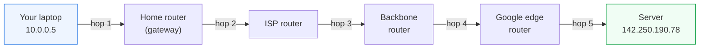
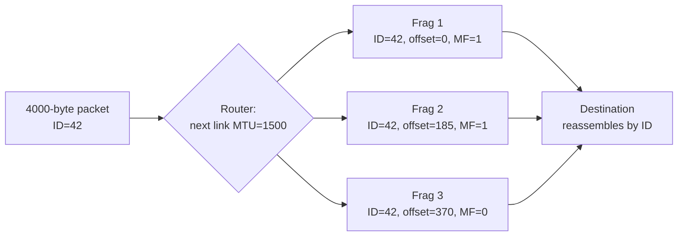
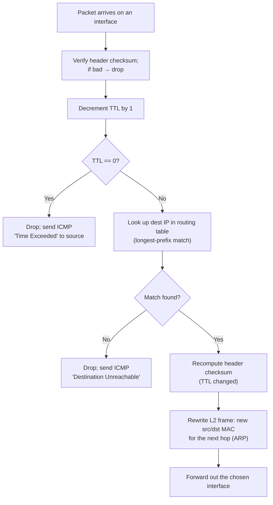
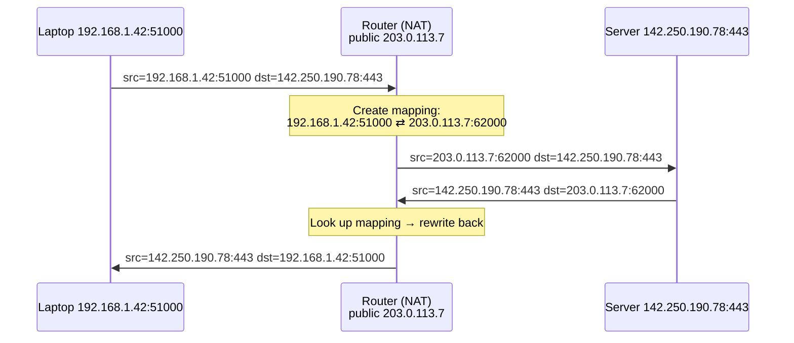
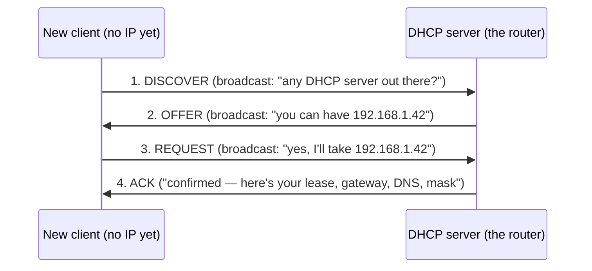
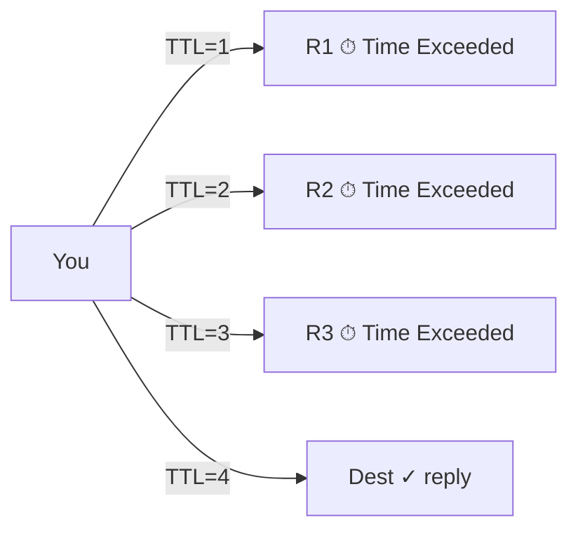
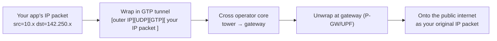

# Module 04 — The Network Layer

> **The one idea to keep:** The link layer ([Module 03](03-link-layer.md)) can only reach
> the room you're in. The **network layer (L3)** is what lets a packet leave that room and
> cross *thousands* of independent networks to a machine on the other side of the planet —
> using a **global, hierarchical address** (the IP address) and a chain of **routers**, each
> making one local decision: "which direction gets this closer?" No single router knows the
> whole path. The internet works because every router only needs to know **the next hop**.

In [Module 03](03-link-layer.md) we could deliver a frame to a *neighbor* — one hop, one
wire, addressed by MAC. But your neighbor isn't Google. To reach Google you must cross
your ISP, several backbone networks, Google's edge, and finally their datacenter — networks
that have never heard of each other and share no link layer. Stitching those into one
apparent "internet" is the entire job of L3.

This is the layer that makes the "inter" in *internet* literal: a **network of networks**.
If you've read the [google.com deep-dive](deep-dive-loading-google.md), this module is the
machinery behind "the gateway takes it from there." It also underpins [DNS](deep-dive-dns.md)
(anycast) and everything [TLS](deep-dive-tls-certificates.md) rides on. When you're done,
[Module 05](05-transport-layer.md) adds reliability *on top* of this best-effort delivery.

---

## 1. The job of L3: host-to-host, across many networks

The link layer's world is one hop. The network layer's world is **the entire internet**.
Its contract to the layer above is deceptively small:

> *"Give me a packet with a destination IP address, and I'll make a best effort to deliver
> it to that machine — wherever it is, across however many networks lie between."*

Three words in that sentence carry the whole design:

- **Best effort** — L3 does *not* guarantee delivery, order, or non-duplication. A packet
  can be dropped, delayed, reordered, or duplicated, and IP will not notice or care.
  Reliability is deliberately pushed up to [Module 05](05-transport-layer.md) (TCP). This is
  the same division of labor you saw at L2, where Ethernet *detects* corruption but leaves
  *recovery* to TCP.
- **A machine** — L3 gets you to the right *host*, not the right *program*. Picking the
  program (via ports) is L4's job.
- **Across many networks** — the defining trick. L3 introduces **routing**: forwarding a
  packet hop by hop toward its destination, where each hop is a fresh L2 delivery
  (new MAC addresses) but the L3 addresses stay fixed end-to-end. (Recall the parcel
  analogy from [Module 01](01-the-layered-model.md): the courier changes at every depot; the
  address on the box does not.)



Each arrow is one L2 hop across a *different* link technology (Wi-Fi, then fiber, then more
fiber). The IP packet is the one thing that survives unchanged from end to end. That
survival is what "network layer" means.

---

## 2. IPv4 addressing: 32 bits wearing a disguise

An **IPv4 address** is just a **32-bit unsigned integer**. That's the whole truth. Everything
else is presentation.

`142.250.190.78` looks like four numbers, but it's one 32-bit value split into four **octets**
(8-bit bytes) and written in **dotted-decimal** so humans can read it. Underneath:

```
 142   .  250   .  190   .   78          ← dotted decimal (what you see)
 10001110 11111010 10111110 01001110     ← the actual 32 bits on the wire
 └─ 142 ─┘└─ 250 ─┘└─ 190 ─┘└─ 78 ─┘
```

Each octet ranges `0–255` (that's what 8 bits can hold), so the total address space is
`2³² ≈ 4.3 billion` addresses. Hold that number — its smallness is why half this module
exists (NAT, IPv6).

> **For the coder:** an IPv4 address is literally a `uint32_t`. `142.250.190.78` equals
> `(142<<24) | (250<<16) | (190<<8) | 78 = 2398796110`. Comparing, masking, and ranging
> addresses is just integer bit-math — which is exactly how routers do it, fast.

### Network portion vs host portion

Here's the pivotal idea. An IP address is **not** one flat number like a MAC address
(which, recall from [Module 03](03-link-layer.md), is *flat* and *local*). It's **split into
two parts**:

- **Network portion** (the high bits) — identifies *which network* the host lives on. All
  hosts on the same link/subnet share this prefix.
- **Host portion** (the low bits) — identifies the *specific host* within that network.

```
  192.168.1.  42
  └── network ┘└ host   (for a /24 — the split is defined by the subnet mask, next section)
```

This split is what makes IP *routable* and *hierarchical*: a router deep in the backbone
doesn't need to know about your specific laptop. It only needs to know "everything starting
with `192.168.1.` goes that way." Millions of individual hosts collapse into one routing
entry. That's the same reason postal codes exist — the sorting office in another country
routes on your country + region, not your house number.

---

## 3. Subnet masks & CIDR: where does the split fall?

The address alone doesn't tell you where the network/host boundary is. That's the job of the
**subnet mask**: a companion 32-bit value where **1-bits mark the network portion** and
**0-bits mark the host portion**.

```
 IP:    192.168.1.42   = 11000000 10101000 00000001 00101010
 Mask:  255.255.255.0  = 11111111 11111111 11111111 00000000
                          └────── network (24 ones) ─────┘└ host ┘
```

Writing out `255.255.255.0` is tedious, so modern notation is **CIDR** (Classless
Inter-Domain Routing): append `/N` where **N = number of network bits**. So
`192.168.1.42/24` means "24 network bits, 8 host bits." The `/24` *is* the mask.

| CIDR | Mask (dotted) | Network bits | Host bits | Usable hosts |
|------|---------------|-------------:|----------:|-------------:|
| /8   | 255.0.0.0     | 8  | 24 | 16,777,214 |
| /16  | 255.255.0.0   | 16 | 16 | 65,534 |
| /24  | 255.255.255.0 | 24 | 8  | 254 |
| /30  | 255.255.255.252 | 30 | 2 | 2 |
| /32  | 255.255.255.255 | 32 | 0 | 1 (a single host) |

> **Why "usable = 2^host − 2":** every subnet reserves two host values. The all-zeros host
> is the **network address** (names the subnet itself); the all-ones host is the **broadcast
> address** (reaches every host on the subnet). So a `/24` has 256 addresses but only 254 you
> can assign. (`/31` and `/32` are special-cased for point-to-point links and single hosts —
> don't apply the −2 there.)

*(You may hear the old "Class A/B/C" system — fixed /8, /16, /24 boundaries. It's dead.
CIDR replaced it in 1993 precisely so networks could be sized to fit, not rounded up to the
next power of 256. Know the term; don't use the scheme.)*

### 🔧 Subnetting math you can do in your head

Given `192.168.1.42/26`, find the network address, broadcast, and usable range.

```
 /26  →  mask = 255.255.255.192   (26 ones: 11111111.11111111.11111111.11000000)
 Host bits = 32 − 26 = 6  →  block size = 2^6 = 64 addresses per subnet
 Subnets step in blocks of 64 in the last octet:  .0  .64  .128  .192
 42 falls in the .0–.63 block, so:
   Network address   = 192.168.1.0     (all host bits 0)
   Broadcast address = 192.168.1.63    (all host bits 1)
   Usable range      = 192.168.1.1  →  192.168.1.62   (62 hosts)
```

**The trick:** find the **block size** (`256 − mask_octet`, here `256 − 192 = 64`), then the
network address is the largest multiple of the block size ≤ your address. Everything else
follows. Practice this — it's the one piece of hand-math networking still demands.

> 🔧 **Project.** Run `ipcalc 192.168.1.42/26` (Linux) or use any online subnet calculator,
> then reproduce its output by hand. Do five random CIDRs until the block-size trick is
> automatic. This is the single highest-leverage 20 minutes in the module.

---

## 4. Public vs private addresses (RFC 1918)

Not every IP is reachable from the global internet. **RFC 1918** carves out three ranges as
**private** — reusable inside any home or corporate network, never routed on the public
internet:

| Range | CIDR | Size | Typical use |
|-------|------|------|-------------|
| `10.0.0.0 – 10.255.255.255` | `10.0.0.0/8` | 16.7M | Large enterprises, cloud VPCs |
| `172.16.0.0 – 172.31.255.255` | `172.16.0.0/12` | 1M | Mid-size networks (Docker default) |
| `192.168.0.0 – 192.168.255.255` | `192.168.0.0/16` | 65K | Home routers |

Your laptop's `192.168.1.42` exists in *millions* of homes simultaneously — that's fine,
because private addresses never leave the local network. When you talk to the internet, your
router **translates** your private address into its one public address (that's **NAT**,
Section 8). Also worth knowing: `127.0.0.0/8` (loopback, `localhost`) and `169.254.0.0/16`
(link-local, self-assigned when DHCP fails).

> **This is a direct consequence of Section 2's tiny 4.3-billion address space.** There
> aren't enough public IPv4 addresses for every device, so we hide entire networks behind a
> single public address using private ranges + NAT. IPv6 (Section 11) makes this hack
> unnecessary.

---

## 5. The IPv4 packet header, field by field

When L4 hands a segment down, IP wraps it in a **20-byte header** (minimum). Every field
earns its place — here's what each does.

```
 0                   1                   2                   3
 0 1 2 3 4 5 6 7 8 9 0 1 2 3 4 5 6 7 8 9 0 1 2 3 4 5 6 7 8 9 0 1
+-+-+-+-+-+-+-+-+-+-+-+-+-+-+-+-+-+-+-+-+-+-+-+-+-+-+-+-+-+-+-+-+
|Version|  IHL  |    DSCP/ECN   |          Total Length         |
+-+-+-+-+-+-+-+-+-+-+-+-+-+-+-+-+-+-+-+-+-+-+-+-+-+-+-+-+-+-+-+-+
|         Identification        |Flags|      Fragment Offset    |
+-+-+-+-+-+-+-+-+-+-+-+-+-+-+-+-+-+-+-+-+-+-+-+-+-+-+-+-+-+-+-+-+
|      TTL      |    Protocol   |         Header Checksum        |
+-+-+-+-+-+-+-+-+-+-+-+-+-+-+-+-+-+-+-+-+-+-+-+-+-+-+-+-+-+-+-+-+
|                       Source IP Address                        |
+-+-+-+-+-+-+-+-+-+-+-+-+-+-+-+-+-+-+-+-+-+-+-+-+-+-+-+-+-+-+-+-+
|                    Destination IP Address                      |
+-+-+-+-+-+-+-+-+-+-+-+-+-+-+-+-+-+-+-+-+-+-+-+-+-+-+-+-+-+-+-+-+
```

| Field | Size | What it does |
|-------|------|--------------|
| **Version** | 4 bits | `4` for IPv4, `6` for IPv6. Tells the receiver how to parse the rest. |
| **IHL** (Header Length) | 4 bits | Header length in 32-bit words. Usually `5` (= 20 bytes); larger if options present. |
| **DSCP/ECN** | 8 bits | Quality-of-Service markings + congestion notification. |
| **Total Length** | 16 bits | Whole packet size (header + data) in bytes. Max `65,535`. |
| **Identification** | 16 bits | Tags fragments of one original packet so they can be reassembled. |
| **Flags** | 3 bits | Includes **DF** (Don't Fragment) and **MF** (More Fragments). |
| **Fragment Offset** | 13 bits | Where this fragment sits within the original packet. |
| **TTL** (Time To Live) | 8 bits | Hop counter; decremented by 1 at every router. Hits 0 → packet dropped. |
| **Protocol** | 8 bits | What's inside: `6`=TCP, `17`=UDP, `1`=ICMP. The demux key to L4. |
| **Header Checksum** | 16 bits | Error-check over the **header only** (not the data). |
| **Source IP** | 32 bits | Who sent it. |
| **Destination IP** | 32 bits | Where it's going — the field routers actually forward on. |

A few fields deserve emphasis:

- **TTL** is the internet's safety valve. Without it, a routing loop (packet bouncing
  A→B→A→B forever) would clog links permanently. Instead, TTL counts down and the packet dies
  after (typically) 64 or 128 hops. This is also the exact mechanism **traceroute** exploits
  (Section 10). Note the contrast with L2: Ethernet frames have *no* TTL, which is why
  Spanning Tree (Module 03) is needed to prevent L2 loops.
- **Protocol** is the same demultiplexing idea as EtherType at L2 — a number saying "hand the
  payload to *this* upper-layer handler."
- **Header Checksum** covers only the header, so it must be **recomputed at every hop**
  (because TTL changes every hop). It detects corruption of the routing-critical fields;
  data integrity is left to L4. (IPv6 drops this field entirely — see Section 11.)

### MTU & fragmentation

Recall the **MTU** (Maximum Transmission Unit) from [Module 03](03-link-layer.md): Ethernet's
payload maxes at **1500 bytes**. But an IP packet can be up to 65,535 bytes, and different
links have different MTUs. What happens when a big packet must cross a small-MTU link?

**Fragmentation.** IPv4 can chop one packet into fragments that each fit, using the
Identification / Flags / Fragment Offset fields so the *destination* can reassemble them.



Fragmentation is **expensive and fragile**: if *any* fragment is lost, the whole packet is
undeliverable and must be resent. So modern stacks avoid it. Setting the **DF (Don't
Fragment)** flag tells routers "drop, don't fragment," and they reply with an ICMP
"Fragmentation Needed" message (Section 10). The sender then does **Path MTU Discovery** —
probing to find the smallest MTU on the path and sizing packets to fit. IPv6 goes further:
routers **never** fragment; only the source may.

> ⚡ **Latency note.** Fragmentation hurts latency two ways: reassembly buffers add delay,
> and a single lost fragment forces retransmission of the *entire* original packet (up to
> 64 KB) — a huge penalty over a lossy link. This is why tunneling protocols that shrink the
> usable MTU (VPNs, and cellular's **GTP** tunnels in Section 12) can quietly wreck
> throughput if MTU isn't tuned.

---

## 6. Routing fundamentals: how a packet finds its way

This is the heart of L3. A **router** is a device with interfaces on multiple networks whose
job is: *receive a packet, look at its destination IP, and forward it out the interface that
gets it closer.* It repeats this, hop by hop, and the packet crosses the world.

### The routing table

Every host and router has a **routing table**: a list of destination *networks* (as CIDR
prefixes) and, for each, the **next hop** and outgoing interface. Here's a typical laptop's:

```
$ ip route            # (Linux; 'netstat -rn' on macOS)
default        via 192.168.1.1   dev wlan0     ← the DEFAULT GATEWAY: "anything I don't
10.0.0.0/8     via 192.168.1.1   dev wlan0        otherwise know, send here"
192.168.1.0/24 dev wlan0                        ← "this subnet is directly attached —
                                                   no router needed, deliver via ARP"
```

Two entry types:
- **Directly connected** (`192.168.1.0/24 dev wlan0`) — the destination is on a link I'm
  physically on, so I deliver it directly (resolve its MAC via ARP, from Module 03, and send
  the frame).
- **Via a next hop** (`via 192.168.1.1`) — the destination is elsewhere; hand the packet to
  *this* router and trust it to continue.

The **default gateway** (`default via …`, also called `0.0.0.0/0`) is the catch-all: "if no
more specific entry matches, send it here." For your laptop, that's your home router. This is
what "the gateway takes it from there" meant in the deep-dive.

### Longest-prefix match

What if *several* entries match a destination? A packet to `10.5.5.5` matches both
`10.0.0.0/8` and `0.0.0.0/0` (default matches everything). The rule is
**longest-prefix match**: **the most specific route wins** — the one with the most network
bits (the largest `/N`). `10.0.0.0/8` (8 bits) beats `0.0.0.0/0` (0 bits), so it's chosen.

> **For the coder:** longest-prefix match is why routing isn't a hash-map lookup. You can't
> just key on the exact address; you must find the *longest* stored prefix that the address
> falls under. Routers use specialized structures (tries, TCAM hardware) to do this at line
> rate, billions of times per second.

### Forwarding, step by step

Here's exactly what a router does with each packet:



Notice what **doesn't** change: the source and destination **IP addresses** are untouched
(NAT aside). What **does** change every hop: **TTL** (−1), **header checksum**
(recomputed), and the entire **L2 frame** (fresh MAC addresses for the next neighbor). This
is the L2-local / L3-global split from [Module 01](01-the-layered-model.md) and
[Module 03](03-link-layer.md), now shown from the router's side.

> ⚡ **Latency note.** Every router hop adds *processing delay* (the lookup + rewrite above)
> and, when links are busy, *queuing delay* — the two per-hop terms from
> [Module 02](02-how-data-moves.md). More hops = more of both. A path with 18 hops has 18
> chances to queue. This is why CDNs and edge caching exist: fewer hops to the content means
> fewer places to wait. It's also why a *geographically* short path routed through a distant
> exchange (bad BGP, Section 7) can have surprisingly high ping.

---

## 7. Static vs dynamic routing; OSPF, BGP, and the glue of the internet

Where do routing-table entries come from?

- **Static routing** — a human types them in. Simple, predictable, zero protocol overhead —
  but it doesn't adapt: if a link dies, the route is just wrong until someone fixes it. Fine
  for a home router's single default route; hopeless at internet scale.
- **Dynamic routing** — routers **talk to each other** using a routing protocol, continuously
  discovering topology and rerouting around failures automatically. This is how the real
  internet stays up.

Dynamic routing splits by scope:

### Interior vs exterior

| | Interior (IGP) | Exterior (EGP) |
|---|---|---|
| **Scope** | *Within* one organization / **autonomous system** | *Between* autonomous systems |
| **Optimizes for** | Shortest/fastest path | Policy, business relationships, reachability |
| **Example** | **OSPF**, IS-IS | **BGP** |
| **Analogy** | Roads inside one city | Treaties between countries |

An **Autonomous System (AS)** is a network under one administrative control (an ISP, a big
company, a cloud provider), identified by an **AS number** (e.g. Google is AS15169).

- **OSPF (Open Shortest Path First)** is a common **interior** protocol. Every router floods
  its local link state to all others, everyone builds an identical map of the AS, and each
  computes shortest paths (Dijkstra) to every subnet. Fast convergence, metric-based, entirely
  *inside* one AS.
- **BGP (Border Gateway Protocol)** is *the* **exterior** protocol — **the routing protocol
  that glues the ~75,000 autonomous systems of the internet together.** ASes announce "I can
  reach these prefixes" to their neighbors, who propagate the announcements. Crucially, BGP
  routes on **policy**, not just distance: an ISP may prefer a cheaper peer over a shorter but
  costlier transit link. BGP is why the internet has no central map — it's a negotiated,
  emergent web of reachability announcements.

> **BGP is load-bearing and scarily fragile.** Because it's built on trust, a single AS
> announcing prefixes it doesn't own can **hijack** traffic (accidentally or maliciously) —
> this has taken down large chunks of the internet more than once. Fixes like **RPKP/RPKI**
> route-origin validation are rolling out in 2025 but adoption is still partial.

### How anycast rides on BGP

**Anycast** is a beautiful BGP trick: announce the *same* IP prefix from *many* locations
worldwide. BGP's longest-prefix + shortest-AS-path logic then naturally sends each user to
the *topologically nearest* instance — no special client logic needed. This is how public
DNS resolvers (`8.8.8.8`, `1.1.1.1`) and CDNs put "the same address" in dozens of cities at
once. The [DNS deep-dive](deep-dive-dns.md) leans on exactly this: when you query
`8.8.8.8`, BGP routes you to whichever Google DNS node is nearest, cutting your lookup
latency dramatically.

> ⚡ **Latency note.** A **suboptimal BGP path** is a real and common latency source. Two
> hosts physically 50 km apart can end up routed through an exchange 500 km away because
> that's the path BGP *policy* selected. You can't fix it from your machine — but `traceroute`
> (Section 10) lets you *see* it, and it explains pings that seem to defy geography.

---

## 8. NAT & PAT: many private hosts, one public address

Back to the 4.3-billion problem. Your home has a dozen devices but your ISP gives you
**one** public IP. **NAT (Network Address Translation)** is what squares that circle: your
router rewrites the **source IP** of outbound packets from your private address to its single
public address, and reverses the rewrite on the replies.

In practice everyone uses **PAT (Port Address Translation)**, a.k.a. **NAPT** or
"NAT overload" — NAT that also rewrites **ports** so *many* internal hosts can share *one*
public IP simultaneously. The router keeps a **translation table** mapping
`(private IP, private port) ↔ (public IP, public port)`:



The server only ever sees the router's public IP and port; it has no idea (and doesn't need
to) that a private network hides behind it.

**Consequences you must internalize:**
- **Outbound works transparently; inbound does not.** A translation entry is created by an
  *outbound* packet. An *unsolicited* inbound packet has no matching entry, so the router
  doesn't know which internal host to send it to — it drops it. This is why you can't just
  run a server at home and have people connect: you need **port forwarding** (a manual static
  mapping) or **hole-punching** (both sides initiate outbound to a rendezvous server — how
  most peer-to-peer, VoIP, and gaming connections work).
- **NAT is stateful.** The table has finite size and entries time out. This is a scaling and
  reliability concern for **CGNAT (Carrier-Grade NAT)**, where your ISP NATs *thousands* of
  customers behind shared public IPs — very common on mobile networks.

> ⚡ **Latency note.** NAT itself is fast (a table lookup per packet), but the **state** it
> requires has latency consequences: idle connections get evicted from the table, so a
> long-lived connection (a push notification socket, an SSH session) must send periodic
> **keepalives** to stay in the table — costing battery and waking the radio on cellular
> (foreshadowing the RRC-state cost from Module 12). NAT is a hidden reason mobile apps
> heartbeat.

> **Cellular tie:** mobile networks are drowning in NAT. Your phone almost always sits behind
> **CGNAT**, so it has no public IPv4 address at all — another reason carriers are pushing
> IPv6 hard (Section 11).

---

## 9. DHCP: how your device gets an address at all

You've never typed your laptop's IP address, subnet mask, gateway, and DNS server by hand —
yet they're all set. That's **DHCP (Dynamic Host Configuration Protocol)**: when a device
joins a network, it *asks* for its configuration and a server *leases* it one.

The exchange is four steps, memorized as **DORA**:



| Step | Who | What |
|------|-----|------|
| **D**iscover | Client | Broadcasts (it has no IP, no server address) looking for any DHCP server. |
| **O**ffer | Server | Proposes an available address + config. |
| **R**equest | Client | Formally accepts one offer (there may be several servers). |
| **A**ck | Server | Confirms and hands over the **lease** (address + mask + gateway + DNS + lease time). |

The address is a **lease** — time-limited, renewed periodically. When it expires (or the
device leaves), the address returns to the pool for reuse. Note the bootstrap paradox DHCP
solves elegantly: the client has *no* IP address yet, so the first messages are L2
**broadcasts** (`ff:ff:ff:ff:ff:ff`, the broadcast MAC from [Module 03](03-link-layer.md)) —
the only way to reach a server when you can't yet address anyone.

> ⚡ **Latency note.** DORA is part of your "join a network" delay — usually tens of
> milliseconds on Wi-Fi, but it's why connecting to a new hotspot isn't instant. Cellular
> avoids DORA entirely: your IP address is assigned during **PDN/bearer setup** by the core
> network when you attach (Modules 09/11) — a cellular-specific re-implementation of "hand the
> device its L3 config," done its own way.

---

## 10. ICMP: the network layer's diagnostic voice

IP is best-effort and silent — but sometimes the network *needs* to report a problem
("your packet was too big," "no route to that host," "TTL expired"). That's **ICMP
(Internet Control Message Protocol)**, a companion to IP (Protocol number `1`) for control
and error signaling. Two everyday tools are built entirely on it:

### ping — "are you there, and how long does the round trip take?"

`ping` sends an **ICMP Echo Request**; the target replies with an **ICMP Echo Reply**. The
round-trip time *is* your latency measurement — the very number
[Module 02](02-how-data-moves.md) taught you to decompose.

### traceroute — TTL as a clever hack

`traceroute` reveals *every router* on the path, and it does so by **weaponizing TTL**
(Section 5). Recall: a router that decrements TTL to 0 drops the packet and sends back an
**ICMP "Time Exceeded"** — which reveals *that router's* address. So:

```
 Send packet with TTL=1  → first router decrements to 0, drops, replies → you learn hop 1
 Send packet with TTL=2  → dies at the second router, replies           → you learn hop 2
 Send packet with TTL=3  → dies at the third router, replies            → you learn hop 3
 ... keep going until a packet actually reaches the destination.
```



Each row of `traceroute` output is one router, with the RTT to it. Watching the RTT climb
hop by hop — and spotting where it *jumps* — is how you see the suboptimal BGP paths and
congested links from Sections 6–7 with your own eyes.

> 🔧 **Project.** Run `traceroute google.com` (macOS/Linux) or `tracert` (Windows), and also
> try `mtr google.com` (a live, continuously-updating traceroute). Identify: your gateway
> (hop 1), your ISP, the handoff into a backbone, and Google's edge. Find the hop where
> latency jumps the most — that's usually the long-haul link. You are directly observing
> everything in Sections 5, 6, and 7.

> ⚠️ Some routers deprioritize or don't reply to ICMP (shown as `* * *`), so a missing hop
> doesn't mean a broken path — just a shy router. Firewalls also often block ICMP entirely.

---

## 11. IPv6: because 4.3 billion wasn't enough

Everything so far — NAT, RFC 1918, CGNAT — is a workaround for one root cause: **IPv4
exhaustion**. The 4.3-billion address pool ran dry (the central pool, IANA, allocated its
last blocks in 2011). **IPv6** is the real fix: a **128-bit** address space.

How big is 128 bits? `2¹²⁸ ≈ 3.4 × 10³⁸` addresses — roughly **10²⁸ addresses per person on
Earth**, or enough to give every atom on the surface of the planet several. Address scarcity
simply stops being a design constraint.

### Notation

IPv6 is written as **eight groups of four hex digits**, colon-separated:

```
 2001:0db8:0000:0000:0000:ff00:0042:8329
```

Two compression rules make that livable:
- **Drop leading zeros** in each group: `2001:db8:0:0:0:ff00:42:8329`.
- **`::` replaces one run of all-zero groups** (once per address):
  `2001:db8::ff00:42:8329`.

So `::1` is loopback (IPv6's `127.0.0.1`) and `::` is all-zeros.

### What changes vs IPv4

| Concept | IPv4 | IPv6 |
|---------|------|------|
| Address size | 32-bit | 128-bit |
| Address config | DHCP (usually) | **SLAAC** (stateless auto-config) or DHCPv6 |
| Address→MAC resolution | **ARP** | **NDP** (Neighbor Discovery, over ICMPv6) |
| Header checksum | Present | **Removed** (L2 + L4 already check; saves per-hop work) |
| Fragmentation | Routers can fragment | **Source-only**; routers never fragment |
| NAT | Ubiquitous | **Generally unnecessary** (every device can have a public address) |

Three of these are the recurring "cellular re-implements lower-layer ideas" thread showing
up again at L3:

- **SLAAC (Stateless Address Autoconfiguration)** lets a host build its *own* global address
  from the network prefix it hears advertised — no DHCP server required (though DHCPv6 still
  exists for managed networks). It's DORA's job, done statelessly.
- **NDP (Neighbor Discovery Protocol)** replaces ARP (which you met in
  [Module 03](03-link-layer.md)) using ICMPv6 multicast instead of broadcast — same
  "find the neighbor's link address" job, cleaner design.
- **No NAT needed** means the return of true **end-to-end connectivity**: any device can be
  addressed directly, which simplifies peer-to-peer, VoIP, and gaming (no hole-punching).
  Firewalls still provide security — NAT was never really the security boundary people
  imagined.

> ⚡ **Latency note.** IPv6 isn't automatically faster, but it can *avoid* latency: no NAT
> keepalives (Section 8), no CGNAT bottleneck, and — because mobile carriers deploy IPv6
> widely — often a *cleaner* path than IPv4-with-CGNAT on cellular. In 2025, a large share of
> mobile traffic is IPv6 end-to-end for exactly this reason.

---

## 12. Where the cellular modem re-implements L3

Keep the running thread alive. In [Module 01](01-the-layered-model.md) the killer concept was
**encapsulation** — wrapping a packet inside another. Cellular takes that idea and runs with
it at L3.

In an LTE/5G network, your phone gets an IP address, and your apps send perfectly ordinary IP
packets. But those packets **do not travel the operator's network as bare IP**. Instead, each
one is **encapsulated inside a GTP (GPRS Tunnelling Protocol) tunnel** and carried across the
operator's **core network** — from the tower (eNodeB/gNodeB) to the packet gateway
(P-GW/UPF) that finally releases it onto the real internet.



Why tunnel instead of just routing? Because of **mobility**: as you move between towers, your
IP address must stay stable so your connections don't break. The tunnel decouples "where you
are physically" from "your IP address" — the core reroutes the *tunnel endpoint* while your IP
never changes. It's IP-inside-IP, and it's the same encapsulation principle from Module 01,
applied to solve a problem generic IP never had to (a host that physically moves mid-session).

We'll open up GTP, bearers, and the mobile core properly in **Modules 09 and 11**. For now,
the one takeaway: **your IP packets are a passenger, riding inside the operator's own tunnels
across their private network.** When someone says "the internet is packets all the way down,"
the honest footnote is "…wrapped in several other headers you never see."

---

## Misconceptions to kill

- ❌ *"IP guarantees my data arrives."* No — IP is **best-effort**. Delivery, order, and
  dedup are TCP's job ([Module 05](05-transport-layer.md)).
- ❌ *"A router looks at the whole path."* No — each router knows only the **next hop**. No
  device holds the end-to-end route.
- ❌ *"My private IP `192.168.1.x` is mine on the internet."* No — it exists in millions of
  homes; NAT translates it to your one public IP at the edge.
- ❌ *"NAT is a firewall / makes me secure."* No — it hides addresses as a side effect, but
  it isn't a security policy. A firewall is.
- ❌ *"Subnet mask and IP are separate unrelated things."* No — the mask *defines* where the
  network/host split falls in that IP. Same address, different mask = different network.
- ❌ *"TTL is measured in seconds."* No — despite the name, it's a **hop count**, decremented
  once per router.

---

## Check your understanding

<div class="quiz">
<p class="q">A packet destined for <code>10.5.5.5</code> matches routing entries <code>10.0.0.0/8</code>, <code>10.5.0.0/16</code>, and <code>0.0.0.0/0</code>. Which does the router use?</p>
<ul class="options">
<li data-correct="true"><code>10.5.0.0/16</code> — the most specific match (longest prefix) wins.</li>
<li><code>0.0.0.0/0</code> — the default route always takes priority.</li>
<li><code>10.0.0.0/8</code> — the first matching entry in the table.</li>
</ul>
<div class="explain">Routers use <strong>longest-prefix match</strong>: among all matching
routes, the one with the most network bits wins. <code>/16</code> (16 bits) is more specific
than <code>/8</code> or the <code>/0</code> default, so it's chosen. The default route is the
last resort, used only when nothing more specific matches.</div>
</div>

<div class="quiz">
<p class="q">For the subnet <code>192.168.10.0/26</code>, what is the broadcast address and how many usable hosts are there?</p>
<ul class="options">
<li data-correct="true">Broadcast <code>192.168.10.63</code>, 62 usable hosts.</li>
<li>Broadcast <code>192.168.10.255</code>, 254 usable hosts.</li>
<li>Broadcast <code>192.168.10.64</code>, 64 usable hosts.</li>
</ul>
<div class="explain">A /26 has 6 host bits → block size 64 (addresses .0–.63). The network
address is .0, the broadcast (all host bits 1) is .63, and usable hosts are .1–.62 =
2⁶ − 2 = 62. The .255/254 answer would be a /24; .64 is the *next* subnet's network
address, not a broadcast.</div>
</div>

<div class="quiz">
<p class="q">How does <code>traceroute</code> discover each router along the path?</p>
<ul class="options">
<li data-correct="true">It sends packets with increasing TTL values; each router that decrements TTL to 0 drops the packet and reveals itself via an ICMP "Time Exceeded" message.</li>
<li>It asks BGP for the full list of autonomous systems between you and the destination.</li>
<li>Each router is required to stamp its address into the IP header as the packet passes.</li>
</ul>
<div class="explain">Traceroute exploits the TTL hop-counter: TTL=1 dies at hop 1 (which
replies with ICMP Time Exceeded, revealing itself), TTL=2 dies at hop 2, and so on. Routers
don't stamp themselves into packets, and there's no BGP query involved — it's a pure,
clever use of the TTL field and ICMP.</div>
</div>

---

## Exercises

1. **Read your own L3 config.** Run `ip addr` + `ip route` (Linux) or `ifconfig` +
   `netstat -rn` (macOS). Identify your IP, subnet mask (CIDR), and default gateway. Confirm
   your gateway is the `default via` entry, and that your own subnet is "directly connected."

2. **🔧 Subnet by hand, then verify.** Pick three random CIDRs (e.g. `172.16.40.100/20`,
   `10.1.2.3/28`, `192.168.5.130/25`). For each, compute the network address, broadcast, and
   usable host range using the block-size trick from Section 3. Check with `ipcalc` or an
   online calculator. Repeat until it's automatic.

3. **Watch DORA happen.** Start a Wireshark capture, then disconnect and reconnect Wi-Fi (or
   run `sudo dhclient -r && sudo dhclient` on Linux). Filter for `dhcp` (or `bootp`) and find
   the Discover / Offer / Request / Ack exchange from Section 9. Note that the first messages
   are L2 broadcasts.

4. **🔧 See NAT with your own eyes.** Visit `whatismyip.com` (or run
   `curl ifconfig.me`) — that's your router's *public* IP. Compare it to your `ip addr`
   private IP. They differ because of NAT. Bonus: on your router's admin page, find the NAT /
   port-forwarding table.

5. **🔧 Trace and read a path.** Run `mtr google.com` (or `traceroute`). Count the hops,
   identify where latency jumps, and look up an AS number of a mid-path hop with a whois tool
   (e.g. `whois <IP>`). You're seeing Sections 5–7 live: TTL, hops, and BGP-chosen paths.

6. **Prove header/TTL behavior.** In Wireshark, capture an outbound packet and inspect the IP
   header. Find the TTL, Protocol (6/17/1), and both IP addresses. Then `ping` a distant host
   and a near host and compare TTLs in the *replies* — the difference hints at how many hops
   away each is (start TTL minus hops remaining).

---

## Key terms

- **Network layer (L3)** — moves packets host-to-host across many networks; best-effort.
- **IPv4 address** — a 32-bit integer, written dotted-decimal, split into network + host.
- **Octet** — one 8-bit byte of an IP address (`0–255`).
- **Subnet mask** — 32-bit value marking which address bits are network (1s) vs host (0s).
- **CIDR** (`/N`) — subnet notation; N = number of network bits.
- **Network / broadcast address** — the all-host-bits-0 / all-host-bits-1 addresses of a subnet (unusable as host addresses).
- **RFC 1918 / private address** — reusable, non-internet-routable ranges (10/8, 172.16/12, 192.168/16).
- **TTL (Time To Live)** — IP header hop-counter, decremented each router; 0 = drop.
- **MTU** — largest payload a link carries (Ethernet: 1500 bytes).
- **Fragmentation** — splitting an oversized packet to fit a smaller MTU; reassembled at the destination.
- **Routing table** — list of destination prefixes → next hop / interface.
- **Default gateway** — the catch-all route (`0.0.0.0/0`) for unknown destinations.
- **Next hop** — the immediate router a packet is handed to.
- **Longest-prefix match** — most-specific route wins.
- **Autonomous System (AS)** — a network under one administrative control, with an AS number.
- **OSPF** — an interior routing protocol (within an AS).
- **BGP** — the exterior routing protocol that glues the internet's ASes together.
- **Anycast** — one IP prefix announced from many locations; BGP routes users to the nearest.
- **NAT / PAT** — rewriting private↔public addresses (and ports) at the edge.
- **CGNAT** — carrier-grade NAT; many customers behind shared public IPs.
- **DHCP / DORA** — automatic address leasing (Discover, Offer, Request, Ack).
- **ICMP** — IP's control/error protocol (ping, traceroute, TTL-expired, unreachable).
- **IPv6** — 128-bit addressing; SLAAC, NDP (replaces ARP), no header checksum, generally no NAT.
- **SLAAC** — stateless IPv6 address auto-configuration.
- **NDP** — IPv6's neighbor discovery (the ARP replacement).
- **GTP** — the tunnel protocol carrying your IP packets across the cellular core.

---

## Cheat-sheet

```
NETWORK LAYER (L3) — host-to-host across MANY networks; BEST-EFFORT (no guarantees)
  IP → the machine | ports → the program (L4) | MAC → the next hop (L2)
  IP addresses stay end-to-end; MAC + TTL + header checksum change every hop

IPv4 ADDRESS = 32-bit int, dotted decimal, split into NETWORK + HOST
  Mask: 1-bits = network, 0-bits = host    CIDR /N = N network bits
  usable hosts = 2^(host bits) − 2   (network addr + broadcast reserved)

SUBNETTING TRICK
  block size = 256 − mask_octet
  network addr = largest multiple of block size ≤ your address
  broadcast = network addr + block size − 1;  usable = network+1 .. broadcast−1
  e.g. /26 → block 64 → .0/.64/.128/.192 ; .42 → net .0, bcast .63, hosts .1–.62

PRIVATE (RFC 1918): 10.0.0.0/8 · 172.16.0.0/12 · 192.168.0.0/16
  loopback 127.0.0.0/8 · link-local 169.254.0.0/16

IPv4 HEADER (20 B): Version|IHL|DSCP/ECN|Total Length
  |ID|Flags(DF,MF)|Frag Offset|  |TTL|Protocol(6=TCP,17=UDP,1=ICMP)|Checksum|
  |Src IP|Dst IP|      TTL = hop count (not seconds); checksum = header only
  MTU 1500 → oversize packets fragment (avoid; use DF + Path MTU Discovery)

ROUTING
  routing table = prefix → next hop / interface   (directly connected OR via gateway)
  default gateway = 0.0.0.0/0 catch-all
  LONGEST-PREFIX MATCH: most specific (largest /N) wins
  per hop: check+recompute checksum, TTL−1 (0→drop+ICMP), lookup, rewrite L2 frame
  static (hand-typed) vs dynamic (protocols)
  OSPF = interior (inside an AS) | BGP = exterior (between ASes) = internet glue
  anycast = same prefix from many sites; BGP picks nearest (8.8.8.8, CDNs)

NAT / PAT: private (IP:port) ⇄ public (IP:port) at the edge; stateful table
  outbound creates state; UNSOLICITED inbound is dropped (need port-forward/hole-punch)
  CGNAT = ISP NATs many customers (common on mobile)

DHCP (DORA): Discover → Offer → Request → Ack  → lease (IP+mask+gateway+DNS)
  first msgs are L2 broadcasts (client has no IP yet)

ICMP: ping (Echo Req/Reply = RTT) · traceroute (increasing TTL → Time Exceeded per hop)

IPv6: 128-bit, hex groups, :: compresses zeros | SLAAC (no DHCP) | NDP (replaces ARP)
  no header checksum | source-only fragmentation | generally NO NAT (end-to-end)

CELLULAR TIE: your IP packets ride INSIDE GTP tunnels across the operator core
  (tower → P-GW/UPF), so your IP stays stable as you move. IP-in-IP = Module 01 encapsulation.
```

---

**Next up → Module 05: The Transport Layer** — IP gets a packet to the right *machine*, best-effort; now TCP, UDP, and QUIC get it to the right *program* and (for TCP) make delivery reliable, ordered, and flow-controlled on top of L3's "no promises."
