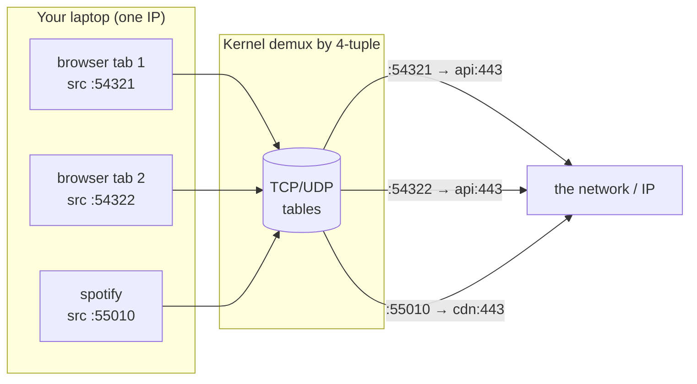
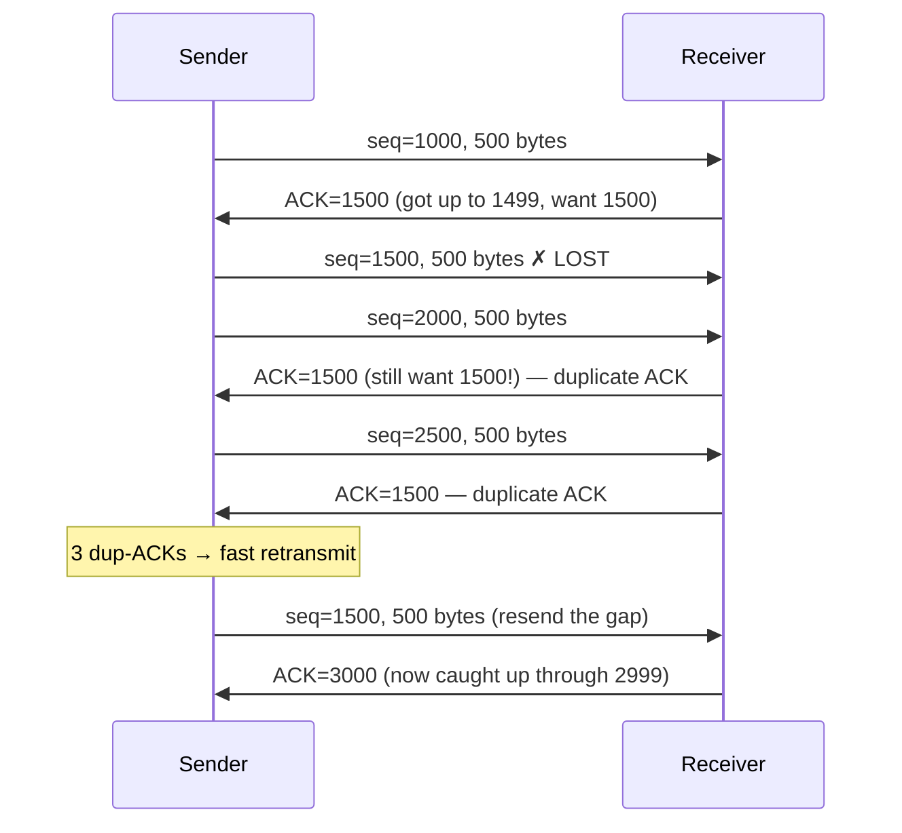
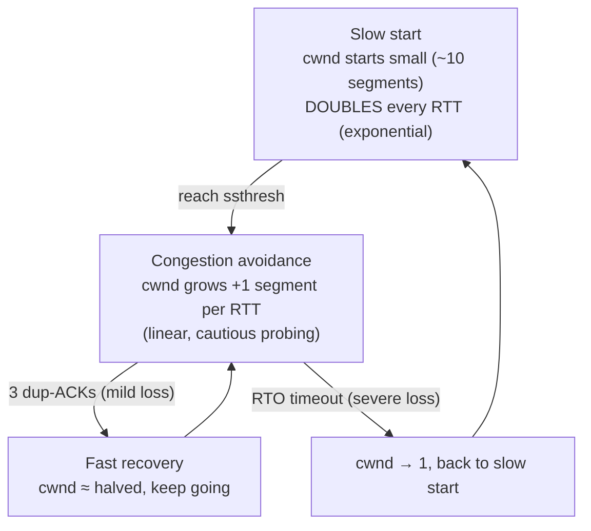
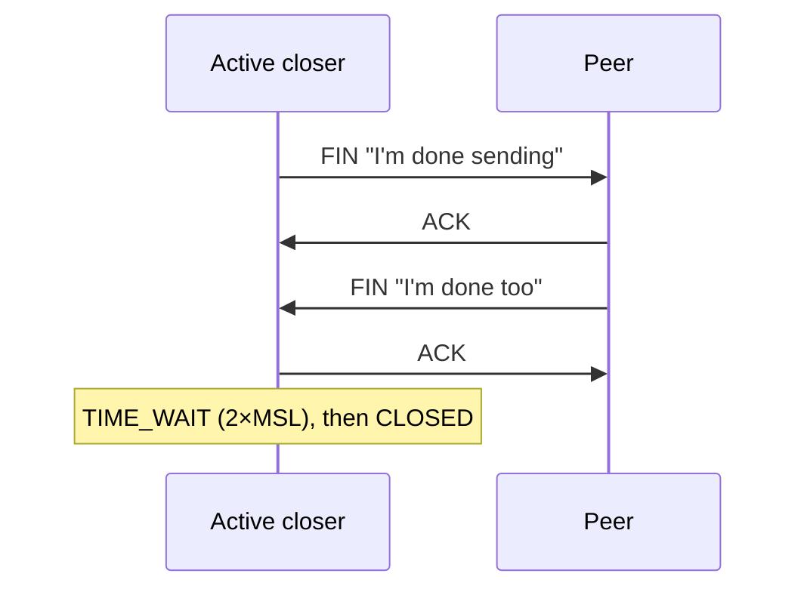
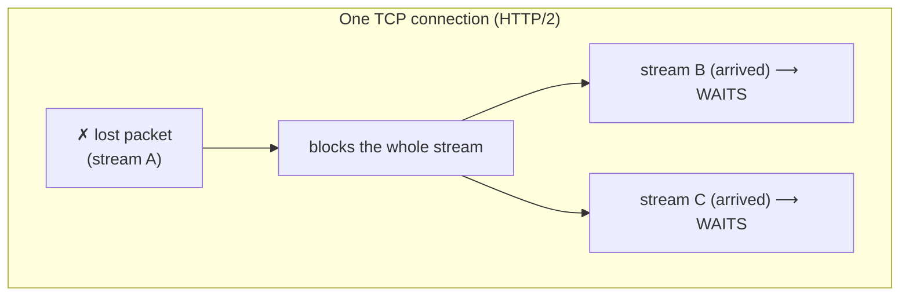
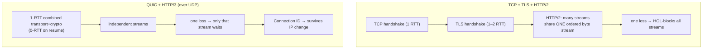

# Module 05 — The Transport Layer

> **The one idea to keep:** The network layer ([Module 04](04-network-layer.md)) gets a
> packet to the right **machine** and then washes its hands of it — best-effort, no
> guarantees, no idea which program wants it. The transport layer's job is everything left
> over: deliver to the right **program** (ports), and — if you use TCP — turn IP's lossy,
> unordered, no-promises pipe into a stream that *feels* reliable and ordered, without ever
> being able to change IP itself. TCP is a **library of illusions built on top of a channel
> that offers none.**

You already know IP is best-effort: it may drop packets, duplicate them, reorder them, or
deliver them corrupted, and it will never tell you. Yet `sock.recv()` in your code hands you
a clean, in-order byte stream. Everything between those two facts is this module. We'll also
meet **UDP** (the honest layer that adds almost nothing) and **QUIC** (the modern redo that
moved TCP's ideas into userspace — the protocol behind [loading google.com](deep-dive-loading-google.md)
today).

---

## 1. What L4 adds that L3 can't: process-to-process delivery

IP addresses identify a **machine** (technically, a network interface). But a machine runs
dozens of programs that all want the network at once — your browser, Spotify, a `ssh`
session, three Docker containers. When a packet arrives at `93.184.216.34`, *which* of them
gets it?

L3 has no answer. That is deliberately not its problem. The transport layer answers it with
one small idea: the **port**, a 16-bit number (0–65535) that names an endpoint *within* a
machine.

| | Network layer (L3) | Transport layer (L4) |
|---|---|---|
| Delivers to | a **host** (IP address) | a **program/socket** (IP + port) |
| Reliability | best-effort, no guarantees | TCP: reliable & ordered · UDP: none |
| Unit ([Module 01](01-the-layered-model.md)) | packet | **segment** (TCP) / **datagram** (UDP) |
| Sees the path? | yes — routes hop by hop | no — end-to-end only, endpoints alone |
| Analogy | delivers to the building | delivers to the specific apartment |

> **The crucial framing:** L4 is an **end-to-end** layer. Unlike L2 (one hop) and L3 (every
> hop rewrites and re-routes), TCP and UDP headers are created by the sender's OS and read
> only by the receiver's OS. No router in the middle is *supposed* to look inside — which is
> exactly why encryption and QUIC can hide so much from the network (Section 11).

---

## 2. Ports, sockets, and the 4-tuple

A **socket** is your program's handle onto the network — the file-descriptor-like object you
`bind()`, `connect()`, `send()`, and `recv()` on. What actually identifies a *connection* on
the wire, though, is a **4-tuple**:

```
   ( source IP , source port , destination IP , destination port )
     142.250.x.y   54321          your.ip.here     443
```

Every TCP connection is uniquely named by these four values (plus the protocol). This is the
mechanism that lets your laptop hold **many** simultaneous connections to the *same* server
on the *same* port 443: each connection gets a different **source port**, so the 4-tuples
differ, so the OS can demultiplex the returning packets to the right socket.

**Well-known vs ephemeral ports:**

| Range | Name | Who uses it |
|---|---|---|
| 0–1023 | **well-known** | servers for standard protocols: 22 SSH, 53 DNS, 80 HTTP, 443 HTTPS/QUIC, 123 NTP |
| 1024–49151 | registered | vendor-assigned server ports (e.g. 5432 Postgres, 6379 Redis) |
| 49152–65535 | **ephemeral** | short-lived source ports the OS hands your *client* automatically |

When you `curl https://example.com`, your OS picks a random ephemeral port (say 54321) as the
source, and dials the server's well-known 443. The server sees `(you:54321 → server:443)` and
replies with source and destination swapped. That symmetry is the whole demux trick.



🔧 **Project.** Run `ss -tan` (Linux) or `netstat -an -p tcp` (macOS). Every row is a live
4-tuple with a state (`LISTEN`, `ESTABLISHED`, `TIME_WAIT`…). You are looking straight at the
kernel's connection table — the thing that makes ports work.

---

## 3. UDP: the honest minimum

**UDP (User Datagram Protocol)** is transport with almost nothing added. It takes your L3
best-effort delivery and bolts on exactly two things: **ports** (so it reaches a program) and
a **checksum** (so corruption is detected). That's it. No handshake, no acknowledgements, no
retransmission, no ordering, no flow or congestion control. It is **connectionless**: each
datagram is fired independently, like a postcard.

The entire UDP header is **8 bytes**:

```
 ┌───────────────┬───────────────┬───────────────┬───────────────┐
 │  Source Port  │   Dest Port   │    Length     │   Checksum    │
 │    2 bytes    │    2 bytes    │    2 bytes    │    2 bytes     │
 └───────────────┴───────────────┴───────────────┴───────────────┘
```

Compare that to TCP's 20+ bytes. UDP's minimalism *is* the feature: it gets out of your way.

**When "no guarantees" is the right choice:**

- **DNS** — one small question, one small answer. A whole TCP handshake would cost more than
  just re-asking if the reply is lost. (See [deep-dive: DNS](deep-dive-dns.md).)
- **VoIP / video calls** — a voice packet that arrives 300 ms late is *worse* than useless;
  you'd rather skip it and play the next one. Retransmission would only add lag.
- **Live game state** — position update #58 makes update #57 obsolete. Resending the stale
  one is pointless; just send #59.
- **Video streaming (low-latency), QUIC/HTTP-3** — build your *own* reliability on top of UDP
  and tailor it (Section 11).

> ⚡ **Latency note.** UDP has **zero connection-setup cost** — the first datagram carries
> real data. TCP makes you pay a full round-trip handshake (Section 5) before byte one. For a
> single tiny request/response like DNS, that handshake would often *double* the latency. This
> is the core reason latency-sensitive protocols reach for UDP and reimplement only the
> reliability bits they actually need.

The recurring theme of this course starts here: **reliability is not free, and it is not
always wanted.** UDP is the layer that lets you decide for yourself.

---

## 4. TCP: the reliable stream, and its segment header

**TCP (Transmission Control Protocol)** presents your program with a **reliable, ordered,
byte-stream** connection: what you `send()` on one side comes out the other side in the same
order, with nothing missing or duplicated — or the connection dies trying. It achieves this
over the same lossy IP as UDP, using four machines running in concert: a **handshake**
(Section 5), **sequence/acknowledgement numbers + retransmission** (Section 6), **flow
control** (Section 7), and **congestion control** (Section 8).

Note "**byte-stream**": TCP does *not* preserve your message boundaries. Two `send()`s of 10
bytes may arrive as one `recv()` of 20, or as 5+15. TCP delivers *bytes*, not *messages* —
framing is your application's job (a classic bug for engineers new to sockets).

The TCP header is 20 bytes (without options):

```
 0                   1                   2                   3
 ┌───────────────────────────────┬───────────────────────────────┐
 │          Source Port          │        Destination Port        │
 ├───────────────────────────────┴───────────────────────────────┤
 │                    Sequence Number  (32 bits)                   │  ← byte offset of this data
 ├─────────────────────────────────────────────────────────────── ┤
 │                 Acknowledgement Number  (32 bits)               │  ← next byte I expect from you
 ├──────┬──────────┬─────────────────────────────────────────────┤
 │ Data │ flags    │              Receive Window                   │  ← flow control (Section 7)
 │ off. │ SYN ACK  │                (16 bits)                      │
 │      │ FIN RST… │                                              │
 ├──────┴──────────┴───────────────┬─────────────────────────────┤
 │           Checksum              │      Urgent Pointer          │
 ├─────────────────────────────────┴─────────────────────────────┤
 │              Options (SACK, timestamps, window scale, MSS…)     │
 └────────────────────────────────────────────────────────────────┘
```

The stars of the header are the **sequence number**, the **acknowledgement number**, the
**flags** (`SYN`, `ACK`, `FIN`, `RST`, `PSH`, `URG`), and the **receive window**. Every later
section is really just "what these fields do."

---

## 5. The 3-way handshake: why it exists

Before any data flows, TCP does a three-message dance to open the connection:

```mermaid
sequenceDiagram
    participant C as Client
    participant S as Server
    Note over C: CLOSED
    C->>S: SYN  (seq=x)  "let's talk; my ISN is x"
    Note over S: SYN-RECEIVED
    S->>C: SYN-ACK (seq=y, ack=x+1)  "ok; my ISN is y; got yours"
    Note over C: ESTABLISHED
    C->>S: ACK (ack=y+1)  "got yours too"
    Note over S: ESTABLISHED
    C->>S: ...data can now flow...
```

Why *three* messages and not one "hello"? Because both sides must accomplish two things each,
and a connection is bidirectional:

1. **Agree on starting sequence numbers.** Each side picks a random **Initial Sequence
   Number (ISN)** and must tell the other. Randomizing it prevents old/stray packets from a
   previous connection being mistaken for this one, and makes blind connection-spoofing hard.
2. **Confirm both directions work.** The `SYN` proves client→server reaches; the `SYN-ACK`
   proves server→client reaches *and* acknowledges the client's SYN; the final `ACK` proves
   the client received the SYN-ACK. After three messages, both ends *know* both directions are
   alive and both ISNs are synchronized. Two messages can't prove all four facts.

> ⚡ **Latency note — the handshake tax.** The connection is only usable after the client's
> final ACK, which lands one **round-trip time (RTT)** after the first SYN. So **every TCP
> connection costs 1 RTT before a single byte of your data moves** — and if it's HTTPS, TLS
> adds another 1–2 RTTs on top ([deep-dive: TLS](deep-dive-tls-certificates.md)). At 50 ms
> RTT that's 100–150 ms of pure "hello" before the request is even sent. This tax is precisely
> what QUIC's 0-RTT and TLS 1.3 attack (Section 11), and why HTTP keeps connections alive to
> reuse them.

A server that receives a SYN allocates state and replies SYN-ACK, then waits for the final
ACK. Flooding a server with SYNs and never completing the handshake is the classic **SYN-flood**
denial-of-service attack; **SYN cookies** are the defense (the server encodes its state into the
ISN so it need not allocate memory until the handshake completes).

---

## 6. Reliable, ordered delivery: sequence numbers, ACKs, retransmission

This is the heart of TCP. Here is the whole trick in one paragraph: **every byte in the stream
has a number.** The sequence number in a segment says "this chunk starts at byte N." The
receiver acknowledges by sending back an **ACK number** meaning "I have everything up to but
not including byte M — send me M next." If the sender doesn't hear an ACK for data it sent, it
**retransmits** it. Ordering falls out for free: the receiver buffers out-of-order arrivals and
only hands the app the bytes in sequence.



How the sender decides something was lost — two mechanisms, fast and slow:

- **RTO (Retransmission Timeout).** When it sends data, TCP starts a timer sized from its
  measured RTT (roughly *smoothed RTT + 4×RTT-variance*, per Jacobson's algorithm). If the ACK
  doesn't arrive before the timer fires, assume loss and resend. RTO is the safety net, but
  it's *slow* — it's deliberately conservative to avoid spurious resends, so it can be
  hundreds of ms.
- **Fast retransmit.** Waiting for a timeout is wasteful when later packets *did* arrive. Each
  time the receiver gets an out-of-order segment, it re-sends the **same** ACK ("still want
  1500"). When the sender sees **3 duplicate ACKs**, it infers the gap segment was lost and
  resends it *immediately* — no waiting for the timer. This is the fast path and it's why the
  diagram above recovers in well under an RTO.

**Cumulative vs selective ACK.** Basic TCP ACKs are *cumulative*: "I have everything through
1499" tells the sender nothing about the 2000 and 2500 segments that *did* arrive after the
gap. Without help, the sender might resend those too. **SACK (Selective Acknowledgement,** a
TCP option) fixes this: the receiver reports the exact non-contiguous ranges it holds ("I have
1500 missing but I *do* have 2000–2999"), so the sender retransmits *only* the true gap.
Essentially all modern stacks negotiate SACK.

> **Cellular callback (foreshadowing Module 11).** Notice the sender only learns about loss
> *one full RTT later* (that's how long an ACK takes to come back). Over a lossy radio link
> that's brutally slow. This is exactly why LTE does **its own retransmission down at L2**
> (the RLC layer, plus HARQ at the MAC layer) — recovering a lost radio block in ~milliseconds
> locally, so TCP up top never even notices the loss and never needlessly slows down. It's the
> [Module 03](03-link-layer.md) "detect-and-drop vs detect-and-resend" theme again: Ethernet
> drops and lets TCP recover; radio *can't afford to*, so it recovers itself.

---

## 7. Flow control: don't overwhelm the *receiver*

Reliability isn't enough — a fast sender could bury a slow receiver in data faster than the
receiver's app can `recv()` it, overflowing its buffer. **Flow control** prevents that, and
it's a receiver-driven feedback loop.

Every ACK carries a **Receive Window (rwnd)**: "I currently have this many bytes of free
buffer space; don't send more than that beyond what I've acknowledged." The sender may have at
most `rwnd` bytes **in flight** (sent-but-unacknowledged) at any moment. This is the **sliding
window**: as ACKs come in, the window slides forward and more data may be sent.

```
   bytes:  ... [ACKed & done] [ sent, not yet ACKed ] [ may send now ] [ can't send yet ] ...
                             └──────── in flight ─────┘└─── rwnd space ─┘
                             ^                                          ^
                        window left edge                          window right edge
                        (advances as ACKs arrive → window "slides" right)
```

**Zero window.** If the receiver's app stops reading, its buffer fills and it advertises
`rwnd = 0` — "stop, I'm full." The sender halts and periodically sends a tiny **window probe**;
when the app drains the buffer, the receiver advertises a non-zero window and flow resumes.
(A stuck reader that never drains causes a stalled, but not broken, connection.)

Because the window field is only 16 bits (max 65535 bytes), which is far too small for modern
fast, high-latency links, the **Window Scale** option multiplies it by a negotiated factor so
windows can reach hundreds of MB.

> **This is the same idea cellular re-implements.** Flow control — "tell the sender how much I
> can take" — reappears at the RLC layer and in the scheduler's buffer-status reporting on the
> radio link (Module 11). Once you see the sliding-window pattern here, you'll recognize it
> everywhere a fast producer feeds a slower consumer.

---

## 8. Congestion control: don't overwhelm the *network*

Flow control protects the *receiver*. But there's a second, subtler enemy: the **network
itself**. The routers between you and the server have finite buffers. If everyone blasts at
full speed, buffers overflow, packets drop, everyone retransmits, and the network collapses
into a useless jam — the "congestion collapse" that nearly killed the early internet in 1986.

**Congestion control** is TCP's answer, and it's entirely self-imposed: there's no signal
from the network saying "slow down" except **packet loss** (and, for some algorithms, rising
delay). Each sender maintains a second, private limit — the **congestion window (cwnd)** — and
at any moment may send only:

```
   data in flight  ≤  min( rwnd , cwnd )
                          └flow  └congestion
                          control  control
```

`rwnd` protects the receiver; `cwnd` protects the network; the smaller one wins.

**The classic algorithm (loss-based), two phases:**



- **Slow start** — despite the name, it ramps up *fast*: cwnd starts around 10 segments and
  **doubles every RTT** until it hits a threshold (`ssthresh`) or loss occurs. This is how a
  new connection quickly probes for how much the path can take.
- **Congestion avoidance** — past the threshold, grow gently: **+1 segment per RTT** (linear).
  Cautiously feel for the ceiling.
- **On loss, back off.** Mild loss (3 dup-ACKs) → roughly **halve** cwnd and continue. Severe
  loss (timeout) → cwnd collapses to 1 and slow-start restarts.

That pattern — grow slowly, cut hard on loss — is **AIMD (Additive Increase, Multiplicative
Decrease)**. AIMD is what makes many independent TCP flows converge to *fairly* sharing a link;
it's a beautifully simple distributed algorithm with no central coordinator.

**Loss-based vs delay-based, and the algorithms by name:**

| Algorithm | Signal it reacts to | Character |
|---|---|---|
| Reno / NewReno | packet loss | the classic AIMD sawtooth; conservative |
| **CUBIC** | packet loss | Linux/most-OS default; grows on a cubic curve for fast high-bandwidth recovery |
| **BBR** (Google) | **delay & bandwidth**, not loss | models the path's actual bottleneck bandwidth + min-RTT; avoids filling buffers |

The loss-based family (CUBIC) has a flaw: it only backs off *after* it has already filled a
buffer enough to cause a drop. **BBR** instead estimates the bottleneck bandwidth and RTT
directly and paces sending to match, aiming to keep buffers nearly empty — which sidesteps the
bufferbloat problem below.

> ⚡ **Latency note — slow-start ramp-up.** Because cwnd starts small, a fresh connection
> *cannot* use the full bandwidth immediately — it takes several RTTs to ramp up. For short
> transfers (a small web page, an API call) the transfer may **finish while still in slow
> start**, meaning you never got near your link's real capacity. This is why bandwidth barely
> helps small-object latency, and why connection reuse and warm connections matter so much.

> ⚡ **Latency note — bufferbloat.** Oversized router/modem buffers (common in home gateways
> and cellular equipment) *hide* loss from loss-based TCP: instead of dropping, the buffer just
> keeps queuing, so cwnd keeps growing and the queue swells to hundreds of ms. Your ping
> skyrockets under load even though nothing is "lost." This is **bufferbloat** — the
> [Module 02](02-how-data-moves.md) *queuing delay* term ballooning — and it's a prime reason
> BBR and modern queue management (fq_codel, CoDel) exist. Cellular equipment historically had
> enormous buffers, making mobile bufferbloat especially bad.

---

## 9. Nagle's algorithm and delayed ACK: a famous bad marriage

Two optimizations, each sensible alone, interact badly:

- **Nagle's algorithm** — to avoid flooding the network with tiny one-byte segments (each
  wrapped in 40 bytes of header), Nagle says: *if you have unacknowledged data outstanding,
  buffer small writes until you get an ACK or you've accumulated a full segment.* Great for
  bulk throughput.
- **Delayed ACK** — to avoid sending a bare ACK for every segment, the receiver waits up to
  ~40–200 ms hoping to piggyback the ACK on a reply, or to ACK two segments at once.

Put them together and you can **deadlock into latency**: the sender is holding a small write
waiting for an ACK; the receiver is holding the ACK waiting for more data or a timer. Result:
a stall of tens to hundreds of ms on small, interactive request/response traffic (a classic
bite for RPC and databases).

🔧 **Project.** In latency-sensitive code, set the **`TCP_NODELAY`** socket option to disable
Nagle. Nearly every high-performance networking library (Redis clients, gRPC, game servers)
sets it. If you've ever seen a mysterious ~40 ms stall in a request/response benchmark, this
duo is the usual suspect.

---

## 10. Teardown, TIME_WAIT, and head-of-line blocking

**Closing a connection** is a four-way exchange (each direction is shut down independently,
because TCP is full-duplex):



**Why TIME_WAIT?** The side that closes first lands in the **TIME_WAIT** state and lingers
there for **2×MSL** (Maximum Segment Lifetime, typically 2×60 s = up to a few minutes on
paper, less in practice). Two reasons: (1) if its final ACK is lost, it must still be around
to answer a retransmitted FIN; (2) it must let any stray, delayed packets from this connection
die out before the same 4-tuple could be reused — otherwise an old packet could corrupt a new
connection sharing that 4-tuple.

> ⚡ **Latency/scale note — TIME_WAIT exhaustion.** A busy client or proxy that opens and
> closes *many* short connections to the same destination piles up thousands of sockets stuck
> in TIME_WAIT, each holding an ephemeral port. Run out of ephemeral ports and **new
> connections fail** until they age out. The real fixes are architectural: **reuse
> connections** (HTTP keep-alive, connection pools) rather than churning them, and let the
> server (not the client) be the active closer where possible. Tuning `tcp_tw_reuse` is a
> band-aid.

**Head-of-line (HOL) blocking within one TCP connection.** Because TCP guarantees *in-order*
delivery of a single byte stream, one lost segment blocks **everything** behind it — even
bytes that already arrived must sit in the buffer, undelivered to the app, until the gap is
retransmitted and filled. That's fine for one file. But HTTP/2 multiplexes *many* independent
requests over *one* TCP connection: now a single lost packet for request A **stalls delivery
of requests B, C, D** that were fully received, purely because TCP can't hand over bytes out of
order. The reliability that makes TCP wonderful for one stream becomes a bottleneck for many.



Fixing this at the transport layer is exactly why QUIC exists.

---

## 11. QUIC: transport, rebuilt over UDP

**QUIC** is a modern transport protocol that runs **inside UDP datagrams** but reimplements —
in *userspace*, not the kernel — everything good about TCP, while fixing its structural
problems. It's the transport under **HTTP/3**, and it's what your browser uses to load
[google.com](deep-dive-loading-google.md) today.

Why build a new transport on top of UDP instead of fixing TCP? Because TCP lives in the OS
kernel and is inspected/mangled by countless middleboxes (NATs, firewalls) that would choke on
a genuinely new L4 protocol number. UDP is universally passed through, so QUIC hides inside it
and becomes deployable and *upgradable* without waiting for every OS and router to change.

What QUIC delivers:

- **No head-of-line blocking across streams.** QUIC has **independent streams** built in. A
  lost packet only stalls *its own* stream; the others keep being delivered. This is the direct
  cure for Section 10's HTTP/2 problem — the single most important reason QUIC exists.
- **Integrated TLS 1.3 — encryption is not optional.** In TCP the transport handshake and the
  TLS handshake ([deep-dive: TLS](deep-dive-tls-certificates.md)) are separate, stacked, and
  cost RTTs in series. QUIC **fuses them into one**: the connection handshake *is* the crypto
  handshake. Almost the entire QUIC header is encrypted too, so middleboxes can't peek or
  ossify it.
- **1-RTT setup, and 0-RTT resumption.** A fresh QUIC connection is usable after **1 RTT**
  (versus TCP's SYN handshake *plus* separate TLS). If you've talked to the server before,
  **0-RTT** lets the client send real application data *in the very first packet*, using cached
  keys — no round-trip before data at all.
- **Connection migration.** A TCP connection *is* its 4-tuple, so changing your IP (Wi-Fi →
  cellular as you leave the house) **breaks** it — the connection dies and must be rebuilt.
  QUIC identifies a connection by a **Connection ID**, not the 4-tuple, so it can survive a
  network change and keep going on the new path. Enormous for mobile.



> ⚡ **Latency note.** Tally the wins: QUIC removes a full round-trip at setup (fused
> handshake), can hit **0 RTT** on resumption, eliminates cross-stream HOL blocking, and
> survives network changes without a reconnect. On a high-RTT mobile link — exactly where
> every saved round-trip hurts most — this is a large, real speedup. It's the culmination of
> every latency lesson so far.

QUIC also runs its **own** reliability, flow control, and congestion control (CUBIC or BBR) —
the *same ideas* as TCP from Sections 6–8, just moved above UDP where they can evolve
per-application without an OS upgrade. That is the theme of this whole module returning one last
time: **the transport guarantees are a software construct; you can rebuild them wherever you
need to.**

---

## 12. Choosing TCP vs UDP (vs QUIC)

| You need… | Use | Because |
|---|---|---|
| Reliable, ordered bytes; correctness > latency | **TCP** | file transfer, DB, SSH, classic HTTP — losing/reordering data is unacceptable |
| Lowest latency; stale data is worthless; tiny req/resp | **UDP** | VoIP, live video, games, DNS — a resend arrives too late to matter |
| Custom reliability, multiplexed streams, mobile, modern web | **QUIC** | HTTP/3; you want TCP's reliability *without* HOL blocking and with 0-RTT/migration |
| Multicast/broadcast to many receivers | **UDP** | TCP is strictly point-to-point |

Rule of thumb: **default to TCP; reach for UDP when a late packet is useless; reach for QUIC
when you want reliability *and* low latency *and* you control both ends (or use HTTP/3).**

---

## Check your understanding

<div class="quiz">
<p class="q">Why does opening a TCP connection require a <em>three</em>-way handshake rather than a single "hello" message?</p>
<ul class="options">
<li data-correct="true">Both sides must exchange and confirm their initial sequence numbers and verify that both directions of the connection actually work.</li>
<li>Because IP packets always travel in groups of three.</li>
<li>To give the firewall time to open the port.</li>
</ul>
<div class="explain">The handshake synchronizes each side's random initial sequence number and
proves both directions are reachable: SYN proves client→server, SYN-ACK proves server→client
and acknowledges the SYN, and the final ACK confirms the client received the SYN-ACK. Two
messages can't establish all of those facts.</div>
</div>

<div class="quiz">
<p class="q">HTTP/2 sends many requests over one TCP connection. A single packet for request A is lost. What happens to requests B and C, whose packets already arrived?</p>
<ul class="options">
<li>They are delivered to the app immediately, since they're independent.</li>
<li data-correct="true">They are stuck in the buffer, undelivered, until A's lost packet is retransmitted — head-of-line blocking.</li>
<li>The whole connection resets and all three restart.</li>
</ul>
<div class="explain">TCP guarantees in-order delivery of its single byte stream, so it can't hand
B and C to the app while there's a gap ahead of them — even though they arrived intact. This
is head-of-line blocking, and it's precisely what QUIC's independent streams fix.</div>
</div>

<div class="quiz">
<p class="q">Your home connection shows normal ping when idle, but ping jumps to 300+ ms during a large upload. What's the most likely cause?</p>
<ul class="options">
<li>Propagation delay increased because the data is bigger.</li>
<li data-correct="true">Bufferbloat: an oversized buffer is queuing packets instead of dropping them, so loss-based TCP keeps growing its window and the queue swells.</li>
<li>The DNS server is overloaded.</li>
</ul>
<div class="explain">Loss-based congestion control (like CUBIC) only backs off on loss. A giant
buffer absorbs the overload without dropping, so cwnd keeps growing and the queue fills with
hundreds of ms of data — ballooning the queuing-delay term from Module 02. Delay-based BBR and
AQM (fq_codel/CoDel) exist to fight exactly this.</div>
</div>

---

## Exercises

1. **See the handshake and teardown.** In Wireshark, filter `tcp.flags.syn==1 || tcp.flags.fin==1`
   while loading a plain-HTTP site. Identify the SYN, SYN-ACK, ACK opening, and the FIN/ACK
   closing. Note the timestamp gap between SYN and the first data byte — that's your handshake
   RTT tax.

2. **Watch congestion control grow.** Start a large download and run
   `ss -ti` (Linux) repeatedly, or use Wireshark's *Statistics → TCP Stream Graphs → Window
   Scaling / Time-Sequence*. Watch `cwnd` climb during slow start, then grow linearly, then
   drop on loss. You're watching AIMD live.

3. **🔧 Prove the Nagle/delayed-ACK stall.** Write a tiny client that sends a 1-byte request
   and waits for a 1-byte reply in a loop, timing each round. Run it with and without
   `TCP_NODELAY`. You'll often see a ~40 ms floor per exchange vanish when Nagle is disabled.

4. **Compare TCP vs QUIC in the browser.** Open DevTools → Network, load a site served over
   HTTP/3 (most Google properties, Cloudflare sites). The *Protocol* column shows `h3`. Compare
   connection-setup timing against an HTTP/1.1 or h2 site. Toggle HTTP/3 off in the browser
   flags and reload to feel the difference.

5. **Trigger TIME_WAIT.** Run a loop that opens and immediately closes hundreds of TCP
   connections to a local server (`ab`, `wrk`, or a short script). Watch `ss -tan state time-wait
   | wc -l` climb. This is the state that exhausts ephemeral ports at scale — and why connection
   pooling exists.

6. **UDP is fire-and-forget.** Send DNS over UDP with `dig example.com` and capture it in
   Wireshark: one query datagram, one response datagram, no handshake. Then run
   `dig +tcp example.com` and count the extra packets TCP adds for the same answer.

---

## Key terms

- **Port** — 16-bit number identifying a program/endpoint within a host; how L4 reaches the
  right process.
- **Socket** — the OS handle your program uses to send/receive; bound to an IP+port.
- **4-tuple** — (src IP, src port, dst IP, dst port); uniquely identifies a connection and lets
  the kernel demultiplex packets.
- **Ephemeral port** — short-lived source port (49152–65535) the OS assigns to client
  connections.
- **UDP** — connectionless best-effort transport: ports + checksum, nothing else (8-byte header).
- **TCP** — reliable, ordered, byte-stream transport built on lossy IP.
- **Segment** — a TCP protocol data unit; **datagram** — a UDP one.
- **ISN** — Initial Sequence Number, randomized per connection.
- **SYN / ACK / FIN / RST** — TCP flags: open, acknowledge, graceful close, abrupt reset.
- **Sequence / Acknowledgement number** — byte-offset of data / next byte expected.
- **RTO** — Retransmission Timeout; the timer-based loss detector.
- **Fast retransmit** — resend on 3 duplicate ACKs, without waiting for RTO.
- **SACK** — Selective Acknowledgement; report exact received ranges so only the true gap is resent.
- **rwnd (receive window)** — receiver-advertised free buffer; the flow-control limit.
- **cwnd (congestion window)** — sender's self-imposed network-safety limit.
- **Slow start / congestion avoidance** — exponential then linear cwnd growth phases.
- **AIMD** — Additive Increase, Multiplicative Decrease; the fairness-producing back-off rule.
- **CUBIC / BBR** — modern congestion-control algorithms (loss-based / delay-and-bandwidth-based).
- **Bufferbloat** — excessive latency from oversized buffers hiding loss from TCP.
- **Nagle's algorithm / delayed ACK** — small-write coalescing / ACK batching; can stall
  interactive traffic together.
- **TIME_WAIT** — post-close waiting state (2×MSL) protecting against stray packets and lost
  final ACKs.
- **Head-of-line (HOL) blocking** — one lost segment stalls all data behind it in an ordered
  stream.
- **QUIC** — modern transport over UDP: independent streams, integrated TLS 1.3, 0-RTT,
  connection migration; the basis of HTTP/3.

---

## Cheat-sheet

```
TRANSPORT LAYER (L4) — process-to-process delivery
  L3 → the machine (IP).  L4 → the program (PORT).  End-to-end only; routers don't look.
  Connection identity = 4-tuple (src ip:port , dst ip:port)
  Ports: 0–1023 well-known (22 ssh,53 dns,80 http,443 https/quic) · 49152+ ephemeral (client)

UDP  = ports + checksum, 8-byte header. Connectionless, best-effort, no order/resend.
       Use: DNS, VoIP, games, live video, QUIC substrate. 0-RTT: first datagram = data.

TCP  = reliable, ordered BYTE-STREAM (not messages!) over lossy IP. 20-byte header.
  OPEN : 3-way handshake  SYN → SYN-ACK → ACK   (costs 1 RTT before data)
  DATA : every byte numbered; ACK = "next byte I want"
         loss detect: RTO timer (slow) | 3 dup-ACKs → fast retransmit (fast) | SACK = exact gaps
  FLOW CONTROL (protect receiver): rwnd advertised in every ACK; zero-window = stop
  CONGESTION CONTROL (protect network): cwnd
         slow start (×2 / RTT) → congestion avoidance (+1 / RTT) → loss → back off (AIMD)
         CUBIC (loss-based, default) · BBR (delay+bandwidth, avoids bufferbloat)
         in-flight ≤ min(rwnd, cwnd)
  CLOSE: FIN/ACK ×2; active closer sits in TIME_WAIT (2×MSL)

GOTCHAS
  Nagle + delayed-ACK → ~40ms stalls on small req/resp → set TCP_NODELAY
  TIME_WAIT exhaustion → reuse connections (keep-alive / pools), don't churn
  HOL blocking: one lost segment stalls everything behind it (bad for HTTP/2 multiplexing)
  slow-start ramp: short transfers finish before reaching full bandwidth
  bufferbloat: oversized buffers hide loss → latency spikes under load

QUIC (= HTTP/3, over UDP): independent streams (no cross-stream HOL) · TLS 1.3 fused in
  · 1-RTT setup / 0-RTT resume · Connection ID survives IP change (Wi-Fi↔cellular)

CHOOSE: default TCP · UDP when a late packet is useless · QUIC for reliable + low-latency web

CELLULAR TIE: plain TCP reacts to loss one RTT late → terrible over lossy radio, so
  LTE retransmits at L2 (RLC + HARQ, Module 11) in ms so TCP never sees the loss.
  Deep radio buffers → mobile bufferbloat. Flow/retransmit ideas reappear on the radio link.
```

---

**Next up → Module 06: Application Protocols** — with a reliable pipe in hand, we climb to the
top of the stack: HTTP/1.1 → 2 → 3, how DNS really resolves names, TLS on top, and the
request/response grammars your code actually speaks. See [Module 06](06-application-protocols.md).
