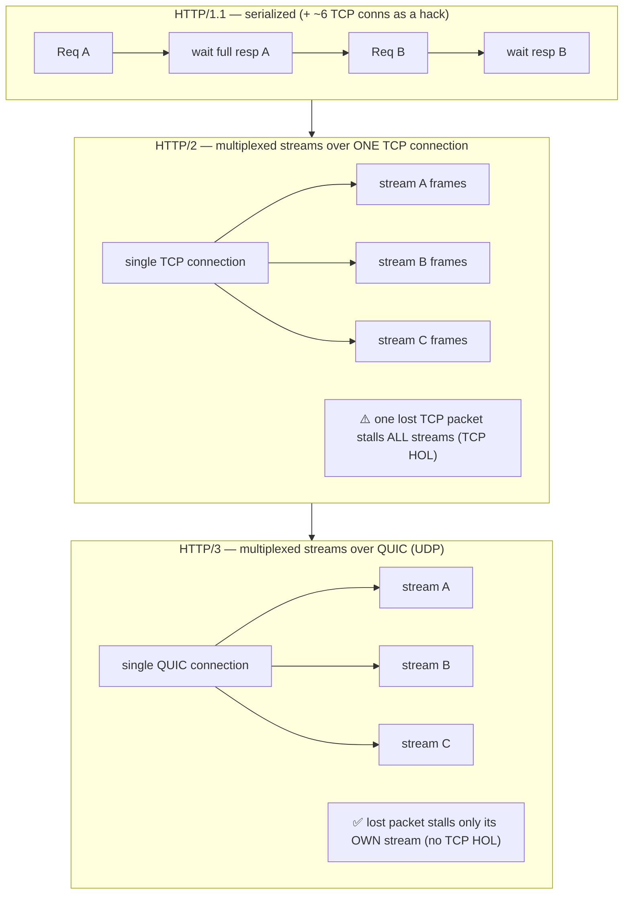
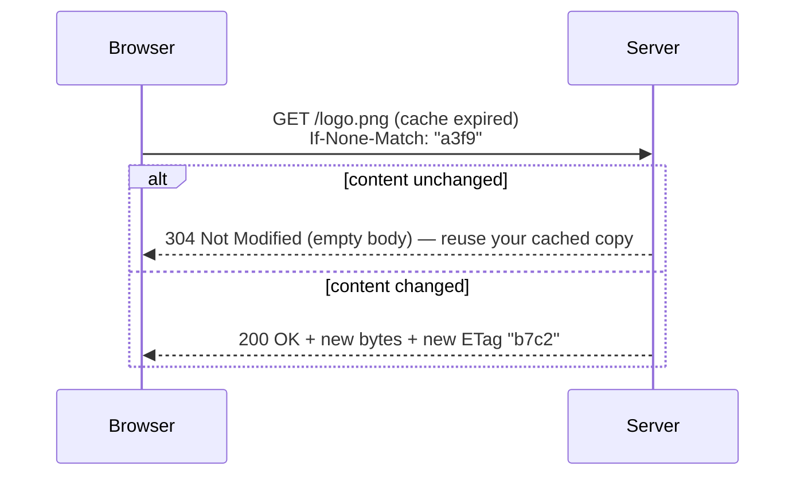

# Module 06 — Application Protocols

> **The one idea to keep:** Every layer below this one moved *bytes* without caring what
> they meant. The application layer (L7) is where the bytes finally **mean something** — a
> web request, an email, a remote procedure call. An application protocol is just an
> **agreed grammar**: what messages exist, what fields they carry, and what each side must
> do in response. Everything in this module is one such grammar (mostly **HTTP**) plus the
> tricks layered on top to make it fast, stateful, and secure over an internet that
> guarantees none of those things.

By now you can get a reliable, ordered byte-stream from one program to another
([Module 05](05-transport-layer.md) gave you TCP, UDP, and QUIC). L7 is what you *say* over
that pipe. This module is deliberately HTTP-heavy, because HTTP is the lingua franca of the
modern internet — but the same ideas (request/response, statelessness, caching, negotiation)
recur everywhere. We stay brief where deep dives already exist and link out: the full name→IP
story is the [DNS deep-dive](deep-dive-dns.md); "authenticate then encrypt" is the
[TLS deep-dive](deep-dive-tls-certificates.md); the end-to-end page-load walkthrough is the
[google.com deep-dive](deep-dive-loading-google.md). Next,
[Module 07](07-rf-wireless.md) leaves wired networking behind for radio.

---

## 1. What "the application layer" actually is

L7 is the **only layer that understands your data as data**. TCP saw a byte-stream; IP saw
a packet; Ethernet saw a frame. None of them knew (or cared) that the bytes spelled
`GET /index.html`. The application protocol is the shared contract that turns those bytes
back into meaning on the far side.

An application protocol answers three questions: **message format** (what does a valid
message look like — a start line and headers, or a binary frame of typed fields?),
**grammar** (what messages are legal when — a request precedes a response), and
**semantics** (what does each side *do* on receipt?). That's it. A protocol is a spec, not a
technology: two programs that agree on it can talk regardless of language, OS, or the layers
underneath — the whole payoff of layering from [Module 01](01-the-layered-model.md).

> **Text vs binary protocols.** Classic protocols (HTTP/1.1, SMTP) are **human-readable
> text** — you can literally type them into a terminal, which is why the exercises below
> work. Modern high-performance ones (HTTP/2, gRPC) are **binary framed** — not readable by
> eye, but compact and unambiguous to parse. The evolution of HTTP in this module is largely
> the story of that text→binary shift.

**A note on DNS.** The first application protocol you use on almost any connection is
**DNS** — turning a name like `google.com` into an IP address, over UDP port 53, *before*
any of the protocols below can start. It is itself an L7 protocol, but it earns its own
full treatment: see the [DNS deep-dive](deep-dive-dns.md) for hierarchy, caching, anycast,
DNSSEC, and DoH/DoT. Here we just note that it runs first and everything else waits on it.

---

## 2. HTTP: the request/response contract

**HTTP (HyperText Transfer Protocol)** is a **request/response** protocol: the client sends
a request, the server sends exactly one response. Statelessly. Over (usually) TCP port 80,
or TLS-wrapped on port 443 (that's **HTTPS**).

Here is a real HTTP/1.1 request and response, in full — this is literally the bytes on the
wire:

```
REQUEST                                  RESPONSE
GET /search?q=modem HTTP/1.1             HTTP/1.1 200 OK
Host: www.google.com                     Content-Type: text/html; charset=utf-8
User-Agent: curl/8.4.0                    Content-Encoding: br
Accept: text/html                        Content-Length: 14032
Accept-Encoding: gzip, br                Cache-Control: private, max-age=0
                                         Set-Cookie: SID=abc123; HttpOnly; Secure
(blank line = end of headers)
                                         (blank line)
(optional body for POST/PUT)             <!doctype html>…the HTML body…
```

Three pieces make up each message: a **start line**, a set of **headers** (`Key: Value`,
one per line), a blank line, then an optional **body**.

### Methods (the verb)

The method states *intent*. The important ones:

| Method | Meaning | Safe? | Idempotent? |
|--------|---------|-------|-------------|
| **GET** | Read a resource. No body. | ✅ yes | ✅ yes |
| **POST** | Create / submit; "do this action." | ❌ no | ❌ no |
| **PUT** | Replace a resource wholesale at a known URL. | ❌ no | ✅ yes |
| **PATCH** | Partially update a resource. | ❌ no | ❌ (usually) |
| **DELETE** | Remove a resource. | ❌ no | ✅ yes |
| **HEAD** | Like GET but headers only (no body). | ✅ yes | ✅ yes |
| **OPTIONS** | Ask what's allowed (used by CORS preflight). | ✅ yes | ✅ yes |

- **Safe** = read-only, no server state change (a crawler can call it freely).
- **Idempotent** = calling it N times has the same effect as calling it once. This matters
  hugely for **retries**: it's safe to auto-retry a `PUT` or `DELETE` after a timeout, but
  retrying a `POST` might charge a credit card twice. Reliability engineering leans on this
  distinction constantly.

### Status codes (the answer's category)

The response's start line carries a **3-digit status code**. Memorize the *classes*, not
the individual numbers:

| Class | Meaning | Examples |
|-------|---------|----------|
| **1xx** | Informational (rare) | `100 Continue`, `101 Switching Protocols` |
| **2xx** | Success | `200 OK`, `201 Created`, `204 No Content` |
| **3xx** | Redirection | `301 Moved Permanently`, `304 Not Modified`, `307 Temporary Redirect` |
| **4xx** | **Client** error (you messed up) | `400 Bad Request`, `401 Unauthorized`, `403 Forbidden`, `404 Not Found`, `429 Too Many Requests` |
| **5xx** | **Server** error (it messed up) | `500 Internal Server Error`, `502 Bad Gateway`, `503 Service Unavailable` |

The 4xx/5xx split is the single most useful debugging reflex: **4xx = fix your request;
5xx = the server (or something behind it) is broken.**

### Headers (the metadata)

Headers are the extensible key/value metadata that make HTTP flexible. A few load-bearing
ones you'll meet throughout this module: `Host` (which site, on a shared IP — the HTTP twin
of TLS's SNI), `Content-Type` (what the body is), `Content-Encoding` (how it's compressed,
§8), `Cache-Control` / `ETag` (caching, §7), `Set-Cookie` / `Cookie` (state, §6),
`Authorization` (credentials), and `Accept*` (content negotiation, §8).

> ⚡ **Latency note.** Headers are pure **overhead** — bytes that aren't your data — and
> HTTP sends a fresh set on *every* request. A typical request/response pair carries
> **hundreds of bytes of repeated headers** (same `User-Agent`, same cookies) for maybe a
> few bytes of actual payload. This is the exact "headers add size" tension from
> [Signal Log Q05](SIGNAL-LOG.md) — and it's precisely why HTTP/2 invented header
> *compression* (§4) and why chatty APIs hurt (§10).

---

## 3. HTTP/1.1 — one conversation at a time

HTTP/1.1 (1997, still everywhere) is **text**, and its defining limitation is how it uses
the TCP connection underneath.

**Persistent connections (keep-alive).** The original HTTP/1.0 opened a fresh TCP
connection per request and closed it after — paying the TCP handshake (and, for HTTPS, the
TLS handshake) *every single time*. HTTP/1.1 made connections **persistent by default**
(`Connection: keep-alive`): the same TCP connection is reused for many requests in
sequence. Huge win — you amortize the handshake cost over dozens of requests.

**But: one request at a time.** On a single HTTP/1.1 connection, the client must send a
request, wait for the full response, *then* send the next. Serialized. To load a page with
100 assets, browsers work around this by opening **~6 parallel TCP connections** per origin
— crude parallelism that wastes memory and handshakes and still caps out fast.

**Pipelining (the failed fix).** HTTP/1.1 defined **pipelining** — fire several requests
back-to-back without waiting for each response. Sounds great, but responses must come back
**in the exact order requested**. So if the first response is slow (a big image, a slow
query), every response queued behind it waits — even if they're ready. This is
**head-of-line (HOL) blocking**: one slow item at the front stalls everyone behind it.
Pipelining was so buggy in practice that browsers **disabled it entirely**. HTTP/1.1's real
answer stayed "just open more connections."

> ⚡ **Latency note.** HOL blocking is the villain of this whole module. Watch it get
> attacked at three different layers: HTTP/2 fixes it *within* HTTP by multiplexing (§4),
> but a new form survives at the TCP layer; HTTP/3 fixes *that* by moving to QUIC (§5).
> Same enemy, three rounds.

---

## 4. HTTP/2 — many streams over one connection

HTTP/2 (2015) keeps HTTP's *semantics* identical (same methods, status codes, headers) but
completely rewrites how they travel. Three changes matter:

**1. Binary framing.** HTTP/2 stops being text. Every message is split into small,
typed **frames** (HEADERS frames, DATA frames, etc.). Frames are the atomic unit, and each
frame is tagged with a **stream ID**.

**2. Multiplexing.** A **stream** is an independent request/response conversation, and
HTTP/2 runs **many streams concurrently over a single TCP connection**, interleaving their
frames. Request A's frames and request B's frames flow intermixed and get reassembled by
stream ID on the far side. This kills HTTP/1.1's "one at a time" and its 6-connection
workaround in one move: 100 assets fetch concurrently over **one** connection. HOL blocking
*at the HTTP layer* is gone — a slow response no longer blocks others, because their frames
just interleave around it.

**3. HPACK header compression.** Since headers repeat almost verbatim on every request
(§2's latency note), HTTP/2 compresses them with **HPACK**: a shared, incrementally-built
**table of previously-seen header fields** on both ends. After the first request, "send my
50 cookies again" becomes a tiny reference to a table index instead of hundreds of bytes.
(HPACK is deliberately designed to resist the CRIME compression attack, unlike naive gzip
of headers.)

> **Why HTTP/2 dropped Server Push.** HTTP/2 originally let a server *proactively* send
> resources the client hadn't asked for yet (push the CSS along with the HTML). In practice
> it was a net loss: servers pushed things the browser **already had cached** (wasting
> bandwidth), it was hard to tune, and browser caches / preload hints did the job better.
> Chrome removed support, and it's effectively dead. The modern replacement is the
> `103 Early Hints` status plus `<link rel=preload>` — tell the browser what to fetch, and
> let *it* decide.

### The remaining flaw: TCP-level HOL blocking

Here's the subtle trap. HTTP/2 removed HOL blocking *inside HTTP*, but all those streams
still ride on **one TCP connection** — and TCP guarantees strict in-order delivery of its
byte-stream ([Module 05](05-transport-layer.md)). If **one TCP packet is lost**, TCP holds
back *every* byte that arrived after it until the retransmission fills the gap — even bytes
belonging to completely unrelated streams. So a single lost packet can stall *all* your
multiplexed streams at once. HTTP/2 moved the head-of-line block from the application down
into the transport. That's the exact problem HTTP/3 was built to solve.

---

## 5. HTTP/3 — HTTP over QUIC, no TCP to block it

HTTP/3 (standardized 2022) keeps HTTP/2's model — binary frames, multiplexed streams,
header compression — but **replaces TCP with QUIC** as the transport.

**QUIC** (covered in [Module 05](05-transport-layer.md)) is a transport built on **UDP**
that implements its own reliability, ordering, and congestion control — but crucially,
**per-stream**, not per-connection. QUIC understands streams natively, so a lost packet
affecting stream A only stalls **stream A**; streams B and C keep flowing. That eliminates
the **TCP-level head-of-line blocking** that HTTP/2 couldn't escape — the final round of the
HOL fight.

QUIC brings more:

- **Faster setup.** QUIC folds the TLS 1.3 handshake *into* the transport handshake
  ([TLS deep-dive](deep-dive-tls-certificates.md)), so a new connection is **1-RTT** total
  (vs TCP handshake + separate TLS handshake), and **0-RTT** on resumption.
- **Connection migration.** A QUIC connection is identified by a **connection ID**, not the
  IP/port 4-tuple. So when your phone switches from Wi-Fi to cellular (your IP changes), the
  connection **survives** instead of breaking — a big deal for mobile.
- **QPACK** is HTTP/3's header compression, the same idea as HPACK but redesigned so that
  out-of-order stream delivery (which QUIC allows) doesn't corrupt the shared header table.

### The three side by side



| | HTTP/1.1 | HTTP/2 | HTTP/3 |
|---|---|---|---|
| Wire format | text | binary frames | binary frames |
| Transport | TCP | TCP | **QUIC over UDP** |
| Concurrency | serial (+ ~6 conns) | multiplexed streams | multiplexed streams |
| App-layer HOL | ✅ (pipelining) | ❌ solved | ❌ solved |
| Transport HOL | n/a | ⚠️ **still present** | ✅ solved (per-stream) |
| Header compression | none | HPACK | QPACK |
| Handshake to first byte | TCP + TLS (2–3 RTT) | TCP + TLS (2–3 RTT) | **1-RTT** (0-RTT resume) |

---

## 6. HTTPS, and the statelessness problem

**HTTPS** is just HTTP running inside a **TLS** tunnel — same requests and responses, now
confidential and authenticated. The client and server negotiate keys, the server proves its
identity with a certificate, and everything after is encrypted. The full mechanics
(handshake, chain of trust, SNI, forward secrecy) are in the
[TLS deep-dive](deep-dive-tls-certificates.md); the one thing to carry here is that
**ALPN** — negotiated during the TLS handshake — is how client and server agree on
*which HTTP version* (h2 vs h3) they'll speak before the first byte of HTTP flows.

Now the deeper issue. **HTTP is stateless**: each request is independent, and the server
remembers nothing about you between requests. That's wonderful for scaling (any server in a
fleet can handle any request — no shared session memory required) but terrible for anything
that needs to know *who you are* across requests (a login, a shopping cart). So state is
added *on top* of a stateless protocol, three main ways:

| Mechanism | How it works | State lives… |
|-----------|--------------|--------------|
| **Cookies** | Server sends `Set-Cookie: SID=abc`; browser returns `Cookie: SID=abc` on every subsequent request. | A small opaque token in the browser |
| **Server sessions** | The cookie holds only a **session ID**; the real data (who you are, cart contents) sits in a server-side store (DB/Redis) keyed by that ID. | **On the server** |
| **Tokens / JWT** | The server issues a **signed token** (e.g. a **JWT** — JSON Web Token: a base64 JSON payload + a cryptographic signature) that the client sends in `Authorization: Bearer …`. The server *verifies the signature* — no lookup needed. | **In the token itself** (stateless server) |

The sessions-vs-tokens choice is a classic tradeoff. **Server sessions** are easy to
revoke (delete the row) but require shared session storage across your fleet. **JWTs** are
self-contained and scale beautifully (any server can verify the signature with no database
hit), but are **hard to revoke before they expire** — which is why JWTs are usually short-
lived and paired with a refresh token. Cookie security flags matter regardless:
`HttpOnly` (JS can't read it, blunts XSS), `Secure` (HTTPS only), and `SameSite`
(mitigates CSRF).

---

## 7. Web caching — the cheapest request is the one you never send

Caching is how the web survives its own popularity. The rule of thumb: **don't fetch what
hasn't changed.** HTTP has rich, explicit caching semantics.

**`Cache-Control` — the directive.** The response header that says how the resource may be
cached: `max-age=3600` (fresh for an hour), `no-store` (never cache — for sensitive data),
`no-cache` (cache, but revalidate before use), `private` (only the browser, not shared
proxies) vs `public`, and `immutable` (never revalidate — used for versioned/fingerprinted
asset filenames like `app.9f3a1.js`).

**Conditional requests (`ETag` / `Last-Modified`).** When a cached item's `max-age`
expires, the browser doesn't blindly re-download — it **revalidates**. The server tagged
the resource with an **`ETag`** (a content fingerprint/version id, e.g. `"a3f9"`). The
browser re-requests with `If-None-Match: "a3f9"`. If the content is unchanged, the server
replies **`304 Not Modified`** with an *empty body* — a tiny confirmation instead of the
whole payload. Same idea with `Last-Modified` / `If-Modified-Since` using timestamps.



**CDNs and edge caching.** A **CDN (Content Delivery Network)** is a global fleet of caching
servers ("edge" servers / **PoPs**, points of presence) that sit *close to users* and serve
copies of your content. Instead of every request crossing an ocean to your origin server, it
hits a nearby edge cache. CDNs use the same **anycast** trick DNS uses — one IP announced
from hundreds of locations, and routing delivers you to the nearest one (see
[anycast in the DNS deep-dive](deep-dive-dns.md)).

> ⚡ **Latency note.** This is the single biggest real-world latency lever after "don't send
> the request at all." Propagation delay is set by distance and the speed of light
> ([Module 02](02-how-data-moves.md)) — you can't beat physics, so **you move the content
> closer**. A cache hit at an edge PoP 20 km away instead of an origin 8,000 km away can cut
> hundreds of milliseconds off the round-trip. Combine that with `immutable` fingerprinted
> assets (fetched once, cached forever) and most of a returning visit is served from within
> a few milliseconds of the user.

---

## 8. Content negotiation & compression

The same URL can serve different representations. **Content negotiation** lets client and
server agree on the best one via `Accept*` request headers answered by `Content-*` response
headers: `Accept: application/json` ↔ `Content-Type`, `Accept-Language: en` ↔
`Content-Language`, and — the big one for performance — `Accept-Encoding` ↔
`Content-Encoding`.

**Compression.** The client advertises what it can decompress (`Accept-Encoding: gzip, br`)
and the server compresses the body with one of them, tagging it (`Content-Encoding: br`):

- **gzip** — universal, fast, decent ratio. The safe default for decades.
- **brotli (`br`)** — newer (Google), noticeably better ratio on text (HTML/CSS/JS),
  especially at higher compression levels. Now supported by all major browsers over HTTPS
  and generally preferred for static text assets.

Compression trades a little CPU for a lot less bytes-on-the-wire. For text-heavy responses
it routinely cuts size 60–80%.

> ⚡ **Latency note.** Fewer bytes = less **transmission delay** and fewer packets to lose
> ([Module 02](02-how-data-moves.md)). On a slow or lossy link (hotel Wi-Fi, congested
> cellular) compression is one of the highest-leverage wins available. But note what it does
> *not* help: compression shrinks the payload, not the round-trips — the handshakes in §5
> still cost what they cost.

---

## 9. API styles — how programs talk to programs

HTTP isn't only for browsers loading pages; it's the substrate for most machine-to-machine
APIs. The four dominant styles, and when each fits:

**REST (Representational State Transfer).** The default web-API style: model everything as
**resources** addressed by URLs (`/users/42/orders`), and use HTTP methods as the verbs
(GET to read, POST to create, etc.) with status codes as the outcome. Stateless, cacheable,
human-inspectable, works with plain HTTP tooling. The overwhelming majority of public web
APIs are REST(-ish), usually exchanging JSON. Its weakness: it can be **chatty** (§10) and
over/under-fetches data.

**gRPC.** A **binary RPC** framework (Google) that runs **over HTTP/2**. Instead of
resources and verbs, you call **typed functions** defined in a **Protocol Buffers** schema
(`.proto`), and messages are serialized to compact binary. It exploits HTTP/2 multiplexing
and supports **streaming** in both directions. Much faster and more compact than JSON/REST,
with generated client/server code and strict typing — but not human-readable and awkward
straight from a browser (needs a proxy). The standard choice for **internal
microservice-to-microservice** traffic.

**WebSocket.** Upgrades a single HTTP connection into a **persistent, full-duplex,
bidirectional** channel: after an HTTP `Upgrade` handshake, both sides can send messages any
time, with tiny per-message framing. Ideal for **real-time two-way** apps — chat, live
collaboration, multiplayer games, trading dashboards. It leaves HTTP's request/response
model behind entirely once established.

**Server-Sent Events (SSE).** A lightweight **one-way** stream: the server keeps an HTTP
response open and pushes text events to the client (`text/event-stream`) as they occur. Only
server→client, but it's dead simple, rides ordinary HTTP, and **auto-reconnects**. Perfect
for **notifications, live feeds, progress updates, and streaming LLM tokens** — anywhere the
client only needs to *listen*.

| Style | Direction | Format | Best for |
|-------|-----------|--------|----------|
| **REST** | request/response | JSON (text) | public APIs, CRUD, cacheable reads |
| **gRPC** | req/resp + streaming | Protobuf (binary) over HTTP/2 | internal microservices, low latency |
| **WebSocket** | full-duplex | any (framed) | real-time two-way (chat, games) |
| **SSE** | server → client only | text events | live feeds, notifications, token streams |

---

## 10. The email trio (SMTP / IMAP / POP), briefly

Email predates the web and splits into **sending** vs **retrieving**:

- **SMTP (Simple Mail Transfer Protocol)** — the **sending/relay** protocol (port 25
  server-to-server; 587 for authenticated submission from your client). A push protocol:
  your mail client (or server) hands the message off toward the recipient's mail server.
- **IMAP (Internet Message Access Protocol)** — **retrieval**, keeping mail **on the
  server** with folders synced across all your devices (port 993 over TLS). The modern
  default.
- **POP3 (Post Office Protocol)** — older **retrieval** that traditionally **downloads and
  deletes** from the server (port 995 over TLS). Fine for a single device; largely
  superseded by IMAP.

The mental model: **SMTP pushes mail between servers; IMAP/POP pull it to your device.**
(The authenticity/anti-spoofing layer — SPF, DKIM, DMARC — rides in DNS `TXT` records; see
the [DNS deep-dive](deep-dive-dns.md).)

---

## 11. Chatty vs batched APIs — per-message overhead, revisited

Now we can close the loop on overhead. Every HTTP request carries fixed costs regardless of
how tiny the useful payload is: **connection/TLS setup** (amortized if reused), a round-trip
of **latency**, and **repeated headers** (§2). So the *design* of an API — how many requests
it takes to do a job — is itself a latency decision.

A **chatty** API makes many small requests (fetch a user, then loop fetching each of their
50 orders one at a time = 51 round-trips). A **batched** API fetches related data together
(one request returns the user *and* their orders). Even with HTTP/2 multiplexing removing
serialization, each request still costs headers and server work — and if any depends on the
previous one's result, you pay **51 sequential round-trips** of latency.

> ⚡ **Latency note — the callback to [Signal Log Q05](SIGNAL-LOG.md).** Q05 asked why we
> tolerate header overhead at all. Here's the punchline at L7: overhead **ratio** is what
> bites. A 20-byte answer wrapped in 500 bytes of repeated headers is 96% overhead — and if
> you make that call 51 times, you've paid the overhead *and* the round-trip 51 times over.
> The fixes are exactly the themes of this module: **batch** requests to amortize overhead,
> **compress** headers (HPACK/QPACK) to shrink it, **cache** to avoid the request entirely,
> and **reuse** the connection to skip repeated handshakes. This same "amortize the fixed
> per-message cost over a bigger payload" instinct is why cellular does header *compression*
> (PDCP) on the radio link — you'll meet it again in Module 11.

---

## Check your understanding

<div class="quiz">
<p class="q">HTTP/2 multiplexes many streams over one TCP connection, so it "solved" head-of-line blocking. Yet HTTP/3 was still built partly to fix HOL blocking. Why?</p>
<ul class="options">
<li data-correct="true">HTTP/2 removed HOL blocking inside HTTP, but all streams share one TCP connection — and a single lost TCP packet stalls every stream until it's retransmitted. HTTP/3's QUIC makes loss recovery per-stream.</li>
<li>HTTP/2 never actually shipped multiplexing; only HTTP/3 has it.</li>
<li>HTTP/3 uses more TCP connections, so there's less blocking per connection.</li>
</ul>
<div class="explain">HTTP/2 fixed application-layer HOL blocking (no more waiting for the
previous response), but pushed the problem down to TCP: because TCP delivers one strictly
ordered byte-stream, one lost packet holds back bytes for <em>all</em> multiplexed streams.
QUIC (over UDP) tracks streams independently, so a loss only stalls its own stream — and
HTTP/3 runs on QUIC.</div>
</div>

<div class="quiz">
<p class="q">A browser has a cached copy of <code>/logo.png</code> whose <code>max-age</code> just expired. It re-requests with <code>If-None-Match: "a3f9"</code> and the server replies <code>304 Not Modified</code> with no body. What happened?</p>
<ul class="options">
<li>The image was deleted, so the server sent an empty error.</li>
<li data-correct="true">The content hasn't changed (its ETag still matches), so the server told the browser to reuse its cached copy instead of re-sending the bytes — a conditional revalidation.</li>
<li>The browser must now download the image twice to be safe.</li>
</ul>
<div class="explain">The ETag <code>"a3f9"</code> is a fingerprint of the content. The browser
asks "only send it if it's changed from a3f9." Since it matches, the server returns a tiny
<code>304</code> with no body and the browser keeps using its cached copy — saving the whole
download. This is conditional-request revalidation.</div>
</div>

<div class="quiz">
<p class="q">You need to stream live progress updates from server to browser (e.g. LLM tokens as they generate), one direction only, over ordinary HTTP, with automatic reconnection. Which fits best?</p>
<ul class="options">
<li>WebSocket, because it's the only way to push data to a browser.</li>
<li data-correct="true">Server-Sent Events (SSE) — a one-way server→client text stream over plain HTTP that auto-reconnects; ideal when the client only needs to listen.</li>
<li>gRPC, because it's binary and therefore always faster.</li>
</ul>
<div class="explain">SSE is purpose-built for one-way server→client streaming over normal HTTP,
with built-in reconnection — exactly this use case. WebSocket would work but adds full-duplex
machinery you don't need. gRPC is great for internal services but is awkward straight from a
browser and overkill for a simple listen-only stream.</div>
</div>

---

## Exercises

Do these — L7 is the layer you can most easily poke by hand.

1. **Read a raw HTTP exchange.** Run `curl -v https://example.com` and map the output to
   this module: the TLS handshake lines, the `> GET / HTTP/2` request with its headers, and
   the `< HTTP/2 200` response with `content-type`, `content-encoding`, and caching headers.
   Notice curl negotiated HTTP/2 via ALPN.

2. **Force each HTTP version and compare.** Run `curl -sI --http1.1 https://www.cloudflare.com`,
   then `--http2`, then `--http3` (recent curl). Compare the status line (`HTTP/1.1` vs
   `HTTP/2` vs `HTTP/3`) and note which the site supports. `-I` sends a `HEAD` request.

3. **Watch caching happen in DevTools.** Open your browser's DevTools → Network tab, load a
   site, then reload. Find assets served from cache (`(disk cache)` / `(memory cache)`) and
   any `304 Not Modified` responses. Click one and read its `Cache-Control` and `ETag`
   headers. Then tick "Disable cache" and reload to see everything re-fetched.

4. **See content negotiation & compression.** Run
   `curl -s -H "Accept-Encoding: br" -D - https://www.google.com -o /dev/null` and find the
   `content-encoding` header in the response. Try with `gzip` instead, and with the header
   omitted, and compare the `content-length`.

5. **Inspect cookies and state.** In DevTools → Application → Cookies, log into any site and
   look at the session cookie: note the `HttpOnly`, `Secure`, and `SameSite` flags from §6,
   and watch it get sent back on subsequent requests in the Network tab's request headers.

6. **Tie it back to DNS + TLS.** Run `dig www.example.com` (the [DNS](deep-dive-dns.md) step)
   then `openssl s_client -connect example.com:443 -alpn h2 -servername example.com`
   (the [TLS](deep-dive-tls-certificates.md) step) and observe the ALPN-negotiated protocol.
   You've now watched all three L7 pieces — name resolution, secure channel, HTTP — that the
   [google.com deep-dive](deep-dive-loading-google.md) walks end to end.

---

## Key terms

- **L7 / application layer** — the layer that assigns *meaning* to the bytes for a specific
  application (HTTP, DNS, SMTP, gRPC).
- **HTTP method / status code** — the request verb (GET/POST/PUT/…) and the 3-digit response
  category (2xx OK, 3xx redirect, 4xx client error, 5xx server error).
- **Idempotent** — safe to repeat; N calls have the same effect as one (matters for retries).
- **Persistent connection / keep-alive** — reusing one TCP connection for many requests.
- **Head-of-line (HOL) blocking** — a slow/lost item at the front stalls everything behind it.
- **Multiplexing** — many independent streams interleaved over one connection (HTTP/2, HTTP/3).
- **HPACK / QPACK** — header compression for HTTP/2 / HTTP/3 (a shared table of seen headers).
- **QUIC** — a UDP-based transport with per-stream reliability + built-in TLS 1.3; the basis
  of HTTP/3.
- **Stateless** — the server keeps no memory of you between requests (HTTP's default); state
  is added via **cookie / server session / JWT**.
- **Cache-Control / ETag / 304** — HTTP's caching directives and conditional-revalidation.
- **CDN / edge cache / PoP** — distributed caches serving content near the user (via anycast).
- **Content negotiation** — agreeing on format/language/encoding via `Accept*` ↔ `Content-*`.
- **REST / gRPC / WebSocket / SSE** — the four dominant API styles.

---

## Cheat-sheet

```
APPLICATION LAYER (L7) = the MEANING of the bytes. A protocol = message format + grammar + semantics.
  DNS runs first (name→IP, UDP/53) — see DNS deep-dive. HTTPS = HTTP inside TLS — see TLS deep-dive.

HTTP MESSAGE = start line + headers (Key: Value) + blank line + optional body
  METHODS: GET(read,safe) POST(create) PUT(replace,idempotent) PATCH DELETE HEAD OPTIONS
  STATUS:  1xx info · 2xx OK · 3xx redirect · 4xx YOUR error · 5xx SERVER error
  KEY HEADERS: Host · Content-Type · Content-Encoding · Cache-Control/ETag · Cookie · Authorization · Accept*

HTTP EVOLUTION (same semantics, different wire):
  1.1  text · persistent conns (keep-alive) · pipelining → app-layer HOL → browsers use ~6 TCP conns
  2    binary frames · MULTIPLEX many streams / 1 TCP conn · HPACK · (server push dropped)
         └ fixes app HOL, but 1 lost TCP packet still stalls ALL streams (transport HOL)
  3    HTTP over QUIC (UDP) · per-stream loss recovery → NO transport HOL · QPACK · 1-RTT · conn migration

STATE on stateless HTTP:
  cookie (token in browser) · server session (id→server store, easy revoke) · JWT (signed, self-contained, scales, hard to revoke)

CACHING (cheapest request = none):
  Cache-Control: max-age / no-store / no-cache / private|public / immutable
  conditional: ETag + If-None-Match → 304 Not Modified (no body)
  CDN / edge / anycast = move content near the user (beats propagation delay)

NEGOTIATION & COMPRESSION: Accept-Encoding: gzip, br → Content-Encoding (brotli > gzip on text, 60–80% smaller)

API STYLES:  REST (JSON, resources+verbs) · gRPC (Protobuf/HTTP2, internal svc) ·
             WebSocket (full-duplex real-time) · SSE (1-way server→client stream)

EMAIL: SMTP push (send/relay, 25/587) · IMAP pull+sync (993) · POP pull+delete (995)

OVERHEAD (Signal Log Q05): fixed per-request cost (headers + RTT). Fix by BATCH · COMPRESS · CACHE · REUSE.
```

---

**Next up → Module 07: RF & Wireless Basics** — we've ridden reliable wires all the way up
the stack; now the medium becomes *air*. What a radio wave actually is, frequency and
spectrum, why radio is a shared and hostile medium, and how the physical tricks from
[Module 02](02-how-data-moves.md) (modulation, QAM, Shannon's ceiling) come roaring back —
the real start of the wireless half of your journey to hero.
