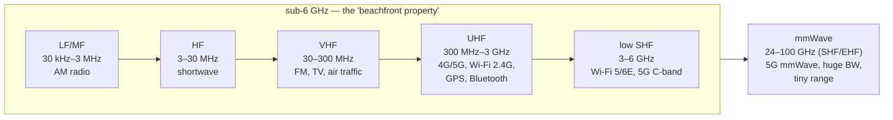
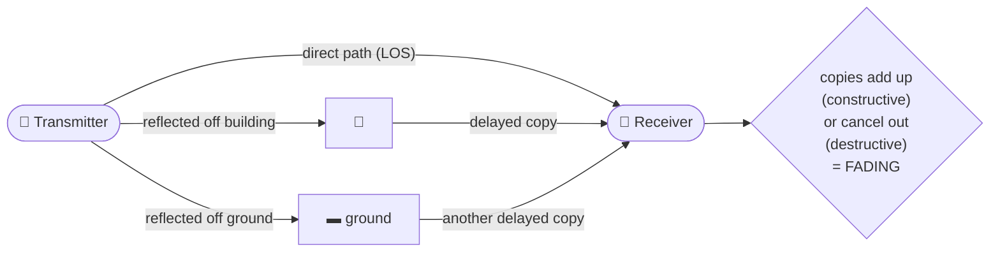

# Module 07 — RF & Wireless Basics

> **The one idea to keep:** Wireless is just [Module 02](02-how-data-moves.md)'s
> modulation — QAM riding a carrier — set loose in the *worst possible medium*: one that's
> **shared** (everyone transmits into the same air), **invisible** (you can't see
> interference coming), **noisy** (energy fades fast and static is everywhere), and
> **mobile** (the channel changes as you move). Every hard, clever thing cellular and Wi-Fi
> do exists to squeeze Shannon's `capacity = B·log₂(1+SNR)` out of that hostile channel.
> Master the four enemies here and the rest of the wireless modules are "the same ideas,
> harder."

In [Module 02](02-how-data-moves.md) we learned to imprint bits onto a carrier wave (ASK,
FSK, PSK, QAM) and saw that noise caps how many bits fit per symbol. In
[Module 03](03-link-layer.md) we saw devices take turns on a shared medium. This module is
where those two threads collide: **what actually happens when you radiate that modulated
carrier out of an antenna into open air.** It's the physics foundation that
[Module 08 (Wi-Fi)](08-wifi.md) and [Module 10 (LTE air interface)](10-lte-air-interface.md)
build on directly — so we go deep here once, and the cellular/Wi-Fi modules can focus on
protocol rather than physics.

> **Recurring thread.** Almost every "why is cellular so complicated?" answer traces back to
> this module. Scheduling, error coding, retransmission, adaptive modulation, MIMO,
> beamforming, cells, licensed spectrum — they're all *responses* to the four properties in
> the box above. Keep asking "which enemy is this fighting?"

---

## 1. Why wireless is fundamentally harder than a wire

A wire (copper or fibre, Module 02) is a **private, contained, stable** channel. Air is the
opposite. Four properties make radio genuinely harder, and they frame everything that
follows:

| Property | On a wire | In the air | Consequence |
|---|---|---|---|
| **Shared** | Your signal is contained in the cable | Everyone's signals overlap in the same space | Must coordinate access (Wi-Fi CSMA/CA, cellular scheduling) + tolerate interference |
| **Invisible** | You can probe the wire directly | You can't see interference or obstacles | Must *measure* the channel constantly and adapt blind |
| **Noisy / lossy** | Low, predictable attenuation | Energy spreads out and fades fast; static everywhere | Path loss + a noise floor cap range and rate |
| **Mobile** | Endpoints don't move | Transmitter, receiver, and reflectors all move | The channel changes millisecond to millisecond (fading, Doppler) |

> ⚡ **Latency note.** On a wire, "did it arrive?" is almost always yes. On radio it's
> *often no* — so wireless links add **retransmissions** (Wi-Fi ACKs, cellular HARQ) and
> **error coding** that a wire never needs. Every retransmission is extra latency, and
> because the channel varies, that latency is *unpredictable* — the single biggest source of
> **jitter** (Module 02) in a mobile link. Hold this thought; it's the spine of Module 13.

The rest of this module is just naming these enemies precisely enough to fight them.

---

## 2. Electromagnetic waves: frequency, wavelength, and the spectrum

A radio signal is an **electromagnetic (EM) wave** — the same physics as light, just at a
lower frequency. Two numbers describe it, and they're locked together:

- **Frequency (`f`)** — how many times per second the wave oscillates, in **hertz (Hz)**.
  Wi-Fi at 2.4 GHz oscillates 2.4 *billion* times per second.
- **Wavelength (`λ`)** — the physical length of one cycle, in metres.

They're tied by the speed of light: `λ = c / f`, where `c ≈ 3×10⁸ m/s`. A handy shortcut:

```
  wavelength (m) ≈ 300 / frequency (MHz)
```

So 100 MHz FM radio → ~3 m waves; 2.4 GHz Wi-Fi → ~12.5 cm; 28 GHz 5G mmWave → ~1 cm. This
single relationship drives a lot of intuition:

- **Lower frequency = longer wavelength = travels further and bends around obstacles better**
  (good coverage, but less bandwidth available).
- **Higher frequency = shorter wavelength = more bandwidth available, but shorter range and
  easily blocked** (a wall, a hand, even rain).
- **Antenna size scales with wavelength** — efficient antennas are roughly a fraction of λ.
  That's *why* a 700 MHz antenna is big and a 28 GHz antenna is fingernail-sized (and why you
  can pack dozens of them into a phone for mmWave — Module 10).

### The RF spectrum and its bands

The **radio spectrum** is the slice of the EM spectrum we use for communication, carved into
named **bands**. You need to recognise these labels because every wireless module refers to
them:



- **Sub-6 GHz** (everything up to 6 GHz) is the workhorse for mobile: it balances range and
  capacity. It's crowded and valuable — the "beachfront property" of spectrum.
- **mmWave** (millimetre wave, ~24–100 GHz) offers *enormous* bandwidth (hence multi-gigabit
  5G) but is blocked by walls, foliage, and even your body, so it only works over short,
  near-line-of-sight distances. This range/capacity tension is a recurring theme.

> ⚡ **Latency note.** "Higher frequency = more bandwidth" is why mmWave 5G can hit multi-Gbps
> **transmission** rates — but only at short range with clear line of sight. The moment you
> step behind a pillar, the link drops to sub-6 GHz and both throughput *and* latency change.
> Range and capacity pull in opposite directions across the spectrum; there's no free lunch.

---

## 3. The decibel: dB, dBm, dBi, and why everything is logarithmic

Radio power spans an absurd range. A phone might transmit at 0.2 watts and the tower receives
something like 0.0000000000001 watts. Writing those numbers is unmanageable, so RF engineers
work in **decibels (dB)** — a *logarithmic* scale. This is the one piece of math you must be
fluent in; everything in a link budget is addition of dB.

**A decibel is always a *ratio*** between two powers:

```
  dB = 10 · log₁₀(P_out / P_in)
```

The magic is that logarithms turn multiplication into addition. Signal power gets multiplied
and divided as it travels (gain here, loss there); in dB those all become simple `+` and `−`.
Memorise these anchors and you can do most link math in your head:

| Ratio (linear) | In dB | Mnemonic |
|---|---|---|
| ×2 | +3 dB | "double = +3" |
| ×10 | +10 dB | "×10 = +10" |
| ×100 | +20 dB | (add the 10s) |
| ÷2 | −3 dB | "half = −3" |
| ÷1000 | −30 dB | |
| ×1 (no change) | 0 dB | |

So +3 dB is twice the power, +6 dB is 4×, +10 dB is 10×, +20 dB is 100×. A −90 dB path loss
means the signal is one *billionth* of its original power — routine for radio.

**Three flavours you must not confuse:**

- **dB** — a *relative* ratio (a gain or a loss). "The cable loses 3 dB." No absolute meaning
  on its own.
- **dBm** — an *absolute* power, referenced to 1 milliwatt. `0 dBm = 1 mW`; `30 dBm = 1 W`;
  `−90 dBm ≈ typical weak received signal`. Because it's absolute, you can compare two dBm
  values directly.
- **dBi** — antenna **gain** relative to an ideal **isotropic** antenna (Section 6). "+3 dBi"
  means this antenna focuses twice the power in its preferred direction versus a perfect
  omnidirectional radiator.

> **The rule that makes RF easy:** in dB, **a link is just addition.** Start with transmit
> power (dBm), *add* antenna gains (dBi), *subtract* every loss (dB), and you land on received
> power (dBm). That's a **link budget** — Section 5 — and it's arithmetic you can do on a
> napkin precisely because we chose a log scale.

---

## 4. Path loss, the noise floor, SNR, and receiver sensitivity

Now the enemies from Section 1, quantified.

### Path loss: signal energy spreads out

Radio from an antenna spreads over an expanding sphere. The power crossing any patch of that
sphere falls with the *square* of distance (the **inverse-square law**) — double the distance,
one quarter the power. In free space the loss also grows with frequency. The **Free-Space Path
Loss (FSPL)** formula captures both:

```
  FSPL (dB) ≈ 20·log₁₀(d) + 20·log₁₀(f) + 32.44     (d in km, f in MHz)
```

Two takeaways you should *feel*, not memorise:

- **Every doubling of distance costs ~6 dB** (a 4× power drop). Range is expensive.
- **Every doubling of frequency also costs ~6 dB.** This is a core reason mmWave has such
  short range — same distance, much higher loss, on top of being blocked by walls.

Real environments are worse than free space: walls, floors, foliage, and rain add extra
**attenuation** on top of FSPL.

<figure class="anim-fig">
<svg viewBox="0 0 720 250" role="img" aria-label="Animation: radio waves spread as expanding rings from a transmitter and fade with distance, so a receiver farther away hears a weaker signal.">
<style>
.m07a-t{font-size:13px;font-weight:700;fill:#2c7be5}
.m07a-lbl{font-size:11px;fill:#64748b}
.m07a-nm{font-size:11px;font-weight:700;fill:#1f2d3d}
.m07a-ring{fill:none;stroke:#2c7be5;stroke-width:3;animation:m07aring 3.3s ease-out infinite}
.m07a-r2{animation-delay:1.1s}
.m07a-r3{animation-delay:2.2s}
.m07a-mast{stroke:#64748b;stroke-width:3}
.m07a-b1{fill:#16a34a}
.m07a-b2{fill:#f59e0b}
.m07a-b3{fill:#ef4444}
.m07a-pulse{animation:m07apulse 3.3s ease-in-out infinite}
@keyframes m07aring{0%{r:8;opacity:.85;stroke-width:3.5}100%{r:470;opacity:0;stroke-width:.5}}
@keyframes m07apulse{0%,100%{opacity:.45}50%{opacity:1}}
</style>
<defs><clipPath id="m07aclip"><rect x="30" y="40" width="660" height="160"/></clipPath></defs>
<text class="m07a-t" x="12" y="20">Free-space path loss — energy spreads over an ever-bigger sphere, so it fades with distance</text>
<line x1="30" y1="200" x2="690" y2="200" stroke="#cbd5e1" stroke-width="2"/>
<g clip-path="url(#m07aclip)">
<circle class="m07a-ring" cx="90" cy="150" r="8"/>
<circle class="m07a-ring m07a-r2" cx="90" cy="150" r="8"/>
<circle class="m07a-ring m07a-r3" cx="90" cy="150" r="8"/>
</g>
<line class="m07a-mast" x1="90" y1="150" x2="90" y2="200"/>
<circle cx="90" cy="150" r="6" fill="#2c7be5"/>
<text class="m07a-nm" x="90" y="220" text-anchor="middle">TX</text>
<g class="m07a-pulse" style="animation-delay:.2s">
<rect class="m07a-b1" x="272" y="140" width="14" height="60" rx="2"/>
</g>
<text class="m07a-lbl" x="279" y="132" text-anchor="middle">strong</text>
<text class="m07a-lbl" x="279" y="220" text-anchor="middle">d</text>
<g class="m07a-pulse" style="animation-delay:.9s">
<rect class="m07a-b2" x="432" y="166" width="14" height="34" rx="2"/>
</g>
<text class="m07a-lbl" x="439" y="220" text-anchor="middle">2d  (−6 dB)</text>
<g class="m07a-pulse" style="animation-delay:1.6s">
<rect class="m07a-b3" x="592" y="182" width="14" height="18" rx="2"/>
</g>
<text class="m07a-lbl" x="599" y="220" text-anchor="middle">4d  (−12 dB)</text>
<text class="m07a-lbl" x="360" y="242" text-anchor="middle">Every doubling of distance ≈ a quarter of the power (−6 dB). Range is expensive.</text>
</svg>
<figcaption>Radio radiates over an expanding sphere, so the same energy is smeared ever thinner: <b>each doubling of distance costs about 6 dB</b> (a 4× power drop). The receiver's bars shrink green → amber → red as the rings fade outward.</figcaption>
</figure>

### The noise floor and SNR

The receiver isn't listening to silence. There's always a **noise floor** — thermal noise
from the receiver's own electronics plus background RF energy. If your signal arrives *below*
the noise floor, it's drowned out and unrecoverable, no matter how sensitive the radio.

What matters is the **Signal-to-Noise Ratio (SNR)** — the gap, in dB, between your received
signal and the noise floor:

```
  SNR (dB) = received signal power (dBm) − noise floor (dBm)
```

**This is the exact SNR from Module 02's Shannon law.** `capacity = B·log₂(1+SNR)`. High SNR
→ the receiver can distinguish a dense constellation (256-QAM, many bits/symbol) → fast link.
Low SNR → it must fall back to a sparse, robust constellation (QPSK, few bits/symbol) → slow
link. **Adaptive Modulation and Coding (AMC)** is the radio picking the richest modulation the
current SNR can support, moment to moment. Wireless is Module 02's story, now driven by a
constantly moving SNR.

<figure class="anim-fig">
<svg viewBox="0 0 720 280" role="img" aria-label="Animation: as distance grows the received signal falls toward the noise floor, so the SNR gap shrinks until the signal nearly dips into the noise.">
<style>
.m07c-t{font-size:13px;font-weight:700;fill:#2c7be5}
.m07c-lbl{font-size:11px;fill:#64748b}
.m07c-ax{font-size:11px;font-weight:700;fill:#1f2d3d}
.m07c-nf{stroke:#ef4444;stroke-width:2;stroke-dasharray:7 5}
.m07c-sig{fill:none;stroke:#2c7be5;stroke-width:2.5}
.m07c-bar{transform-origin:96px 200px;animation:m07cbar 5s ease-in-out infinite}
.m07c-dot{animation:m07cdot 5s ease-in-out infinite}
@keyframes m07cbar{
0%{transform:translateX(0) scaleY(1);fill:#16a34a}
60%{transform:translateX(360px) scaleY(.34);fill:#f59e0b}
85%{transform:translateX(500px) scaleY(.16);fill:#ef4444}
100%{transform:translateX(544px) scaleY(.06);fill:#ef4444}}
@keyframes m07cdot{
0%{transform:translate(0px,0px)}
60%{transform:translate(360px,78px)}
85%{transform:translate(500px,105px)}
100%{transform:translate(544px,112px)}}
</style>
<text class="m07c-t" x="12" y="20">SNR vs the noise floor — the signal sinks toward the noise as you move away</text>
<line x1="60" y1="40" x2="60" y2="200" stroke="#cbd5e1" stroke-width="2"/>
<line x1="60" y1="200" x2="670" y2="200" stroke="#cbd5e1" stroke-width="2"/>
<text class="m07c-ax" x="16" y="120" transform="rotate(-90 16 120)" text-anchor="middle">power (dBm)</text>
<text class="m07c-lbl" x="365" y="234" text-anchor="middle">distance from transmitter →</text>
<line class="m07c-nf" x1="60" y1="176" x2="670" y2="176"/>
<text class="m07c-lbl" x="666" y="192" text-anchor="end" fill="#ef4444">noise floor</text>
<polyline class="m07c-sig" points="90,60 250,96 410,128 560,160 640,172"/>
<text class="m07c-lbl" x="120" y="52" fill="#2c7be5">received signal</text>
<rect class="m07c-bar" x="88" y="60" width="16" height="140" rx="2"/>
<circle class="m07c-dot" cx="96" cy="60" r="5" fill="#1f2d3d"/>
<text class="m07c-lbl" x="365" y="258" text-anchor="middle">SNR = signal − noise floor. As it shrinks, the radio drops to a robuster modulation ≈ slower link.</text>
</svg>
<figcaption>The blue bar is the live <b>SNR</b> — the gap between the received signal and the red <b>noise floor</b>. As distance grows the signal sinks and that gap shrinks (green → amber → red); once it nears the noise floor the link must fall back to a sparser, slower constellation, or drop.</figcaption>
</figure>

### Receiver sensitivity

**Receiver sensitivity** is the minimum signal power (in dBm) a radio needs to decode a signal
at a given modulation. It's more negative (better) for robust modulations and less negative
(needs a stronger signal) for dense ones — which is *why* the link speeds up as you approach
the router and slows as you walk away. Below sensitivity, the link drops entirely.

> ⚡ **Latency note.** When SNR sags, two things add delay: the radio steps *down* to a slower
> modulation (fewer bits/symbol → each packet takes longer to send), and marginal frames fail
> their checksum and get **retransmitted**. Both are why a weak-signal video call gets choppy
> and laggy even though "it still works" — the physics is silently taxing every packet.

---

## 5. Link budgets: adding it all up

A **link budget** is the whole trip as one line of dB arithmetic. Because we're in dB, it's
just add-the-gains, subtract-the-losses:

```
  received power = TX power  +  TX antenna gain  −  path loss  +  RX antenna gain  −  other losses
     (dBm)           (dBm)         (dBi)             (dB)           (dBi)              (dB)
```

Then compare the result to receiver sensitivity. The slack between them is your **link
margin** — headroom for fading, rain, and movement.

**Worked example — a Wi-Fi link across a house:**

| Term | Value | Running total |
|---|---|---|
| TX power (router) | +20 dBm | +20 dBm |
| Router antenna gain | +3 dBi | +23 dBm |
| Free-space path loss (10 m, 2.4 GHz) | −60 dB | −37 dBm |
| Two interior walls | −10 dB | −47 dBm |
| Laptop antenna gain | +2 dBi | −45 dBm |
| **Received power** | | **−45 dBm** |
| Receiver sensitivity (for 256-QAM) | −65 dBm | |
| **Link margin** | | **+20 dB → plenty; runs fast** |

Walk two rooms further and add another −25 dB of walls and distance: received power drops to
−70 dBm, *below* the −65 dBm needed for 256-QAM. The radio drops to a more robust modulation
(say 16-QAM, sensitivity −80 dBm) — link survives, but slower. That fallback *is* adaptive
modulation, expressed as a link budget.

> **Why engineers love dB:** every one of those rows would be a multiply or divide in linear
> watts. In dB it's a column you can add up by hand. The whole discipline of RF planning —
> cell coverage, Wi-Fi placement, satellite links — is this table, filled in.

---

## 6. Antennas: gain, directionality, polarization, beamforming

An **antenna** is the transducer between guided signal (on the chip) and radiated EM wave (in
the air). Key concepts:

- **Isotropic antenna** — a theoretical ideal that radiates *equally in all directions* (a
  perfect sphere). It doesn't exist, but it's the **reference** for gain (the "i" in dBi).
- **Antenna gain (dBi)** — antennas don't create power; they *focus* it. Gain is how much more
  power goes in the preferred direction versus isotropic. A +3 dBi antenna doubles power one
  way by taking it from another. Gain is directionality measured in dB.
- **Omnidirectional vs directional** — a phone/router antenna radiates roughly all around
  (low gain, convenient); a satellite dish or point-to-point link focuses a tight beam (high
  gain, but you must aim it).
- **Polarization** — the orientation of the wave's electric field (vertical, horizontal, or
  circular). TX and RX antennas should match; a mismatch (cross-polarization) loses signal.
  It's also a way to reuse the same frequency twice (two polarizations = two channels).

### Beamforming (intro)

Instead of one antenna, use *many* small ones (an **array**) and control the timing/phase of
each element so their waves **add up** toward a specific receiver and **cancel** elsewhere.
This is **beamforming**: an electronically steered beam, no moving parts. It raises effective
gain and SNR exactly where the user is — and it's foundational to modern Wi-Fi (Module 08) and
especially 5G, where **massive MIMO** arrays steer dozens of independent beams. Beamforming is
how mmWave is usable at all: it concentrates the little energy that survives that huge path
loss straight at you.

> ⚡ **Latency note.** Beamforming improves SNR, which lets the radio hold a *higher*
> modulation and avoid retransmissions — so it lowers latency indirectly by keeping the link
> in its fast, reliable regime. But steering the beam to a *moving* user requires constant
> channel measurement and feedback, itself a small recurring overhead.

🔧 **Project (RTL-SDR).** A ~$30 **RTL-SDR** USB dongle (a Software-Defined Radio — a receiver
whose demodulation is done in software, Module 16) turns your laptop into a spectrum scanner.
Pair it with a directional vs omnidirectional antenna and watch the *same* station's signal
strength change as you rotate the antenna — you're measuring antenna gain and polarization
firsthand.

---

## 7. Propagation effects: multipath, fading, and Doppler

In the real world the wave doesn't take one clean path. It interacts with the environment:

- **Reflection** — bounces off large flat surfaces (walls, buildings, the ground).
- **Diffraction** — bends around edges (a hill, a building corner), letting signal reach into
  "shadows" it couldn't reach in a straight line.
- **Scattering** — splatters off rough or small objects (foliage, rain, street clutter) into
  many weak directions.

The combined result is **multipath**: the receiver hears the *same signal several times*,
each copy arriving via a different path, at slightly different delays and strengths.



When those copies overlap at the receiver they **interfere**: sometimes they add up
(constructive — stronger signal), sometimes they partially cancel (destructive — a deep
**fade**, signal drops sharply). This is **multipath fading**, and because you and the
reflectors move, the pattern shifts constantly — the SNR you rely on for AMC is a *moving
target*.

<figure class="anim-fig">
<svg viewBox="0 0 720 312" role="img" aria-label="Animation: one transmitted signal reaches the receiver by a direct path plus two reflected paths, arriving at slightly different times so the copies add up or cancel — fading.">
<style>
.m07b-t{font-size:13px;font-weight:700;fill:#2c7be5}
.m07b-lbl{font-size:11px;fill:#64748b}
.m07b-nm{font-size:11px;font-weight:700;fill:#1f2d3d}
.m07b-path{fill:none;stroke-width:2;stroke-dasharray:5 6}
.m07b-d{stroke:#16a34a}
.m07b-r1{stroke:#f59e0b}
.m07b-r2{stroke:#7c3aed}
.m07b-bldg{fill:#e2e8f0;stroke:#64748b;stroke-width:1.5}
.m07b-fade{animation:m07bfade 3s ease-in-out infinite}
@keyframes m07bfade{0%{height:70px;y:95px;fill:#16a34a}20%{height:22px;y:143px;fill:#ef4444}40%{height:58px;y:107px;fill:#f59e0b}60%{height:14px;y:151px;fill:#ef4444}80%{height:64px;y:101px;fill:#16a34a}100%{height:70px;y:95px;fill:#16a34a}}
</style>
<text class="m07b-t" x="12" y="20">Multipath — the same signal arrives several times, offset, and the copies add up or cancel</text>
<rect class="m07b-bldg" x="330" y="40" width="70" height="46"/>
<text class="m07b-lbl" x="365" y="34" text-anchor="middle">building</text>
<line x1="60" y1="262" x2="660" y2="262" stroke="#cbd5e1" stroke-width="2"/>
<text class="m07b-lbl" x="365" y="280" text-anchor="middle">ground</text>
<path class="m07b-path m07b-d" d="M110,165 L610,165"/>
<path class="m07b-path m07b-r1" d="M110,165 L365,90 L610,165"/>
<path class="m07b-path m07b-r2" d="M110,165 L365,258 L610,165"/>
<line x1="110" y1="165" x2="110" y2="262" stroke="#64748b" stroke-width="3"/>
<circle cx="110" cy="165" r="7" fill="#2c7be5"/>
<text class="m07b-nm" x="110" y="298" text-anchor="middle">TX</text>
<line x1="610" y1="165" x2="610" y2="262" stroke="#64748b" stroke-width="3"/>
<text class="m07b-nm" x="610" y="298" text-anchor="middle">RX</text>
<circle r="6" fill="#16a34a"><animateMotion path="M110,165 L610,165" dur="2s" repeatCount="indefinite"/></circle>
<circle r="6" fill="#f59e0b"><animateMotion path="M110,165 L365,90 L610,165" dur="2.7s" repeatCount="indefinite"/></circle>
<circle r="6" fill="#7c3aed"><animateMotion path="M110,165 L365,258 L610,165" dur="3.2s" repeatCount="indefinite"/></circle>
<rect class="m07b-fade" x="628" y="95" width="16" height="70" rx="2"/>
<text class="m07b-lbl" x="636" y="185" text-anchor="middle">sum</text>
<text class="m07b-lbl" x="360" y="304" text-anchor="middle">Direct (green) arrives first • reflected copies (amber, purple) lag • combined level swings = fading</text>
</svg>
<figcaption>One transmission reaches the receiver by a <b>direct</b> path plus copies <b>reflected</b> off a building and the ground. Because each copy travels a different distance it arrives slightly offset, so at the receiver they sometimes reinforce and sometimes cancel — the bar's swing is <b>multipath fading</b>.</figcaption>
</figure>

Multipath sounds purely bad, but modern systems *exploit* it: **MIMO** (Multiple-Input
Multiple-Output, Module 10) uses multiple antennas to turn several independent paths into
several parallel data streams — trading the enemy into extra capacity. That reversal is one of
the great tricks of modern wireless.

### Doppler shift

If transmitter and receiver move relative to each other, the received frequency shifts
slightly — the same **Doppler** effect that makes a passing siren change pitch. At highway or
train speeds this smears the carrier enough that the receiver must actively track and correct
it. It's a direct tax of *mobility*, the fourth enemy, and it's why high-speed-rail cellular
is a specialist problem (Module 12).

> ⚡ **Latency note.** Fading is the deepest source of wireless **jitter**. A packet that sails
> through in a constructive moment may need three retransmissions a few milliseconds later in a
> fade. The *average* throughput can look fine while the *variance* wrecks anything real-time.
> This is why cellular L2 (Module 11) does its own fast retransmission (HARQ) rather than
> waiting for TCP — the channel changes faster than an end-to-end recovery loop can react.

---

## 8. Spectrum as a regulated economic resource

Here's a non-obvious but crucial point: **spectrum is a finite, government-controlled
resource.** Because everyone's signals share the air (enemy #1), unrestricted use would be
chaos — so regulators (the FCC in the US, Ofcom in the UK, etc.) license who may transmit,
where, at what power, in each band. This split explains a lot of the cellular-vs-Wi-Fi design
difference:

| | **Licensed spectrum** | **Unlicensed spectrum (ISM bands)** |
|---|---|---|
| Who uses it | Cellular carriers (they *buy* exclusive rights, often for billions) | Wi-Fi, Bluetooth, microwaves, cordless phones — anyone, no licence |
| Bands (examples) | 700 MHz, C-band ~3.5 GHz, 28 GHz | 2.4 GHz, 5 GHz, 6 GHz (Wi-Fi 6E) |
| Interference | Controlled — the owner has exclusive use | A free-for-all; you must tolerate neighbours |
| Access method | Central **scheduler** (the tower) — no contention | **Contention** (CSMA/CA — listen before talk, Module 08) |
| Consequence | Predictable QoS, guaranteed latency | Cheap and open, but variable performance |

This is *the* reason cellular can offer more predictable latency than Wi-Fi: the carrier owns
the spectrum and the tower *schedules* every transmission (no collisions), whereas Wi-Fi
devices must politely contend for shared, crowded, unlicensed air. Module 03's "who talks
when?" problem is solved differently precisely because of who owns the band.

> **The 2025 landscape.** 5G spans all three tiers — low-band (<1 GHz) for coverage, mid-band
> C-band (~3.5 GHz) for the capacity/coverage sweet spot most real 5G runs on, and mmWave for
> dense hotspots. Wi-Fi 6E and Wi-Fi 7 opened the **6 GHz** unlicensed band, adding wide clean
> channels. **CBRS** (3.5 GHz in the US) is a hybrid "shared licensed" model. The tension is
> always the same: everyone wants more of a fixed pie.

---

## 9. Duplexing: FDD vs TDD

A conversation needs both directions — **downlink** (tower→you) and **uplink** (you→tower).
**Duplexing** is how one link carries both without the two directions clobbering each other.
Two schemes:

- **FDD (Frequency-Division Duplex)** — use *two separate frequency bands*, one for each
  direction, simultaneously. Like a two-lane road: traffic flows both ways at once. Simple,
  low latency, but needs a *paired* chunk of spectrum. Common in traditional cellular
  (many LTE bands).
- **TDD (Time-Division Duplex)** — use *one* frequency band and rapidly alternate: downlink
  for a few slots, then uplink, then downlink. Like a single-lane bridge with a traffic
  controller. Uses spectrum flexibly (you can give more slots to whichever direction is
  busy — great for asymmetric traffic like video streaming), needs only unpaired spectrum,
  but adds a little switching overhead. Dominant in 5G mid-band and mmWave, and in Wi-Fi.

> ⚡ **Latency note.** TDD adds a subtle delay: if you want to transmit but it's currently a
> downlink slot, you *wait* for the next uplink slot. Configuring that DL/UL slot ratio is a
> direct latency-vs-capacity knob operators tune — more uplink slots cut uplink latency but
> cost downlink capacity. You'll see this exact trade-off in Module 10.

---

## 10. Bandwidth, capacity, and frequency reuse (cells)

Two last ideas tie the module to why networks are built the way they are.

### More spectrum = more bits (Shannon, again)

Shannon's `capacity = B·log₂(1+SNR)` has **two** levers. Section 4 covered SNR (signal
quality). The other is **B — channel bandwidth**, the *width* of the frequency slice you
transmit over. Capacity is *linear* in bandwidth: **double the channel width, double the
capacity** (at the same SNR). This is why every wireless generation grabs wider channels:

| Technology | Typical channel width | Note |
|---|---|---|
| LTE | up to 20 MHz per carrier | aggregate several via carrier aggregation |
| 5G sub-6 (C-band) | up to 100 MHz | wider channels = the headline speed jump |
| 5G mmWave | up to 400 MHz | why mmWave is multi-Gbps |
| Wi-Fi 6 (5 GHz) | up to 160 MHz | |
| Wi-Fi 7 (6 GHz) | up to 320 MHz | widest consumer channels yet |

Widening the channel is often *easier* than raising SNR — which is exactly why the fight over
spectrum (Section 8) matters so much. Wider clean channels are the most direct path to more
bits.

### Frequency reuse: the "cellular" idea

Spectrum is finite, so you can't give every user their own frequency forever. The insight that
created the whole industry: **because signals fade with distance (path loss, Section 4), the
same frequencies can be reused in geographically separated areas without interfering.** Divide
a region into **cells**, each served by one base station using a subset of the frequencies;
give *adjacent* cells *different* frequencies (so neighbours don't clash), but reuse each
frequency again a few cells away where it's faded to harmless levels.

That's literally why it's called **cellular**. Path loss — enemy #3 — is turned into a
*feature*: it's what lets the same precious spectrum serve millions of users at once. Smaller
cells → more reuse → more total capacity, which is why dense urban networks use many small
cells rather than one giant tower. You'll build on this heavily in
[Module 10](10-lte-air-interface.md) and the cellular architecture modules.

> ⚡ **Latency note.** Cells create **handovers**: as you move, you cross from one cell to the
> next and the network must transfer your connection mid-stream. A handover is a brief,
> carefully managed interruption — done well it's invisible, done poorly it's a dropped call
> or a latency spike. Module 12 is devoted to getting this right.

---

## Connecting back to Module 02

Everything here is Module 02 applied to the air:

- **Modulation/QAM** → still the mechanism, but now the constellation choice is *dictated by a
  moving SNR* (adaptive modulation).
- **Shannon `B·log₂(1+SNR)`** → both levers are now live wires: **SNR** swings with path loss,
  fading, and interference; **B** is a scarce, regulated, fought-over resource (Sections 8, 10).
- **The four delays (Module 02 §6)** → wireless piles new terms on top: retransmissions from
  poor SNR, TDD slot waits, contention/scheduling delay, and handover interruptions — all
  sources of the **jitter** that makes mobile latency its own discipline (Module 13).

If Module 02 was "modulation in a lab," Module 07 is "modulation in a hurricane."

---

## Check your understanding

<div class="quiz">
<p class="q">Your phone moves from right next to the router to two rooms away. Its link speed drops even though it still works. In RF terms, what happened?</p>
<ul class="options">
<li data-correct="true">Path loss and walls lowered the received signal, dropping SNR, so the radio adaptively fell back to a lower-order modulation (fewer bits/symbol).</li>
<li>The router ran out of bandwidth and throttled you.</li>
<li>Your phone's antenna physically got smaller with distance.</li>
</ul>
<div class="explain">Distance and obstacles increased path loss, so received power fell and
SNR dropped. Since capacity = B·log₂(1+SNR), a lower SNR supports fewer bits per symbol, so
adaptive modulation and coding steps down (e.g. 256-QAM → 16-QAM). The link survives but
carries less data — exactly Module 02's Shannon ceiling, now driven by a moving SNR.</div>
</div>

<div class="quiz">
<p class="q">An antenna is rated at +6 dBi. Roughly what does that mean?</p>
<ul class="options">
<li>It amplifies the transmitter's total output power by 4×.</li>
<li data-correct="true">It focuses about 4× the power in its preferred direction versus a perfect isotropic (omnidirectional) antenna — by taking energy from other directions.</li>
<li>It transmits at 6 milliwatts.</li>
</ul>
<div class="explain">dBi is gain relative to an ideal isotropic radiator, and +6 dB is a 4×
power ratio (+3 dB = ×2, +6 dB = ×4). Antennas don't create power — they redistribute it,
concentrating it in a direction. (Absolute power would be dBm, not dBi.)</div>
</div>

<div class="quiz">
<p class="q">Why can cellular carriers offer more predictable latency than Wi-Fi, all else equal?</p>
<ul class="options">
<li>Cellular uses higher frequencies, which are always faster.</li>
<li data-correct="true">Cellular runs on licensed spectrum the carrier owns exclusively and the tower schedules every transmission, so there's no contention; Wi-Fi shares unlicensed ISM bands and devices must contend (CSMA/CA).</li>
<li>Wi-Fi has no error correction.</li>
</ul>
<div class="explain">Licensed spectrum means the carrier has exclusive, interference-controlled
use, and a central scheduler (the tower) assigns airtime with no collisions. Wi-Fi lives in
crowded unlicensed bands where every device contends for the medium, so its latency varies
with how many neighbours are talking. Ownership of the band, not frequency, is the key.</div>
</div>

---

## Exercises

1. **Wi-Fi analyzer app.** Install a Wi-Fi analyzer (e.g. WiFiAnalyzer on Android, or built-in
   tools on macOS via the Wireless Diagnostics app). Record your network's **RSSI in dBm** at
   the router, across the room, and behind a wall. Confirm the readings get *more negative* as
   you move away — that's path loss in dBm, live. Note which channel/band (2.4 vs 5 vs 6 GHz)
   and how crowded each is.

2. **🔧 SDR waterfall.** With an **RTL-SDR** dongle and free software (SDR#, GQRX, or SDR++),
   open a **waterfall** display (frequency on one axis, time on the other, brightness =
   signal strength). Tune around the FM band and the ISM band. Identify strong carriers vs the
   noise floor. This is the invisible enemy made visible — Section 1's "invisible" property,
   defeated.

3. **dB math, no calculator.** Compute these in your head using the anchors from Section 3:
   (a) A signal loses 30 dB — what fraction of power remains? (b) A +23 dBm transmitter feeds
   a +3 dBi antenna and hits −60 dB of path loss — what's the received power in dBm?
   (c) You double a channel's bandwidth *and* the SNR is high — roughly what happens to
   capacity? (Answers: 1/1000; −34 dBm; roughly doubles.)

4. **Build a link budget.** Recreate Section 5's table in a spreadsheet for your own home
   Wi-Fi. Plug in your router's TX power (check its specs, often ~20 dBm), estimate FSPL with
   `20·log₁₀(d) + 20·log₁₀(f) + 32.44`, subtract a guess for each wall (~5–10 dB), and compare
   to a typical −70 dBm sensitivity. Does your predicted dead zone match reality?

5. **Feel frequency vs range.** If your router is dual/tri-band, connect a device to 2.4 GHz,
   then 5 GHz, then (if available) 6 GHz, at the *same* far-away spot. Note how the higher band
   is faster up close but drops out sooner. You're feeling `λ = c/f` and FSPL's frequency term.

6. **Spot multipath fading.** Stream something over Wi-Fi and slowly move your device (or your
   body) a few centimetres at a time in a marginal-signal spot. Watch the signal strength
   jump around over tiny distances — that's the constructive/destructive multipath pattern
   from Section 7, sampled by hand.

---

## Key terms

- **EM wave** — electromagnetic wave; radio and light are the same physics at different
  frequencies.
- **Frequency / wavelength** — oscillations per second (Hz) / physical length of one cycle;
  `λ = c/f`, shortcut `λ(m) ≈ 300/f(MHz)`.
- **Band** — a named range of frequencies (VHF, UHF, SHF…); **sub-6 GHz** vs **mmWave**.
- **dB** — logarithmic *ratio* of two powers (+3 dB = ×2, +10 dB = ×10).
- **dBm** — *absolute* power referenced to 1 mW (0 dBm = 1 mW, 30 dBm = 1 W).
- **dBi** — antenna gain relative to an ideal isotropic radiator.
- **Path loss / FSPL** — power lost as the wave spreads with distance and frequency (~6 dB per
  doubling of either).
- **Noise floor** — the ambient noise power a receiver hears even with no signal.
- **SNR** — signal-to-noise ratio (dB); the Shannon lever that sets how many bits/symbol fit.
- **Receiver sensitivity** — minimum signal power a radio needs to decode a given modulation.
- **Link budget** — the trip as dB arithmetic: TX power + gains − losses = RX power.
- **Isotropic antenna** — theoretical antenna radiating equally in all directions; the gain
  reference.
- **Beamforming** — steering an antenna array so waves add up toward one user, boosting SNR.
- **Multipath / fading** — multiple delayed copies of a signal interfering, adding up or
  cancelling.
- **Doppler shift** — frequency shift from relative motion of TX and RX.
- **Licensed / unlicensed (ISM)** — carrier-owned exclusive spectrum vs open shared bands
  (Wi-Fi, Bluetooth).
- **FDD / TDD** — duplexing by separate frequencies (both directions at once) vs shared
  frequency split in time.
- **Frequency reuse / cell** — reusing spectrum in geographically separated cells because path
  loss isolates them.
- **AMC** — adaptive modulation and coding; picking the best modulation the current SNR allows.

---

## Cheat-sheet

```
THE FOUR ENEMIES OF WIRELESS (vs a wire)
  SHARED (everyone in one medium) · INVISIBLE (can't see interference)
  NOISY/LOSSY (path loss + noise floor) · MOBILE (channel changes constantly)
  → everything cellular/Wi-Fi does is a response to these

FREQUENCY & WAVELENGTH
  λ(m) ≈ 300 / f(MHz)
  lower f  = longer λ = more range, bends around obstacles, LESS bandwidth
  higher f = shorter λ = MORE bandwidth, short range, blocked by walls
  bands: LF<MF<HF<VHF<UHF<SHF<EHF ; sub-6 GHz (workhorse) vs mmWave (huge BW, tiny range)

DECIBELS (log scale → link math is + and −)
  dB  = ratio     +3=×2  +10=×10  +20=×100  −3=÷2  −30=÷1000
  dBm = absolute power (0 dBm=1 mW, 30 dBm=1 W)
  dBi = antenna gain vs isotropic (focus, not amplify)

PATH LOSS  FSPL(dB) ≈ 20log₁₀(d) + 20log₁₀(f) + 32.44   (d km, f MHz)
  ~6 dB lost per doubling of distance OR frequency

SNR = RX power(dBm) − noise floor(dBm)     ← Module 02 Shannon: capacity = B·log₂(1+SNR)
  high SNR → dense QAM (fast) ; low SNR → robust QPSK (slow) = adaptive modulation
  below receiver sensitivity → link drops

LINK BUDGET (dBm)
  RX = TX power + TX gain − path loss + RX gain − other losses
  link margin = RX power − sensitivity   (headroom for fading/rain/motion)

PROPAGATION
  reflection / diffraction / scattering → MULTIPATH → fading (add up or cancel)
  MIMO turns multipath into parallel streams ; Doppler = shift from motion
  fading = #1 source of wireless JITTER → drives retransmissions (HARQ)

SPECTRUM ECONOMICS
  licensed (carriers, exclusive, tower SCHEDULES → predictable latency)
  unlicensed ISM (Wi-Fi/BT, shared, CONTENTION/CSMA-CA → variable)

DUPLEXING  FDD = two freqs, both dirs at once | TDD = one freq split in time (5G/Wi-Fi)
CAPACITY   double bandwidth ≈ double capacity ; grab wider channels each generation
REUSE      path loss lets the same freq repeat in separated CELLS → "cellular"; handovers
```

---

**Next up → Module 08: Wi-Fi** — take everything here (shared unlicensed ISM bands, CSMA/CA
contention, multipath, beamforming, adaptive modulation) and see how 802.11 actually turns
hostile open air into your home network — channels, association, the hidden-node problem, and
why Wi-Fi 6/7 got so much faster.
