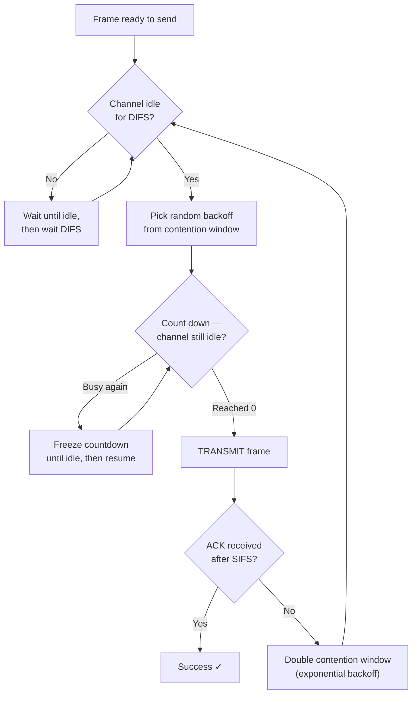
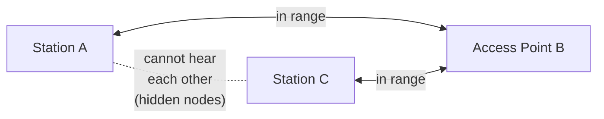
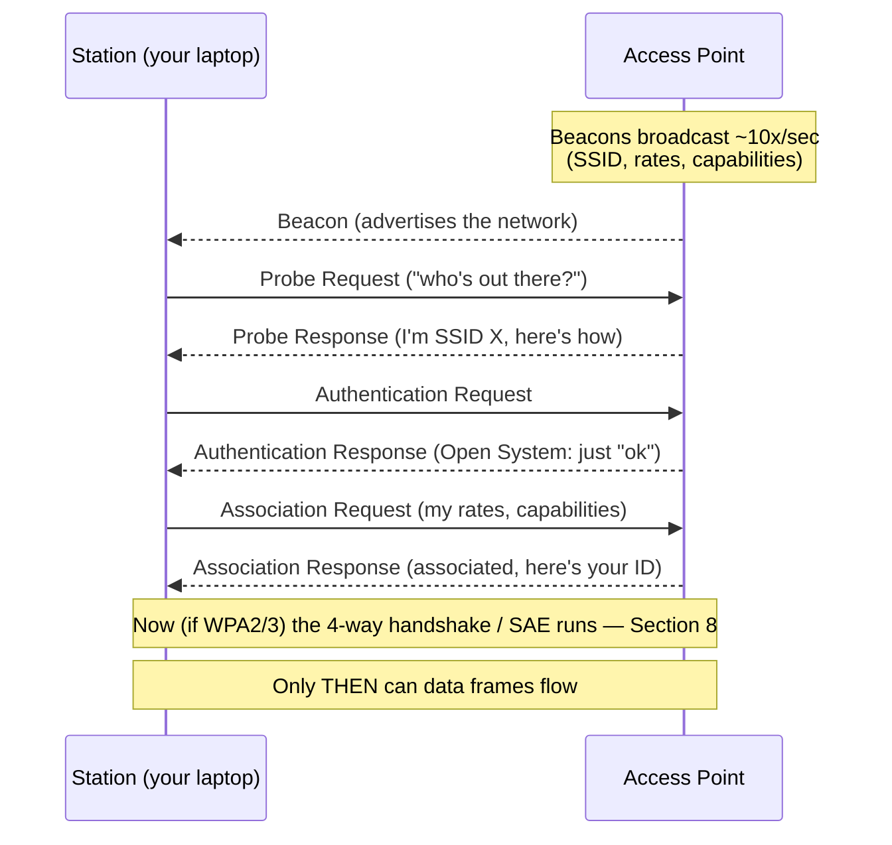

# Module 08 — Wi-Fi (802.11)

> **The one idea to keep:** Wi-Fi is **Ethernet's link layer re-fought on radio.** It keeps
> the same *addressing* (MAC addresses, [Module 03](03-link-layer.md)) but throws out the same
> *media-access* rule, because the trick that makes wired Ethernet work — *detecting* a
> collision while you transmit — is physically impossible on a radio. A Wi-Fi radio can't hear
> itself over its own transmission, so it can't detect collisions; it can only try to *avoid*
> them. That single limitation — **collision avoidance instead of detection** — explains almost
> everything that makes Wi-Fi feel fast-but-twitchy: the polite waiting, the acknowledgements,
> the spiky latency. And it's the exact problem cellular solves a completely different way — by
> having a tower **schedule** everyone instead of letting them contend ([Module 09](09-cellular-architecture.md)).

In [Module 03](03-link-layer.md) we watched wired Ethernet evolve from a shared wire (CSMA/CD,
collisions, backoff) into switched full-duplex links where collisions vanished. Wi-Fi doesn't
get that luxury: the air is *inherently* a shared medium ([Module 02](02-how-data-moves.md),
Section 5 — path loss, interference, multipath), and [Module 07](07-rf-wireless.md) is where we
cover the RF basics this module assumes (carriers, bands, SNR). Everyone in range shares one
channel, so Wi-Fi is stuck fighting the shared-medium battle forever. This module is how it
fights — and loses just gracefully enough to stream your 4K video.

---

## 1. Where Wi-Fi sits: same MAC address, different MAC layer

802.11 (the IEEE standard family; "Wi-Fi" is the marketing name from the Wi-Fi Alliance) is an
**L1 + L2 technology**, exactly like Ethernet. Look at how neatly it slots into Module 03's
picture:

| Link-layer job (Module 03) | Ethernet | Wi-Fi (802.11) |
|---|---|---|
| Framing | Ethernet frame | 802.11 frame (three/four MAC addresses, not two) |
| Addressing | 48-bit MAC | **The same 48-bit MAC addresses** |
| Media access | CSMA/CD (or none, switched) | **CSMA/CA** (this module) |
| Error handling | CRC → drop (TCP recovers) | CRC → drop **+ link-layer ACK & retransmit** |

Two things to burn in early:

- **Wi-Fi reuses Ethernet's MAC addresses unchanged.** The `a4:83:e7:…` OUI scheme, unicast /
  broadcast / multicast — all identical. That's *why* your laptop keeps the same L2 identity
  whether it's on cable or Wi-Fi, and why a home router can bridge the two into one subnet
  without translation. The L3 packet inside doesn't know or care which medium carried it — the
  whole point of layering.
- **But the frame carries up to *four* MAC addresses**, not Ethernet's two. A Wi-Fi frame often
  travels client → access point → wired network, so it needs to name the sender, the receiver,
  *and* the access point acting as relay (plus a fourth for AP-to-AP bridging). More on the
  access point's role below.

> **Vocabulary up front.** An **access point (AP)** is the radio base station of a Wi-Fi
> network — the box everyone associates with. A **station (STA)** is any Wi-Fi client (your
> laptop, phone). A **BSS (Basic Service Set)** is one AP plus its associated stations — the
> Wi-Fi equivalent of "everyone on this switch." Keep AP / STA / BSS handy; the rest of the
> module leans on them.

---

## 2. The generation timeline (and why the names finally make sense)

For twenty years Wi-Fi versions had cryptic names (802.11n, 802.11ac). In 2018 the Wi-Fi
Alliance mercifully added plain numbers. Here's the map, current to 2025:

| Standard | Marketing name | Year | Band(s) | Max channel | Top modulation | Headline PHY rate\* |
|---|---|---|---|---|---|---|
| 802.11b | (Wi-Fi 1) | 1999 | 2.4 GHz | 20 MHz | — | 11 Mbps |
| 802.11a/g | (Wi-Fi 2/3) | 1999–2003 | 5 / 2.4 GHz | 20 MHz | 64-QAM | 54 Mbps |
| 802.11n | **Wi-Fi 4** | 2009 | 2.4 + 5 GHz | 40 MHz | 64-QAM | 600 Mbps |
| 802.11ac | **Wi-Fi 5** | 2013 | 5 GHz | 160 MHz | 256-QAM | ~3.5 Gbps |
| 802.11ax | **Wi-Fi 6** | 2019 | 2.4 + 5 GHz | 160 MHz | 1024-QAM | ~9.6 Gbps |
| 802.11ax | **Wi-Fi 6E** | 2021 | + **6 GHz** | 160 MHz | 1024-QAM | ~9.6 Gbps |
| 802.11be | **Wi-Fi 7** | 2024 | 2.4 + 5 + 6 GHz | **320 MHz** | **4096-QAM** | ~46 Gbps |

\* *"PHY rate" is the theoretical over-the-air maximum with every antenna and the widest
channel — a marketing ceiling you will never see. Real throughput is a fraction of it, because
of the airtime overhead this whole module is about.*

Two throughlines to notice, both straight from [Module 02](02-how-data-moves.md), Section 4:

- **Richer modulation each generation.** 64-QAM → 256-QAM → 1024-QAM → 4096-QAM is just packing
  more bits per symbol (6 → 8 → 10 → 12). Each step needs a *cleaner* signal (higher SNR) to
  work — which is why 4096-QAM only helps close to the AP. Shannon's ceiling, again.
- **More spectrum each generation.** Wider channels and new bands. The single biggest recent
  leap wasn't a clever algorithm — it was **6 GHz** (Wi-Fi 6E/7) opening ~1200 MHz of fresh,
  empty airspace. Spectrum is capacity.

---

## 3. Bands and channels: why 2.4 GHz is a slum and 6 GHz is a new suburb

Wi-Fi lives in three unlicensed bands. "Unlicensed" means no operator owns them — anyone can
transmit within power limits, which is exactly why they get crowded.

| Band | Total width | Non-overlapping 20 MHz channels | Character |
|---|---|---|---|
| **2.4 GHz** | ~70 MHz usable | **3** (channels 1, 6, 11) | Long range, penetrates walls, *hopelessly crowded* |
| **5 GHz** | ~500 MHz | ~25 | Shorter range, much more room, some channels need DFS\*\* |
| **6 GHz** | ~1200 MHz | ~59 | Wi-Fi 6E/7 only; shortest range, huge capacity, still empty |

\*\* *DFS (Dynamic Frequency Selection): some 5 GHz channels are shared with weather/military
radar, so the AP must listen and vacate if it detects radar.*

**Why 2.4 GHz is a slum.** Three problems compound:

1. **Only three non-overlapping channels.** A 20 MHz channel is wider than the spacing between
   channel numbers, so channels 1–11 overlap heavily; only 1, 6, and 11 don't step on each
   other. Every AP in your apartment building is fighting over those three.
2. **It's not just Wi-Fi.** Microwave ovens, Bluetooth, baby monitors, cordless phones, and
   Zigbee all radiate in 2.4 GHz. It's a public commons that everything camps on.
3. **Better propagation is a curse here.** 2.4 GHz travels farther and through walls better than
   5/6 GHz — so you hear *more* distant, competing networks, all of them contending for the same
   airtime as you.

**Channel width is a speed-vs-crowding trade.** Bonding channels (20 → 40 → 80 → 160 → 320 MHz)
doubles data rate per step, but a wide channel occupies more spectrum and collides with more
neighbors. In dense 2.4 GHz you're almost forced to 20 MHz; in empty 6 GHz you can run 160 or
320 MHz freely. This is the same "more bandwidth = more capacity" from Module 02 — but here
bandwidth is literally *airspace you must share*.

> ⚡ **Latency note.** Band choice is a latency decision, not just a speed one. On congested
> 2.4 GHz your frames wait behind everyone else's airtime (Section 4), so *jitter* climbs even
> when average throughput looks fine. Moving a latency-sensitive device (a video call, a game)
> to 5 or 6 GHz often cuts jitter more than it raises throughput — you've escaped the crowd, not
> widened the road.

---

## 4. CSMA/CA: why avoidance, not detection

Here is the heart of the module. Recall CSMA/CD from [Module 03](03-link-layer.md): *transmit,
and if you hear a collision, stop and back off.* That "if you hear a collision" step is the part
radio can't do.

> **Why a radio can't detect its own collisions.** A Wi-Fi radio is effectively **half-duplex**
> on one channel: while its transmitter is blasting out a signal, that signal is millions of
> times stronger at its own antenna than any far-off station's signal would be. It literally
> **cannot hear anyone else while it's talking** — its own transmission drowns everything out.
> Wired Ethernet could compare the voltage it sent against the voltage on the wire and notice a
> mismatch; a radio has no equivalent. So collision *detection* (CD) is off the table. All Wi-Fi
> can do is try hard to *avoid* collisions before they happen: **CA**.

CSMA/CA avoids collisions with four mechanisms working together:

1. **Carrier sense (two kinds).** Before transmitting, a station listens. *Physical* carrier
   sense = "is there RF energy on the channel?" *Virtual* carrier sense = the **NAV (Network
   Allocation Vector)**: every frame announces how long the medium will be busy (its "Duration"
   field), and everyone else sets a countdown timer and stays quiet that long — even if they
   can't physically hear the transmitter (this is what saves the hidden node, Section 5).
2. **Interframe spaces (the pecking order).** After the channel goes idle, you must wait a fixed
   gap before transmitting. The gaps have different lengths, which creates *priority*:
   - **SIFS (Short Interframe Space)** — the *shortest* gap, reserved for the highest-priority
     follow-ups like an ACK. Because it's shortest, an ACK always jumps the queue.
   - **DIFS (DCF Interframe Space)** — the longer gap a normal new transmission must wait.
   Short wait = high priority. This is how an ACK is guaranteed to go out before anyone starts a
   fresh transmission.
3. **Random backoff (before you talk, not after a collision).** After waiting DIFS, a station
   picks a random number from its **contention window** and counts down, decrementing only while
   the channel stays idle, transmitting when it hits zero. Two stations almost never pick the
   same number, so they don't start together. If a transmission fails (no ACK), the station
   *doubles* its contention window (exponential backoff) and tries again — same idea as CSMA/CD's
   backoff, but done *proactively before* transmitting rather than reactively after a collision.
4. **Link-layer ACKs.** Because the sender can't see a collision, the *only* way it learns a
   frame arrived is a positive **acknowledgement** from the receiver, sent after a SIFS. **No
   ACK = assume it collided or was lost = retransmit.** This is a big departure from Ethernet,
   whose CRC only detects-and-drops and leaves recovery to TCP (Module 03, Section 5). Wi-Fi
   retransmits *at L2*, because radio loses far too much to wait for TCP — the same reasoning
   that makes cellular retransmit at L2 (Module 03's foreshadowing; full detail in Module 11).



<figure class="anim-fig">
<svg viewBox="0 0 720 250" role="img" aria-label="Animation: CSMA/CA. A station senses the channel busy, waits DIFS, counts down a random backoff, transmits to the access point, and receives an ACK — no collision.">
<style>
.m08a-box{fill:#eef5ff;stroke:#2c7be5;stroke-width:2}
.m08a-bt{font-size:12px;font-weight:700;fill:#1f4a7a}
.m08a-lbl{font-size:10px;font-weight:700;fill:#334155}
.m08a-glow{fill:none;stroke:#0f172a;stroke-width:3;rx:5}
.m08a-hi1{animation:m08ahi1 8s linear infinite}
.m08a-hi2{animation:m08ahi2 8s linear infinite}
.m08a-hi3{animation:m08ahi3 8s linear infinite}
.m08a-hi4{animation:m08ahi4 8s linear infinite}
.m08a-hi5{animation:m08ahi5 8s linear infinite}
.m08a-c3{animation:m08ac 8s linear infinite}
.m08a-c2{animation:m08ac2 8s linear infinite}
.m08a-c1{animation:m08ac1 8s linear infinite}
.m08a-c0{animation:m08ac0 8s linear infinite}
.m08a-tx{animation:m08atx 8s linear infinite}
.m08a-ack{animation:m08aack 8s linear infinite}
.m08a-ok{animation:m08aok 8s linear infinite}
@keyframes m08ahi1{0%{opacity:1}24%{opacity:1}26%,100%{opacity:0}}
@keyframes m08ahi2{0%,24%{opacity:0}26%,33%{opacity:1}35%,100%{opacity:0}}
@keyframes m08ahi3{0%,33%{opacity:0}35%,50%{opacity:1}52%,100%{opacity:0}}
@keyframes m08ahi4{0%,50%{opacity:0}52%,78%{opacity:1}80%,100%{opacity:0}}
@keyframes m08ahi5{0%,80%{opacity:0}82%,94%{opacity:1}96%,100%{opacity:0}}
@keyframes m08ac{0%,35%{opacity:0}36%,38%{opacity:1}39%,100%{opacity:0}}
@keyframes m08ac2{0%,39%{opacity:0}40%,42%{opacity:1}43%,100%{opacity:0}}
@keyframes m08ac1{0%,43%{opacity:0}44%,46%{opacity:1}47%,100%{opacity:0}}
@keyframes m08ac0{0%,47%{opacity:0}48%,50%{opacity:1}51%,100%{opacity:0}}
@keyframes m08atx{0%,50%{opacity:0;transform:translate(0,0)}53%{opacity:1}76%{opacity:1;transform:translate(490px,0)}78%,100%{opacity:0;transform:translate(490px,0)}}
@keyframes m08aack{0%,80%{opacity:0;transform:translate(0,0)}83%{opacity:1}92%{opacity:1;transform:translate(-490px,0)}94%,100%{opacity:0;transform:translate(-490px,0)}}
@keyframes m08aok{0%,88%{opacity:0}92%,99%{opacity:1}100%{opacity:0}}
</style>
<text x="12" y="20" style="font-size:13px;font-weight:700;fill:#2c7be5">CSMA/CA: sense → wait DIFS → random backoff → transmit → ACK (avoid, don't detect)</text>
<rect class="m08a-box" x="20" y="42" width="80" height="44" rx="8"/><text class="m08a-bt" x="60" y="69" text-anchor="middle">STA A</text>
<rect class="m08a-box" x="620" y="42" width="80" height="44" rx="8"/><text class="m08a-bt" x="660" y="69" text-anchor="middle">AP</text>
<line x1="100" y1="64" x2="620" y2="64" stroke="#cbd5e1" stroke-width="2"/>
<g class="m08a-tx"><rect x="105" y="55" width="22" height="18" rx="4" fill="#2c7be5"/></g>
<g class="m08a-ack"><rect x="593" y="55" width="22" height="18" rx="4" fill="#16a34a"/></g>
<!-- channel timeline -->
<rect x="60" y="140" width="140" height="30" rx="5" fill="#cbd5e1"/>
<rect x="200" y="140" width="45" height="30" rx="5" fill="#f59e0b"/>
<rect x="245" y="140" width="120" height="30" rx="5" fill="#7c3aed"/>
<rect x="365" y="140" width="185" height="30" rx="5" fill="#2c7be5"/>
<rect x="550" y="140" width="30" height="30" rx="5" fill="#64748b"/>
<rect x="580" y="140" width="80" height="30" rx="5" fill="#16a34a"/>
<text class="m08a-lbl" x="130" y="159" text-anchor="middle" fill="#475569">BUSY (others)</text>
<text class="m08a-lbl" x="222" y="159" text-anchor="middle" fill="#fff">DIFS</text>
<text class="m08a-lbl" x="305" y="159" text-anchor="middle" fill="#fff">backoff</text>
<text class="m08a-lbl" x="457" y="159" text-anchor="middle" fill="#fff">A transmits</text>
<text class="m08a-lbl" x="620" y="159" text-anchor="middle" fill="#fff">ACK</text>
<text x="565" y="185" text-anchor="middle" style="font-size:9px;font-weight:700;fill:#64748b">SIFS</text>
<!-- phase highlights -->
<rect class="m08a-glow m08a-hi1" x="60" y="140" width="140" height="30" rx="5"/>
<rect class="m08a-glow m08a-hi2" x="200" y="140" width="45" height="30" rx="5"/>
<rect class="m08a-glow m08a-hi3" x="245" y="140" width="120" height="30" rx="5"/>
<rect class="m08a-glow m08a-hi4" x="365" y="140" width="185" height="30" rx="5"/>
<rect class="m08a-glow m08a-hi5" x="580" y="140" width="80" height="30" rx="5"/>
<!-- backoff countdown -->
<text class="m08a-c3" x="305" y="205" text-anchor="middle" style="font-size:15px;font-weight:700;fill:#7c3aed">3</text>
<text class="m08a-c2" x="305" y="205" text-anchor="middle" style="font-size:15px;font-weight:700;fill:#7c3aed">2</text>
<text class="m08a-c1" x="305" y="205" text-anchor="middle" style="font-size:15px;font-weight:700;fill:#7c3aed">1</text>
<text class="m08a-c0" x="305" y="205" text-anchor="middle" style="font-size:15px;font-weight:700;fill:#16a34a">0 → go</text>
<text class="m08a-ok" x="360" y="235" text-anchor="middle" style="font-size:12px;font-weight:700;fill:#16a34a">✓ ACK received — frame delivered, no collision</text>
</svg>
<figcaption>Unlike CSMA/CD (Module 03), nothing ever collides here. The station waits out the <b>busy</b> channel, holds for <b>DIFS</b>, counts down a <b>random backoff</b> while the channel stays idle, then <b>transmits</b> — and learns it worked only from the returning <b>ACK</b> (sent after the shorter SIFS so it jumps the queue). No ACK would mean "assume lost → double the window → retry."</figcaption>
</figure>

> **Contrast to hold onto — contention vs scheduling.** In CSMA/CA *nobody is in charge*. Every
> station independently gambles on random backoff and hopes it doesn't collide. It's a polite
> free-for-all. Cellular does the opposite: the tower (base station) **grants** each device an
> exact slice of time and frequency to transmit in, so there's no contention and no collision by
> design (Modules 10/11). Contention is simpler and needs no coordinator, but degrades under
> load; scheduling needs a smart tower but stays orderly when packed. That trade-off is the
> spine of the wireless half of this course.

---

## 5. The hidden-node problem and RTS/CTS

Carrier sense assumes everyone can hear everyone. On radio, they can't. Picture two stations, A
and C, on opposite sides of an access point B. A and C are both in range of B, but a wall (or
just distance) means **A and C can't hear each other.** So when A checks the channel, it sounds
idle — even though C is mid-transmission to B. A transmits, and its frame collides with C's *at
B*. A and C are **hidden nodes** to each other.



Carrier sense alone can't fix this — A genuinely hears nothing. The fix is **RTS/CTS
handshaking**, a form of *virtual* carrier sense:

1. A sends a tiny **RTS (Request to Send)** to B.
2. B replies with a **CTS (Clear to Send)** — and crucially, **everyone in range of B hears the
   CTS**, including hidden C.
3. The CTS carries a Duration value, so C sets its **NAV** and stays silent for exactly as long
   as A needs. A transmits collision-free; C waits its turn.

RTS/CTS trades overhead (two extra tiny frames) for protection, so it's typically enabled only
for larger frames or in environments where hidden nodes are common. It's the same NAV mechanism
from Section 4, deployed to solve the one problem physical carrier sense fundamentally can't.

<figure class="anim-fig">
<svg viewBox="0 0 720 300" role="img" aria-label="Animation: the hidden-node problem. Stations A and C cannot hear each other, so both transmit to access point B and collide. Then RTS/CTS fixes it: B's CTS is heard by everyone, so C sets its NAV and stays quiet while A transmits.">
<style>
.m08b-box{fill:#eef5ff;stroke:#2c7be5;stroke-width:2}
.m08b-ap{fill:#fef9c3;stroke:#f59e0b;stroke-width:2}
.m08b-t{font-size:12px;font-weight:700;fill:#1f4a7a}
.m08b-A1{animation:m08bA1 10s linear infinite}
.m08b-C1{animation:m08bC1 10s linear infinite}
.m08b-boom{animation:m08bboom 10s linear infinite}
.m08b-p1{animation:m08bp1 10s linear infinite}
.m08b-p2{animation:m08bp2 10s linear infinite}
.m08b-rts{animation:m08brts 10s linear infinite}
.m08b-ctsA{animation:m08bctsA 10s linear infinite}
.m08b-ctsC{animation:m08bctsC 10s linear infinite}
.m08b-nav{animation:m08bnav 10s linear infinite}
.m08b-data{animation:m08bdata 10s linear infinite}
.m08b-ok{animation:m08bok 10s linear infinite}
@keyframes m08bA1{0%{opacity:0;transform:translate(0,0)}3%{opacity:1}30%{opacity:1;transform:translate(220px,-45px)}33%,100%{opacity:0;transform:translate(220px,-45px)}}
@keyframes m08bC1{0%{opacity:0;transform:translate(0,0)}3%{opacity:1}30%{opacity:1;transform:translate(-200px,-45px)}33%,100%{opacity:0;transform:translate(-200px,-45px)}}
@keyframes m08bboom{0%,27%{opacity:0;transform:scale(.4)}31%{opacity:1;transform:scale(1)}42%{opacity:1}46%,100%{opacity:0}}
@keyframes m08bp1{0%{opacity:1}44%{opacity:1}47%,100%{opacity:0}}
@keyframes m08bp2{0%,47%{opacity:0}50%,99%{opacity:1}100%{opacity:0}}
@keyframes m08brts{0%,50%{opacity:0;transform:translate(0,0)}54%{opacity:1}62%{opacity:1;transform:translate(220px,-45px)}64%,100%{opacity:0;transform:translate(220px,-45px)}}
@keyframes m08bctsA{0%,64%{opacity:0;transform:translate(0,0)}66%{opacity:1}72%{opacity:1;transform:translate(-220px,45px)}74%,100%{opacity:0;transform:translate(-220px,45px)}}
@keyframes m08bctsC{0%,64%{opacity:0;transform:translate(0,0)}66%{opacity:1}72%{opacity:1;transform:translate(200px,45px)}74%,100%{opacity:0;transform:translate(200px,45px)}}
@keyframes m08bnav{0%,73%{opacity:0}77%,98%{opacity:1}100%{opacity:0}}
@keyframes m08bdata{0%,76%{opacity:0;transform:translate(0,0)}80%{opacity:1}90%{opacity:1;transform:translate(220px,-45px)}92%,100%{opacity:0;transform:translate(220px,-45px)}}
@keyframes m08bok{0%,89%{opacity:0}93%,99%{opacity:1}100%{opacity:0}}
</style>
<text x="12" y="20" style="font-size:13px;font-weight:700;fill:#2c7be5">Hidden nodes: A and C can't hear each other — RTS/CTS makes them take turns</text>
<!-- topology -->
<line x1="110" y1="140" x2="330" y2="95" stroke="#cbd5e1" stroke-width="2"/>
<line x1="610" y1="140" x2="410" y2="95" stroke="#cbd5e1" stroke-width="2"/>
<line x1="110" y1="170" x2="610" y2="170" stroke="#ef4444" stroke-width="1.5" stroke-dasharray="6 5"/>
<text x="360" y="188" text-anchor="middle" style="font-size:10.5px;font-weight:700;fill:#ef4444">A and C cannot hear each other (hidden nodes)</text>
<rect class="m08b-box" x="20" y="120" width="90" height="46" rx="8"/><text class="m08b-t" x="65" y="148" text-anchor="middle">STA A</text>
<rect class="m08b-ap" x="315" y="62" width="110" height="46" rx="8"/><text class="m08b-t" x="370" y="90" text-anchor="middle">AP B</text>
<rect class="m08b-box" x="610" y="120" width="90" height="46" rx="8"/><text class="m08b-t" x="655" y="148" text-anchor="middle">STA C</text>
<!-- phase 1: both transmit, collide at B -->
<g class="m08b-A1"><rect x="102" y="132" width="20" height="16" rx="4" fill="#2c7be5"/></g>
<g class="m08b-C1"><rect x="598" y="132" width="20" height="16" rx="4" fill="#16a34a"/></g>
<g class="m08b-boom" style="transform-origin:370px 85px"><polygon points="370,63 379,81 400,85 379,89 370,107 361,89 340,85 361,81" fill="#ef4444"/></g>
<text class="m08b-p1" x="360" y="230" text-anchor="middle" style="font-size:11.5px;font-weight:700;fill:#ef4444">💥 Both sense idle, both transmit → collision at B</text>
<!-- phase 2: RTS/CTS -->
<g class="m08b-p2">
<text x="360" y="212" text-anchor="middle" style="font-size:11.5px;font-weight:700;fill:#7c3aed">RTS/CTS fix: A → RTS → B, then B → CTS → everyone</text>
</g>
<g class="m08b-rts"><rect x="102" y="132" width="24" height="16" rx="4" fill="#7c3aed"/><text x="114" y="145" text-anchor="middle" style="font-size:9px;font-weight:700;fill:#fff">RTS</text></g>
<g class="m08b-ctsA"><rect x="326" y="88" width="24" height="16" rx="4" fill="#16a34a"/><text x="338" y="101" text-anchor="middle" style="font-size:9px;font-weight:700;fill:#fff">CTS</text></g>
<g class="m08b-ctsC"><rect x="398" y="88" width="24" height="16" rx="4" fill="#16a34a"/><text x="410" y="101" text-anchor="middle" style="font-size:9px;font-weight:700;fill:#fff">CTS</text></g>
<text class="m08b-nav" x="655" y="248" text-anchor="middle" style="font-size:10.5px;font-weight:700;fill:#7c3aed">C hears CTS → sets NAV • stays quiet</text>
<g class="m08b-data"><rect x="102" y="132" width="24" height="16" rx="4" fill="#2c7be5"/><text x="114" y="145" text-anchor="middle" style="font-size:9px;font-weight:700;fill:#fff">data</text></g>
<text class="m08b-ok" x="360" y="268" text-anchor="middle" style="font-size:11.5px;font-weight:700;fill:#16a34a">✓ A transmits collision-free while C waits its turn</text>
</svg>
<figcaption>Plain carrier sense fails: A and C each hear silence and transmit, <b>colliding at B</b>. The fix is <b>RTS/CTS</b> — A asks with a tiny <b>RTS</b>, B answers with a <b>CTS that everyone in range of B hears</b>, including hidden C. The CTS carries a Duration, so C sets its <b>NAV</b> and stays silent exactly long enough for A to finish. Virtual carrier sense solving what physical carrier sense can't.</figcaption>
</figure>

> ⚡ **Latency note.** RTS/CTS adds a fixed round-trip of overhead to every protected frame —
> cheap insurance when hidden nodes would otherwise cause repeated collisions and retransmits
> (each retransmit is a *far* bigger latency hit). It's a classic latency trade: pay a small,
> *predictable* cost to avoid a large, *random* one. Reducing jitter often means exactly this.

---

## 6. Joining a network: beacons, probes, authentication, association

Before any data flows, a station must *associate* with an AP. First, definitions people
constantly confuse:

- **SSID (Service Set Identifier)** — the **network name** you see and pick ("HomeWiFi"). It's
  human-facing and *not* unique; ten cafés can all be "CoffeeWiFi."
- **BSSID (Basic Service Set Identifier)** — the **AP's MAC address**. This is the actual L2
  identifier of the specific radio you're talking to. One SSID can span many BSSIDs (a mesh or
  office with many APs all advertising "CorpWiFi" — each AP is a different BSSID).

The association flow has four stages:



<figure class="anim-fig">
<svg viewBox="0 0 720 350" role="img" aria-label="Animation: the Wi-Fi association sequence. The AP beacons, the station sends a probe request and gets a probe response, then authentication request and response, then association request and response — after which data frames can flow.">
<style>
.m08c-box{fill:#eef5ff;stroke:#2c7be5;stroke-width:2}
.m08c-bt{font-size:12px;font-weight:700;fill:#1f4a7a}
.m08c-life{stroke:#cbd5e1;stroke-width:2;stroke-dasharray:4 4}
.m08c-lb{font-size:10.5px;font-weight:700}
.m08c-m1{animation:m08cm1 12s linear infinite}
.m08c-m2{animation:m08cm2 12s linear infinite}
.m08c-m3{animation:m08cm3 12s linear infinite}
.m08c-m4{animation:m08cm4 12s linear infinite}
.m08c-m5{animation:m08cm5 12s linear infinite}
.m08c-m6{animation:m08cm6 12s linear infinite}
.m08c-m7{animation:m08cm7 12s linear infinite}
.m08c-l1{animation:m08cl1 12s linear infinite}
.m08c-l2{animation:m08cl2 12s linear infinite}
.m08c-l3{animation:m08cl3 12s linear infinite}
.m08c-l4{animation:m08cl4 12s linear infinite}
.m08c-l5{animation:m08cl5 12s linear infinite}
.m08c-l6{animation:m08cl6 12s linear infinite}
.m08c-l7{animation:m08cl7 12s linear infinite}
.m08c-fin{animation:m08cfin 12s linear infinite}
@keyframes m08cm1{0%,4%{opacity:0;transform:translate(0,0)}6%{opacity:1}11%{opacity:1;transform:translate(-480px,0)}13%,100%{opacity:0;transform:translate(-480px,0)}}
@keyframes m08cm2{0%,15%{opacity:0;transform:translate(0,0)}17%{opacity:1}22%{opacity:1;transform:translate(480px,0)}24%,100%{opacity:0;transform:translate(480px,0)}}
@keyframes m08cm3{0%,26%{opacity:0;transform:translate(0,0)}28%{opacity:1}33%{opacity:1;transform:translate(-480px,0)}35%,100%{opacity:0;transform:translate(-480px,0)}}
@keyframes m08cm4{0%,37%{opacity:0;transform:translate(0,0)}39%{opacity:1}44%{opacity:1;transform:translate(480px,0)}46%,100%{opacity:0;transform:translate(480px,0)}}
@keyframes m08cm5{0%,48%{opacity:0;transform:translate(0,0)}50%{opacity:1}55%{opacity:1;transform:translate(-480px,0)}57%,100%{opacity:0;transform:translate(-480px,0)}}
@keyframes m08cm6{0%,59%{opacity:0;transform:translate(0,0)}61%{opacity:1}66%{opacity:1;transform:translate(480px,0)}68%,100%{opacity:0;transform:translate(480px,0)}}
@keyframes m08cm7{0%,70%{opacity:0;transform:translate(0,0)}72%{opacity:1}77%{opacity:1;transform:translate(-480px,0)}79%,100%{opacity:0;transform:translate(-480px,0)}}
@keyframes m08cl1{0%,4%{opacity:0}7%,95%{opacity:1}98%,100%{opacity:0}}
@keyframes m08cl2{0%,15%{opacity:0}18%,95%{opacity:1}98%,100%{opacity:0}}
@keyframes m08cl3{0%,26%{opacity:0}29%,95%{opacity:1}98%,100%{opacity:0}}
@keyframes m08cl4{0%,37%{opacity:0}40%,95%{opacity:1}98%,100%{opacity:0}}
@keyframes m08cl5{0%,48%{opacity:0}51%,95%{opacity:1}98%,100%{opacity:0}}
@keyframes m08cl6{0%,59%{opacity:0}62%,95%{opacity:1}98%,100%{opacity:0}}
@keyframes m08cl7{0%,70%{opacity:0}73%,95%{opacity:1}98%,100%{opacity:0}}
@keyframes m08cfin{0%,82%{opacity:0}86%,97%{opacity:1}100%{opacity:0}}
</style>
<text x="12" y="20" style="font-size:13px;font-weight:700;fill:#2c7be5">Joining a network: beacon → probe → authenticate → associate</text>
<rect class="m08c-box" x="60" y="30" width="100" height="36" rx="8"/><text class="m08c-bt" x="110" y="53" text-anchor="middle">STA</text>
<rect class="m08c-box" x="560" y="30" width="100" height="36" rx="8"/><text class="m08c-bt" x="610" y="53" text-anchor="middle">AP</text>
<line class="m08c-life" x1="110" y1="66" x2="110" y2="315"/>
<line class="m08c-life" x1="610" y1="66" x2="610" y2="315"/>
<!-- message rows: labels + moving tokens -->
<text class="m08c-lb m08c-l1" x="360" y="90" text-anchor="middle" fill="#7c3aed">① Beacon — AP broadcasts SSID ✓ (passive scan)</text>
<g class="m08c-m1"><rect x="590" y="96" width="22" height="14" rx="3" fill="#7c3aed"/></g>
<text class="m08c-lb m08c-l2" x="360" y="125" text-anchor="middle" fill="#2c7be5">② Probe Request → "anyone here?" (active scan)</text>
<g class="m08c-m2"><rect x="108" y="131" width="22" height="14" rx="3" fill="#2c7be5"/></g>
<text class="m08c-lb m08c-l3" x="360" y="160" text-anchor="middle" fill="#7c3aed">③ Probe Response ← "I'm SSID X, here's how"</text>
<g class="m08c-m3"><rect x="590" y="166" width="22" height="14" rx="3" fill="#7c3aed"/></g>
<text class="m08c-lb m08c-l4" x="360" y="195" text-anchor="middle" fill="#2c7be5">④ Authentication Request →</text>
<g class="m08c-m4"><rect x="108" y="201" width="22" height="14" rx="3" fill="#2c7be5"/></g>
<text class="m08c-lb m08c-l5" x="360" y="230" text-anchor="middle" fill="#7c3aed">⑤ Authentication Response ← (Open System: "ok")</text>
<g class="m08c-m5"><rect x="590" y="236" width="22" height="14" rx="3" fill="#7c3aed"/></g>
<text class="m08c-lb m08c-l6" x="360" y="265" text-anchor="middle" fill="#2c7be5">⑥ Association Request → (my rates, capabilities)</text>
<g class="m08c-m6"><rect x="108" y="271" width="22" height="14" rx="3" fill="#2c7be5"/></g>
<text class="m08c-lb m08c-l7" x="360" y="300" text-anchor="middle" fill="#16a34a">⑦ Association Response ← (associated + your ID)</text>
<g class="m08c-m7"><rect x="590" y="306" width="22" height="14" rx="3" fill="#16a34a"/></g>
<text class="m08c-fin" x="360" y="335" text-anchor="middle" style="font-size:12px;font-weight:700;fill:#16a34a">✓ Associated → (after WPA2/3 key handshake) data frames flow</text>
</svg>
<figcaption>Four stages, top to bottom: <b>discovery</b> (the AP's beacon, plus the station's probe request/response), <b>authentication</b> (usually just Open System "ok" — real security comes later), and <b>association</b> (the station joins the BSS and gets an ID). Only after this (and, if secured, the WPA2/WPA3 key handshake, Section 8) can encrypted <b>data frames</b> flow — which is why the first connection always takes a noticeable moment.</figcaption>
</figure>

1. **Discovery — beacons and probes.** An AP broadcasts a **beacon** frame roughly ten times a
   second, announcing its SSID, supported rates, and capabilities. That's *passive* scanning.
   Stations can also *actively* scan by sending **probe requests** ("anyone here?") and
   collecting **probe responses**. This is what fills your Wi-Fi menu.
2. **Authentication.** Historically an L2 step; with modern security it's usually **Open System**
   ("authentication" that just says yes) — the real security happens *after* association in the
   4-way handshake (Section 8). (WPA3 folds more into this step; see below.)
3. **Association.** The station sends an **association request** (its rates and capabilities);
   the AP replies with an **association response** and an association ID. Now the station is a
   member of the BSS.
4. **Key exchange** (if secured). The WPA2/WPA3 handshake derives encryption keys. Only after
   this do encrypted **data frames** flow.

> ⚡ **Latency note.** This entire dance — scan, authenticate, associate, key exchange — is why
> connecting to Wi-Fi takes a noticeable moment, and it's the cost you pay *again* every time you
> roam to a new AP (Section 10) unless fast-transition is enabled. Cellular has an analogous but
> heavier "attach" procedure (Module 09/12); in both worlds, *the first packet is always the
> slowest.*

---

## 7. Power save: sleeping between DTIM beacons

A radio that's always listening drains the battery. Wi-Fi lets a station tell the AP "I'm going
to sleep — buffer my frames." The station then powers its radio down and wakes only periodically
to check whether anything's waiting.

The coordination point is the beacon. Each beacon carries a **TIM (Traffic Indication Map)**
saying which sleeping stations have unicast frames buffered. Every Nth beacon is a **DTIM
(Delivery Traffic Indication Map)** beacon, which also signals buffered *broadcast/multicast*
traffic. A sleeping station arranges to wake for DTIM beacons, checks the map, and stays down if
there's nothing for it.

Wi-Fi 6 adds **TWT (Target Wake Time)**: the AP and station *negotiate a schedule* of exactly
when the station will wake to transmit/receive, so a battery device (think IoT sensor) can sleep
for seconds and wake on a precise appointment.

> ⚡ **Latency note.** Power save is a deliberate **latency-for-battery trade.** A sleeping
> station can't receive a packet until its next scheduled wake-up, adding tens of milliseconds
> of delay to downlink traffic. Notice TWT is Wi-Fi *borrowing the scheduling idea* — an
> appointment instead of contention — which is precisely how cellular manages the same
> battery-vs-latency tension for phones (Module 12's DRX). Same problem, converging solutions.

🔧 **Project.** In a capture (Section, Exercises) filter for `wlan.fc.type_subtype == 0x08`
(beacons) and inspect the TIM element and the DTIM period. You're seeing the AP's heartbeat that
every sleeping device on the network keys off.

---

## 8. Security evolution: WEP → WPA2 → WPA3

Wi-Fi security is a cautionary tale of "encryption is easy to get subtly, fatally wrong."

| Scheme | Year | Cipher | Fatal flaw / status (2025) |
|---|---|---|---|
| **WEP** | 1999 | RC4 | Broken. Key recoverable in minutes. **Never use.** |
| **WPA** | 2003 | RC4 + TKIP | Stopgap; also deprecated. |
| **WPA2** | 2004 | **AES-CCMP** | The long-time standard; strong cipher, but see the handshake note. |
| **WPA3** | 2018 | AES + **SAE** | Current best; fixes WPA2's offline-guessing weakness. |

**WPA2 and the 4-way handshake.** WPA2-Personal starts from a shared password (the PSK,
Pre-Shared Key). It never sends the password over the air. Instead, after association, a **4-way
handshake** runs: the AP and station exchange random numbers (nonces) and, combined with the PSK,
each independently derives a fresh per-session encryption key, then prove to each other they got
the same key. Clever — but with a weakness: an attacker who *captures* the handshake can take it
offline and try password guesses against it as fast as their hardware allows (an offline
dictionary attack). Weak Wi-Fi passwords fall this way.

**WPA3 and SAE ("Dragonfly").** WPA3-Personal replaces the PSK handshake with **SAE
(Simultaneous Authentication of Equals)**, a password-authenticated key exchange (the
"Dragonfly" handshake). Its two big wins:

- **No offline dictionary attack.** Each password guess requires a *fresh live interaction* with
  the AP, so an attacker can't grind captured data offline. Brute-forcing becomes impractical.
- **Forward secrecy.** Even if the password is later compromised, previously recorded traffic
  can't be decrypted — each session's keys are independent.

> 🔒 **Security preview.** WPA2's captured-handshake weakness is the direct successor to Module
> 03's "L2 trusts what it's told" theme (ARP spoofing). WPA3 is the fix; use it where you can.
> We'll go deeper on wireless attacks in the security/tooling modules.

---

## 9. Modern PHY: MIMO, MU-MIMO, OFDMA, beamforming

These are the tricks that took Wi-Fi from 54 Mbps to tens of Gbps. All build on the modulation
foundation from [Module 02](02-how-data-moves.md).

- **MIMO (Multiple-Input Multiple-Output).** Multiple antennas at each end send *independent*
  data streams — **spatial streams** — on the same channel at the same time. Multipath (Module
  02's echo problem, usually an enemy) becomes an *asset*: the reflections let the receiver tell
  the streams apart. "4×4 MIMO" = four spatial streams ≈ 4× the data. This is *spatial
  multiplexing*.
- **MU-MIMO (Multi-User MIMO).** Plain MIMO serves one station at a time. MU-MIMO uses those
  antennas to talk to *several stations simultaneously* — the AP steers distinct streams to
  distinct clients at once instead of taking turns.
- **OFDMA (Orthogonal Frequency-Division Multiple Access).** The headline feature of Wi-Fi 6, and
  **borrowed straight from LTE** (you'll meet it as the core of cellular in Module 10). It slices
  one channel into many small subcarrier groups called **resource units (RUs)**, and hands
  *different RUs to different stations in the same transmission*. Instead of one station hogging
  the whole channel for a tiny packet, the AP packs several small clients into one airtime slot —
  a huge efficiency win for many-small-devices workloads.
- **Beamforming.** Rather than radiating equally in all directions, the AP shapes the combined
  signal from its antennas to *focus energy toward a specific station*. Stronger signal there =
  higher SNR = the richer modulation from Section 2 becomes usable = more speed.

> **The contention/scheduling thread, made concrete.** OFDMA is the moment Wi-Fi quietly starts
> *scheduling* — the AP decides which client gets which RU, exactly as a cellular tower assigns
> resource blocks. Wi-Fi 6 is CSMA/CA on the *outside* (a station still contends to win the
> channel) but *scheduled* on the inside once the AP has it. Watch this convergence: the more
> Wi-Fi wants cellular-grade efficiency, the more it adopts cellular's scheduler.

---

## 10. Why Wi-Fi latency is spiky — and roaming

You now have every ingredient to explain the thing engineers actually feel: Wi-Fi throughput can
be great while latency is *erratic*. The causes, all from this module:

- **Airtime contention (Section 4).** Every frame waits DIFS + a random backoff, and freezes
  whenever anyone else is talking. The wait is *random by design*, so per-packet delay varies —
  that's jitter, straight from the mechanism.
- **Retransmissions (Section 4).** A lost frame with no ACK is retried after a *doubled* backoff.
  One retransmit can add many milliseconds; a burst of interference adds several.
- **Rate adaptation.** As signal quality wobbles (you move, someone opens a microwave), the radio
  hops between modulation rates (Module 02's AMC). Rate changes make transmission time — and thus
  latency — jump around.
- **Interference.** Neighbors, Bluetooth, and non-Wi-Fi noise on 2.4 GHz all steal airtime or
  corrupt frames, triggering more of the above.
- **Bufferbloat on the AP.** Cheap APs hold oversized transmit buffers; under load, packets sit
  in a bloated queue (Module 02's *queuing delay*) for hundreds of ms. Modern fixes (fq_codel /
  CAKE smart-queue management) keep those queues short and are the single biggest latency
  improvement you can make to a home AP.

> ⚡ **Latency note — the summary.** Wi-Fi's latency floor is low, but its *ceiling is wild*
> because so many of its delays are random (backoff, retransmit, contention). This is the
> fundamental cost of **contention**: no one guarantees your turn. Cellular's **scheduler**
> exists precisely to bound this — a base station can promise a device a slot every few
> milliseconds, trading Wi-Fi's simplicity for predictable, low jitter. When Module 13 attributes
> end-to-end latency, "is the access network contended or scheduled?" is one of the first
> questions.

**Roaming between APs.** In a large space (office, home mesh) many APs share one SSID; as you
walk, your station must hand off from one BSSID to another. The catch: **the station decides when
to roam, not the network** — it clings to a weakening AP until signal drops enough, then
re-runs the whole join flow (Section 6) *including* the security handshake, which can cause a
visible stall on a call. Fixes:

- **802.11r (Fast BSS Transition)** pre-establishes keys so roaming skips most of the handshake —
  turning a multi-hundred-ms reassociation into a few ms.
- **802.11k** gives the station a neighbor report (a list of nearby APs) so it doesn't have to
  scan blindly, and **802.11v** lets the network *suggest* a better AP.

> **Contrast to cellular.** Wi-Fi roaming is *client-driven and abrupt* — you disconnect from one
> AP and reconnect to another. Cellular handover is *network-controlled and seamless* — the
> network measures your signal and orchestrates the handover before you drop (Module 12). Same
> goal (stay connected while moving); opposite philosophies — contention vs. control, once again.

---

## Check your understanding

<div class="quiz">
<p class="q">Why does Wi-Fi use collision <em>avoidance</em> (CSMA/CA) instead of collision <em>detection</em> (CSMA/CD) like classic Ethernet?</p>
<ul class="options">
<li data-correct="true">A radio can't hear other stations while it's transmitting — its own signal drowns everything out — so it can't detect a collision in progress and must try to avoid one instead.</li>
<li>Radios are faster than wires, so detection would be too slow.</li>
<li>Wi-Fi frames are too large for collision detection to work.</li>
</ul>
<div class="explain">A Wi-Fi radio is effectively half-duplex: while transmitting, its own signal is vastly stronger at its antenna than any distant station's, so it literally cannot listen for a collision the way wired Ethernet compares sent vs. observed voltage. With detection impossible, Wi-Fi relies on carrier sense, random backoff, and link-layer ACKs to <em>avoid</em> collisions and detect losses after the fact.</div>
</div>

<div class="quiz">
<p class="q">Two stations A and C are both in range of access point B but cannot hear each other. What is this called, and what fixes it?</p>
<ul class="options">
<li data-correct="true">The hidden-node problem; RTS/CTS handshaking (the CTS, heard by everyone in range of B, sets their NAV so they stay quiet).</li>
<li>The exposed-node problem; solved by switching to 2.4 GHz for longer range.</li>
<li>A broadcast storm; solved by Spanning Tree Protocol.</li>
</ul>
<div class="explain">Because A and C can't hear each other, plain carrier sense fails — each thinks the channel is idle and they collide at B. RTS/CTS fixes it: A's RTS prompts B to send a CTS that <em>everyone</em> in range of B (including hidden C) receives, and its Duration field makes them set their NAV and wait. It's virtual carrier sense solving what physical carrier sense can't.</div>
</div>

<div class="quiz">
<p class="q">What's the difference between an SSID and a BSSID?</p>
<ul class="options">
<li data-correct="true">The SSID is the human-readable network name (not unique); the BSSID is a specific access point's MAC address (the actual L2 identifier). One SSID can span many BSSIDs.</li>
<li>The SSID is the AP's MAC address; the BSSID is the network name.</li>
<li>They're two names for the same thing.</li>
</ul>
<div class="explain">The SSID ("HomeWiFi") is the name you pick and isn't unique across networks. The BSSID is the MAC address of the individual AP radio you're associated with. A mesh or office network advertises one SSID across many APs, each with its own BSSID — which is exactly what roaming (802.11r/k/v) hops between.</div>
</div>

---

## Exercises

1. **Scan your neighborhood.** Use a Wi-Fi analyzer (WiFi Explorer / iStumbler on macOS,
   `nmcli dev wifi` or a Wi-Fi Analyzer app on Linux/Android) to list nearby networks. Note how
   many are crammed onto 2.4 GHz channels 1/6/11, and which have escaped to 5 or 6 GHz. Map the
   Section-3 slum firsthand.

2. **Read your own link.** Run `airport -I` (macOS: the hidden
   `/System/Library/PrivateFrameworks/Apple80211.framework/…/airport` tool) or
   `iw dev wlan0 link` (Linux). Identify your **BSSID**, channel, channel width, and current
   PHY rate. Then walk away from the AP and watch the rate drop — that's rate adaptation
   (Section 10 / Module 02's AMC) live.

3. **🔧 Wireshark in monitor mode.** Put your Wi-Fi adapter into *monitor mode* (macOS: Wireshark
   can enable it per-capture; Linux: `sudo iw dev wlan0 set type monitor`, or `airmon-ng`). Unlike
   normal captures, monitor mode shows raw 802.11 **management** and **control** frames.
   Filter for `wlan.fc.type_subtype == 0x08` and watch **beacons** stream from every nearby AP —
   expand one and find the SSID, supported rates, and DTIM period.

4. **🔧 Capture the join flow.** Still in monitor mode, forget and rejoin your own network while
   capturing. Filter with `wlan.fc.type == 0` (management frames) and identify the Section-6
   sequence: **probe request/response → authentication → association request/response**. If your
   network is WPA2, follow it with the four **EAPOL** frames — that's the 4-way handshake
   (Section 8).

5. **Channel scan and pick.** Using the analyzer from #1, count how many APs sit on your current
   channel vs. the least-crowded 1/6/11 (2.4 GHz) or an empty 5/6 GHz channel. Change your AP to
   the quietest option and re-measure ping jitter (`ping -i 0.2 <gateway>` for a minute, before
   and after). You should see the *variation* shrink — the Section-10 airtime-contention effect.

6. **Compare bands for latency.** Connect the same device first to your 2.4 GHz SSID, then 5/6
   GHz, and run a sustained `ping` to your gateway during a busy evening. Record min/avg/max.
   The average may be similar, but the **max/jitter** usually drops on the less-crowded band —
   proof that band choice is a jitter decision, not just a throughput one.

---

## Key terms

- **802.11 / Wi-Fi** — the IEEE standard family (and its marketing name) for wireless LAN; an
  L1+L2 technology sharing Ethernet's MAC addressing.
- **AP / STA / BSS** — access point (radio base station) / station (client) / the AP plus its
  clients (one "neighborhood").
- **SSID / BSSID** — network name (human-facing, non-unique) / an AP's MAC address (the real L2
  identifier).
- **CSMA/CA** — Carrier Sense Multiple Access with Collision *Avoidance*; Wi-Fi's media-access
  method.
- **DIFS / SIFS** — interframe spaces; the longer gap before a new transmission / the short gap
  before high-priority follow-ups like ACKs.
- **Backoff / contention window** — the random idle countdown a station waits before transmitting;
  doubles on failure (exponential backoff).
- **ACK** — link-layer acknowledgement; its absence signals a lost frame and triggers L2
  retransmission (unlike Ethernet, which leaves recovery to TCP).
- **NAV** — Network Allocation Vector; virtual carrier sense — a countdown other stations honor
  based on a frame's announced Duration.
- **Hidden node / RTS/CTS** — two stations that can't hear each other but share an AP / the
  handshake (Request/Clear to Send) that reserves the medium via NAV to protect them.
- **Beacon / probe / association** — the AP's periodic advertisement / a station's active query /
  the process of formally joining a BSS.
- **DTIM / TIM / TWT** — beacon elements that let sleeping stations know when buffered traffic
  awaits / the negotiated wake schedule in Wi-Fi 6.
- **WEP / WPA2 / WPA3** — obsolete/broken / current-standard (AES-CCMP, 4-way handshake) /
  best-practice (SAE "Dragonfly", forward secrecy) security.
- **MIMO / MU-MIMO / spatial stream** — multiple antennas sending independent data streams / to
  multiple clients at once / one such independent stream.
- **OFDMA / resource unit** — subdividing a channel among several stations in one transmission
  (borrowed from LTE) / the sub-channel each gets.
- **Beamforming** — focusing antenna energy toward a specific station to raise its SNR.
- **802.11r / k / v** — fast roaming (pre-shared keys) / neighbor reports / network-suggested AP
  steering.

---

## Cheat-sheet

```
WI-FI (802.11) — Ethernet's link layer, re-fought on radio
  Same MAC ADDRESSES as Ethernet (Module 03); DIFFERENT media access (CSMA/CA)
  AP = base station · STA = client · BSS = AP + its clients
  SSID = network name (not unique) · BSSID = AP's MAC (real L2 id)

GENERATIONS
  n=Wi-Fi 4 (MIMO, 40MHz) · ac=Wi-Fi 5 (5GHz, 256-QAM, MU-MIMO)
  ax=Wi-Fi 6 (OFDMA, 1024-QAM) · 6E adds 6GHz · be=Wi-Fi 7 (320MHz, 4096-QAM, MLO)
  each gen = richer modulation (more bits/symbol) + more spectrum

BANDS / CHANNELS
  2.4GHz: only 3 non-overlapping (1,6,11), crowded (BT, microwaves) — a slum
  5GHz: ~25 channels, more room, some need DFS (radar)
  6GHz: ~1200MHz, Wi-Fi 6E/7 only, empty — new capacity
  width 20/40/80/160/320MHz: wider = faster but shares more airspace

CSMA/CA — why AVOID not DETECT: a radio can't hear itself over its own TX
  listen (physical + NAV virtual carrier sense)
  wait DIFS → random backoff countdown → transmit → wait for ACK (SIFS)
  no ACK → double contention window, retransmit (L2 retransmit, unlike Ethernet)
  SIFS < DIFS  → ACKs jump the queue

HIDDEN NODE: A & C can't hear each other, both reach B → collide at B
  fix: RTS/CTS — CTS heard by all near B sets their NAV → they wait

JOIN FLOW: beacon → probe req/resp → auth (open) → assoc req/resp → key handshake
POWER SAVE: sleep, wake for DTIM beacons (buffered traffic map); Wi-Fi 6 = TWT

SECURITY: WEP(broken) → WPA2(AES, 4-way handshake, offline-guessable)
          → WPA3(SAE/Dragonfly: no offline attack + forward secrecy)

PHY TRICKS: MIMO (spatial streams) · MU-MIMO (many clients at once)
            OFDMA (share channel via RUs — from LTE) · beamforming (focus energy)

WHY LATENCY IS SPIKY: random backoff + retransmits + rate adaptation
   + interference + AP bufferbloat (fix: fq_codel/CAKE)
ROAMING: client-driven, re-does join per AP; 802.11r/k/v speed it up

THE THREAD: Wi-Fi = CONTENTION (nobody in charge, spiky jitter)
            Cellular = SCHEDULING (tower grants slots, bounded jitter) — Modules 09-12
```

---

**Next up → Module 09: Cellular Architecture** — Wi-Fi shares the air by letting everyone
politely contend for it. Cellular refuses the free-for-all: a network of base stations and a
core network *schedule* every transmission and hand you off seamlessly as you move. We'll map
the players (UE, eNodeB/gNodeB, the core) and see why "who's in charge of the air" is the
defining difference between the two wireless worlds.
