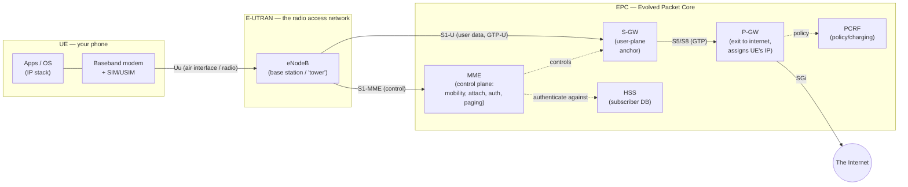
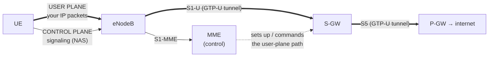
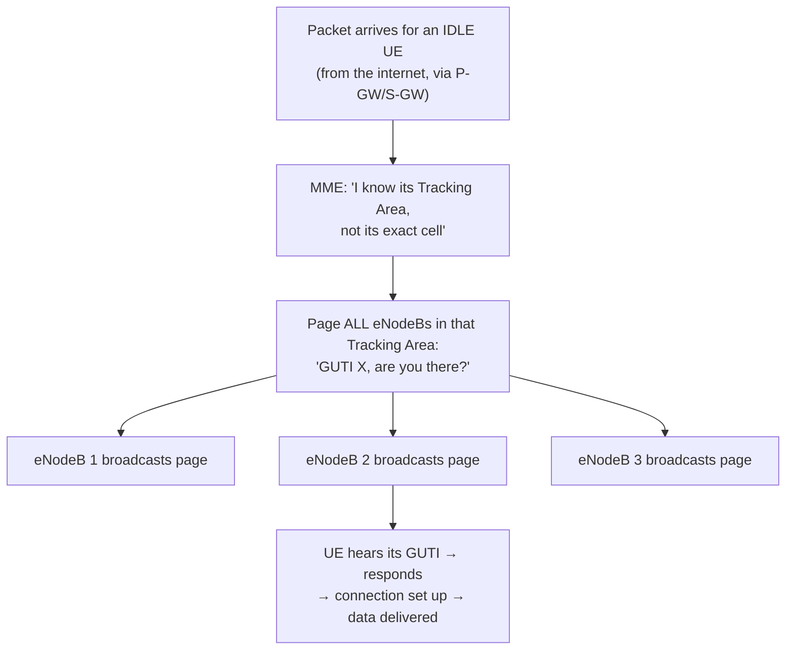

# Module 09 — Cellular Architecture

> **The one idea to keep:** A cellular network is just a very elaborate way to give your
> phone an ordinary IP address and carry its ordinary IP packets — over radio, while you
> move. Everything special about it (SIMs, base stations, a "core network," tunnels,
> paging) exists to solve two problems the wired internet never had to: *the link is
> radio* and *the endpoint keeps moving*. Underneath, it's still encapsulation and IP —
> the exact ideas from Modules 01 and 04, wearing telecom costumes.

This module is **the big map** of a mobile network. Modules 10, 11 and 12 each zoom into
one region of it: [Module 10](10-lte-air-interface.md) drills into the *radio link* (the
"Uu" line on our diagrams), [Module 11](11-lte-protocol-stack.md) opens up the *protocol
stack* running over that link, and [Module 12](12-procedures.md) walks the *procedures*
(attach, paging, handover) that make it all move. Here we lay out the whole board so those
deep-dives have a place to hang.

You already have the tools you need. If you internalize the layered model
([Module 01](01-the-layered-model.md)) and how IP/NAT move packets across networks
([Module 04](04-network-layer.md)), then cellular is "the same ideas, harder environment."
We also lean on radio physics from [Module 07](07-rf-wireless.md). Siblings:
[Module 10 — LTE air interface](10-lte-air-interface.md),
[Module 11 — LTE protocol stack](11-lte-protocol-stack.md),
[Module 12 — procedures](12-procedures.md).

> We teach **4G/LTE** as the backbone here because it's the first *all-IP* mobile network
> and its core (EPC) is the clean reference design everyone learns from. 5G reuses the
> same *shape* with new names, so once LTE clicks, 5G is a relabel (Section 8).

---

## 1. Sixty years in one table: 1G → 5G

Every "G" (generation) is a roughly ten-year leap defined by the standards body **3GPP**
(see Section 2). The through-line: each generation carries *more kinds of traffic* and
progressively turns the whole network into *plain IP*.

| Gen | Era | Core tech | What it added | Data model |
|-----|-----|-----------|---------------|------------|
| **1G** | 1980s | Analog (AMPS, NMT) | Mobile *voice*, full stop | None (analog voice) |
| **2G** | 1990s | Digital (**GSM**) | Digital voice, **SMS**, then GPRS/EDGE data | Circuit-switched voice + slow packet data bolted on |
| **3G** | 2000s | **UMTS** / HSPA | Real mobile *data* (web, video) | Parallel circuit (voice) + packet (data) domains |
| **4G** | 2010s | **LTE** | Fast data, low latency; **all-IP** | Everything is IP — even voice (**VoLTE**) |
| **5G** | 2020s | **NR** (New Radio) | More speed, lower latency, massive IoT, slicing | All-IP, cloud-native core |

The single most important shift for a software engineer is **3G → 4G**. Before LTE, a
phone call was a *circuit* (a dedicated end-to-end path, like an old telephone exchange)
and data was a separate afterthought. LTE threw the circuit domain away: **everything is
now an IP packet**, including your voice call, which rides as Voice over LTE (VoLTE) using
the same packet machinery as your web traffic. That's why this module can treat cellular
as "IP over radio" and mean it.

> ⚡ **Latency note.** Each generation didn't just get *faster* (more bandwidth); it got
> *snappier* (lower latency). Typical round-trip to the first hop dropped from ~500 ms on
> 3G to ~30–50 ms on good LTE to a target of ~1–10 ms on 5G. Bandwidth and latency are
> different axes (Module 02) — 5G's headline is as much about latency as about gigabits.

---

## 2. Who decides all this: 3GPP and spectrum

Two things make a global cellular network possible: a shared **rulebook** and shared
**airwaves**.

**3GPP (3rd Generation Partnership Project)** is the consortium that writes the standards —
GSM, UMTS, LTE, and 5G NR are all 3GPP specs. It publishes numbered **Releases** (e.g.
Release 8 = first LTE, Release 15 = first 5G, and by 2025 the industry is deploying
Release 17/18 features, "5G-Advanced"). When two engineers on opposite sides of the planet
build a base station and a modem that interoperate, it's because both obey the same 3GPP
Release. Think of a Release like a versioned API contract for the entire industry.

**Spectrum** is the actual radio frequency the network transmits on (Module 07 covers the
physics). It is a scarce, government-regulated resource: national regulators **auction**
slices of spectrum to **carriers** (the operators — Verizon, Vodafone, Jio, etc.). A band
is identified by a **3GPP band number** (e.g. Band 3 = 1800 MHz, Band 71 = 600 MHz, n78 =
3.5 GHz for 5G). Roughly:

- **Low band** (600–900 MHz): travels far, penetrates buildings, but modest speed — great
  coverage.
- **Mid band** (1.8–3.5 GHz): the workhorse balance of range and speed.
- **High band / mmWave** (24 GHz+): huge speed, tiny range — stadiums and dense urban.

> This is why your phone shows different speeds in different places: it's picking the best
> band its modem and the tower share, using **adaptive modulation** (Module 02) on top.
> The band you're on is something you can actually inspect — see the Exercises.

---

## 3. The end-to-end LTE system: the map

Here is the whole board. Read it left to right as "your phone → radio → base station →
core network → the internet." Every acronym is defined in the sections that follow; don't
try to absorb them yet, just see the shape.



Three big pieces, and one line you should never lose sight of:

1. **UE (User Equipment)** — your device (Section 4).
2. **E-UTRAN** — the radio access network: essentially "the towers" (Section 5).
3. **EPC (Evolved Packet Core)** — the brains and plumbing behind the towers (Section 6).

The line to keep in view is the **bold data path**: `UE → eNodeB → S-GW → P-GW → internet`.
That's where *your actual bytes* flow. Everything else (MME, HSS, PCRF) is signaling and
policy that *sets up* and *controls* that path. Hold that distinction — it's the
control-plane vs user-plane split in Section 7.

---

## 4. The UE: device + modem + SIM

**UE (User Equipment)** is 3GPP's word for "the thing in the user's hand." It's three
cooperating parts:

- **The device / OS** — runs apps with an ordinary IP stack. As far as your app is
  concerned, it has an IP address and sends packets. It has *no idea* it's on cellular
  (that's the payoff of layering from Module 01 — swap the link, the app never notices).
- **The baseband modem** — a dedicated chip (Qualcomm, MediaTek, Apple's own, etc.) that
  implements the *entire* radio stack: PHY, MAC, RLC, PDCP, RRC (Module 11). This is the
  "cellular modem" from Module 01 — far more than a plain L1 modulator. It's effectively a
  small, specialized computer running its own real-time OS, talking to the main OS over an
  internal interface.
- **The SIM / USIM** — a tamper-resistant smartcard (physical nano-SIM or an **eSIM**
  soldered in) that holds your **identity** and the **secret key** used to authenticate you
  to the network. On LTE the relevant application on the card is the **USIM** (Universal
  SIM). It stores your **IMSI** (subscriber identity) and a secret key **Ki** that *never
  leaves the card* — authentication is done by challenge/response so the key is never
  transmitted.

> **Two identities you must not confuse:**
> - **IMEI** identifies the *hardware* (the phone itself). Burned into the device. Dial
>   `*#06#` to see it. Used to block stolen handsets.
> - **IMSI** identifies the *subscriber* (you, via your SIM). Lives on the SIM. Move the
>   SIM to another phone and your IMSI goes with it.
>
> Hardware vs subscriber — the same split as MAC-address-vs-account. We'll add temporary
> identities (GUTI/TMSI) in Section 9, because broadcasting your permanent IMSI over the
> air is a privacy disaster.

---

## 5. E-UTRAN: the eNodeB (the base station)

**E-UTRAN** (Evolved UMTS Terrestrial Radio Access Network) is the official name for
LTE's radio access network. In practice it's made of one kind of box repeated everywhere:
the **eNodeB** (Evolved Node B, often "eNB" — the LTE base station, i.e. what a layperson
calls "the cell tower's equipment").

The eNodeB is more capable than older base stations. It:

- Terminates the **Uu air interface** — the radio link to the UE. This is *the* hop this
  whole course has been building toward; Module 10 is entirely about what happens on this
  line.
- Runs the radio stack's lower layers and **schedules** every transmission on the air.
  Recall from Module 03 that Ethernet lets devices contend (CSMA/CD) and Wi-Fi avoids
  collisions (CSMA/CA) — cellular does neither. The eNodeB is a **scheduler**: it decides,
  millisecond by millisecond, exactly which UE transmits on which slice of spectrum. No
  free-for-all, because radio is too scarce to waste on collisions.
- Talks to the core over two S1 interfaces (Section 6) and to *neighbouring* eNodeBs over
  **X2**.

**X2 — why base stations talk to each other directly:** when you move from one cell to
the next mid-download, the two eNodeBs coordinate a **handover** over the X2 interface,
forwarding your in-flight packets from the old cell to the new one so the connection
doesn't drop. (Module 12 details the handover procedure.) X2 is a big part of why LTE
handovers feel seamless.

> ⚡ **Latency note.** The eNodeB scheduler is a latency source *and* a latency saver.
> Saver: no collision backoff (Module 03's random-wait penalty is gone). Cost: if your UE
> is idle, it must *request* a scheduling grant before it can send — a control round-trip
> on the air before your first byte moves (Module 12's RRC setup). That's the ~50–100 ms
> "wake the radio" tax Module 01 foreshadowed.

---

## 6. The EPC: the core network, box by box

The **EPC (Evolved Packet Core)** is the all-IP core introduced with LTE. It's a set of
specialized network functions. The cleanest way to learn them is by the
**control-plane / user-plane** split (formalized in Section 7): some boxes *decide things*
(signaling), others *carry your packets* (data).

| Function | Plane | One-line job |
|----------|-------|--------------|
| **MME** (Mobility Management Entity) | Control | The brain: handles attach, authentication, tracking your location, and *deciding* to page you. Never touches user data. |
| **S-GW** (Serving Gateway) | User | The mobility anchor for your data; forwards your packets between the eNodeB and the P-GW. Stays put as you move between eNodeBs. |
| **P-GW** (PDN Gateway) | User | The **exit to the internet**. Assigns your UE its **IP address**, does NAT, enforces policy, and is where the outside world "sees" your phone. |
| **HSS** (Home Subscriber Server) | Control | The master subscriber database: who you are, your key, what you're allowed to use. The MME checks you against it. |
| **PCRF** (Policy & Charging Rules Function) | Control | Decides QoS and billing rules (e.g. "throttle after 50 GB", "prioritize VoLTE"). |

Walk the boxes in the order they matter to you:

- **MME — the control brain.** When your phone powers on and *attaches*, the MME runs the
  show: it pulls your credentials from the **HSS**, challenges your SIM to authenticate
  you, tracks which region you're in, and — when a call/packet arrives for an idle phone —
  it triggers **paging** (Section 9, detailed in Module 12). Crucially, **the MME never
  carries your data.** It's pure signaling.

- **S-GW and P-GW — the user-plane pipe.** Your packets flow UE → eNodeB → **S-GW** →
  **P-GW** → internet. The **S-GW** is the *anchor* that stays fixed while you hop between
  eNodeBs (so mobility doesn't break your flows). The **P-GW** is the *border*: it's a
  router facing the internet (the interface is called **SGi**), it hands your UE its **IP
  address**, and — because that IP is typically a private one — it usually performs **NAT**
  (Module 04) so many subscribers share public IPv4 addresses. In other words, **the P-GW
  is your phone's default gateway and NAT box**, the cellular equivalent of your home
  router's WAN side.

- **HSS — the subscriber source of truth.** A database. Your IMSI, your key, your allowed
  services. The MME authenticates you against it at attach.

- **PCRF — policy and money.** Applies QoS and charging rules to your bearers (Section 7).

> **Map it to what you already know:** the P-GW *is* your default gateway + NAT
> ([Module 04](04-network-layer.md)). The HSS *is* an auth database (like the identity
> store behind a login). The MME *is* a session/orchestration controller. You've built
> all these shapes in software; cellular just gives them telecom names.

### The interfaces (the named lines on the map)

Telecom obsessively names every link between boxes. The five you must know:

| Interface | Between | Carries |
|-----------|---------|---------|
| **Uu** | UE ↔ eNodeB | The **air interface** (radio). Module 10. |
| **S1-MME** | eNodeB ↔ MME | **Control** signaling (attach, paging, bearer setup). |
| **S1-U** | eNodeB ↔ S-GW | **User** data, inside **GTP-U** tunnels (Section 7). |
| **X2** | eNodeB ↔ eNodeB | Handover coordination between neighbours. |
| **S5/S8** | S-GW ↔ P-GW | User data across the core (S5 = same operator, S8 = roaming). |

---

## 7. Control plane vs user plane, bearers, and GTP tunnels

This is the conceptual heart of the module. Two ideas that unlock everything else.

### The two planes

A cellular network cleanly separates:

- **Control plane** — the *signaling* that sets up, moves, and tears down your connection.
  "Authenticate this SIM." "Page this phone." "Set up a bearer with this QoS." Runs UE ↔
  eNodeB ↔ **MME**. Low volume, high importance.
- **User plane** — the *actual bytes* of your traffic (your HTTPS, your video, your VoLTE
  packets). Runs UE ↔ eNodeB ↔ **S-GW** ↔ **P-GW** ↔ internet. High volume.



The bold double lines are your data; the thin lines are signaling. The MME *conducts the
orchestra* (it tells the S-GW/P-GW what path to build) but never plays an instrument (it
never forwards a data packet). Separating "who decides" from "who carries" lets each scale
independently — a theme 5G takes even further (CUPS, Section 8).

<figure class="anim-fig">
<svg viewBox="0 0 760 300" role="img" aria-label="Animation: control-plane signalling travels UE to eNodeB to MME on a thin dashed path while user-plane data travels UE to eNodeB to S-GW to P-GW to the Internet on a thick path; the two planes split at the eNodeB.">
<style>
.m09b-lbl{font-size:12px;font-weight:700;fill:#fff}
.m09b-t{font-size:13px;font-weight:700;fill:#2c7be5}
.m09b-cp{font-size:11px;font-weight:700;fill:#7c3aed}
.m09b-up{font-size:11px;font-weight:700;fill:#2c7be5}
.m09b-note{font-size:10.5px;fill:#64748b}
.m09b-wire{stroke:#cbd5e1;stroke-width:3;fill:none}
.m09b-ctl{stroke:#7c3aed;stroke-width:2;stroke-dasharray:6 5;fill:none;animation:m09bants 1s linear infinite}
.m09b-usr{stroke:#2c7be5;stroke-width:4;fill:none}
@keyframes m09bants{to{stroke-dashoffset:-22}}
</style>
<text class="m09b-t" x="12" y="20">Control plane vs user plane — the split happens at the eNodeB</text>
<line class="m09b-wire" x1="110" y1="150" x2="150" y2="150"/>
<polyline class="m09b-ctl" points="250,150 290,150 290,62 330,62"/>
<polyline class="m09b-usr" points="250,150 290,150 290,232 330,232"/>
<line class="m09b-usr" x1="420" y1="232" x2="470" y2="232"/>
<line class="m09b-usr" x1="570" y1="232" x2="626" y2="232"/>
<text class="m09b-cp" x="335" y="34">CONTROL PLANE — signalling (NAS): sets up the path</text>
<text class="m09b-up" x="335" y="200">USER PLANE — your IP packets</text>
<rect x="20" y="128" width="90" height="44" rx="6" fill="#64748b"/><text class="m09b-lbl" x="65" y="155" text-anchor="middle">UE</text>
<rect x="150" y="128" width="100" height="44" rx="6" fill="#16a34a"/><text class="m09b-lbl" x="200" y="155" text-anchor="middle">eNodeB</text>
<rect x="330" y="40" width="140" height="44" rx="6" fill="#7c3aed"/><text class="m09b-lbl" x="400" y="67" text-anchor="middle">MME</text>
<rect x="330" y="210" width="90" height="44" rx="6" fill="#2c7be5"/><text class="m09b-lbl" x="375" y="237" text-anchor="middle">S-GW</text>
<rect x="470" y="210" width="100" height="44" rx="6" fill="#2c7be5"/><text class="m09b-lbl" x="520" y="237" text-anchor="middle">P-GW</text>
<circle cx="660" cy="232" r="32" fill="#64748b"/><text class="m09b-lbl" x="660" y="236" text-anchor="middle">Internet</text>
<circle r="4" fill="#7c3aed"><animateMotion path="M65,150 L290,150 L290,62 L400,62" dur="3.6s" begin="0s" repeatCount="indefinite"/></circle>
<circle r="4" fill="#7c3aed"><animateMotion path="M65,150 L290,150 L290,62 L400,62" dur="3.6s" begin="1.8s" repeatCount="indefinite"/></circle>
<circle r="5" fill="#2c7be5"><animateMotion path="M65,150 L290,150 L290,232 L626,232" dur="4.5s" begin="0s" repeatCount="indefinite"/></circle>
<circle r="5" fill="#2c7be5"><animateMotion path="M65,150 L290,150 L290,232 L626,232" dur="4.5s" begin="1.5s" repeatCount="indefinite"/></circle>
<circle r="5" fill="#2c7be5"><animateMotion path="M65,150 L290,150 L290,232 L626,232" dur="4.5s" begin="3s" repeatCount="indefinite"/></circle>
<text class="m09b-note" x="380" y="288" text-anchor="middle">The MME conducts (decides the path) but never carries a data packet.</text>
</svg>
<figcaption><b>Two planes, one split.</b> Signalling (purple, thin dashed) runs UE ⇄ eNodeB ⇄ <b>MME</b> to set up your connection; your actual bytes (blue, thick) run UE ⇄ eNodeB ⇄ <b>S-GW</b> ⇄ <b>P-GW</b> ⇄ internet. The MME decides; the gateways carry.</figcaption>
</figure>

### EPS bearers: a pipe with a promised quality

Your data doesn't just flow as loose packets across the core — it flows through an **EPS
bearer**: a logical channel from the UE all the way to the P-GW, tagged with a **quality of
service (QoS)** level. Think of a bearer as a virtual pipe with an SLA attached.

- **Default bearer** — created automatically at attach. Best-effort, always-on. This is
  what carries your ordinary web/app traffic. You get an IP address with it.
- **Dedicated bearer** — created on demand for traffic that needs *better* treatment, e.g.
  a **VoLTE** voice call gets a dedicated bearer with guaranteed bandwidth and low latency
  so your call doesn't stutter when the network is busy.

QoS is expressed as a **QCI (QoS Class Identifier)** — a small integer that maps to a
treatment profile (priority, delay budget, loss tolerance). For example, QCI 1 is
conversational voice (tight delay budget, guaranteed bitrate); QCI 9 is default best-effort
internet. The PCRF sets these rules; the network honours them end to end.

> ⚡ **Latency note.** QCI encodes a *packet delay budget* — e.g. voice bearers target
> ~100 ms end-to-end, non-guaranteed data tolerates ~300 ms. This is the network
> *deliberately* trading latency by traffic class. It's why a VoLTE call stays crisp on a
> congested cell while your download slows: the scheduler (Section 5) services the
> low-QCI bearer first.

### GTP tunneling — the callback to encapsulation and NAT

Here's the mechanism that carries a bearer across the core, and it's a direct replay of
[Module 01](01-the-layered-model.md)'s **encapsulation** and [Module 04](04-network-layer.md)'s
IP/NAT.

Your phone's IP packet (say, an HTTPS request to a server) does **not** travel across the
operator's core as a bare IP packet. Instead, the eNodeB wraps it in a **GTP-U (GPRS
Tunnelling Protocol – User plane)** tunnel and ships it to the S-GW, which re-tunnels it to
the P-GW. Only at the P-GW is your original packet *un*wrapped and released onto the
internet.

What GTP-U encapsulation looks like on the wire between eNodeB and S-GW:

```
 Your original packet (what your app made):
   [ IP (src=UE IP, dst=server) | TCP | TLS | HTTP... ]

 As it crosses S1-U / S5, wrapped for the core:
   [ outer IP | UDP | GTP-U hdr (TEID) | [ IP(UE) | TCP | TLS | HTTP... ] ]
    └────────── core's own transport ─────────┘ └──── your packet, untouched ────┘
```

<figure class="anim-fig">
<svg viewBox="0 0 760 250" role="img" aria-label="Animation: an IP packet leaves the UE, gets a GTP wrapper added at the eNodeB, rides through the S-GW and P-GW inside the tunnel, and is unwrapped back to a plain IP packet as it exits the P-GW to the Internet.">
<style>
.m09a-t{font-size:13px;font-weight:700;fill:#2c7be5}
.m09a-lbl{font-size:12px;font-weight:700;fill:#fff}
.m09a-note{font-size:10.5px;fill:#64748b}
.m09a-tun{font-size:11px;font-weight:700;fill:#f59e0b}
.m09a-ip{font-size:12px;font-weight:700;fill:#fff}
.m09a-gtp{font-size:11px;font-weight:700;fill:#7a5200}
.m09a-wire{stroke:#cbd5e1;stroke-width:3;fill:none}
.m09a-pkt{animation:m09amove 8s ease-in-out infinite}
.m09a-wrap{animation:m09awrap 8s ease-in-out infinite}
@keyframes m09amove{
0%,10%{transform:translateX(0)}
25%{transform:translateX(140px)}
50%{transform:translateX(300px)}
72%{transform:translateX(450px)}
88%,100%{transform:translateX(620px)}}
@keyframes m09awrap{
0%,24%{opacity:0}
28%,70%{opacity:1}
74%,100%{opacity:0}}
</style>
<text class="m09a-t" x="12" y="20">Your IP packet rides inside a GTP tunnel across the core</text>
<line x1="200" y1="150" x2="510" y2="150" stroke="#f59e0b" stroke-width="2" stroke-dasharray="5 4"/>
<line x1="200" y1="145" x2="200" y2="155" stroke="#f59e0b" stroke-width="2"/>
<line x1="510" y1="145" x2="510" y2="155" stroke="#f59e0b" stroke-width="2"/>
<text class="m09a-tun" x="355" y="142" text-anchor="middle">GTP-U tunnel (S1-U, then S5)</text>
<line class="m09a-wire" x1="95" y1="207" x2="648" y2="207"/>
<rect x="25" y="185" width="70" height="44" rx="6" fill="#64748b"/><text class="m09a-lbl" x="60" y="212" text-anchor="middle">UE</text>
<rect x="150" y="185" width="100" height="44" rx="6" fill="#16a34a"/><text class="m09a-lbl" x="200" y="212" text-anchor="middle">eNodeB</text>
<rect x="320" y="185" width="80" height="44" rx="6" fill="#2c7be5"/><text class="m09a-lbl" x="360" y="212" text-anchor="middle">S-GW</text>
<rect x="470" y="185" width="80" height="44" rx="6" fill="#2c7be5"/><text class="m09a-lbl" x="510" y="212" text-anchor="middle">P-GW</text>
<circle cx="680" cy="207" r="32" fill="#64748b"/><text class="m09a-lbl" x="680" y="211" text-anchor="middle">Internet</text>
<g class="m09a-pkt">
<g class="m09a-wrap">
<rect x="20" y="64" width="80" height="52" rx="6" fill="#f59e0b"/>
<text class="m09a-gtp" x="60" y="76" text-anchor="middle">GTP</text>
</g>
<rect x="40" y="80" width="40" height="24" rx="4" fill="#2c7be5"/>
<text class="m09a-ip" x="60" y="96" text-anchor="middle">IP</text>
</g>
<text class="m09a-note" x="380" y="245" text-anchor="middle">Wrapped at the eNodeB, carried by the core, unwrapped at the P-GW — your UE IP never changes.</text>
</svg>
<figcaption><b>Encapsulation for mobility.</b> Your plain <b>IP</b> packet gets a <b>GTP</b> wrapper (amber) added at the eNodeB, rides the tunnel through the S-GW and P-GW, then is unwrapped and released onto the internet at the P-GW. The tunnel lets the network reroute you without ever changing your IP.</figcaption>
</figure>

Read that against the encapsulation diagram in Module 01 — it's the **exact same nesting
of envelopes**, one layer deeper. Key points:

- The **outer IP + UDP** headers are the *operator's own* addressing, used to route your
  data between core boxes over their internal IP network. Your packet is just payload to
  them.
- The **TEID (Tunnel Endpoint Identifier)** in the GTP-U header is the label that says
  *which bearer / which UE* this tunnel belongs to — so the S-GW/P-GW can keep thousands of
  subscribers' flows straight. It's the "tunnel ID," conceptually like a VLAN tag or a
  flow label.
- **Why tunnel at all?** *Mobility.* Because your packets are wrapped, the operator can
  reroute the tunnel (change which eNodeB, even which S-GW) as you move, **without your UE's
  IP address ever changing**. Your TCP connections survive the handover because, to them,
  nothing changed — the tunnel absorbed the mobility. That's the whole trick: tunnels let
  the network move you around while the IP layer above believes it's sitting still.
- The **P-GW then does NAT** (Module 04): it strips the GTP wrapper, and forwards your
  (usually private) UE IP onto the internet behind a shared public IP — exactly like your
  home router, just at carrier scale (**CGNAT**, carrier-grade NAT).

> **The one connection to bank:** *GTP is encapsulation (Module 01) in service of mobility;
> the P-GW is NAT + default gateway (Module 04).* If you see that, you understand why a
> mobile network needs a "core" at all. It's not magic — it's tunnels so your IP can stand
> still while you physically move, plus a NAT'd exit to the internet. This same tunnels-
> for-mobility idea returns in Module 15 (VPNs & tunneling) — hold the thread.

---

## 8. A brief tour of 5G (the same map, relabeled)

5G's radio is **NR (New Radio)** and its base station is the **gNB** (the 5G eNodeB). The
core is redesigned but the *shapes* are familiar. The **5G Core (5GC)** splits the EPC's
combined boxes into finer, cloud-native functions:

| EPC (4G) | 5GC (5G) | Job |
|----------|----------|-----|
| MME (control parts) | **AMF** (Access & Mobility Function) | Attach, mobility, paging control |
| MME/PGW (session parts) | **SMF** (Session Management Function) | Sets up sessions & assigns IP (control side) |
| S-GW + P-GW (user parts) | **UPF** (User Plane Function) | Carries your packets; the exit to the internet |

Notice the pattern: the 5GC formally separates **control** (AMF, SMF) from **user plane**
(UPF). This is **CUPS (Control and User Plane Separation)** — the Section 7 split, now made
architectural. The benefit: operators can push the **UPF** physically close to you (edge
computing) for low latency, while keeping the control functions centralized.

Two more terms you'll hear constantly in 2025:

- **NSA vs SA.** Most 5G launched as **Non-Standalone (NSA)**: a 5G radio (gNB) bolted onto
  the *existing LTE core (EPC)* — 5G speed, 4G control plane. **Standalone (SA)** is "real"
  5G: 5G radio *and* 5G Core, which unlocks ultra-low latency and slicing. Through 2025
  carriers have been steadily migrating NSA → SA.
- **Network slicing.** Because the 5GC is software-defined, an operator can carve one
  physical network into multiple **virtual networks ("slices")**, each with its own QoS
  profile — low-latency factory robots, massive-but-slow IoT, consumer broadband — all on
  the same hardware. It's multi-tenancy applied to a whole mobile network.

> ⚡ **Latency note.** The headline 5G promise of ~1 ms latency needs **SA** + an **edge
> UPF** (short physical path to the internet exit) + a low-latency slice. Plain NSA 5G on a
> distant core is faster in *bandwidth* than LTE but not dramatically better in *latency* —
> another reminder that the two axes are independent (Module 02).

---

## 9. Identifiers, tracking areas, and paging (the mobility glue)

A moving, sometimes-sleeping phone forces the network to solve "where is this device, and
how do I reach it without draining its battery?" The answers are identifiers plus tracking.

**Temporary identities (privacy).** Broadcasting your permanent **IMSI** over the air would
let anyone with a radio track you (that's exactly what an "IMSI catcher"/Stingray does). So
after you attach, the MME issues a **GUTI (Globally Unique Temporary Identity)** — a
temporary alias used on the air instead of the IMSI. The short form used within a region is
the **TMSI**. These rotate, so eavesdroppers can't easily follow you.

**Tracking Areas (coarse location).** The network doesn't know *exactly* which cell an idle
phone is in — tracking every phone to a single cell would flood the network with updates as
people move. Instead the coverage map is divided into **Tracking Areas (TAs)**, each a group
of cells. Your idle phone only reports in when it crosses into a *new* Tracking Area (a
**Tracking Area Update**). So the MME knows your TA, not your exact cell — a deliberate
trade of precision for battery/signaling savings.

**Paging (finding you to deliver something).** When data or a call arrives for your idle
phone, the MME doesn't know your exact cell — only your Tracking Area. So it **pages**: it
asks *every* eNodeB in your Tracking Area to broadcast "UE with this GUTI, are you there?"
Your phone hears its GUTI, responds, and the connection is set up. (Full procedure in
Module 12.)



> ⚡ **Latency note.** Paging is a real, visible latency cost. If your phone is idle, an
> incoming packet must wait for: page broadcast → UE responds → RRC connection setup →
> bearer resumed — easily **100+ ms** before your data flows, on top of normal network
> latency. This is why the *first* packet to a sleeping phone is slow and the next ones are
> fast (the radio is now awake). It's the mobile-specific tax that pure wired networking
> never pays, and Module 12 breaks down every millisecond of it.

---

## 10. Putting it together: what happens when you open an app on 4G

Tying the map to a concrete flow (each step is detailed in Modules 10–12):

```
 1. Attach (once, at power-on): UE ↔ eNodeB ↔ MME. SIM authenticated against HSS.
    MME sets up a DEFAULT BEARER; P-GW assigns your UE an IP address (via NAT).
 2. Idle: to save battery, the radio drops to idle; MME knows only your Tracking Area.
 3. You tap the app → UE must reconnect: RRC setup on the Uu air interface (a control
    round-trip) to get a scheduling grant from the eNodeB.
 4. Your HTTPS packet is built normally (IP/TCP/TLS — Modules 04/05, TLS deep-dive).
 5. eNodeB wraps it in a GTP-U tunnel → S-GW → P-GW (S1-U, then S5).
 6. P-GW un-tunnels it, NATs the source IP, forwards it onto the internet (SGi).
 7. Reply comes back to the P-GW's public IP → NAT maps it to your UE → back down the
    tunnels → eNodeB → over the air to your phone → up your normal IP stack to the app.
```

<figure class="anim-fig">
<svg viewBox="0 0 760 320" role="img" aria-label="Animation: the LTE attach procedure as a message sequence — UE to eNodeB to MME to HSS and back — ending with the UE attached and an IP address assigned.">
<style>
.m09c-t{font-size:13px;font-weight:700;fill:#2c7be5}
.m09c-lbl{font-size:12px;font-weight:700;fill:#fff}
.m09c-life{stroke:#cbd5e1;stroke-width:2;stroke-dasharray:4 4}
.m09c-msg{font-size:10.5px;font-weight:600;fill:#1f2d3d}
.m09c-s1{animation:m09cs1 9s ease-in-out infinite}
.m09c-s2{animation:m09cs2 9s ease-in-out infinite}
.m09c-s3{animation:m09cs3 9s ease-in-out infinite}
.m09c-s4{animation:m09cs4 9s ease-in-out infinite}
.m09c-s5{animation:m09cs5 9s ease-in-out infinite}
.m09c-s6{animation:m09cs6 9s ease-in-out infinite}
.m09c-s7{animation:m09cs7 9s ease-in-out infinite}
@keyframes m09cs1{0%,5%{opacity:0}9%,92%{opacity:1}97%,100%{opacity:0}}
@keyframes m09cs2{0%,16%{opacity:0}20%,92%{opacity:1}97%,100%{opacity:0}}
@keyframes m09cs3{0%,27%{opacity:0}31%,92%{opacity:1}97%,100%{opacity:0}}
@keyframes m09cs4{0%,38%{opacity:0}42%,92%{opacity:1}97%,100%{opacity:0}}
@keyframes m09cs5{0%,49%{opacity:0}53%,92%{opacity:1}97%,100%{opacity:0}}
@keyframes m09cs6{0%,60%{opacity:0}64%,92%{opacity:1}97%,100%{opacity:0}}
@keyframes m09cs7{0%,73%{opacity:0}77%,92%{opacity:1}97%,100%{opacity:0}}
</style>
<text class="m09c-t" x="12" y="20">Attach / registration — power-on message sequence</text>
<line class="m09c-life" x1="90" y1="60" x2="90" y2="300"/>
<line class="m09c-life" x1="280" y1="60" x2="280" y2="300"/>
<line class="m09c-life" x1="470" y1="60" x2="470" y2="300"/>
<line class="m09c-life" x1="660" y1="60" x2="660" y2="300"/>
<rect x="50" y="32" width="80" height="26" rx="5" fill="#64748b"/><text class="m09c-lbl" x="90" y="50" text-anchor="middle">UE</text>
<rect x="232" y="32" width="96" height="26" rx="5" fill="#16a34a"/><text class="m09c-lbl" x="280" y="50" text-anchor="middle">eNodeB</text>
<rect x="430" y="32" width="80" height="26" rx="5" fill="#7c3aed"/><text class="m09c-lbl" x="470" y="50" text-anchor="middle">MME</text>
<rect x="622" y="32" width="76" height="26" rx="5" fill="#f59e0b"/><text class="m09c-lbl" x="660" y="50" text-anchor="middle">HSS</text>
<g class="m09c-s1">
<text class="m09c-msg" x="185" y="86" text-anchor="middle">Attach Request (IMSI/GUTI)</text>
<line x1="90" y1="92" x2="280" y2="92" stroke="#64748b" stroke-width="2"/>
<polygon points="280,92 272,88 272,96" fill="#64748b"/>
</g>
<g class="m09c-s2">
<text class="m09c-msg" x="375" y="116" text-anchor="middle">forward to MME</text>
<line x1="280" y1="122" x2="470" y2="122" stroke="#16a34a" stroke-width="2"/>
<polygon points="470,122 462,118 462,126" fill="#16a34a"/>
</g>
<g class="m09c-s3">
<text class="m09c-msg" x="565" y="146" text-anchor="middle">auth info request</text>
<line x1="470" y1="152" x2="660" y2="152" stroke="#7c3aed" stroke-width="2"/>
<polygon points="660,152 652,148 652,156" fill="#7c3aed"/>
</g>
<g class="m09c-s4">
<text class="m09c-msg" x="565" y="176" text-anchor="middle">auth vectors + profile</text>
<line x1="660" y1="182" x2="470" y2="182" stroke="#f59e0b" stroke-width="2"/>
<polygon points="470,182 478,178 478,186" fill="#f59e0b"/>
</g>
<g class="m09c-s5">
<text class="m09c-msg" x="280" y="206" text-anchor="middle">authenticate + NAS security</text>
<line x1="470" y1="212" x2="90" y2="212" stroke="#7c3aed" stroke-width="2"/>
<polygon points="90,212 98,208 98,216" fill="#7c3aed"/>
</g>
<g class="m09c-s6">
<text class="m09c-msg" x="280" y="236" text-anchor="middle">Attach Accept + IP address</text>
<line x1="470" y1="242" x2="90" y2="242" stroke="#7c3aed" stroke-width="2"/>
<polygon points="90,242 98,238 98,246" fill="#7c3aed"/>
</g>
<g class="m09c-s7">
<rect x="230" y="266" width="300" height="32" rx="6" fill="#16a34a"/>
<text class="m09c-lbl" x="380" y="287" text-anchor="middle">UE attached — IP address assigned ✓</text>
</g>
</svg>
<figcaption><b>The attach handshake.</b> On power-on the UE registers: request up through the <b>eNodeB</b> to the <b>MME</b>, which pulls your credentials from the <b>HSS</b> and challenges your SIM. Once authenticated, the MME sends <b>Attach Accept</b> and a default bearer is set up — you now have an <b>IP address</b>.</figcaption>
</figure>

Steps 4, 6, 7 are *ordinary internet* (everything from Modules 01–06). Steps 1–3 and 5 are
the *cellular-specific* wrapping around it. That's the whole point of this module: cellular
is a mobility-and-radio shell around plain IP.

---

## Check your understanding

<div class="quiz">
<p class="q">In the LTE core (EPC), which node carries your actual user data and assigns your phone its IP address?</p>
<ul class="options">
<li>The MME</li>
<li data-correct="true">The P-GW (with the S-GW as the mobility anchor on the path)</li>
<li>The HSS</li>
</ul>
<div class="explain">The user-plane path is UE → eNodeB → S-GW → P-GW → internet. The
<strong>P-GW</strong> is the exit to the internet, assigns the UE's IP, and does NAT. The
<strong>MME</strong> is pure control-plane signaling and never touches user data; the
<strong>HSS</strong> is just the subscriber database.</div>
</div>

<div class="quiz">
<p class="q">Why does the LTE core wrap your IP packets in GTP-U tunnels between the eNodeB and the gateways?</p>
<ul class="options">
<li>To encrypt the packets so they can't be read.</li>
<li data-correct="true">So the network can reroute the tunnel as you move between cells without ever changing your UE's IP address — mobility, via encapsulation.</li>
<li>Because IP packets can't travel over the operator's core network.</li>
</ul>
<div class="explain">GTP-U is encapsulation (Module 01) in service of mobility. Wrapping
your packet means the operator can move the tunnel's endpoints (different eNodeB/S-GW) as
you move, while your UE's IP address stays constant — so your TCP connections survive
handovers. GTP-U itself isn't an encryption mechanism, and your packets absolutely are IP
(that's what's inside the tunnel).</div>
</div>

<div class="quiz">
<p class="q">Your phone is idle and a message arrives for it. The MME knows your Tracking Area but not your exact cell. What does it do?</p>
<ul class="options">
<li data-correct="true">It pages every eNodeB in your Tracking Area to broadcast a message addressed to your temporary identity (GUTI), and your phone responds.</li>
<li>It looks up your exact cell in the HSS and contacts only that eNodeB.</li>
<li>It drops the message, since idle phones are unreachable.</li>
</ul>
<div class="explain">This is <strong>paging</strong>. The network trades location
precision for battery/signaling savings: it only tracks idle phones to a Tracking Area
(a group of cells), then pages all cells in that area using your temporary
<strong>GUTI</strong> (not your permanent IMSI, for privacy). It adds real first-packet
latency — the mobile-specific tax.</div>
</div>

---

## Exercises

Cellular becomes real once you see these identifiers and bands on your *own* device.

1. **🔧 See your IMEI (the hardware ID).** On your phone's dialer, type `*#06#`. The IMEI
   pops up instantly — this is the device identity from Section 4. (Some phones also show
   the EID for the eSIM.) Note it's tied to the *phone*, not your SIM.

2. **🔧 Open the hidden field-test / cell-info menu.** iPhone: dial `*3001#12345#*` and call
   to enter **Field Test Mode**. Android: many phones respond to `*#*#4636#*#*` ("Testing"
   menu) or need an app (next exercise). Find your serving cell's **Cell ID**, the **band**
   you're on, and signal metrics like **RSRP** (reference signal received power) and
   **RSRQ**. Watch RSRP change as you walk around.

3. **🔧 Map the network with NetMonster / CellMapper.** Install **NetMonster** (Android) or
   use **CellMapper**. These surface your serving eNodeB, Cell ID, band, and neighbouring
   cells in a friendly UI — and CellMapper crowdsources tower locations onto a map. Identify
   which physical tower you're attached to and which band it's using (low/mid/high — Section
   2). *(On iOS the OS is more locked down; Field Test Mode is the closest equivalent.)*

4. **Inspect your SIM.** In your phone's settings, find the SIM/mobile info screen and locate
   your **ICCID** (the SIM card's serial number) and, where shown, hints of your **IMSI**
   (operators often mask most of it). Consider: your IMSI identifies *you*, the IMEI
   identifies the *phone* — move the SIM to another handset and confirm your number/identity
   follows the SIM, not the phone.

5. **Check your carrier IP — and prove you're behind NAT.** On the phone's browser, visit a
   "what is my IP" site and note the **public** IP. Then check the IP your OS reports for the
   cellular interface (Android: Settings → About → Status; or a network-info app). They'll
   usually differ — the OS shows a *private* address, the website shows the P-GW's *shared
   public* address. That gap is **CGNAT** at the P-GW (Sections 6–7, and Module 04).

6. **Watch a generation/band switch.** Toggle your phone between "5G/LTE/3G" preferences (or
   walk from a strong area into a weak one) and watch the status indicator and the band in
   your field-test tool change. You're watching the modem pick the best band the tower shares
   — adaptive selection in action (Section 2, Module 02).

---

## Key terms

- **3GPP** — the standards consortium that writes GSM/UMTS/LTE/5G specs, published as
  numbered *Releases*.
- **Carrier / operator** — the company that owns spectrum and runs the network (Verizon,
  Vodafone, Jio…).
- **Band** — a specific slice of radio spectrum, identified by a 3GPP band number; grouped
  into low/mid/high.
- **UE (User Equipment)** — 3GPP's term for the user's device (OS + baseband modem + SIM).
- **Baseband modem** — the chip implementing the whole radio stack (PHY/MAC/RLC/PDCP/RRC).
- **SIM / USIM** — the smartcard (or eSIM) holding subscriber identity + secret key; USIM is
  the LTE-era application on it.
- **IMSI** — International Mobile Subscriber Identity; permanent *subscriber* identity, on
  the SIM.
- **IMEI** — International Mobile Equipment Identity; permanent *hardware* identity, in the
  phone (`*#06#`).
- **GUTI / TMSI** — temporary identities the MME assigns so your permanent IMSI isn't
  broadcast over the air (privacy).
- **E-UTRAN** — LTE's radio access network (the eNodeBs).
- **eNodeB (eNB)** — the LTE base station; terminates the air interface and *schedules* all
  radio transmissions.
- **gNB** — the 5G base station (NR).
- **EPC (Evolved Packet Core)** — LTE's all-IP core network.
- **MME (Mobility Management Entity)** — control-plane brain: attach, authentication,
  mobility tracking, paging control. Never carries user data.
- **S-GW (Serving Gateway)** — user-plane mobility anchor; forwards packets between eNodeB
  and P-GW.
- **P-GW (PDN Gateway)** — user-plane exit to the internet; assigns the UE's IP and does NAT.
- **HSS (Home Subscriber Server)** — master subscriber database (identity + key +
  entitlements).
- **PCRF** — Policy & Charging Rules Function; sets QoS and billing rules.
- **Uu / S1-MME / S1-U / X2 / S5-S8** — the named interfaces (air / control / user / inter-eNB
  / core).
- **Control plane vs user plane** — signaling (who decides) vs actual data traffic (who
  carries).
- **EPS bearer** — a logical, QoS-tagged pipe from UE to P-GW. *Default* (best-effort,
  always-on) vs *dedicated* (on-demand, e.g. VoLTE).
- **QCI** — QoS Class Identifier; the integer selecting a bearer's priority/delay/loss
  profile.
- **GTP (GTP-U)** — GPRS Tunnelling Protocol (User plane); encapsulates your IP packets
  across the core so the network can move you around without changing your IP.
- **TEID** — Tunnel Endpoint Identifier; the label in a GTP header naming which bearer/UE a
  tunnel belongs to.
- **Tracking Area (TA)** — a group of cells; the granularity to which the network tracks an
  idle phone.
- **Paging** — broadcasting to all cells in a Tracking Area to locate an idle UE for
  incoming data.
- **VoLTE** — Voice over LTE; phone calls carried as IP packets on a dedicated bearer.
- **5GC / AMF / SMF / UPF** — the 5G Core and its split functions (mobility control / session
  control / user-plane forwarding).
- **NSA vs SA** — Non-Standalone (5G radio on a 4G core) vs Standalone (full 5G radio + core).
- **CUPS** — Control and User Plane Separation; architecting the two planes as independent,
  separately-scalable functions.
- **Network slicing** — carving one physical 5G network into multiple virtual networks with
  distinct QoS.
- **CGNAT** — Carrier-Grade NAT; the large-scale NAT at the P-GW/UPF sharing public IPs
  across many subscribers.

---

## Cheat-sheet

```
CELLULAR ARCHITECTURE (LTE reference) — "IP over radio, while moving"

GENERATIONS:  1G analog voice · 2G GSM digital+SMS · 3G UMTS data ·
              4G LTE ALL-IP (incl. VoLTE) · 5G NR (slicing, low latency)
STANDARDS: 3GPP Releases (R8=LTE, R15=5G, R17/18=5G-Advanced ~2025)
SPECTRUM:  carriers buy bands. low=coverage, mid=balance, high/mmWave=speed

THREE BIG PIECES + THE DATA PATH:
  UE (device+baseband modem+SIM/USIM)
    ── Uu (air) ── eNodeB (E-UTRAN; SCHEDULES the radio; X2 to neighbours)
    ── S1 ── EPC:
        DATA PATH:  UE → eNodeB → S-GW → P-GW → internet   (user plane)
        CONTROL:    UE → eNodeB → MME                        (signaling)

EPC BOXES:
  MME  = control brain (attach, auth, mobility, paging). NO user data.
  S-GW = user-plane mobility anchor
  P-GW = internet exit; ASSIGNS UE IP; does NAT (= your default gateway)
  HSS  = subscriber DB (identity + key)      PCRF = QoS/charging rules

IDENTIFIERS:
  IMEI = the PHONE (hardware)      IMSI = the SUBSCRIBER (SIM)
  GUTI/TMSI = temporary alias over the air (privacy; hides IMSI)

TWO PLANES:  control = who DECIDES (MME) · user = who CARRIES (S/P-GW)
BEARERS:     default (best-effort, gets your IP) · dedicated (VoLTE, GBR)
             QoS via QCI (QCI1=voice tight delay, QCI9=default data)

GTP TUNNELS (the key idea):
  your packet [IP|TCP|...]  --wrapped-->  [outerIP|UDP|GTP-U(TEID)| your packet ]
  = ENCAPSULATION (Mod 01) so the network moves you WITHOUT changing your IP
  P-GW un-wraps + NAT (Mod 04) → internet

MOBILITY: Tracking Areas (coarse location) + PAGING (find idle UE) + handover (X2)

5G RELABEL:  gNB(radio) · 5GC: AMF(=MME mobility) SMF(sessions/IP) UPF(=S/P-GW data)
             SA vs NSA · CUPS (plane separation) · network slicing · edge UPF

LATENCY TAXES (mobile-specific):
  idle→active RRC setup (~50-100ms) · paging first-packet (100ms+) · core tunneling
```

---

**Next up → Module 10: The LTE Air Interface** — we zoom all the way into the **Uu** line
on this map: how bits actually cross the radio between your phone and the eNodeB. OFDMA,
resource blocks, subframes, and how the tower schedules the spectrum millisecond by
millisecond. This is where the "modem" thread gets physical.
