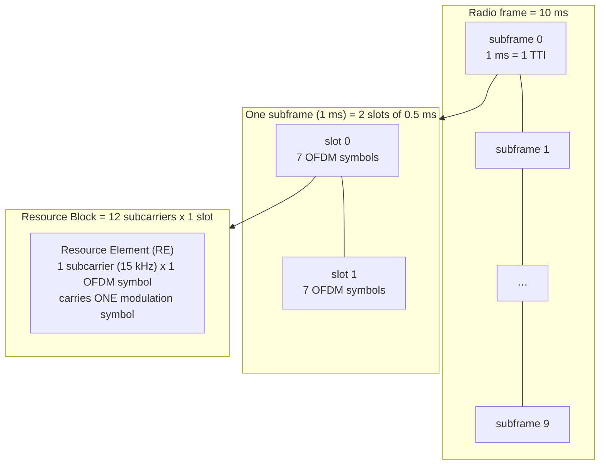
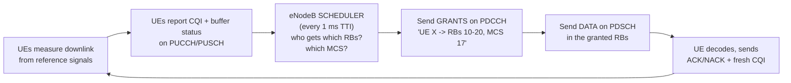

# Module 10 — The LTE Air Interface

> **The one idea to keep:** LTE turns the radio into a **shared, scheduled grid of time
> and frequency**. Instead of one big carrier, it spreads data across *thousands of tiny
> orthogonal subcarriers* (OFDM) so it can survive echoes, then a scheduler in the tower
> hands out little rectangles of that grid — **resource blocks** — to specific users
> every **1 millisecond**. Where Wi-Fi and Ethernet let devices *fight* for the medium,
> LTE **assigns** it. That single design choice — central scheduling over a frequency-time
> grid — is what makes cellular fast, fair, and predictable in a brutally hostile channel.

Module 02 got a bitstream across *one* link by modulating a carrier, and warned that radio
is the hardest medium there is: path loss, interference, multipath, mobility. Module 07
covered how radio waves behave; Module 09 laid out the LTE network (UE ↔ **eNodeB** ↔ core).
This module zooms all the way into the **Uu interface** — the radio link between your phone
and the tower — and answers: *how do bits actually cross that gap?* This is the PHY (physical
layer) of LTE, built directly on Module 02's modulation and Shannon.

Prerequisites and neighbors: [Module 02](02-how-data-moves.md) (modulation, QAM, symbols,
Shannon), [Module 07](07-rf-wireless.md) (RF basics), [Module 09](09-cellular-architecture.md)
(the LTE architecture). Its sibling [Module 11](11-lte-protocol-stack.md) picks up *above*
the PHY — the MAC/RLC/PDCP layers that ride on top of everything here.

---

## 1. Why one carrier isn't enough: the multipath problem

Module 02 modulated a single carrier: vary its amplitude and phase (QAM) to pack several
bits into each **symbol**, send symbols back-to-back. On a clean wire that's fine. On radio
it falls apart, and the killer is **multipath**.

Your signal doesn't take one path to the tower — it bounces off buildings, cars, and walls,
arriving as many slightly-delayed copies. A symbol sent now overlaps with the echo of the
*previous* symbol still arriving. This smearing is **inter-symbol interference (ISI)**, and
it gets worse the *faster* you send symbols (the shorter each symbol, the more echoes from
neighbors pile in).

> **The trap of the obvious fix.** To go faster on one carrier you shorten each symbol — but
> shorter symbols are *more* vulnerable to multipath echo. So a single wide-band carrier hits
> a wall: speed up and ISI destroys you. LTE escapes the trap by going the *opposite* way —
> use a huge number of **very slow** carriers in parallel.

---

## 2. OFDM: many narrow orthogonal subcarriers

**OFDM (Orthogonal Frequency-Division Multiplexing)** is LTE's core trick. Instead of one
fast carrier across the whole channel, split the channel into **many narrow subcarriers**,
each spaced **15 kHz** apart, and send a slow, low-rate symbol stream on each one *in
parallel*. A 20 MHz LTE channel carries around **1200 subcarriers** at once.

Why this wins:

- **Each subcarrier is slow, so its symbols are long** → an echo arriving a microsecond late
  is a tiny fraction of a long symbol, so ISI is negligible. You get the *aggregate* speed of
  a wide channel without the ISI penalty of one fast carrier.
- **"Orthogonal" means they don't interfere despite overlapping.** The subcarriers are spaced
  so that at the exact frequency where one peaks, every other is at zero. The receiver can
  pull each subcarrier out cleanly even though their spectra overlap — no wasted guard bands
  between them. (This is done efficiently in silicon with an **FFT** — a Fast Fourier
  Transform — which is why OFDM only became practical once cheap DSP existed.)

### The cyclic prefix: a small tax that kills echoes

Long symbols help, but echoes still bleed a little into the start of the next symbol. OFDM
adds a **cyclic prefix (CP)**: copy the tail of each symbol and paste it in front as a short
guard interval (~4.7 µs in normal LTE). As long as every echo arrives *within* that guard
window, it lands in the disposable CP and never touches the real symbol. The receiver throws
the CP away and decodes a clean symbol.

> ⚡ **Latency note.** The cyclic prefix is pure overhead — ~7% of airtime spent on a guard
> interval that carries no data. It's the price of beating multipath. This is the recurring
> theme of the radio: you constantly *spend* capacity (CP, reference signals, error-correction
> coding, retransmissions) to buy *reliability* in a hostile channel. On fiber none of this
> exists.

---

## 3. OFDMA down, SC-FDMA up: why the two directions differ

OFDM describes how one link is built. LTE then uses it to serve *many* users:

- **Downlink (tower → phone): OFDMA** (Orthogonal Frequency-Division *Multiple Access*).
  The scheduler hands different **groups of subcarriers** (and time slots) to different users
  simultaneously. User A gets subcarriers 1–120, user B gets 121–240, all in the same
  millisecond. It's like assigning each user their own set of lanes on a very wide road.

- **Uplink (phone → tower): SC-FDMA** (Single-Carrier FDMA), a modified OFDM.

Why not just use OFDMA in both directions? **Battery.** Plain OFDM has a high
**PAPR (Peak-to-Average Power Ratio)**: summing thousands of subcarriers occasionally
produces huge instantaneous peaks. Handling those peaks demands a power amplifier that runs
inefficiently and drains the battery — fine for a tower plugged into the grid, painful for a
phone. **SC-FDMA** pre-processes the signal so its power is much smoother (lower PAPR), so the
phone's amplifier runs efficiently and cooler. Same grid, but the uplink trades a little
complexity for battery life.

| | Downlink | Uplink |
|---|---|---|
| Scheme | OFDMA | SC-FDMA |
| Who transmits | eNodeB | UE (phone) |
| Optimized for | throughput to many users | low PAPR → battery efficiency |
| Data channel | PDSCH | PUSCH |

---

## 4. The resource grid: the map of time and frequency

This is the single most important picture in LTE. The air interface is a **2-D grid**: one
axis is **frequency** (subcarriers), the other is **time** (OFDM symbols). Everything the
tower and phone do is "fill in rectangles of this grid."

The building blocks, from smallest up:

- **Resource Element (RE)** — one subcarrier × one OFDM symbol. The *atom* of the grid. Each
  RE carries one modulation symbol (e.g. one 64-QAM symbol = 6 bits).
- **OFDM symbol** — one column of the grid in time (~71 µs including CP). A normal slot holds
  **7 OFDM symbols**.
- **Subcarrier** — one row, 15 kHz wide.
- **Resource Block (RB / PRB)** — the unit the scheduler actually allocates:
  **12 subcarriers (= 180 kHz) × one 0.5 ms slot**. So one RB = 12 × 7 = **84 REs**. When
  allocated in the frequency domain it's often called a **PRB (Physical Resource Block)**.
- **Slot** — 0.5 ms, 7 OFDM symbols.
- **Subframe** — 1 ms = 2 slots. **This is the TTI (Transmission Time Interval)** — the
  scheduling heartbeat. The tower makes a fresh allocation decision *every 1 ms*.
- **Frame** — 10 ms = 10 subframes.



**Channel bandwidth sets how *wide* the grid is** — i.e. how many RBs exist per slot:

| Channel bandwidth | Resource blocks | Subcarriers (approx) |
|---|---|---|
| 1.4 MHz | 6 | 72 |
| 3 MHz | 15 | 180 |
| 5 MHz | 25 | 300 |
| 10 MHz | 50 | 600 |
| 15 MHz | 75 | 900 |
| 20 MHz | 100 | 1200 |

More bandwidth = more RBs = more rectangles the scheduler can hand out each millisecond =
more capacity. (This is Shannon from Module 02: capacity scales with bandwidth.) Carriers can
also be glued together — **carrier aggregation** — to exceed 20 MHz, e.g. 3 × 20 MHz = 60 MHz.

> **Mental model:** think of the resource grid as a spreadsheet that scrolls left-to-right in
> time forever. Every 1 ms the tower redraws which cells belong to which phone. Ethernet
> hands you the whole wire when it's your turn; LTE hands you a *sub-region of a shared grid*,
> and the region changes every millisecond.

---

## 5. Modulation, coding, and MCS: how many bits per RE

Each RE carries one modulation symbol, and Module 02's rule applies directly — richer
constellations pack more bits per symbol, but need a cleaner signal:

| Modulation | Bits per RE (symbol) | Needs |
|---|---|---|
| QPSK | 2 | weak signal OK (robust) |
| 16-QAM | 4 | moderate signal |
| 64-QAM | 6 | good signal |
| 256-QAM | 8 | excellent signal (LTE-Advanced Pro) |

But modulation is only half the story. LTE also adds **forward error correction (FEC)** —
extra redundant bits (via turbo coding in LTE) so the receiver can *fix* some errors without
a retransmission. The **code rate** is the fraction of transmitted bits that are actual data
(e.g. rate 1/3 = one data bit per three transmitted bits — very robust; rate 0.9 = almost all
data — fast but fragile).

Modulation *and* code rate are bundled into a single index: the **MCS (Modulation and Coding
Scheme)**, numbered 0–28 in LTE. Low MCS = QPSK + heavy coding (robust, slow). High MCS =
256-QAM + light coding (fast, fragile). The MCS is the single knob the scheduler turns to
match the link's current quality.

### Adaptive Modulation and Coding (AMC), driven by CQI

The phone constantly measures the downlink quality and reports a **CQI (Channel Quality
Indicator)** — a 0–15 number meaning "here's the richest MCS I could currently decode
reliably." The tower reads the CQI and picks the MCS accordingly. Signal drops → CQI falls →
tower drops to a lower MCS (fewer bits/RE, more coding) to keep the link alive. Signal
improves → CQI rises → tower climbs to a higher MCS for more speed.

This is exactly the **adaptive modulation** Module 02 promised you'd meet again — but now
it's a tight, per-user feedback loop running on a millisecond timescale. It's *why* your
throughput sags as you walk away from the tower: the radio is silently retreating from
256-QAM toward QPSK to survive the falling SNR (Shannon's ceiling in action).

> ⚡ **Latency note.** CQI is a *report about the recent past*. By the time the tower acts on
> it, the channel may have changed (you moved, someone walked between you and the tower). This
> **CQI feedback lag** means the chosen MCS is always a slightly stale bet — occasionally too
> optimistic, causing a decode failure and a retransmission (Section 9). Fast-changing
> channels (high speed, e.g. a train) suffer most.

---

## 6. MIMO: using multiple antennas

Module 02's Shannon limit says capacity = bandwidth × log₂(1 + SNR). **MIMO (Multiple-Input
Multiple-Output)** cheats it by adding a *third* dimension — space — via multiple antennas at
both ends. Three distinct uses:

- **Spatial multiplexing** — send *different* data streams simultaneously on the same
  subcarriers from different antennas. With 2×2 MIMO you can (in good conditions with enough
  multipath scattering) roughly *double* throughput; 4×4 quadruples it. Each independent
  stream is a **layer**. This is where LTE's headline peak rates come from.
- **Transmit diversity** — send the *same* data over multiple antennas with different coding,
  so if one path fades the other survives. Trades speed for **reliability** — used when the
  signal is weak.
- **Beamforming** — combine antennas to *steer* the signal's energy toward a specific user
  instead of radiating everywhere. More signal on target, less interference to others.

Ironically MIMO *needs* multipath — the very thing OFDM fought. Rich scattering makes the
antenna paths independent enough to separate the streams. In a wide-open field with one clean
path, spatial multiplexing collapses back toward a single stream.

---

## 7. The physical channels and signals

The grid isn't all user data. LTE overlays a set of **physical channels** (carrying
information) and **physical signals** (fixed patterns for sync and measurement) onto the same
time-frequency grid. The essential ones:

| Name | Direction | Carries |
|---|---|---|
| **PSS / SSS** (Primary/Secondary Sync Signals) | DL | fixed patterns the phone finds first to lock onto timing and identify the cell |
| **PBCH** (Physical Broadcast Channel) | DL | the **MIB** — minimal system info (bandwidth, frame number) every phone needs to start |
| **Reference signals** (pilots / CRS) | DL/UL | known symbols sprinkled in the grid so the receiver can estimate the channel and measure quality (they feed **RSRP/RSRQ** and CQI) |
| **PDCCH** (Physical Downlink Control Channel) | DL | **scheduling grants** — "user X, your data is in these RBs with this MCS." The control plane of the air interface. |
| **PDSCH** (Physical Downlink Shared Channel) | DL | the actual **downlink user data** |
| **PUCCH** (Physical Uplink Control Channel) | UL | uplink control: CQI reports, HARQ ACK/NACK, scheduling requests |
| **PUSCH** (Physical Uplink Shared Channel) | UL | the actual **uplink user data** |

The word **Shared** in PDSCH/PUSCH is the whole point: these channels are a *common pool* the
scheduler divides among users each TTI — not dedicated pipes. And **PDCCH is the key that
unlocks PDSCH**: a phone must first decode a grant on PDCCH telling it *where in the grid* its
data sits, before it can read PDSCH. No grant, no data.

> **Startup sequence (why PSS/SSS/PBCH come first).** A phone powering on knows nothing. It
> scans for **PSS/SSS** to find a cell and lock timing, reads **PBCH** for the basic
> parameters, then listens on **PDCCH** for grants. Only then can user data flow on PDSCH.
> Module 11 covers what happens *above* this; Module 12 covers finding and switching cells.

---

## 8. The eNodeB scheduler: the heart of "who transmits when"

Here is the defining difference between cellular and everything in Modules 03 and 08. On the
shared grid, *someone* must decide, every single millisecond, which phone gets which resource
blocks and at what MCS. In LTE that someone is the **scheduler in the eNodeB** (the tower).

Every 1 ms TTI it runs a loop:



The scheduler juggles competing goals every millisecond: **throughput** (favor users with
good channels — they carry more bits per RB), **fairness** (don't starve the user at the cell
edge), and **latency** (a voice packet can't wait). Real schedulers use policies like
*proportional fair* to balance these. It also picks the MCS per user from their CQI (Section 5)
and steers beams (Section 6).

Contrast the three media you now know:

| Medium | Who decides who talks | Mechanism | Result |
|---|---|---|---|
| **Ethernet** (Module 03) | nobody / the switch | CSMA/CD, then per-port full-duplex | collisions historically; now none |
| **Wi-Fi** (Module 08) | nobody — devices contend | **CSMA/CA**: listen, random backoff, hope | works, but collisions & backoff add random jitter under load |
| **LTE** | **the eNodeB, centrally** | **scheduling** every 1 ms | no contention, no collisions; predictable, tunable per-user |

> ⚡ **Latency note — this is the big one.** Wi-Fi's CSMA/CA is *contention*: under load,
> devices back off random amounts and delay is unpredictable (jitter, Module 02). LTE
> *eliminates the free-for-all* — the tower grants airtime, so there are no data collisions
> and latency is controllable. **But** it adds its own floors: the **1 ms TTI granularity**
> (you wait for the next slot boundary), and if the phone had nothing scheduled it must send a
> **scheduling request** on PUCCH and wait for a grant before it can even transmit — a
> round-trip *before* the data moves. So cellular trades Wi-Fi's random contention delay for a
> smaller, *bounded, structured* delay. Predictability, not zero.

This central-scheduling idea is the thread of Part IV: it's why cellular can guarantee quality
for voice, prioritize traffic, and pack a cell full of users without them stepping on each
other — things a contention-based medium simply cannot promise.

---

## 9. HARQ: retransmission that reuses failed attempts

Radio loses data constantly (Module 02). Waiting for TCP (Module 05) to notice and resend
would be far too slow — the round-trip is enormous by radio standards. So LTE retransmits
right down at the PHY/MAC layer with **HARQ (Hybrid Automatic Repeat reQuest)**.

The basic ARQ part: every transport block carries a CRC. The receiver checks it and sends
back **ACK** (good) or **NACK** (corrupt) on PUCCH. NACK → the sender retransmits.

The **"Hybrid" / soft-combining** part is the clever bit: a failed block is **not thrown
away**. The receiver *keeps* the garbled signal, and when the retransmission arrives, it
**combines** the two noisy copies before decoding. Two weak, corrupt copies added together
often decode perfectly where neither could alone — you accumulate signal energy across
attempts. (Retransmissions may even send *different* redundancy bits — *incremental
redundancy* — making each retry more informative.)

LTE runs several HARQ processes in parallel (typically 8) so it doesn't stall waiting for one
ACK — while process 1 waits for its ACK, processes 2–8 keep sending.

> ⚡ **Latency note.** A HARQ round-trip in LTE is about **8 ms** (send → decode → ACK/NACK →
> retransmit). Each retransmission adds roughly that. This is a real, named term in your
> Module 02 delay budget: it's *below* TCP, invisible to it, but it directly inflates the
> effective RTT the transport layer sees. A few HARQ retries on a bad link can quietly add
> tens of milliseconds. Module 13 will attribute end-to-end latency using exactly these terms.

---

## 10. A quick look ahead: 5G NR deltas

5G New Radio (NR) keeps this whole framework — OFDM grid, resource blocks, scheduling, AMC,
HARQ, MIMO — and relaxes the fixed constants:

- **Flexible numerology.** LTE fixed subcarrier spacing at 15 kHz. NR allows 15, 30, 60, 120
  kHz (and more). Wider spacing = shorter symbols = **shorter slots** = lower latency and
  support for very high frequencies. A 1 ms TTI is no longer sacred.
- **mmWave.** NR adds spectrum in the **millimeter-wave** bands (24 GHz+) with huge bandwidth
  (hundreds of MHz) for multi-gigabit speeds — at the cost of tiny range and poor wall
  penetration, so it needs dense small cells.
- **Massive MIMO.** Dozens to hundreds of antenna elements enable aggressive beamforming and
  many spatial layers — especially vital at mmWave to overcome path loss.

The mindset transfers wholesale: if you understand the LTE grid, scheduler, and HARQ loop,
5G NR is "the same machine with tunable knobs."

---

## Misconceptions to kill

- ❌ *"OFDM sends data on one big carrier."* The opposite — it splits the channel into ~1200
  narrow 15 kHz subcarriers precisely to *avoid* one fast carrier's multipath problem.
- ❌ *"The cyclic prefix carries data."* No — it's a disposable guard interval that absorbs
  echoes. Pure overhead you pay to beat ISI.
- ❌ *"MIMO makes the signal stronger."* Spatial multiplexing sends *different* streams for
  more speed; it's not "more power." (Diversity and beamforming *do* improve robustness.)
- ❌ *"Phones grab airtime like Wi-Fi does."* No — the eNodeB *grants* every transmission.
  There's no contention or collision on LTE data channels; a phone can't transmit user data
  without a scheduling grant.
- ❌ *"HARQ throws away failed packets and resends fresh."* No — it *keeps* the failed copy and
  soft-combines it with the retransmission. That's the "hybrid" part.
- ❌ *"More bandwidth always means more speed here."* Only if SNR supports a high MCS. A weak
  signal forces low MCS regardless of how many RBs you're given — Shannon still rules.

---

## Check your understanding

<div class="quiz">
<p class="q">Why does LTE split its channel into ~1200 narrow 15 kHz subcarriers instead of using one wide carrier?</p>
<ul class="options">
<li data-correct="true">Narrow subcarriers carry slow, long symbols, so multipath echoes are a tiny fraction of a symbol — this defeats inter-symbol interference.</li>
<li>Narrow carriers are legally required by spectrum regulators.</li>
<li>It lets the phone use a smaller, cheaper antenna.</li>
</ul>
<div class="explain">A single wide carrier means very short symbols, which multipath echoes smear
into each other (ISI). OFDM's many slow subcarriers make each symbol long, so a late echo
barely overlaps the next symbol — and the cyclic prefix mops up what's left. That's the whole
reason OFDM exists.</div>
</div>

<div class="quiz">
<p class="q">On the LTE downlink, how does a phone know which resource blocks contain *its* data?</p>
<ul class="options">
<li>It listens to the whole grid and filters by its MAC address.</li>
<li data-correct="true">It decodes a scheduling grant on the PDCCH that points to specific RBs and an MCS, then reads its data from the PDSCH.</li>
<li>Every phone gets a fixed, permanently assigned set of resource blocks.</li>
</ul>
<div class="explain">The eNodeB scheduler sends grants on the <strong>PDCCH</strong> ("UE X → RBs
10–20, MCS 17"). Only after decoding its grant does the phone know where in the shared PDSCH
its data sits. No grant, no data — the shared channel is re-divided every 1 ms TTI.</div>
</div>

<div class="quiz">
<p class="q">How is LTE's approach to "who transmits when" fundamentally different from Wi-Fi's CSMA/CA?</p>
<ul class="options">
<li>LTE devices listen before transmitting and back off randomly, just faster.</li>
<li data-correct="true">LTE has no contention — the eNodeB centrally schedules every transmission each 1 ms TTI, so there are no data collisions or random backoff.</li>
<li>LTE lets every device transmit whenever it wants and fixes collisions afterward.</li>
</ul>
<div class="explain">Wi-Fi (Module 08) uses contention: devices sense the medium and back off
random amounts, which adds unpredictable jitter under load. LTE eliminates the free-for-all —
the tower grants airtime centrally, so data never collides. The trade is a bounded, structured
delay (the 1 ms TTI, and a scheduling-request round-trip if you had nothing scheduled).</div>
</div>

---

## Exercises

1. **Read your radio's vitals.** On Android, dial `*#*#4636#*#*` (or install a *network
   monitor* / *cell info* app) and find **RSRP**, **RSRQ**, and **SINR/SNR**. On iPhone, dial
   `*3001#12345#*` for Field Test mode. Note the values indoors vs by a window. Watch RSRP
   (signal power) climb and RSRQ/SINR (quality) improve as you get a clearer path — this is
   the input to CQI.

2. **Correlate quality with modulation.** Using an engineering app that exposes it (e.g.
   Network Signal Guru on a rooted Android, or SigCap), watch the **MCS / modulation order**
   the tower assigns you. Move from a strong-signal spot to a weak one and watch it fall from
   256-/64-QAM toward QPSK. You're watching **AMC** respond to your **CQI** in real time.

3. **Identify your band and EARFCN.** From the field-test data, note your serving **band**
   (e.g. B2, B66, n78) and **EARFCN** (the channel number). Look the EARFCN up in any online
   EARFCN/band calculator to find the exact center frequency and channel bandwidth. Tie the
   bandwidth back to the RB count in Section 4's table.

4. **Estimate a resource block count.** From your channel bandwidth, use Section 4 to state how
   many RBs exist per slot and roughly how many REs that is per millisecond. Then reason:
   at your observed MCS, roughly how many bits/RE — a back-of-envelope peak throughput.

5. **🔧 Project — watch the scheduler breathe.** Run a large download and, with a monitoring
   app, watch your allocated RB count and MCS change moment to moment. Note how they *rise*
   when you have data to move and the channel is good, and drop when idle or when signal
   fades. You're observing the eNodeB scheduler's per-TTI decisions from the outside.

6. **🔧 Project (future hardware).** Note for later: an **SDR** (software-defined radio, e.g.
   RTL-SDR from Module 02, or a LimeSDR) plus open tooling can decode LTE's **PSS/SSS/PBCH**
   and even show the live resource grid. A hands-on way to *see* Sections 4 and 7.

---

## Key terms

- **OFDM** — Orthogonal Frequency-Division Multiplexing: split a channel into many narrow,
  non-interfering subcarriers carrying slow parallel symbol streams; defeats multipath.
- **OFDMA** — OFDM used as *multiple access* on the downlink: different users get different
  subcarriers/time.
- **SC-FDMA** — the low-PAPR uplink variant of OFDM, chosen to save phone battery.
- **Subcarrier** — one 15 kHz frequency slice of the OFDM grid.
- **Cyclic prefix (CP)** — a copied guard interval prepended to each symbol to absorb echoes.
- **Resource Element (RE)** — one subcarrier × one OFDM symbol; carries one modulation symbol.
- **OFDM symbol** — one time-column of the grid (~71 µs); 7 per slot.
- **Resource Block (RB) / PRB** — 12 subcarriers × one 0.5 ms slot (= 84 REs); the unit the
  scheduler allocates.
- **Slot** — 0.5 ms, 7 OFDM symbols. **Subframe** — 1 ms = 2 slots = one **TTI**. **Frame** —
  10 ms.
- **TTI (Transmission Time Interval)** — the 1 ms scheduling heartbeat.
- **MCS (Modulation and Coding Scheme)** — index (0–28) bundling modulation order + code rate.
- **Code rate** — fraction of transmitted bits that are actual data (rest is error-correction).
- **AMC** — Adaptive Modulation and Coding: pick the richest MCS the channel currently allows.
- **CQI (Channel Quality Indicator)** — the phone's 0–15 report of the best MCS it can decode.
- **RSRP / RSRQ / SINR** — measured signal power / quality / signal-to-interference-plus-noise.
- **MIMO** — multiple antennas for spatial multiplexing (speed), diversity (robustness), or
  beamforming (steering).
- **PDSCH / PUSCH** — physical downlink/uplink *shared* channels: user data.
- **PDCCH / PUCCH** — physical downlink/uplink *control* channels: grants, ACK/NACK, CQI.
- **PBCH** — broadcast channel (basic system info). **PSS/SSS** — sync signals a phone finds
  first. **Reference signals** — known pilot symbols for channel estimation.
- **HARQ** — Hybrid ARQ: PHY/MAC retransmission that *soft-combines* failed copies.
- **eNodeB** — the LTE base station (tower) that runs the scheduler.
- **EARFCN** — the number identifying an LTE carrier's frequency/channel.

---

## Cheat-sheet

```
THE LTE AIR INTERFACE (Uu / PHY) — bits across the radio

OFDM (why): one fast carrier dies to multipath (ISI). Fix = many SLOW subcarriers.
  ~1200 subcarriers @ 15 kHz, orthogonal (overlap but don't interfere), decoded via FFT.
  Cyclic Prefix (CP) = copied guard interval that absorbs echoes (~7% overhead).
  Downlink = OFDMA (users get different subcarriers). Uplink = SC-FDMA (low PAPR = battery).

THE RESOURCE GRID (2-D: frequency x time)
  RE   = 1 subcarrier x 1 OFDM symbol  = one modulation symbol
  RB   = 12 subcarriers x 0.5 ms slot  = 84 REs   <- scheduler's unit (aka PRB)
  slot = 0.5 ms, 7 OFDM symbols
  subframe = 1 ms = 2 slots = 1 TTI    <- scheduling heartbeat
  frame = 10 ms
  bandwidth -> RBs:  1.4MHz=6 · 3=15 · 5=25 · 10=50 · 15=75 · 20=100  (aggregate for more)

MODULATION & CODING
  bits/RE:  QPSK 2 · 16-QAM 4 · 64-QAM 6 · 256-QAM 8   (need cleaner signal going up)
  code rate = data / transmitted bits (rest = FEC)
  MCS (0-28) = modulation + code rate bundled
  AMC loop: phone reports CQI -> tower picks MCS. Weak signal -> lower MCS (Shannon).

MIMO = extra antennas:  spatial multiplexing (speed) | diversity (robust) | beamforming (steer)

PHYSICAL CHANNELS/SIGNALS
  DL: PSS/SSS (sync) · PBCH (broadcast) · PDCCH (GRANTS) · PDSCH (DATA) · reference signals
  UL: PUCCH (CQI/ACK/req) · PUSCH (DATA)
  Rule: decode grant on PDCCH FIRST -> then read your data on PDSCH.

THE SCHEDULER (the heart)  -- eNodeB decides every 1 ms TTI:
  who gets which RBs + which MCS. Goals: throughput vs fairness vs latency.
  vs Ethernet CSMA/CD, vs Wi-Fi CSMA/CA (contention) -> LTE = NO contention, central grants.

HARQ (retransmit at PHY/MAC)
  CRC -> ACK/NACK. Failed copy is KEPT and SOFT-COMBINED with retransmit (hybrid).
  ~8 ms per HARQ round-trip; 8 parallel processes so it never stalls.

LATENCY FLOORS ADDED HERE: CP overhead · 1 ms TTI granularity · scheduling-request RTT ·
  CQI feedback lag · ~8 ms per HARQ retry.  (All feed Module 13's end-to-end budget.)

5G NR DELTAS: flexible numerology (15/30/60/120 kHz) · mmWave (24 GHz+, huge BW, short range) ·
  massive MIMO. Same machine, tunable knobs.
```

---

**Next up → Module 11: The LTE Protocol Stack** — the PHY got bits across the radio; now
what sits *on top* of it? MAC (scheduling & HARQ control), RLC (retransmission & reordering),
PDCP (header compression, ciphering), and how a "bearer" carries your IP packets over the air.
The same four L2 jobs from Module 03 — framing, addressing, media access, error handling —
rebuilt for the hostile radio channel.
