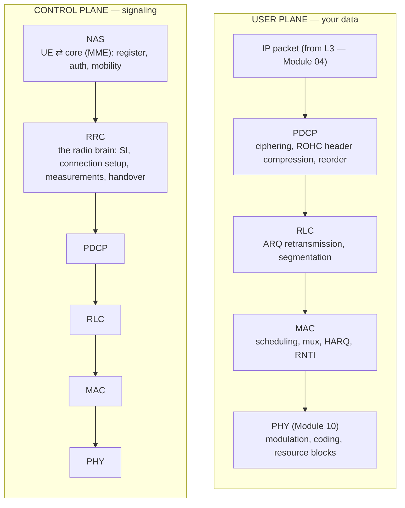
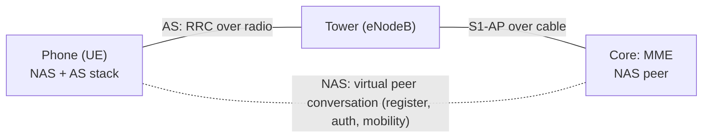
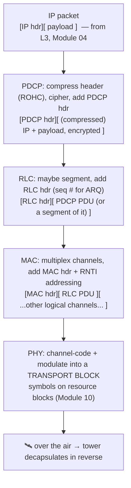

# Module 11 — The LTE Protocol Stack

> **The one idea to keep:** Cellular doesn't invent new networking — it *re-implements the
> bottom two layers* you already know, made brutal-radio-proof. Framing, addressing,
> retransmission, header handling: every generic idea from Modules 01–03 comes back here as
> a named layer (PDCP, RLC, MAC, PHY), each solving the same old problem against a hostile,
> shared, moving, lossy medium. If you learned the link layer, you already know 80% of this —
> the last 20% is "why radio forces a twist."

This is a **payoff module**. Back in [Module 01](01-the-layered-model.md) we said the LTE
stack is "a very elaborate expansion of the TCP/IP **Link** layer." In
[Module 03](03-link-layer.md) we listed the link layer's four jobs (framing, addressing,
media access, error detection) and promised cellular re-does *every one*. In
[Module 10](10-lte-air-interface.md) we built the radio itself (resource blocks, modulation,
HARQ). Now we assemble the machinery **on top of** that radio that turns "I can move symbols
through the air" into "I have a usable IP link." Sibling module
[Module 12](12-procedures.md) covers the *procedures* (paging, RRC states, handover) that
drive this stack. Everything below lives inside the **baseband modem** — the chip in your
phone. When Module 01 said "a cellular modem is far more than L1," *this* is the "more."

---

## 1. The map: where these layers sit

The device we call the phone's radio is really a private, self-contained protocol stack,
split — exactly like Ethernet's LLC/MAC split ([Module 03 §1](03-link-layer.md)) — into a
**user plane** (your actual data: IP packets) and a **control plane** (signaling that sets
up and steers the connection). Same wire, different jobs.



Two things to notice immediately, both callbacks:

- **It's the same encapsulation-down-the-stack pattern from
  [Module 01 §3](01-the-layered-model.md).** Each layer wraps the thing above it in its own
  header and hands it down. We'll trace an actual packet in §9.
- **NAS rides *transparently* over RRC.** The radio stack doesn't read NAS messages — it
  ferries them like sealed envelopes to the core network. This is the "virtual peer
  conversation" idea from Module 01: NAS-in-the-phone talks to NAS-in-the-core as if the
  radio between them didn't exist.

Mapping to the models you already have ([Module 01 §2](01-the-layered-model.md)):

| LTE layer | OSI-ish | TCP/IP-ish | The generic job it re-implements |
|---|---|---|---|
| NAS | L3 control | (control) | Session/mobility management (core-facing) |
| RRC | L3 control | (control) | Link setup/config signaling |
| PDCP | upper L2 | Link | Header compression + encryption + reorder |
| RLC | mid L2 | Link | **Retransmission** + segmentation (Module 03's "TCP recovers" — but *here*) |
| MAC | lower L2 | Link | **Framing/addressing/media access** (Module 03's four jobs) |
| PHY | L1 | Link/Phys | Bits ↔ radio signal (Module 10) |

Everything from PDCP down is "OSI Layer 2, radio edition." That's the whole thesis.

---

## 2. PHY — a one-screen recap (full detail in Module 10)

You built this in [Module 10](10-lte-air-interface.md); we only need its *service contract*
here — what PHY offers the layer above.

- **Resource blocks in time and frequency.** LTE divides the air into a grid: 1 ms
  subframes × 180 kHz sub-carrier chunks. The MAC layer's whole job (§3) is deciding who
  gets which cells of that grid.
- **Adaptive modulation & coding.** Good signal → 64-QAM, more bits/symbol; bad signal →
  QPSK, fewer but sturdier (the Shannon-limit tradeoff from
  [Signal Log Q04](SIGNAL-LOG.md#q04--how-does-the-physical-signal-travel--how-do-bits-form)).
- **HARQ (Hybrid ARQ).** PHY/MAC's *fast* retransmission with soft-combining: a failed
  transmission isn't thrown away; the retry is combined with the stored failed copy so even
  "two bad copies" can decode. Sub-millisecond turnaround. Keep HARQ (fast, L1/MAC) mentally
  separate from RLC ARQ (slower, L2) — we contrast them in §5.
- **Transport block.** Once per scheduling opportunity, PHY carries exactly one chunk from
  MAC — the **transport block** — sized to fit the grid and current modulation. That's the
  bottom of our encapsulation ladder in §9.

> ⚡ **Latency note.** LTE's scheduling quantum is the **1 ms subframe** (the TTI —
> Transmission Time Interval). Nothing the layers above do can beat that floor for a single
> transmission; every per-packet delay we discuss is measured in these 1 ms units. (5G NR
> shrinks the TTI with "numerologies" — sub-ms slots — precisely to cut this floor.)

---

## 3. MAC — the scheduler, and cellular's answer to Module 03

The MAC layer is where cellular's re-implementation of the classic link layer is most vivid.
Line up [Module 03's four jobs](03-link-layer.md#1-the-link-layers-four-jobs) against what
MAC does:

### 3.1 Media access — the tower schedules; there is no free-for-all

In Ethernet, who-talks-when was **CSMA/CD**: listen, maybe collide, back off randomly
([Module 03 §6](03-link-layer.md#6-the-shared-medium-problem-who-gets-to-talk)). On radio you
*can't even detect collisions* while transmitting, and spectrum is far too scarce to waste on
backoff. So LTE throws out the free-for-all entirely: **the eNodeB (tower) schedules every
single transmission**, uplink and downlink, subframe by subframe.

Every millisecond the scheduler decides, per user: transmit or not, on which resource
blocks, at which modulation. It weighs channel quality (users with good signal are cheaper to
serve), fairness, and QoS priority. This is the "cellular avoids the free-for-all by having
the tower schedule" promise from [Module 03 §6](03-link-layer.md#6-the-shared-medium-problem-who-gets-to-talk),
now cashed in.

> ⚡ **Latency note.** Scheduling has a cost: to *send* uplink data your phone must first ask
> for a grant (a **scheduling request**), wait for the tower to grant resources, *then* send.
> That request→grant→send round-trip adds several milliseconds before the first uplink byte
> moves — a delay Ethernet simply never has. (It's also why the random-access procedure in
> §3.4 matters so much for the very first packet.)

### 3.2 Addressing — the RNTI is the "MAC address," but temporary and tower-assigned

Ethernet names a neighbor with a 48-bit **MAC address**, globally unique and *burned into the
hardware* ([Module 03 §3](03-link-layer.md#3-mac-addresses-how-you-name-a-neighbor)). Radio
does the same job — "which device is this transmission for?" — with an **RNTI (Radio Network
Temporary Identifier)**. But every design choice is inverted:

| Ethernet MAC address | LTE RNTI |
|---|---|
| 48-bit, globally unique | 16-bit, unique only within one cell |
| Burned into hardware | **Assigned by the tower**, on the fly |
| Permanent | **Temporary** — released when you leave/idle |
| Flat, self-describing | Just a scheduling handle the cell hands you |

Why temporary and local? Because identity that's *assigned* can be reassigned as you move
between towers, and a 16-bit local handle is cheaper to put in every scheduling message than a
48-bit global one. There are several RNTIs for different purposes — e.g. **C-RNTI** (your
dedicated identity once connected), **RA-RNTI** (during random access), **P-RNTI** (paging),
**SI-RNTI** (system-info broadcast). This is exactly the
[Module 03 §10 table](03-link-layer.md#10-where-this-maps-onto-the-cellular-modem) entry
"MAC address → RNTI: identity is assigned & temporary, not burned-in," in full.

### 3.3 Multiplexing logical → transport channels (and framing)

MAC sits between many **logical channels** (defined by *what kind of traffic*: broadcast
control, paging, dedicated control, dedicated user data) and the few **transport channels**
the PHY actually offers (defined by *how* it's carried over the air). MAC's job is to
**multiplex** several logical channels' data into one transport block going down, and
**demultiplex** on the way up — writing a small MAC header of sub-headers so the receiver can
pull the pieces back apart. That header-plus-payload assembly *is* radio framing, cellular's
version of [Module 03 §2](03-link-layer.md#2-framing-finding-the-edges-in-a-river-of-bits).

- **Logical channels** = "the meaning" (BCCH broadcast, PCCH paging, DCCH/DTCH dedicated
  control/traffic).
- **Transport channels** = "the delivery mechanism over the air" (BCH, PCH, DL-SCH/UL-SCH
  shared channels).
- MAC maps the first onto the second, subframe by subframe.

### 3.4 The random-access procedure — how a phone first gets a voice

Before you have a C-RNTI you can't be scheduled, and you can't ask to be scheduled without a
way to speak. **Random access (RACH)** breaks that chicken-and-egg. Simplified 4-step
("contention-based") flow:

```mermaid
sequenceDiagram
    participant UE as Phone (UE)
    participant eNB as Tower (eNodeB)
    UE->>eNB: 1. Preamble (random pick from a shared pool)
    eNB->>UE: 2. Random Access Response (timing advance + a temporary RNTI + grant)
    UE->>eNB: 3. RRC Connection Request (using the grant; includes an identity)
    eNB->>UE: 4. Contention Resolution (you win the identity → becomes your C-RNTI)
```

Step 1 is the *only* moment LTE tolerates something collision-like: two phones may pick the
same preamble. Step 4 resolves the contention (only one wins the identity), so it's
"collision *avoidance*, then resolution" — a cousin of Ethernet's collide-then-backoff, but
tamed. This is the on-ramp to a connection; Module 12 picks up what happens after.

### 3.5 HARQ and logical-channel prioritization

- **HARQ** lives here too (§2): MAC drives the fast per-transport-block retransmissions.
- **Logical-channel prioritization (LCP):** when a grant arrives, MAC fills it from the
  logical channels in priority order (signaling and voice before bulk download), so a big
  file transfer can't starve a control message or a call. This is QoS enforced at L2.

---

## 4. RLC — L2 retransmission, and *why radio needs it*

Here is the module's sharpest callback. In
[Module 03 §5](03-link-layer.md#5-error-detection-the-crc--fcs) we drew a hard line:

> Ethernet's CRC only **detects** errors — it drops the bad frame and does **not** ask for a
> resend. Recovering the lost data is left to a higher layer (**TCP**).

We literally told you to *file away* that cellular is different. **RLC is where it's
different.** RLC (Radio Link Control) performs its own **ARQ (Automatic Repeat reQuest)** —
retransmission **at Layer 2**, inside the modem, without waiting for TCP.

### Why not just let TCP handle it, like Ethernet does?

Because radio loses *far* more than copper, and TCP's recovery loop is *far* too slow for it:

1. **Loss rate.** Ethernet's bit-error rate is astronomically low; a dropped frame is rare.
   Radio — with fading, interference, and a moving phone (Module 10) — drops chunks
   constantly. Leaving that to TCP would mean constant end-to-end recovery.
2. **The recovery loop length.** TCP notices loss only after a missing ACK across the *entire*
   internet path — tens to hundreds of milliseconds (Module 01's latency budget). RLC notices
   and resends across *one radio hop* in a few milliseconds. Fixing loss locally, close to
   where it happens, is enormously faster.
3. **TCP misreads radio loss as congestion.** TCP assumes loss = the network is overloaded,
   so it *slows down*. But radio loss isn't congestion — it's just a bad instant of fading.
   If TCP saw every radio drop, it would needlessly throttle your throughput. By hiding radio
   loss behind local L2 retransmission, RLC (with HARQ below it) lets TCP see a *clean* link
   and keep its speed up.

So cellular deliberately breaks the Ethernet rule: **L2 retransmits, so L4 rarely has to.**

<figure class="anim-fig">
<svg viewBox="0 0 760 300" role="img" aria-label="Animation: RLC acknowledged mode sends numbered blocks over the air; block 2 is lost, the receiver sends a status NACK for block 2, and the sender re-sends block 2 at Layer 2 — unlike Ethernet, which drops the frame and leaves recovery to TCP.">
<style>
.m11b-box{fill:#eef5ff;stroke:#2c7be5;stroke-width:2}
.m11b-t{font-size:12px;font-weight:700;fill:#1f4a7a}
.m11b-cap{font-size:11px;fill:#64748b}
.m11b-air{stroke:#cbd5e1;stroke-width:2;stroke-dasharray:6 5}
.m11b-num{font-size:12px;font-weight:700;fill:#fff}
.m11b-lost{font-size:12px;font-weight:700;fill:#ef4444}
.m11b-nl{font-size:11px;font-weight:700;fill:#fff}
.m11b-ok{font-size:15px;font-weight:700;fill:#16a34a}
.m11b-tok1{animation:m11btok1 9s linear infinite}
.m11b-tok2{animation:m11btok2 9s linear infinite}
.m11b-tok3{animation:m11btok3 9s linear infinite}
.m11b-x{animation:m11bx 9s linear infinite}
.m11b-nack{animation:m11bnack 9s linear infinite}
.m11b-re{animation:m11bre 9s linear infinite}
.m11b-okc{animation:m11bok 9s linear infinite}
@keyframes m11btok1{0%{opacity:0;transform:translateX(0)}2%{opacity:1;transform:translateX(0)}14%{opacity:1;transform:translateX(460px)}17%{opacity:1;transform:translateX(460px)}19%{opacity:0;transform:translateX(460px)}100%{opacity:0;transform:translateX(460px)}}
@keyframes m11btok2{0%,7%{opacity:0;transform:translateX(0)}9%{opacity:1;transform:translateX(0)}19%{opacity:1;transform:translateX(210px)}23%{opacity:0;transform:translateX(235px)}100%{opacity:0;transform:translateX(235px)}}
@keyframes m11btok3{0%,19%{opacity:0;transform:translateX(0)}22%{opacity:1;transform:translateX(0)}34%{opacity:1;transform:translateX(460px)}37%{opacity:1;transform:translateX(460px)}39%{opacity:0;transform:translateX(460px)}100%{opacity:0;transform:translateX(460px)}}
@keyframes m11bx{0%,20%{opacity:0}23%{opacity:1}33%{opacity:1}37%,100%{opacity:0}}
@keyframes m11bnack{0%,40%{opacity:0;transform:translateX(0)}43%{opacity:1;transform:translateX(0)}55%{opacity:1;transform:translateX(-460px)}58%{opacity:1;transform:translateX(-460px)}60%{opacity:0;transform:translateX(-460px)}100%{opacity:0;transform:translateX(-460px)}}
@keyframes m11bre{0%,60%{opacity:0;transform:translateX(0)}63%{opacity:1;transform:translateX(0)}76%{opacity:1;transform:translateX(460px)}82%{opacity:1;transform:translateX(460px)}86%{opacity:0;transform:translateX(460px)}100%{opacity:0;transform:translateX(460px)}}
@keyframes m11bok{0%,80%{opacity:0}83%{opacity:1}92%{opacity:1}96%,100%{opacity:0}}
</style>
<text x="12" y="20" style="font-size:13px;font-weight:700;fill:#2c7be5">RLC ARQ — a lost block is re-sent at Layer 2 (not left for TCP)</text>
<rect class="m11b-box" x="20" y="70" width="110" height="120" rx="8"/>
<text class="m11b-t" x="75" y="122" text-anchor="middle">Sender</text>
<text class="m11b-t" x="75" y="140" text-anchor="middle">RLC (AM)</text>
<rect class="m11b-box" x="630" y="70" width="110" height="120" rx="8"/>
<text class="m11b-t" x="685" y="122" text-anchor="middle">Receiver</text>
<text class="m11b-t" x="685" y="140" text-anchor="middle">RLC (AM)</text>
<line class="m11b-air" x1="130" y1="118" x2="630" y2="118"/>
<line class="m11b-air" x1="130" y1="175" x2="630" y2="175"/>
<text class="m11b-cap" x="380" y="92" text-anchor="middle">downlink  →</text>
<text class="m11b-cap" x="380" y="200" text-anchor="middle">←  uplink status report</text>
<text class="m11b-lost m11b-x" x="360" y="100" text-anchor="middle">✗ block 2 lost (fading)</text>
<g class="m11b-tok1"><rect x="136" y="105" width="34" height="26" rx="5" fill="#2c7be5"/><text class="m11b-num" x="153" y="123" text-anchor="middle">1</text></g>
<g class="m11b-tok2"><rect x="136" y="105" width="34" height="26" rx="5" fill="#2c7be5"/><text class="m11b-num" x="153" y="123" text-anchor="middle">2</text></g>
<g class="m11b-tok3"><rect x="136" y="105" width="34" height="26" rx="5" fill="#2c7be5"/><text class="m11b-num" x="153" y="123" text-anchor="middle">3</text></g>
<g class="m11b-re"><rect x="136" y="105" width="34" height="26" rx="5" fill="#16a34a"/><text class="m11b-num" x="153" y="123" text-anchor="middle">2</text></g>
<g class="m11b-nack"><rect x="506" y="162" width="120" height="26" rx="5" fill="#ef4444"/><text class="m11b-nl" x="566" y="180" text-anchor="middle">STATUS: NACK 2</text></g>
<text class="m11b-ok m11b-okc" x="612" y="127" text-anchor="middle">✓</text>
<text class="m11b-cap" x="380" y="245" text-anchor="middle">Ethernet would detect the bad frame, drop it, and leave recovery to TCP (end-to-end, tens of ms).</text>
<text class="m11b-cap" x="380" y="262" text-anchor="middle">RLC re-sends the missing block locally over one radio hop, in a few ms.</text>
</svg>
<figcaption>Blocks stream over the air; <b>block 2 is lost</b>. The receiver's RLC sends a <b>status report (NACK 2)</b> back, and the sender <b>re-sends block 2 at Layer 2</b> (green) — repairing loss locally instead of waiting for TCP, the way Ethernet's detect-and-drop would force.</figcaption>
</figure>

> ⚡ **Latency note — the layered retransmit hierarchy.** There are now *three* nested repair
> loops: **HARQ** (PHY/MAC, sub-ms, per transport block) catches most errors; **RLC ARQ**
> (L2, few ms, per radio hop) catches what HARQ misses; **TCP** (L4, tens–hundreds of ms,
> end to end) is the last resort. Each is roughly 10× slower and 10× wider than the one below.
> The design goal: resolve every loss at the *lowest, fastest* loop possible so the slow ones
> almost never fire.

### RLC's other job: segmentation & reassembly

The scheduler hands out transport blocks of *whatever size fits the grid this millisecond* —
which changes constantly with signal quality. RLC **segments** a PDCP packet to fit a small
grant, or (in older releases) concatenates to fill a big one, and **reassembles** on the far
side. This is the radio analog of IP fragmentation / the MTU story from
[Module 03 §4](03-link-layer.md#4-the-ethernet-frame-field-by-field), but *dynamic*, redone
every subframe.

### The three RLC modes — pick your reliability

RLC runs in one of three modes per radio bearer, a clean reliability-vs-latency dial:

| Mode | Retransmit? | In-order? | Use it for | Feels like |
|---|---|---|---|---|
| **TM** (Transparent) | No | — | Broadcast/paging control — no per-user state | A bare pipe |
| **UM** (Unacknowledged) | No | Yes (reorders) | VoLTE voice, streaming — late data is useless | UDP-ish |
| **AM** (Acknowledged) | **Yes (ARQ)** | Yes | Web, files, TCP traffic — must be complete | TCP-ish |

The insight: reliability is a *choice per bearer*. Your voice call runs **UM** (a
retransmitted 20-ms-old voice frame is worthless — drop it, keep latency low), while the web
page in the background runs **AM** (every byte must arrive; a few ms of retransmit delay is
fine). Same stack, two dials, set by RRC (§7). Compare this to Module 01's fixed "TCP =
reliable, UDP = not" — here L2 itself is configurable.

---

## 5. HARQ vs RLC ARQ — don't confuse the two retransmitters

Because two layers retransmit, engineers constantly mix them up. The clean split: **HARQ**
(L1/MAC) is the *fast reflex* — sub-millisecond, ACK/NACK every transport block, and it
*soft-combines* failed copies (keeps the garbage and adds to it, so two bad copies can
decode); it catches the common case. **RLC ARQ** (L2, AM mode) is the *deliberate backstop* —
a few milliseconds, plain resend of missing PDUs, firing only on the rare residual failures
HARQ misses (e.g. a lost NACK). Together they make the radio hop look *reliable* to PDCP.

---

## 6. PDCP — header compression, encryption, and ordering

PDCP (Packet Data Convergence Protocol) is the top of the user-plane L2. It's where several
threads from earlier modules finally pay off.

### 6.1 ROHC header compression — the direct payoff of Signal Log Q05

Back in [Signal Log Q05](SIGNAL-LOG.md#q05--headers-add-size--why-add-them) you asked *why we
keep adding headers when they bloat the packet.* The answer ended with a promise:

> When overhead genuinely hurts — e.g. **VoIP**, where ~32 bytes of audio ride under ~40 bytes
> of IP/UDP/RTP headers (>50% waste) — networks fight back with **header compression**.
> Cellular's **PDCP** layer uses **ROHC** to squash those 40 bytes down to ~1–3 bytes over the
> air. (We'll cover this in Module 11.)

**This is Module 11.** ROHC (**Robust Header Compression**) works because those 40 bytes of
IP/UDP/RTP header are *almost identical on every packet* of a flow — same source/dest IP, same
ports, and fields like sequence numbers that just tick up by a predictable amount. So PDCP
establishes the full header once as **context** on both ends, then over the air sends only a
tiny **context ID + the few bytes that actually changed** — squashing ~40 bytes to ~1–3.

```
 A VoIP packet, over the air:

 Without ROHC:  [ IP 20B ][ UDP 8B ][ RTP 12B ][ ~32B voice ]   → ~59% is header
 With ROHC:     [ 1–3B ][ ~32B voice ]                          → ~5–8% is header
```

<figure class="anim-fig">
<svg viewBox="0 0 760 300" role="img" aria-label="Animation: PDCP ROHC compresses a ~40-byte IP/UDP/RTP header down to a 1 to 3 byte context id before it goes over the air, then the receiver expands it back to the full header using stored context.">
<style>
.m11c-t{font-size:12px;font-weight:700;fill:#1f2d3d}
.m11c-hdr{font-size:11px;font-weight:700;fill:#fff}
.m11c-data{font-size:11px;font-weight:600;fill:#1f2d3d}
.m11c-lbl{font-size:11px;font-weight:700;fill:#7c3aed}
.m11c-cap{font-size:11px;fill:#64748b}
.m11c-air{stroke:#cbd5e1;stroke-width:2;stroke-dasharray:6 5}
.m11c-ctx{fill:none;stroke:#64748b;stroke-width:1.5;stroke-dasharray:4 3}
.m11c-sf{animation:m11csf 10s ease-in-out infinite}
.m11c-rf{animation:m11crf 10s ease-in-out infinite}
.m11c-tok{animation:m11ctok 10s linear infinite}
.m11c-ca{animation:m11cca 10s ease-in-out infinite}
.m11c-da{animation:m11cda 10s ease-in-out infinite}
@keyframes m11csf{0%{opacity:0}3%{opacity:1}30%{opacity:1}36%,100%{opacity:0}}
@keyframes m11crf{0%,70%{opacity:0}75%{opacity:1}95%{opacity:1}99%,100%{opacity:0}}
@keyframes m11ctok{0%,26%{opacity:0;transform:translateX(0)}31%{opacity:1;transform:translateX(0)}64%{opacity:1;transform:translateX(360px)}68%{opacity:1;transform:translateX(360px)}72%,100%{opacity:0;transform:translateX(360px)}}
@keyframes m11cca{0%,22%{opacity:0}26%{opacity:1}32%{opacity:1}36%,100%{opacity:0}}
@keyframes m11cda{0%,64%{opacity:0}68%{opacity:1}74%{opacity:1}78%,100%{opacity:0}}
</style>
<text x="12" y="20" style="font-size:13px;font-weight:700;fill:#2c7be5">PDCP ROHC — a ~40B IP/UDP/RTP header shrinks to ~1–3B over the air, then expands back</text>
<line class="m11c-air" x1="200" y1="166" x2="560" y2="166"/>
<text class="m11c-cap" x="380" y="140" text-anchor="middle">over the air  →</text>
<g class="m11c-sf">
<text class="m11c-t" x="40" y="64">Sender (PDCP)</text>
<rect x="40" y="70" width="40" height="34" rx="4" fill="#16a34a"/><text class="m11c-hdr" x="60" y="91" text-anchor="middle">IP</text>
<rect x="80" y="70" width="38" height="34" rx="4" fill="#2c7be5"/><text class="m11c-hdr" x="99" y="91" text-anchor="middle">UDP</text>
<rect x="118" y="70" width="38" height="34" rx="4" fill="#7c3aed"/><text class="m11c-hdr" x="137" y="91" text-anchor="middle">RTP</text>
<rect x="156" y="70" width="90" height="34" rx="4" fill="#cbd5e1"/><text class="m11c-data" x="201" y="91" text-anchor="middle">voice 32B</text>
<text class="m11c-cap" x="143" y="120" text-anchor="middle">IP+UDP+RTP ≈ 40B  •  ~59% overhead</text>
</g>
<text class="m11c-lbl m11c-ca" x="120" y="150" text-anchor="middle">ROHC compress ▼</text>
<g class="m11c-tok">
<rect x="70" y="152" width="30" height="30" rx="4" fill="#f59e0b"/><text class="m11c-hdr" x="85" y="172" text-anchor="middle">CID</text>
<rect x="100" y="152" width="90" height="30" rx="4" fill="#cbd5e1"/><text class="m11c-data" x="145" y="172" text-anchor="middle">voice 32B</text>
<text class="m11c-cap" x="115" y="147" text-anchor="middle">~1–3B</text>
</g>
<text class="m11c-lbl m11c-da" x="600" y="150" text-anchor="middle">ROHC expand ▲</text>
<g class="m11c-rf">
<text class="m11c-t" x="470" y="64">Receiver (PDCP)</text>
<rect x="470" y="70" width="40" height="34" rx="4" fill="#16a34a"/><text class="m11c-hdr" x="490" y="91" text-anchor="middle">IP</text>
<rect x="510" y="70" width="38" height="34" rx="4" fill="#2c7be5"/><text class="m11c-hdr" x="529" y="91" text-anchor="middle">UDP</text>
<rect x="548" y="70" width="38" height="34" rx="4" fill="#7c3aed"/><text class="m11c-hdr" x="567" y="91" text-anchor="middle">RTP</text>
<rect x="586" y="70" width="90" height="34" rx="4" fill="#cbd5e1"/><text class="m11c-data" x="631" y="91" text-anchor="middle">voice 32B</text>
<text class="m11c-cap" x="573" y="120" text-anchor="middle">full header rebuilt from context</text>
</g>
<rect class="m11c-ctx" x="30" y="210" width="220" height="30" rx="5"/>
<text class="m11c-cap" x="140" y="230" text-anchor="middle">context: full header stored once</text>
<rect class="m11c-ctx" x="510" y="210" width="220" height="30" rx="5"/>
<text class="m11c-cap" x="620" y="230" text-anchor="middle">context: full header stored once</text>
<text class="m11c-cap" x="380" y="265" text-anchor="middle">Only a tiny context id + the few changed bytes cross the air; the rest is already known at both ends.</text>
</svg>
<figcaption>The bulky <b>IP/UDP/RTP header (~40B)</b> is squashed by <b>ROHC</b> to a <b>1–3B context id</b> before it crosses the air, then <b>rebuilt to the full header</b> at the receiver from the context both ends agreed on once. For 50 voice packets/second that is a large, permanent saving on scarce spectrum.</figcaption>
</figure>

For a call sending 50 packets/second, that's a massive, permanent saving on the scarcest
resource in the whole system: radio spectrum. It's the Module 01 observation — "header
overhead ratio is terrible for tiny payloads" — turned into a concrete engineering win.
"Robust" is in the name because it's designed to keep working even when packets are lost or
reordered over the flaky radio link (older schemes broke on loss).

> ⚡ **Latency note.** ROHC is pure win for the *air* (fewer bits = faster to send, less
> spectrum), and its compute cost is negligible. The genuinely expensive PDCP operation is
> the next one — ciphering.

### 6.2 Ciphering (encryption) and integrity protection

PDCP encrypts (**ciphers**) user data and signaling over the air, and adds **integrity
protection** (a tamper-check) to control-plane messages. This is the radio-hop equivalent of
TLS's confidentiality-vs-integrity split from the
[TLS deep-dive](deep-dive-tls-certificates.md), but at L2 and for a different reason: anyone
with an antenna can hear the air, so the *access link itself* must be encrypted even before
your app's TLS kicks in. (Note the two are independent layers of protection: PDCP ciphering
protects the radio hop; your app's TLS protects end-to-end. Belt and suspenders.)

> ⚡ **Latency note.** Ciphering every packet costs CPU cycles in the modem — small per packet,
> but it's a fixed per-packet tax on the whole data path, and one reason the baseband chip has
> dedicated crypto hardware. It's a real line item in the per-layer processing budget we're
> assembling for Module 13.

### 6.3 Reordering, in-order delivery, and duplication

- **Reordering / in-order delivery.** Because RLC segmentation, HARQ retries, and (during
  handover) two paths can deliver PDCP packets out of order, PDCP uses sequence numbers to
  **reorder** before handing up to IP — so L3 sees a clean, ordered stream.
- **Duplication (reliability by redundancy).** For ultra-reliable traffic, PDCP can *duplicate*
  a packet and send both copies over independent paths (e.g. two carriers); whichever arrives
  first wins, the duplicate is discarded. It's trading spectrum for reliability — a knob that
  becomes central in 5G URLLC.

### A note on SDAP (5G only)

In 5G NR, one more layer sits *above* PDCP: **SDAP (Service Data Adaptation Protocol)**, which
maps IP flows to QoS flows to radio bearers. LTE doesn't have it (QoS mapping is handled
differently), but it's worth knowing the top of the 5G user-plane stack is
SDAP → PDCP → RLC → MAC → PHY. Everything else in this module carries straight over to 5G.

---

## 7. RRC — the control brain

Everything so far is machinery. **RRC (Radio Resource Control)** is the *brain* that
configures and drives it. RRC is control-plane signaling between the phone and the tower, and
it owns the radio connection end to end. Its jobs:

- **Broadcasts System Information (SI).** The tower continuously broadcasts "here's how to use
  this cell" (identities, frequencies, access rules) on the BCCH — the info a phone reads
  before it can do anything. (This is what SI-RNTI addresses, §3.2.)
- **Sets up / reconfigures / releases the connection.** RRC establishes the radio connection
  (right after random access, §3.4) and creates the **radio bearers** — the per-flow pipes
  that pin down *all* the lower-layer settings: which RLC mode (§4), which QoS priority for
  LCP (§3.5), the PDCP/ciphering config. When the network says "run this bearer in RLC-UM for
  voice," that's an RRC reconfiguration message.
- **Configures measurements.** RRC tells the phone what neighboring cells to measure and when
  to report — the raw material for handover decisions.
- **Drives handover.** When you move, RRC orchestrates the switch to a new cell (deep-dived in
  Module 12).
- **Controls RRC states** — chiefly **RRC_IDLE** (connected to the core but no active radio,
  battery-saving) vs **RRC_CONNECTED** (active radio, can move data). The transitions between
  these — and paging you when you're idle — are the whole subject of the next module.

> ⚡ **Latency note.** If your phone is in **RRC_IDLE** (no active radio to save battery), the
> *first* packet must first wake the radio: random access (§3.4) + RRC connection setup, which
> adds **~50–100 ms** before any data flows. This is the exact "wake the radio from idle" cost
> Module 01 mentioned in its latency walkthrough — now you can name the layer (RRC) and the
> procedure. Module 12 is entirely about managing this.

Think of RRC as the *configuration and lifecycle manager* for the radio bearers. PDCP/RLC/MAC
are the workers; RRC hires them, tells them how to behave, and lays them off.

---

## 8. NAS — the phone-to-core conversation

**NAS (Non-Access Stratum)** is control signaling between the phone (UE) and the **core
network** — specifically the **MME (Mobility Management Entity)** in LTE — that the radio
network is *not* supposed to read. ("Access Stratum" = the radio part: RRC and below. "Non-
Access Stratum" = everything above it, core-facing.) NAS handles:

- **Registration / attach** — joining the network.
- **Authentication & security** — proving the SIM is genuine and deriving the keys that PDCP
  ciphering later uses.
- **Mobility management** — tracking *which area* the phone is in while idle (so it can be
  paged — Module 12).
- **Session management** — establishing the data session (the "EPS bearer" / PDN connection)
  that ultimately gives you an IP address.

The key structural idea: **NAS rides transparently over RRC.** The phone's NAS layer and the
core's NAS layer hold a conversation; RRC just carries their messages across the radio as
opaque payload — a textbook "virtual peer conversation"
([Module 01 §3](01-the-layered-model.md#3-the-core-mechanic-encapsulation-this-is-the-thing-to-understand)),
where two peers talk as if the layers between them didn't exist. The tower is the middleman
that forwards sealed envelopes it doesn't open.



---

## 9. Encapsulation down the stack — a packet's journey (the Module 01 payoff)

Time to make it concrete, exactly as [Module 01 §3](01-the-layered-model.md#3-the-core-mechanic-encapsulation-this-is-the-thing-to-understand)
did for Ethernet — but for radio. One of your IP packets (say, a chunk of a video stream)
arrives at the top of the stack and gets wrapped, layer by layer, until it's a transport
block of symbols in the air.



<figure class="anim-fig">
<svg viewBox="0 0 760 388" role="img" aria-label="Animation: an IP packet gains a PDCP header, then an RLC header, then a MAC header, and finally becomes a PHY transport block of symbols.">
<style>
.m11a-lbl{font-size:12.5px;font-weight:600}
.m11a-sub{font-size:10.5px;fill:#64748b}
.m11a-hdr{font-size:12.5px;font-weight:700;fill:#fff}
.m11a-data{font-size:12px;font-weight:600;fill:#1f2d3d}
.m11a-bits{font-size:14px;font-weight:700;fill:#2c7be5;letter-spacing:2px}
.m11a-r1{animation:m11ar1 10s linear infinite}
.m11a-r2{animation:m11ar2 10s linear infinite}
.m11a-r3{animation:m11ar3 10s linear infinite}
.m11a-r4{animation:m11ar4 10s linear infinite}
.m11a-r5{animation:m11ar5 10s linear infinite}
.m11a-arrow{animation:m11aarrow 10s ease-in-out infinite}
.m11a-shim{animation:m11ashim 1.6s ease-in-out infinite}
@keyframes m11ar1{0%,4%{opacity:0;transform:translateY(-14px)}9%,90%{opacity:1;transform:translateY(0)}96%,100%{opacity:0;transform:translateY(-14px)}}
@keyframes m11ar2{0%,16%{opacity:0;transform:translateY(-14px)}21%,90%{opacity:1;transform:translateY(0)}96%,100%{opacity:0;transform:translateY(-14px)}}
@keyframes m11ar3{0%,28%{opacity:0;transform:translateY(-14px)}33%,90%{opacity:1;transform:translateY(0)}96%,100%{opacity:0;transform:translateY(-14px)}}
@keyframes m11ar4{0%,40%{opacity:0;transform:translateY(-14px)}45%,90%{opacity:1;transform:translateY(0)}96%,100%{opacity:0;transform:translateY(-14px)}}
@keyframes m11ar5{0%,52%{opacity:0;transform:translateY(-14px)}57%,90%{opacity:1;transform:translateY(0)}96%,100%{opacity:0;transform:translateY(-14px)}}
@keyframes m11aarrow{0%,4%{opacity:0;transform:translateY(0)}9%{opacity:1;transform:translateY(0)}52%{opacity:1;transform:translateY(248px)}90%{opacity:1;transform:translateY(248px)}96%,100%{opacity:0;transform:translateY(248px)}}
@keyframes m11ashim{0%,100%{opacity:.55}50%{opacity:1}}
</style>
<text x="12" y="20" style="font-size:13px;font-weight:700;fill:#2c7be5">Encapsulation down the LTE stack — an IP packet becomes a transport block, going DOWN ↓</text>
<polygon class="m11a-arrow" points="118,64 130,64 124,76" fill="#ef4444"/>
<g class="m11a-r1">
<text class="m11a-lbl" x="12" y="74" fill="#16a34a">IP</text><text class="m11a-sub" x="12" y="88">IP packet</text>
<rect x="300" y="52" width="80" height="40" rx="5" fill="#16a34a"/><text class="m11a-hdr" x="340" y="77" text-anchor="middle">IP hdr</text>
<rect x="380" y="52" width="160" height="40" rx="5" fill="#cbd5e1"/><text class="m11a-data" x="460" y="77" text-anchor="middle">payload</text>
</g>
<g class="m11a-r2">
<text class="m11a-lbl" x="12" y="136" fill="#2c7be5">PDCP</text><text class="m11a-sub" x="12" y="150">PDCP PDU</text>
<rect x="250" y="114" width="50" height="40" rx="5" fill="#2c7be5"/><text class="m11a-hdr" x="275" y="139" text-anchor="middle">PDCP</text>
<rect x="300" y="114" width="80" height="40" rx="5" fill="#16a34a"/><text class="m11a-hdr" x="340" y="139" text-anchor="middle">IP hdr</text>
<rect x="380" y="114" width="160" height="40" rx="5" fill="#cbd5e1"/><text class="m11a-data" x="460" y="139" text-anchor="middle">payload</text>
</g>
<g class="m11a-r3">
<text class="m11a-lbl" x="12" y="198" fill="#f59e0b">RLC</text><text class="m11a-sub" x="12" y="212">RLC PDU</text>
<rect x="205" y="176" width="45" height="40" rx="5" fill="#f59e0b"/><text class="m11a-hdr" x="227" y="201" text-anchor="middle">RLC</text>
<rect x="250" y="176" width="50" height="40" rx="5" fill="#2c7be5"/><text class="m11a-hdr" x="275" y="201" text-anchor="middle">PDCP</text>
<rect x="300" y="176" width="80" height="40" rx="5" fill="#16a34a"/><text class="m11a-hdr" x="340" y="201" text-anchor="middle">IP hdr</text>
<rect x="380" y="176" width="160" height="40" rx="5" fill="#cbd5e1"/><text class="m11a-data" x="460" y="201" text-anchor="middle">payload</text>
</g>
<g class="m11a-r4">
<text class="m11a-lbl" x="12" y="260" fill="#7c3aed">MAC</text><text class="m11a-sub" x="12" y="274">MAC PDU</text>
<rect x="150" y="238" width="55" height="40" rx="5" fill="#7c3aed"/><text class="m11a-hdr" x="177" y="263" text-anchor="middle">MAC</text>
<rect x="205" y="238" width="45" height="40" rx="5" fill="#f59e0b"/><text class="m11a-hdr" x="227" y="263" text-anchor="middle">RLC</text>
<rect x="250" y="238" width="50" height="40" rx="5" fill="#2c7be5"/><text class="m11a-hdr" x="275" y="263" text-anchor="middle">PDCP</text>
<rect x="300" y="238" width="80" height="40" rx="5" fill="#16a34a"/><text class="m11a-hdr" x="340" y="263" text-anchor="middle">IP hdr</text>
<rect x="380" y="238" width="160" height="40" rx="5" fill="#cbd5e1"/><text class="m11a-data" x="460" y="263" text-anchor="middle">payload</text>
</g>
<g class="m11a-r5">
<text class="m11a-lbl" x="12" y="322" fill="#64748b">PHY</text><text class="m11a-sub" x="12" y="336">transport block</text>
<text class="m11a-bits m11a-shim" x="150" y="327">10110100 11010011 00101110 10011010 …</text>
<text class="m11a-sub" x="150" y="352">→ one transport block of symbols, over the air (Module 10)</text>
</g>
</svg>
<figcaption>Watch it build: an <b>IP packet</b> gains a <b>PDCP</b> header (ROHC + ciphering), then an <b>RLC</b> header (a sequence number for ARQ), then a <b>MAC</b> header (RNTI addressing + muxing) — and <b>PHY</b> codes it into one <b>transport block</b> of symbols. The tower strips these back off in reverse (decapsulation).</figcaption>
</figure>

Trace the transformations and notice each is a *named layer doing exactly one generic job*:

| Step | Layer | What it prepends / does | Generic idea (callback) |
|---|---|---|---|
| 1 | (arrives) | An IP packet, ~40B of headers on small payloads | Module 01 encapsulation input |
| 2 | **PDCP** | ROHC squashes the header to ~1–3B, encrypts, adds PDCP seq # | Q05 header compression + TLS-like ciphering |
| 3 | **RLC** | Segments to fit the grant, adds a seq # for ARQ | Module 03 framing + *its own* retransmission |
| 4 | **MAC** | Muxes logical channels, adds MAC header, addresses via RNTI | Module 03 framing + addressing (MAC→RNTI) |
| 5 | **PHY** | Codes + modulates into one transport block | Module 10 / Module 02 bits→signal |

On the tower, the exact reverse happens — **decapsulation** — each layer reading and stripping
*its own* header and handing the inside up, precisely the mirror-image process from
[Module 01 §3](01-the-layered-model.md#3-the-core-mechanic-encapsulation-this-is-the-thing-to-understand).
The payoff sentence: **the LTE stack is Module 01's encapsulation diagram with radio-specific
layer names.** If you understood nesting envelopes there, you understand it here.

> ⚡ **Latency note — per-layer processing.** Every one of those five wraps (and five unwraps
> at the far end) costs a little processing time, and RLC/HARQ may add retransmit delays. The
> per-packet radio-stack latency is the *sum* of all of it — which is exactly the "latency is a
> sum across every layer" decomposition Module 01 promised and Module 13 will total up.

---

## 10. The recurring thread, in one table

The spine of this whole module: cellular re-implements the generic lower-layer ideas. Here it
is at a glance — every row is a callback.

| Generic idea (where you met it) | LTE re-implementation | The radio twist |
|---|---|---|
| Framing ([M03 §2](03-link-layer.md#2-framing-finding-the-edges-in-a-river-of-bits)) | MAC/RLC headers over 1 ms subframes | Time is *scheduled*, not free |
| Addressing / MAC address ([M03 §3](03-link-layer.md#3-mac-addresses-how-you-name-a-neighbor)) | **RNTI** | Temporary, tower-assigned, 16-bit, cell-local |
| Media access / CSMA ([M03 §6](03-link-layer.md#6-the-shared-medium-problem-who-gets-to-talk)) | Tower **scheduling** | No collisions; a request→grant round-trip instead |
| Error handling: detect + drop, TCP recovers ([M03 §5](03-link-layer.md#5-error-detection-the-crc--fcs)) | **RLC ARQ** + **HARQ** retransmit at L2 | Radio loses too much to wait for TCP |
| Header overhead ([Q05](SIGNAL-LOG.md#q05--headers-add-size--why-add-them)) | **PDCP ROHC** | ~40B IP/UDP/RTP → ~1–3B over the air |
| Encapsulation down the stack ([M01 §3](01-the-layered-model.md#3-the-core-mechanic-encapsulation-this-is-the-thing-to-understand)) | IP→PDCP→RLC→MAC→PHY transport block | Same nesting, radio names |
| Virtual peer conversation ([M01 §3](01-the-layered-model.md)) | **NAS** over RRC | Peers = phone & core; tower forwards sealed |

---

## Check your understanding

<div class="quiz">
<p class="q">Ethernet's CRC only detects corruption and drops the frame, leaving recovery to TCP. Why does the LTE stack instead retransmit at Layer 2 (RLC)?</p>
<ul class="options">
<li data-correct="true">Radio loses far more than copper, and waiting a full end-to-end round-trip for TCP would be too slow — plus TCP would misread radio loss as congestion and needlessly slow down.</li>
<li>Because LTE doesn't run TCP, so something else has to do retransmission.</li>
<li>Because RLC is faster than the PHY layer at sending bits.</li>
</ul>
<div class="explain">Radio is lossy and TCP's recovery loop spans the whole internet path (tens–hundreds of ms) and treats loss as congestion. RLC repairs loss locally over one radio hop in a few ms, hiding radio errors so TCP sees a clean link and keeps its speed. (LTE absolutely carries TCP — that's the point of protecting it.)</div>
</div>

<div class="quiz">
<p class="q">The RNTI is described as LTE's analog of the Ethernet MAC address. What's the key difference?</p>
<ul class="options">
<li>The RNTI is 48 bits and globally unique, like a MAC address.</li>
<li data-correct="true">The RNTI is temporary and assigned by the tower (and only unique within one cell), whereas a MAC address is permanent and burned into the hardware.</li>
<li>The RNTI identifies the destination IP, not the device.</li>
</ul>
<div class="explain">Both answer "which device is this transmission for?", but the RNTI is a short (16-bit), cell-local, tower-assigned, temporary handle — the opposite of the permanent, global, hardware-burned MAC address. Assigned identity is what lets it be reassigned as you move between towers.</div>
</div>

<div class="quiz">
<p class="q">A VoLTE voice call and a background file download run over the same LTE stack but use different RLC modes. Which pairing is right?</p>
<ul class="options">
<li data-correct="true">Voice uses UM (no retransmission — a late voice frame is useless, keep latency low); the download uses AM (ARQ retransmission — every byte must arrive).</li>
<li>Voice uses AM (must be perfectly reliable); the download uses UM (speed matters more than completeness).</li>
<li>Both must use TM, because they share one radio.</li>
</ul>
<div class="explain">Reliability is a per-bearer choice. Voice picks UM: a retransmitted 20-ms-old voice frame is worthless, so don't wait — minimize latency. Bulk data picks AM: completeness matters and a few ms of retransmit delay is fine. TM is for stateless broadcast/paging, not user data.</div>
</div>

---

## Exercises

1. **Map the stack to OSI.** On paper, draw the LTE user-plane stack (PDCP/RLC/MAC/PHY) and
   the control-plane (RRC/NAS) beside the OSI 7-layer and TCP/IP 4-layer models from
   [Module 01 §2](01-the-layered-model.md#2-two-models-osi-the-teaching-model-and-tcpip-the-real-one).
   Which OSI layer does each LTE layer correspond to? (Hint: nearly all of PDCP-down is "OSI
   L2, radio edition"; RRC/NAS are control-plane L3-ish.)

2. **Trace a packet's encapsulation.** Take a single 32-byte VoIP audio sample and write out
   its size and headers at each step down the stack (IP/UDP/RTP → after ROHC → +PDCP →
   +RLC → +MAC → transport block). Compare the over-the-air header overhead *with* ROHC vs
   *without*. This is [Module 01](01-the-layered-model.md)'s encapsulation exercise, redone
   for radio.

3. **Conceptual QoS mapping.** You have three simultaneous flows: a VoLTE call, a video
   stream, and a background app update. For each, choose an RLC mode (TM/UM/AM) and a relative
   LCP priority, and justify it in one sentence. Which layer *configures* these choices?
   (Answer: RRC, §7.)

4. **Name the three retransmitters.** Without looking, list the three nested loops that repair
   loss (fastest to slowest), the layer each lives in, and its rough timescale. Then explain
   why the design wants loss resolved at the *lowest* possible loop.

5. **🔧 Project — read the layers on a real modem.** On a rooted Android phone (or an SDR + a
   tool like `srsRAN`/`Amarisoft` in a lab), enable modem/RRC logging (many phones expose a
   diagnostic mode; Qualcomm chips log via QXDM/QCAT). Capture an attach + a data session and
   identify: the **random-access** exchange (§3.4), an **RRC connection setup**, and the
   **RLC/MAC** headers on data packets. *(This is the cellular counterpart to the Wireshark
   captures from [Module 03](03-link-layer.md#exercises) — different tool, same "see the
   layers with your own eyes" goal.)*

6. **Explain it back.** In your own words, answer: *Why does cellular schedule every
   transmission instead of using CSMA like Ethernet, and what does that cost the very first
   uplink packet?* If your answer mentions "can't detect collisions on radio + spectrum is too
   scarce" and "a scheduling-request round-trip before sending," you've got it.

---

## Key terms

- **PDCP (Packet Data Convergence Protocol):** top of the user-plane L2 — does ROHC header
  compression, ciphering + integrity protection, reordering/in-order delivery, and
  duplication.
- **RLC (Radio Link Control):** L2 layer that does ARQ retransmission, plus segmentation and
  reassembly of packets to fit radio grants. Runs in mode TM, UM, or AM.
- **MAC (Medium Access Control):** L2 layer that schedules and multiplexes logical channels
  onto transport channels, drives HARQ, runs random access, addresses via RNTI, and does
  logical-channel prioritization. (Same *name* as Ethernet's MAC sublayer, similar *job*.)
- **RRC (Radio Resource Control):** control-plane "brain" — broadcasts system information,
  sets up/reconfigures/releases the radio connection and radio bearers, configures
  measurements, drives handover, and controls RRC states.
- **NAS (Non-Access Stratum):** control signaling between the phone and the core (MME) —
  registration, authentication, mobility & session management — carried transparently over
  RRC.
- **ROHC (Robust Header Compression):** PDCP scheme that compresses ~40B IP/UDP/RTP headers to
  ~1–3B over the air by sending only what changed against an agreed context.
- **ARQ (Automatic Repeat reQuest):** retransmission based on ACK/NACK feedback. RLC's L2 form
  (in AM mode) is what makes cellular differ from Ethernet's detect-and-drop.
- **HARQ (Hybrid ARQ):** the fast (sub-ms) MAC/PHY retransmission that *soft-combines* failed
  copies to decode. Sits below RLC ARQ.
- **RNTI (Radio Network Temporary Identifier):** the tower-assigned, temporary, cell-local
  device handle — LTE's analog of a MAC address (C-RNTI, RA-RNTI, P-RNTI, SI-RNTI, …).
- **Logical channels:** streams defined by *what* traffic they carry (broadcast, paging,
  dedicated control/traffic).
- **Transport channels:** the *how* — the delivery mechanisms PHY offers; MAC maps logical
  onto transport channels.
- **RLC modes — TM/UM/AM:** Transparent (no header/retransmit, for broadcast), Unacknowledged
  (reorders, no retransmit — voice), Acknowledged (ARQ retransmit + in-order — data).
- **Transport block:** the chunk of data PHY carries in one scheduling opportunity; bottom of
  the encapsulation ladder.
- **SDAP:** 5G-only layer above PDCP that maps IP/QoS flows to radio bearers (not in LTE).

---

## Cheat-sheet

```
LTE PROTOCOL STACK — "OSI Layer 2, radio edition"

USER PLANE (top→bottom):   (5G: SDAP →) PDCP → RLC → MAC → PHY
CONTROL PLANE:             NAS (rides over) RRC → PDCP → RLC → MAC → PHY

WHO DOES WHAT
  PDCP  header compression (ROHC), ciphering + integrity, reorder, duplication
  RLC   ARQ retransmit (L2!), segmentation/reassembly, modes TM/UM/AM
  MAC   scheduling, mux logical→transport channels, HARQ, RNTI, random access, LCP
  PHY   modulation/coding, resource blocks, HARQ, transport block   (Module 10)
  RRC   SI broadcast, connection + bearer setup/reconfig/release, measurements,
        handover, RRC states (IDLE/CONNECTED)                        (→ Module 12)
  NAS   phone⇄core (MME): register, auth, mobility, sessions (over RRC, transparent)

CALLBACKS (the recurring thread)
  MAC address  → RNTI (temporary, tower-assigned, cell-local)         [M03 §3]
  CSMA/CD      → tower SCHEDULES everything (no collisions)           [M03 §6]
  CRC drop→TCP → RLC ARQ RETRANSMITS at L2 (radio too lossy for TCP)  [M03 §5]
  header cost  → PDCP ROHC: ~40B → ~1–3B                              [Q05]
  encapsulation→ IP→PDCP→RLC→MAC→PHY transport block                  [M01 §3]

THREE RETRANSMIT LOOPS (resolve loss at the lowest/fastest one)
  HARQ  L1/MAC  sub-ms   soft-combines   (common case)
  RLC   L2      few ms   plain resend    (HARQ leftovers)
  TCP   L4      10s–100s ms  end-to-end  (last resort)

RLC MODES        TM = bare pipe (broadcast) · UM = reorder, no retx (voice)
                 AM = ARQ + in-order (web/files/TCP)

LATENCY FLOORS   1 ms subframe (TTI) · idle→connected wake ~50–100 ms (RRC)
                 uplink needs scheduling-request→grant→send round-trip
```

---

**Next up → Module 12: Paging, RRC States & Handover** — now that the stack exists, how does
the network *find* your phone when it's asleep (paging), flip it between IDLE and CONNECTED to
save battery, and hand your live connection from one tower to the next at 120 km/h without
dropping a packet? That's where RRC earns its "brain" title.
