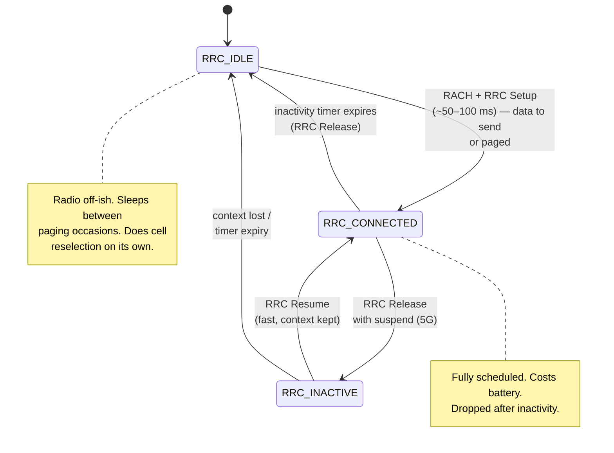
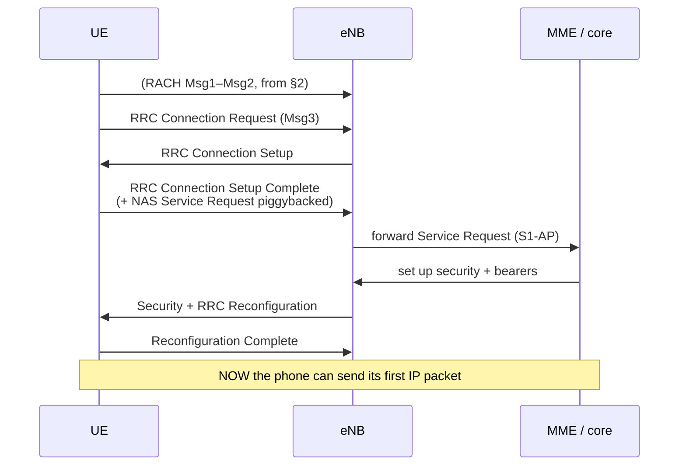
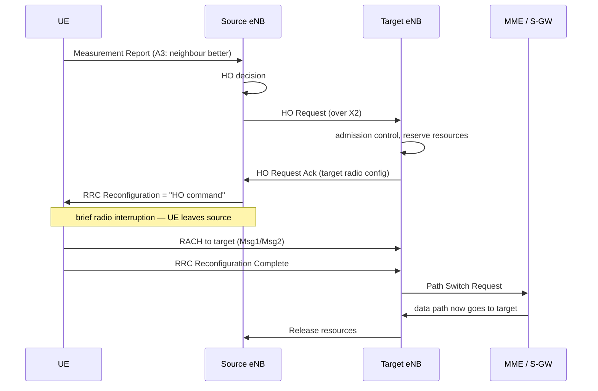

# Module 12 — Paging, RRC States & Handover

> **The one idea to keep:** A phone spends almost all of its life *asleep* — radio off,
> unreachable in the normal sense — because keeping the radio "connected" would flatten the
> battery in an hour. The entire art of cellular is a set of **procedures** that let the
> network **wake a sleeping phone** (paging), **promote it to a live connection** (RRC setup
> over Random Access), and **keep that connection alive as it moves** (handover) — each one
> trading **battery against reachability against latency**. When you feel the "first tap after
> the phone's been in your pocket is slow," you are feeling these procedures run.

In [Module 09](09-cellular-architecture.md) you met the *boxes* — the tower (eNB/gNB), the
core (MME/AMF), the tracking of who's where. In [Module 11](11-lte-protocol-stack.md) you met
the *layers* — and that **RRC** (Radio Resource Control) is the brain of the control plane and
that the **MME does paging**. This module brings those alive as **procedures over time**, and
finally cashes the cheque the course keeps writing: *"…if the radio was idle, add ~50–100 ms
(Module 12)."*

📚 This is the full treatment of the **mobile RRC twist** flagged in the
[google.com deep-dive](deep-dive-loading-google.md) (Phase 4). The siblings continue the
thread: [Module 13](13-latency.md) totals the whole latency budget, and
[Module 14](14-constrained-devices.md) pushes these knobs to the IoT extreme.

---

## 1. RRC states: the phone's battery-vs-latency dial

**RRC (Radio Resource Control)** is the control-plane protocol between the UE (the phone —
*User Equipment*) and the base station. Its single most important job is to hold the UE in one
of a small number of **states**. Think of RRC state as a dial with two ends:

- **Radio ON, connected, resources allocated** → instant to send/receive, but power-hungry.
- **Radio mostly OFF, no connection** → sips battery, but must be "woken up" first.

**LTE has two states; 5G NR adds a clever third.**

| | **RRC_IDLE** | **RRC_CONNECTED** | **RRC_INACTIVE** (5G) |
|---|---|---|---|
| Radio connection | none | active, dedicated resources | suspended (context kept) |
| Who knows the UE's exact cell | nobody | the serving base station | nobody (RAN area only) |
| Network tracks location by | **Tracking Area** (a group of cells) | exact cell | **RAN Notification Area** |
| RRC context (keys, config) | discarded | live in the base station | **kept, suspended** in the "anchor" gNB |
| Core-network connection | released | up | **kept up** |
| How the UE is reached | **paging** | direct scheduling | **RAN paging** |
| Data latency (first packet) | worst (~50–100 ms setup) | best (~ms) | in between (~10–20 ms resume) |
| Battery | best | worst | nearly as good as idle |

The point of **RRC_INACTIVE**, introduced with 5G NR, is to escape the cruel LTE choice. In
LTE, an idle phone that wants to send one packet must rebuild *everything* from scratch. In
5G, an INACTIVE phone kept its security context and core-network connection *suspended* — so
it can **resume** with far fewer messages. It's "asleep like idle, but wakes like connected."
(NB-IoT and LTE-M later back-ported a similar idea; more in [Module 14](14-constrained-devices.md).)



> ⚡ **Latency note.** Notice the arrow that costs the most: **RRC_IDLE → RRC_CONNECTED**.
> Every other transition is cheap. This one arrow is *the* mobile latency tax, and Sections
> 2–3 are entirely about it. The network deliberately drops you to IDLE after a few seconds
> of silence (the **inactivity timer**) to save your battery — which means the *very next*
> thing you do pays the tax again. Battery savings today, latency tomorrow.

🔧 **Project — watch the dial move.** On Android, install *NetMonster* or *Network Cell
Info Lite*; both surface the live RRC state / connection status. Open one, let the phone sit
untouched, and watch it fall to IDLE. Then load a page and watch it snap to CONNECTED. On
iOS, Field Test Mode (dial `*3001#12345#*`) exposes similar serving-cell info. You'll *see*
the promotion you're about to read about.

---

## 2. Random Access (RACH): how a silent phone grabs the mic

An IDLE phone has **no uplink resources** — it can't just transmit, because on a cellular
link the tower **schedules every transmission** (recall the Module 03 table: no CSMA/CD
free-for-all here). So before it can say anything, the UE must get the tower's attention and
be granted a slot. That's the job of the **Random Access Channel (RACH)** procedure.

The standard flavour is **contention-based, four steps** (Msg1–Msg4), because many phones
might try at the exact same instant:

```mermaid
sequenceDiagram
    participant UE as UE (phone)
    participant eNB as Base station (eNB/gNB)

    Note over UE,eNB: UE is IDLE — no uplink grant yet
    UE->>eNB: Msg1 — Random Access Preamble<br/>(a signature picked at random from a pool)
    eNB->>UE: Msg2 — Random Access Response (RAR)<br/>timing advance + uplink grant + temp C-RNTI
    UE->>eNB: Msg3 — RRC Connection Request<br/>(carries a UE identity, sent on the grant)
    eNB->>UE: Msg4 — Contention Resolution<br/>(echoes the identity — the winner)
    Note over UE,eNB: If two UEs picked the same preamble,<br/>only one is echoed; the loser backs off & retries
```

Why each step exists:

1. **Msg1 — Preamble.** The UE picks one of ~64 preamble "signatures" *at random* and sends
   it on the PRACH. Random, because it has no identity the tower knows yet. Two UEs can
   collide by picking the same one — hence "contention."
2. **Msg2 — Random Access Response (RAR).** The tower replies with a **timing advance** (how
   early to transmit so the signal lands aligned — physics of distance), a small **uplink
   grant**, and a temporary identity (**C-RNTI**).
3. **Msg3 — the real request.** Now the UE has a grant, it sends its actual message (for
   connection setup, the **RRC Connection Request** with a UE identity).
4. **Msg4 — Contention resolution.** The tower echoes back the identity it heard. The UE whose
   identity is echoed **wins**; any collided loser sees a mismatch, backs off a random time,
   and restarts. (Same random-backoff idea as Ethernet's CSMA/CD — Module 03 — applied to
   who gets the tower's attention.)

> ⚡ **Latency note.** Even with no collision, four messages = **two round-trips over the
> air** before the connection request is even acknowledged, each waiting for the next
> available RACH occasion. That's why 5G added a **2-step RACH** (MsgA = preamble+payload
> together, MsgB = response), collapsing two round-trips toward one to shave setup latency.

---

## 3. RRC connection setup — why the *first* packet after idle is slow

RACH just got you the mic. Now RRC actually builds the connection. From IDLE, the sequence is
roughly:



Count what had to happen before packet one: a RACH exchange, three or more RRC messages,
security activation (ciphering/integrity keys), and a round-trip into the **core network**
(the NAS *Service Request* — NAS is the UE↔core signalling from Module 09) to re-establish
the data bearer. In total this is **~50–100 ms of pure setup**, on top of everything else.

**This is the recurring thread of the whole course.** Remember the google.com latency budget
(deep-dive: DNS + TCP + TLS ≈ 3–4 round-trips before the first byte)? On a phone whose radio
was idle, **all of that is preceded by this promotion**. The timeline reads:

```
   [ RRC_IDLE → CONNECTED: ~50–100 ms ]  →  DNS  →  TCP  →  TLS  →  HTTP GET  →  first byte
   \___ the mobile tax, before a single "internet" packet ___/
```

So the honest answer to *"why does the first tap feel slow but the next feels instant?"* is:
the first tap **paid the RRC setup tax** (and warmed DNS/TCP/TLS caches); by the second tap
you're already CONNECTED and warm. This is also why background keep-alives, prefetching, and
"fast dormancy" tuning matter so much on mobile — they're all fights over *this one arrow*.

> ⚡ **Latency note.** ~50–100 ms sounds small next to a page load, but it's **added latency
> you cannot cache away with a CDN** — it's local to the radio. It's often the single largest
> avoidable delay on a mobile request from cold. [Module 13](13-latency.md) adds it to the
> full end-to-end tally.

---

## 4. Paging: how the network wakes a phone it can't directly address

Sections 2–3 covered the phone reaching *out*. **Paging** is the reverse and harder problem:
an incoming call or push notification arrives at the core for a phone that is **IDLE** — radio
mostly off, exact cell unknown. How do you reach something that isn't listening on a known
address?

**What a "page" actually is:** a short broadcast message meaning *"UE with identity X, the
network wants you — please connect."* It carries no data. Its only job is to make the phone
run the Section 2–3 procedure and come to CONNECTED, at which point real data flows.

The mechanics, bottom-up:

- The **MME** knows the UE only to the resolution of its **Tracking Area** (a group of cells,
  Module 09). It sends the page to **every base station in that tracking area** (or area list).
- Each base station **broadcasts** a paging message. But a phone can't listen continuously
  (battery!). So paging is addressed by a special shared identity, the **P-RNTI** (Paging
  Radio Network Temporary Identifier — a fixed value, `FFFE` in hex, that *all* idle UEs
  watch for).
- The UE wakes at its scheduled **paging occasion**, checks the **PDCCH** (the control
  channel) for something addressed to **P-RNTI**. If it finds one, it decodes the paging
  message on the shared data channel and looks for **its own identity** (its S-TMSI) in the
  list of paging records.
- **Match → the UE initiates RACH + RRC setup (Sections 2–3) to answer the page.** No match →
  it goes straight back to sleep.

**Tracking Areas and TAU.** Paging every cell in the country would be absurd, so the network
scopes it to the UE's tracking area. The UE is registered to a **Tracking Area list**; as long
as it roams within that list, it says nothing. When it moves *out* of the list (or a periodic
timer fires), it performs a **Tracking Area Update (TAU)** — a small signalling exchange that
tells the core "I'm over here now," so future pages are sent to the right place. TAU is the
quiet background chatter that keeps paging *targeted*.

> ⚡ **Latency note.** Paging adds latency to **mobile-terminated** traffic (incoming
> call/notification): the page must reach the UE at its *next* paging occasion, then the whole
> RACH+RRC promotion runs. A longer paging cycle saves battery but delays every incoming
> event — the exact trade-off Section 5 formalises.

---

## 5. DRX: sleeping on a schedule (and eDRX for things that barely wake)

A phone can't listen for paging continuously without frying the battery, and it can't ignore
paging or it becomes unreachable. The compromise is **DRX — Discontinuous Reception**: the UE
and network *agree on a schedule* of when the UE will be awake to listen. Between those
moments, the receiver powers down.

There are two DRX contexts:

- **Idle-mode DRX.** While IDLE, the UE only wakes at its **paging occasions**, once per
  **paging cycle** (broadcast by the network, e.g. 320 ms / 640 ms / 1.28 s / 2.56 s). The UE's
  specific occasion is derived from its identity so occasions spread across UEs. Paging and DRX
  are two halves of one mechanism: **the network schedules pages to land exactly on the UE's
  DRX wake-up.** Misalign them and you get a page miss (Section 6).
- **Connected-mode DRX (C-DRX).** Even when CONNECTED, a UE doesn't need the receiver on every
  millisecond. C-DRX lets it doze between bursts: an **onDuration** it's awake, an
  **inactivity timer** keeps it awake while data flows, then short/long **DRX cycles** of sleep.
  This is why a CONNECTED phone streaming audio still gets decent battery — it's micro-sleeping.

```mermaid
gantt
    title Idle-mode DRX: the UE wakes only at paging occasions
    dateFormat X
    axisFormat %L
    section UE radio
    Sleep (RX off)        :done, 0, 300
    Wake — Paging Occasion :active, 300, 320
    Sleep (RX off)        :done, 320, 620
    Wake — Paging Occasion :active, 620, 640
    Sleep (RX off)        :done, 640, 940
    section Network
    Page arrives at core   :milestone, 450, 0
    Page sent — lands on next PO :crit, 620, 640
```



**eDRX (extended DRX)** stretches the idle cycle far longer for devices that tolerate delay —
LTE-M up to ~**43.7 minutes**, NB-IoT up to ~**2.9 hours**. The device is *unreachable* for
almost the entire cycle, waking briefly to check for pages. This is a battery miracle for a
sensor that reports twice a day, and a latency disaster for anything interactive — which is
exactly the right trade for [Module 14](14-constrained-devices.md)'s constrained devices.
(**PSM — Power Saving Mode** goes further still, letting a device be effectively off for up to
days, reachable only after it next checks in.)

> ⚡ **Latency note — the whole DRX bargain in one line.** *Sleep longer → save battery →
> become less reachable → add latency to incoming traffic.* A 2.56 s idle paging cycle means an
> incoming call can wait up to 2.56 s just to hear the page, *before* RRC setup. eDRX turns
> that into minutes. There is no free lunch: reachability and battery are the same dial.

---

## 6. Page miss / paging failure: when the wake-up doesn't land

A **page miss** is when the network pages a UE and gets no answer. Because paging is an
unacknowledged broadcast onto a sleeping, moving, radio-limited device, misses are a normal
fact of life — the network is built to *retry*, not to assume success. The learner-favourite
question "what causes a page miss?" has several answers, and they're worth separating:

| Cause | What's actually happening |
|---|---|
| **Poor coverage** | The UE is there but can't decode the PDCCH/paging message (weak signal, deep indoors, edge of cell). The page was sent; the phone never heard it. |
| **Stale / wrong tracking area** | The UE moved but hasn't done a TAU, so the core pages the *old* area. The phone isn't listening there. |
| **DRX / timing misalignment** | The page didn't land on the UE's paging occasion, or the UE is in a long eDRX/PSM sleep and simply isn't awake yet. |
| **Network congestion** | The paging channel has finite capacity; under load, paging messages can be dropped or delayed (a real problem during mass events — a stadium after a goal). |
| **UE dozed / powered-saving** | Aggressive power modes, temporary out-of-service, or a UE mid-reselection between cells. |

**Consequences.** A missed page means mobile-terminated traffic is **delayed** (retry) or, if
all retries fail, **lost** — the classic symptom is a call that goes to voicemail without the
phone ever ringing, or a push notification that arrives minutes late.

**Paging retries — the network's answer.** The MME doesn't give up on the first miss. A typical
strategy escalates the **scope** while retrying under a timer:

1. Page the **last known cell / smaller area** first (cheapest, most likely).
2. No response before the paging timer → **retransmit to the whole tracking area**.
3. Still nothing → **page the entire tracking-area list** (widest, most expensive).
4. All retries exhausted → **paging failure**; the core reports the UE unreachable and the
   incoming call/session fails.

> ⚡ **Latency note.** Each retry costs a full paging-cycle wait plus a timer. A call that
> *does* connect after two retries can take several seconds to make the phone ring — that lag
> between "caller hears ringing" and "your phone rings" is often paging retries in action.

---

## 7. Handover: staying connected while you move

Everything so far assumed the UE stays put. **Handover (HO)** is how a **CONNECTED** UE keeps
its session alive as it moves from one cell's coverage into another's — the feature that makes
a phone call survive a drive down the motorway. (An *IDLE* UE does the cheaper **cell
reselection** on its own, with no network signalling — it just picks a better cell to camp on.
Handover is the CONNECTED, network-controlled version.)

**Step 1 — measurement reporting.** The UE constantly measures the signal (**RSRP** — reference
signal received power) of its serving cell and neighbours, and reports when a configured
**event** fires. The events (LTE naming, reused in 5G):

| Event | Fires when… | Typical use |
|---|---|---|
| **A1** | serving cell **>** threshold | "coverage is fine again" — stop measuring |
| **A2** | serving cell **<** threshold | "coverage is getting bad" — start looking |
| **A3** | a **neighbour > serving + offset** | **the classic handover trigger** |
| **A4** | a neighbour **>** threshold | hand toward a specific better cell |
| **A5** | serving **< thresh1** *and* neighbour **> thresh2** | leave a bad cell for a good one |

**A3** is the one to remember: "someone else is now meaningfully better than who I'm on." The
**offset** and a **time-to-trigger** timer prevent *ping-pong* — bouncing back and forth at a
boundary from momentary fluctuations.

**Step 2 — the handover itself.** The source base station decides, prepares the target, and
commands the UE to switch:



**Handover types:**

- **X2-based handover** — source and target base stations talk **directly** over the **X2**
  interface (5G: **Xn**). The core is only told at the end (Path Switch). Fast, the common case.
- **S1-based handover** — used when there's **no X2** between the two (e.g. different vendors or
  domains). Signalling goes **through the core (MME)**, which is slower.

**Make-before-break vs the interruption.** Classic LTE handover is a **hard handover**: the UE
*leaves* the source before it's fully attached to the target, creating a brief **interruption
time** (~30–50 ms typical) where no data flows. 5G introduced **DAPS (Dual Active Protocol
Stack)** and related schemes for true **make-before-break** — the UE keeps the source link
alive *while* attaching to the target, driving interruption toward **0 ms** (crucial for
low-latency and voice).

**When it goes wrong — RLF and re-establishment.** If the radio degrades faster than handover
can complete (you walk into a lift, a lorry blocks the signal), the UE declares **Radio Link
Failure (RLF)** — after a run of "out-of-sync" indications and a timer (T310) expiring. It then
attempts **RRC re-establishment**: quickly find a suitable cell, RACH into it, and try to
resume the context. If a suitable cell is found in time, the call survives with a hiccup; if
not, the UE **drops to IDLE** and the session is lost — a dropped call, and the next attempt
pays the full Section 3 setup tax again.

> ⚡ **Latency note.** Handover interruption is a **micro-outage** mid-session: for those tens
> of milliseconds, packets queue or drop. On a video call it's a freeze; on TCP it can look
> like loss and trigger backoff (Module 05). Every millisecond shaved (X2 over S1, DAPS over
> hard HO) directly reduces that glitch — and RLF + re-establishment is the *expensive* failure
> path, seconds long, that all of this is designed to avoid.

🔧 **Project — catch a handover in the wild.** With *NetMonster* or *CellMapper* running,
take a train or drive a familiar route and watch the **serving cell ID (PCI/eNB)** change as
you move. Log RSRP alongside it and you'll see the pattern: signal falls, a neighbour rises
above it (that's your A3), then the cell ID flips. You've just watched Section 7 happen live.

---

## 8. Putting it together: the mobile latency story

Zoom out. Every procedure in this module is one term in the **mobile latency budget**, and they
compose in a specific, painful order for the worst case — an incoming request to a phone that's
been idle in your pocket:

```
incoming data → core pages the tracking area
   → wait up to one paging cycle for the UE's occasion   (§4–5: DRX)
   → UE runs RACH (2 air round-trips)                    (§2)
   → RRC connection setup + NAS service request          (§3: ~50–100 ms)
   → NOW the "internet" latency begins: DNS/TCP/TLS/HTTP  (google.com deep-dive)
```

The lesson for an engineer: on mobile, **a large slice of "the request was slow" is spent
before your packet ever hits IP** — and it's dominated by *whatever RRC state the radio
happened to be in*. Warm (CONNECTED) requests skip almost all of it; cold (IDLE) ones pay in
full. That single variable — RRC state at the moment of the request — explains most of the
maddening variance in mobile latency. [Module 13](13-latency.md) assembles the full number.

---

## Misconceptions to kill

- ❌ *"An idle phone is basically online, just quiet."* No — IDLE means **no radio connection
  at all**; the network only knows your tracking area, not your cell. It must *page* you first.
- ❌ *"Paging delivers the data."* No — a page is just a **wake-up**; it carries no user data.
  Data flows only after the UE promotes to CONNECTED.
- ❌ *"DRX and paging are separate features."* They're two halves of one mechanism: pages are
  scheduled to land exactly on the UE's DRX wake-up.
- ❌ *"Handover is seamless / zero-cost."* Classic LTE handover has a real **interruption time**;
  only make-before-break (DAPS) approaches zero. And it can fail (RLF).
- ❌ *"5G's RRC_INACTIVE is just a rename of IDLE."* No — INACTIVE **keeps** the RRC and
  core-network context suspended, so resuming is far cheaper than IDLE→CONNECTED.

---

## Check your understanding

<div class="quiz">
<p class="q">Why is the first packet after a phone has been idle noticeably slower than subsequent packets?</p>
<ul class="options">
<li data-correct="true">The radio must transition RRC_IDLE → RRC_CONNECTED (RACH + RRC setup + core signalling), adding ~50–100 ms before any IP packet can be sent.</li>
<li>DNS is always uncached on mobile, so the first lookup is slow.</li>
<li>The cellular core throttles the first packet of every session for fairness.</li>
</ul>
<div class="explain">An idle phone has no radio connection. Before it can send anything it runs
the Random Access procedure and RRC connection setup, including a round-trip to the core for
the NAS Service Request — roughly 50–100 ms of pure setup that precedes the usual DNS/TCP/TLS
work. Once CONNECTED, later packets skip this, so they feel instant.</div>
</div>

<div class="quiz">
<p class="q">A user's phone doesn't ring for an incoming call, which goes to voicemail. Which of these is a classic paging-related cause?</p>
<ul class="options">
<li data-correct="true">The UE moved without performing a Tracking Area Update, so the core paged the wrong (old) tracking area and the phone never heard the page.</li>
<li>The phone's DNS cache expired.</li>
<li>The TCP congestion window was too small.</li>
</ul>
<div class="explain">Paging is scoped to the UE's tracking area. If the UE has roamed out of its
registered area but hasn't sent a TAU, the MME pages cells the phone isn't listening on — a page
miss. Other causes include poor coverage, DRX/eDRX misalignment, and congestion. DNS and TCP
operate far above this and are irrelevant to being reached at all.</div>
</div>

<div class="quiz">
<p class="q">In connected mode, which measurement event most directly triggers a normal handover?</p>
<ul class="options">
<li data-correct="true">A3 — a neighbour cell becomes better than the serving cell by a configured offset.</li>
<li>A1 — the serving cell rises above a threshold.</li>
<li>A5 — the serving cell is fine and no neighbour is needed.</li>
</ul>
<div class="explain">A3 fires when "neighbour &gt; serving + offset" — i.e. someone else is now
meaningfully better — which is the classic handover trigger. A1 means coverage is good again
(stop measuring); A5 is the "serving is bad AND a neighbour is good" combination. An offset and
time-to-trigger timer damp A3 to prevent ping-pong.</div>
</div>

---

## Exercises

1. **Watch the RRC state fall and rise.** Install *NetMonster* (Android) or open iOS Field Test
   Mode. Leave the phone idle for a minute, note the connection state, then load a page and watch
   it flip to connected. Estimate how long the promotion took.

2. **Measure the cold-vs-warm tax.** With a stopwatch (or a timing tool), load a small page (a)
   right after the phone's been idle a few minutes, and (b) again immediately after. The
   difference is dominated by the RRC setup + cache-warming you read about in Section 3. Write
   down both numbers.

3. **Map a handover on a journey.** Run *CellMapper* while on a train or drive. Log the serving
   cell ID and RSRP. Identify a point where the cell ID changed and reason about which event
   (A3?) likely fired just before it.

4. **Reason about eDRX.** A soil-moisture sensor uses a 40-minute eDRX cycle to last years on a
   battery. Explain, in two sentences, why you would *never* configure a smart doorbell the same
   way — tie it explicitly to the reachability-vs-battery dial from Section 5.

5. **Trace a page miss.** For each cause in the Section 6 table, write one concrete real-world
   scenario that would produce it (e.g. "underground car park" → poor coverage). Then state what
   the network does next (the retry escalation).

6. **Connect it to google.com.** Take the deep-dive latency budget (DNS + TCP + TLS ≈ 3–4 RTT)
   and prepend the mobile-from-idle terms from Section 8. Write the full ordered timeline and
   mark which parts a CDN can help with and which it cannot.

---

## Key terms

- **RRC_IDLE** — no radio connection; network knows the UE only by tracking area; UE must be
  paged and promoted before data flows. Best battery, worst first-packet latency.
- **RRC_CONNECTED** — active radio connection with dedicated resources; network knows the exact
  cell and can schedule immediately. Best latency, worst battery.
- **RRC_INACTIVE** — 5G state that keeps the RRC + core-network context suspended, so the UE can
  *resume* far faster than IDLE→CONNECTED while sleeping nearly as efficiently.
- **RACH (Random Access Channel)** — the contention-based procedure (preamble → RAR → request →
  contention resolution) by which a UE with no uplink grant gets the tower's attention.
- **Paging** — a network-initiated broadcast wake-up telling an IDLE UE to connect; carries no
  user data.
- **P-RNTI** — the shared Paging Radio Network Temporary Identifier all idle UEs monitor on the
  PDCCH to detect paging (fixed value `FFFE`).
- **DRX (Discontinuous Reception)** — the agreed schedule of when the UE's receiver is awake;
  idle-mode DRX aligns wake-ups with paging occasions, connected-mode DRX micro-sleeps between
  data bursts.
- **eDRX (extended DRX)** — DRX with very long cycles (minutes to hours) for IoT devices,
  trading reachability for battery.
- **TAU (Tracking Area Update)** — the signalling a UE sends when it leaves its registered
  tracking area (or periodically), keeping the core's location record current so paging is
  targeted.
- **Handover** — the network-controlled transfer of a CONNECTED UE from one cell to another as
  it moves; may be X2/Xn-based (fast, direct) or S1-based (via the core).
- **RLF (Radio Link Failure)** — the UE's declaration that the radio link is broken; triggers
  RRC re-establishment, and if that fails, a drop to IDLE (a dropped call).
- **Measurement events (A1–A5)** — the conditions on serving/neighbour signal strength that make
  the UE send a measurement report; **A3** (neighbour > serving + offset) is the classic
  handover trigger.

---

## Cheat-sheet

```
RRC STATES — the battery ↔ latency dial
  IDLE       no connection; known by TRACKING AREA; must be PAGED; ~50–100 ms to wake
  CONNECTED  live resources; known by exact cell; instant data; battery-hungry
  INACTIVE   (5G) context suspended; RESUME fast; sleeps like idle
  transitions: IDLE --RACH+RRC setup--> CONNECTED --inactivity timer--> IDLE
               CONNECTED --release+suspend--> INACTIVE --resume--> CONNECTED

RACH (contention-based, 4-step)
  Msg1 preamble (random)  → Msg2 RAR (timing advance + grant + C-RNTI)
  Msg3 RRC request (id)   → Msg4 contention resolution (echo id → winner)
  5G: 2-step RACH (MsgA/MsgB) to cut latency

FIRST-PACKET-AFTER-IDLE TAX (~50–100 ms)  = RACH + RRC setup + NAS Service Request
  then normal internet cost: DNS + TCP + TLS + HTTP  (google.com deep-dive)
  warm/CONNECTED request skips the tax → why 1st tap is slow, 2nd is instant

PAGING
  MME → all cells in TRACKING AREA → broadcast page addressed by P-RNTI (FFFE)
  UE wakes at its PAGING OCCASION, checks PDCCH for P-RNTI, matches S-TMSI → connects
  TAU keeps location current so paging is scoped (not the whole country)

DRX  = scheduled sleep.  longer cycle = more battery, less reachable, more latency
  idle-mode DRX aligns to paging occasions | connected-mode DRX micro-sleeps
  eDRX: minutes–hours (IoT) | PSM: up to days

PAGE MISS causes: poor coverage · stale tracking area (no TAU) · DRX/eDRX misalign
  · congestion · UE asleep      → RETRY: last cell → whole TA → TA list → FAIL

HANDOVER (CONNECTED; idle uses cheaper cell reselection)
  measure RSRP → event fires (A3 = neighbour > serving + offset) → report
  X2/Xn HO (direct, fast) vs S1 HO (via core, slow)
  hard HO interruption ~30–50 ms | DAPS = make-before-break ~0 ms
  RLF → RRC re-establishment → else drop to IDLE (dropped call)
```

---

**Next up → Module 13: Latency, End to End** — we've now collected every mobile-specific delay
(RRC setup, paging cycle, DRX sleep, handover interruption). Module 13 assembles them *with* the
DNS/TCP/TLS/propagation costs into one honest, attributable millisecond budget — so you can look
at any slow request and say exactly where the time went, and which parts you can actually fix.
