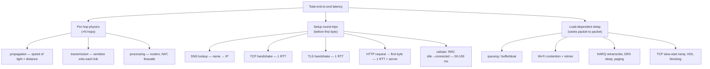
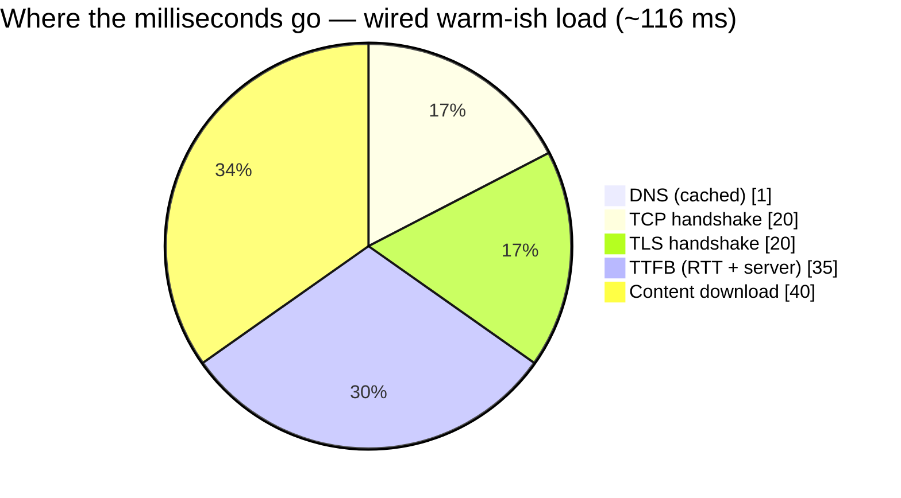
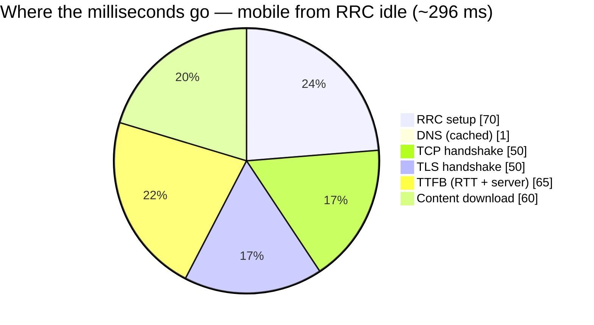

# Module 13 — Latency, End to End

> **The one idea to keep:** Latency is not one number — it's a **budget** of many named,
> separable delays, and almost every one of them is a *round-trip* charged by some layer of
> the stack. The whole course has been quietly handing you the line items. This module adds
> them up, attributes every millisecond to a layer, and tells you which ones you can
> actually fix (and which ones physics has already decided).

Back in [Module 02](02-how-data-moves.md) you learned the master key: the delay to cross
*one hop* is a sum of four things — **transmission, propagation, processing, queuing**. That
was the atom. This is the molecule. A real page load isn't one hop or one trip — it's a
**relay race** run several times over ([the google.com deep-dive](deep-dive-loading-google.md)
draws the route), where each layer you've studied adds its own round-trips on top of the raw
physics.

By the end you'll look at a slow request and say *"that's 70 ms of radio wake-up, 40 ms of
handshakes I could have reused, and 20 ms of pure speed-of-light I can never get back"* — and
know which lever to pull. We link back to the sources throughout: [Module 04](04-network-layer.md)
(routing/BGP/NAT), [Module 05](05-transport-layer.md) (TCP/handshakes/congestion),
[Module 08](08-wifi.md) (Wi-Fi contention), [Module 11](11-lte-protocol-stack.md) and
[Module 12](12-procedures.md) (the cellular stack), plus the [DNS](deep-dive-dns.md) and
[TLS](deep-dive-tls-certificates.md) deep dives.

---

## 1. The delay taxonomy, extended

Module 02 gave you the four **per-hop** delays. Let's restate them, because everything else
hangs off them:

| Per-hop delay | Formula | Bandwidth helps? | Who controls it |
|---|---|---|---|
| **Transmission** | bits ÷ link bandwidth | ✅ yes | your pipe width |
| **Propagation** | distance ÷ signal speed | ❌ never | physics + geography |
| **Processing** | router/switch think-time | mostly no | hardware, usually µs |
| **Queuing** | time waiting in a buffer | ❌ no (often *hurt* by it) | congestion — the wild card |

That's one hop. But a request crosses **10–20 hops**, and — this is the part the course has
been building toward — it also pays a **round-trip tax at every layer** before useful data
even flows:



The single most important idea in this module: **most of a fresh request's latency is not
data transfer — it's setup round-trips.** And a round-trip is dominated by **propagation
delay**, the one term bandwidth can't touch. That's why buying a fatter pipe rarely fixes
"the internet feels slow."

> ⚡ **Latency note.** Define **RTT (round-trip time)**: the time for a packet to go there
> *and* the acknowledgement to come back — one there-and-back. Almost every setup step below
> costs "1 RTT," so RTT is the currency of latency. Halve your RTT (move closer / use an
> edge) and you halve nearly every setup cost at once.

---

## 2. Where the round-trips come from (the setup tax)

Walk the layers in the order a cold request pays them. Each links to where you learned it.

1. **DNS lookup** ([DNS deep-dive](deep-dive-dns.md)) — turn `example.com` into an IP.
   Cold, walking root → TLD → authoritative, this can be **1–4 RTT**. Warm (cached, within
   the record's TTL), it's **~0**. This distinction matters enormously — see §9 and
   [Signal Log Q13](SIGNAL-LOG.md#q13--can-i-hardcode-an-aws-ip-instead-of-the-endpoint-name-to-save-dns-time).
2. **TCP handshake** ([Module 05](05-transport-layer.md)) — SYN / SYN-ACK / ACK is **1 RTT**
   before you can send a single byte of application data.
3. **TLS handshake** ([TLS deep-dive](deep-dive-tls-certificates.md)) — TLS 1.3 is **1 RTT**
   (it merged the old two-round-trip dance); TLS 1.2 was 2 RTT. This is also where the
   server's certificate is verified.
4. **HTTP request → first byte** ([google.com deep-dive](deep-dive-loading-google.md)) —
   send `GET /`, wait **1 RTT + server think-time** for the first byte back. That wait is
   **TTFB (time to first byte)**.
5. **TCP slow start** ([Module 05](05-transport-layer.md)) — even once connected, TCP
   doesn't blast at full speed. It ramps the **congestion window** exponentially, so a large
   response that needs, say, 6 windows costs several *extra* RTTs of ramp-up. On a
   high-RTT link this "slow start tax" can dwarf the raw transfer time.
6. **HTTP head-of-line (HOL) blocking** — with HTTP/1.1, one slow response stalls everything
   behind it on that connection. HTTP/2 multiplexes many streams over one TCP connection, but
   a single lost TCP segment still stalls *all* streams (TCP-level HOL). HTTP/3 over QUIC
   fixes this (§9).
7. **The network path itself** ([Module 04](04-network-layer.md)) — routers add processing,
   and **BGP** (the internet's inter-network routing protocol) often picks a path chosen for
   *policy/cost*, not shortest distance. This **path inflation** means your packets may
   detour hundreds of km, adding propagation delay you didn't ask for. **NAT** (network
   address translation) adds a small per-packet table lookup, and its state setup can add a
   touch on the first packet of a flow.
8. **The first physical hop** — on Ethernet, negligible. On **Wi-Fi** ([Module 08](08-wifi.md))
   the air is a *shared medium*: your frame waits for a clear channel (**contention**) and
   may need **retries** when frames collide or fade — jittery milliseconds added right at
   the edge. On **cellular**, the surcharge is much bigger (§5).

> ⚡ **Latency note.** Add up the setup: DNS (~0–1) + TCP (1) + TLS (1) + first byte (1) ≈
> **3–4 RTT before a single byte of content**. On a 20 ms-RTT edge that's ~75 ms of pure
> ceremony; on a 200 ms satellite/long-haul link it's most of a second. This is the number
> every optimization in §9 is trying to shrink.

---

## 3. RTT vs bandwidth, and the bandwidth-delay product

Two independent numbers describe a link:

- **Bandwidth** — capacity (bits/sec). Sets **transmission** delay only.
- **RTT** — the there-and-back latency. Sets how long every *handshake and acknowledgement*
  takes.

A transfer is either **latency-bound** or **bandwidth-bound**:

- **Small transfers** (an API call, a DNS answer, the first byte of a page) are
  **latency-bound** — they're all setup and round-trips, over almost before any bandwidth is
  used. More bandwidth does *nothing* for them.
- **Large transfers** (a video, a big download) are **bandwidth-bound** — once the pipe is
  full, it's the pipe width that matters.

The bridge between them is the **bandwidth-delay product (BDP)**:

```
  BDP  =  bandwidth  ×  RTT     (bits "in flight" that fit in the pipe at once)
```

BDP is how much data can be *unacknowledged and in transit* before the first ACK returns.
If your TCP send/receive window is smaller than the BDP, you **stall waiting for ACKs** and
can never fill the pipe — a fast, far link runs slow not because of bandwidth but because
the window is too small for the latency.

> **Worked example.** A 100 Mbps link with 80 ms RTT: BDP = 100,000,000 × 0.08 = 8,000,000
> bits = **1 MB**. To saturate that link you must keep ~1 MB in flight. A default 64 KB
> window would cap you at 64KB ÷ 80ms ≈ **6.4 Mbps** — 6% of the link — on nothing but a
> too-small window. This is the classic "long fat network" trap, fixed by TCP window scaling
> ([Module 05](05-transport-layer.md)).

---

## 4. Budget A — a wired/Wi-Fi web request

Concrete scenario: a laptop on Wi-Fi, fetching `https://example.com` from a **regional CDN
edge** ~20 ms RTT away. DNS is cached (warm), but this is the *first* connection to the
origin, so TCP + TLS must be set up. We attribute every millisecond:

| Line item | Cold-ish (new conn) | Warm reuse (HTTP/2) | HTTP/3, 0-RTT resume |
|---|---|---|---|
| DNS lookup (cached) | 1 ms | 0 ms | 0 ms |
| TCP handshake (1 RTT) | 20 ms | 0 ms (reused) | — (QUIC) |
| TLS 1.3 handshake (1 RTT) | 20 ms | 0 ms (reused) | 0 ms (0-RTT) |
| HTTP GET → first byte (1 RTT + 15 ms server) | 35 ms | 35 ms | 35 ms |
| Content download (bandwidth-bound) | 40 ms | 40 ms | 40 ms |
| **Total to fully loaded** | **~116 ms** | **~75 ms** | **~75 ms** |
| *of which, before first byte* | *76 ms* | *35 ms* | *~20 ms* |

The "where the milliseconds go" breakdown for the cold-ish case:



<figure class="anim-fig">
<svg viewBox="0 0 720 175" role="img" aria-label="Animation: a latency budget builds up segment by segment — DNS, then the TCP handshake, then TLS, then the HTTP request — accumulating into a total bar before the first byte arrives.">
<style>
.m13a-h{font-size:13px;font-weight:700;fill:#2c7be5}
.m13a-lab{font-size:11px;font-weight:700}
.m13a-ms{font-size:10px;fill:#64748b}
.m13a-cap{font-size:11px;font-weight:700;fill:#b45309}
.m13a-s1{animation:m13a-r1 8s linear infinite}
.m13a-s2{animation:m13a-r2 8s linear infinite}
.m13a-s3{animation:m13a-r3 8s linear infinite}
.m13a-s4{animation:m13a-r4 8s linear infinite}
.m13a-flag{animation:m13a-r5 8s linear infinite}
@keyframes m13a-r1{0%,4%{opacity:0}9%,100%{opacity:1}}
@keyframes m13a-r2{0%,24%{opacity:0}29%,100%{opacity:1}}
@keyframes m13a-r3{0%,44%{opacity:0}49%,100%{opacity:1}}
@keyframes m13a-r4{0%,64%{opacity:0}69%,100%{opacity:1}}
@keyframes m13a-r5{0%,84%{opacity:0}89%,100%{opacity:1}}
</style>
<text x="12" y="20" class="m13a-h">The setup budget stacks up — one segment per round-trip →</text>
<line x1="70" y1="60" x2="70" y2="118" stroke="#cbd5e1" stroke-width="1.5"/>
<text class="m13a-ms" x="70" y="132" text-anchor="middle">0 ms</text>
<g class="m13a-s1">
<rect x="70" y="72" width="18" height="34" rx="3" fill="#64748b"/>
<text class="m13a-ms" x="79" y="66" text-anchor="middle">DNS</text>
<text class="m13a-ms" x="79" y="132" text-anchor="middle">~1</text>
</g>
<g class="m13a-s2">
<rect x="88" y="72" width="150" height="34" rx="3" fill="#2c7be5"/>
<text class="m13a-lab" x="163" y="93" text-anchor="middle" fill="#ffffff">TCP</text>
<text class="m13a-ms" x="163" y="132" text-anchor="middle">+20 ms</text>
</g>
<g class="m13a-s3">
<rect x="238" y="72" width="150" height="34" rx="3" fill="#7c3aed"/>
<text class="m13a-lab" x="313" y="93" text-anchor="middle" fill="#ffffff">TLS</text>
<text class="m13a-ms" x="313" y="132" text-anchor="middle">+20 ms</text>
</g>
<g class="m13a-s4">
<rect x="388" y="72" width="190" height="34" rx="3" fill="#16a34a"/>
<text class="m13a-lab" x="483" y="93" text-anchor="middle" fill="#ffffff">HTTP request → TTFB</text>
<text class="m13a-ms" x="483" y="132" text-anchor="middle">+35 ms</text>
</g>
<g class="m13a-flag">
<line x1="578" y1="60" x2="578" y2="118" stroke="#ef4444" stroke-width="2"/>
<polygon points="578,60 578,74 606,67" fill="#ef4444"/>
<text class="m13a-cap" x="578" y="150" text-anchor="middle">first byte ≈ 76 ms</text>
</g>
</svg>
<figcaption>Every segment is <b>one round-trip</b> charged by a layer — DNS, TCP, TLS, then the request — and they add up to the wait <b>before the first byte</b>. Reuse a connection or use HTTP/3 and the middle segments collapse toward zero.</figcaption>
</figure>

Notice: **over a third of the load is handshakes** that a reused connection makes free. The
propagation-bound RTT of 20 ms appears *three times*. Cut the RTT (a closer edge) and you cut
all three at once — the single highest-leverage move for a wired request.

---

## 5. The cellular surcharge

On a phone, everything in §2 still happens — but *before* the first packet can leave, the
radio stack ([Module 11](11-lte-protocol-stack.md), [Module 12](12-procedures.md)) adds its
own delays. These are the terms that make mobile "feel" slower even on good signal:

- **RRC state transition (idle → connected).** **RRC (Radio Resource Control)** is the
  protocol that decides whether your radio has a dedicated connection to the tower. To save
  battery, an idle phone has *no* connection. The first byte you send triggers an **RRC
  connection setup** — a multi-message exchange with the tower to allocate radio resources —
  costing **~50–100 ms in LTE** *before packet one*. Wi-Fi has no equivalent.
- **TTI scheduling.** The **TTI (transmission time interval)** is LTE's scheduling quantum —
  **1 ms**. You can't just transmit; you send a **scheduling request**, wait for the tower's
  **grant**, then send in your assigned slot. That request-grant round adds several ms.
- **HARQ round-trips.** **HARQ (Hybrid Automatic Repeat reQuest)** is fast link-layer
  retransmission: a corrupted radio block is re-sent within **~8 ms (LTE)**. Great for
  reliability, but each retransmit is another ~8 ms of latency and a source of **jitter**.
- **DRX sleep.** **DRX (Discontinuous Reception)** lets a connected radio micro-sleep to save
  power, waking periodically to check for data. If data arrives while it's asleep, it waits
  until the next wake-up — adding anything from a few ms (short DRX) to hundreds of ms (long
  DRX cycles).
- **Paging.** For traffic *coming to* an idle phone (a push, an incoming call), the network
  must **page** it first — broadcast "wake up, I have data" and wait for the phone's next
  paging-check in its DRX cycle (often ~1.28 s worst case), *then* do RRC setup. This is why
  the first packet to a sleeping phone is dramatically slower than steady-state.

The radio's life cycle in one line: **RRC IDLE** (radio off, battery saved) → *you send or
are paged* → **RRC setup (~50–100 ms)** → **RRC CONNECTED** (send/receive, with 1 ms TTI
scheduling, ~8 ms HARQ retries, and DRX micro-sleeps) → *idle timer expires* → back to IDLE.

> ⚡ **Latency note.** The cruel trade-off: keeping the radio connected gives low latency but
> drains battery, so networks push phones back to idle aggressively. The result is that the
> *first* request after a pause pays the full RRC setup, while a burst of requests moments
> later is fast. 5G improves this with the **RRC_INACTIVE** state (resume without full setup),
> shorter sub-ms slots, and a ~1 ms air-interface target — but LTE, the focus of Modules
> 10–12, pays the numbers above.

---

## 6. Budget B — a mobile web request from RRC idle

Same page, same regional edge, but now a phone whose radio was **idle**. Once connected, the
LTE air interface + backhaul push the effective RTT to ~50 ms. DNS is still cached.

| Line item | Cost | Why |
|---|---|---|
| RRC idle → connected setup | 70 ms | radio was asleep ([Module 12](12-procedures.md)) |
| DNS lookup (cached) | 1 ms | warm resolver cache |
| TCP handshake (1 RTT) | 50 ms | LTE RTT ≈ 50 ms |
| TLS 1.3 handshake (1 RTT) | 50 ms | |
| HTTP GET → first byte (1 RTT + 15 ms server) | 65 ms | TTFB |
| Content download (bandwidth-bound) | 60 ms | |
| **Total to fully loaded** | **~296 ms** | |
| *of which, before first byte* | *236 ms* | setup dominates |



<figure class="anim-fig">
<svg viewBox="0 0 720 210" role="img" aria-label="Animation: two latency budget bars compared — a wired request and a mobile-from-idle request. The mobile bar is much longer because of an added RRC radio-setup segment and larger round-trips.">
<style>
.m13b-h{font-size:13px;font-weight:700;fill:#2c7be5}
.m13b-t{font-size:11px;font-weight:700;fill:#1f2d3d}
.m13b-lab{font-size:10px;font-weight:700;fill:#ffffff}
.m13b-ms{font-size:9.5px;fill:#64748b}
.m13b-note{font-size:11px;font-weight:700;fill:#b45309}
.m13b-w{animation:m13b-rw 9s linear infinite}
.m13b-m{animation:m13b-rm 9s linear infinite}
.m13b-x{animation:m13b-rx 9s linear infinite}
@keyframes m13b-rw{0%,4%{opacity:0}10%,100%{opacity:1}}
@keyframes m13b-rm{0%,40%{opacity:0}46%,100%{opacity:1}}
@keyframes m13b-rx{0%,86%{opacity:0}91%,100%{opacity:1}}
</style>
<text x="12" y="20" class="m13b-h">Same page, two budgets — the radio tax makes mobile longer →</text>
<text class="m13b-t" x="12" y="60">Wired</text>
<g class="m13b-w">
<rect x="110" y="44" width="8" height="24" rx="2" fill="#64748b"/>
<rect x="118" y="44" width="48" height="24" rx="2" fill="#2c7be5"/><text class="m13b-lab" x="142" y="60" text-anchor="middle">TCP</text>
<rect x="166" y="44" width="48" height="24" rx="2" fill="#7c3aed"/><text class="m13b-lab" x="190" y="60" text-anchor="middle">TLS</text>
<rect x="214" y="44" width="84" height="24" rx="2" fill="#16a34a"/><text class="m13b-lab" x="256" y="60" text-anchor="middle">request</text>
<text class="m13b-ms" x="306" y="60">≈ 76 ms to first byte</text>
</g>
<text class="m13b-t" x="12" y="106">Mobile</text>
<text class="m13b-t" x="12" y="120">(from idle)</text>
<g class="m13b-m">
<rect x="110" y="96" width="168" height="24" rx="2" fill="#f59e0b"/><text class="m13b-lab" x="194" y="112" text-anchor="middle">RRC setup ~70 ms</text>
<rect x="278" y="96" width="8" height="24" rx="2" fill="#64748b"/>
<rect x="286" y="96" width="120" height="24" rx="2" fill="#2c7be5"/><text class="m13b-lab" x="346" y="112" text-anchor="middle">TCP</text>
<rect x="406" y="96" width="120" height="24" rx="2" fill="#7c3aed"/><text class="m13b-lab" x="466" y="112" text-anchor="middle">TLS</text>
<rect x="526" y="96" width="156" height="24" rx="2" fill="#16a34a"/><text class="m13b-lab" x="604" y="112" text-anchor="middle">request</text>
<text class="m13b-ms" x="110" y="140">≈ 236 ms to first byte — each RTT is ~2.5× bigger on the radio</text>
</g>
<g class="m13b-x">
<rect x="110" y="160" width="572" height="30" rx="6" fill="#fffbeb" stroke="#f59e0b" stroke-width="1.5"/>
<text class="m13b-note" x="396" y="179" text-anchor="middle">The extra length is the one-time RRC wake-up • kept warm, mobile collapses toward the wired bar</text>
</g>
</svg>
<figcaption>Two horizontal budgets to scale: the <b>mobile-from-idle</b> bar carries an extra <b>RRC radio-setup</b> segment and fatter TCP/TLS/request round-trips — which is why the same page feels ~2.5× slower on a sleeping phone.</figcaption>
</figure>

Compare the two pies. The mobile request is **~2.5× slower** for the *same* page, and the
extra time is almost entirely (a) the one-time RRC wake-up and (b) each RTT being ~2.5×
larger because the radio access sits in the path. This is why "keep the radio warm" and
"kill setup round-trips" (§9) matter far more on mobile than on Wi-Fi.

> ⚡ **Latency note.** If the phone had *stayed* connected (RRC setup = 0) and reused the
> connection (TCP + TLS = 0), Budget B collapses to ~65 ms TTFB + 60 ms content ≈ **125 ms** —
> less than half. Steady-state mobile can be genuinely fast; it's the transitions that hurt.

---

## 7. Queuing, bufferbloat, and delay under load

Sections 4–6 assumed an *idle* network. Add load and the **queuing** term from §1 comes
alive — and it's the most misunderstood delay of all.

Every router and modem has a buffer. When packets arrive faster than the outgoing link can
send them, they *wait* in that buffer. Reasonable buffers absorb bursts. But manufacturers,
afraid of dropping packets, shipped **oversized** buffers — so under load, packets sit in a
huge queue for hundreds of milliseconds instead of being dropped. This is **bufferbloat**:
latency exploding under load even though bandwidth looks fine.

The classic symptom: start a big upload, and suddenly your ping to *anything* jumps from
20 ms to 300+ ms. The upload filled your modem's upstream buffer, and now every other packet
— your game, your video call, your DNS query — waits behind it.

<figure class="anim-fig">
<svg viewBox="0 0 720 250" role="img" aria-label="Animation: packets arrive faster than the link can drain them and pile into an over-large buffer, so the queue and the queuing delay keep growing even though the link output rate stays constant.">
<style>
.m13c-h{font-size:13px;font-weight:700;fill:#2c7be5}
.m13c-t{font-size:10px;font-weight:700;fill:#1f2d3d}
.m13c-s{font-size:9.5px;fill:#64748b}
.m13c-note{font-size:11px;font-weight:700;fill:#b91c1c}
.m13c-in1{animation:m13c-in 2.1s linear infinite}
.m13c-in2{animation:m13c-in 2.1s linear infinite;animation-delay:-.7s}
.m13c-in3{animation:m13c-in 2.1s linear infinite;animation-delay:-1.4s}
.m13c-out1{animation:m13c-out 2.4s linear infinite}
.m13c-out2{animation:m13c-out 2.4s linear infinite;animation-delay:-1.2s}
.m13c-q1{animation:m13c-k1 9s linear infinite}
.m13c-q2{animation:m13c-k2 9s linear infinite}
.m13c-q3{animation:m13c-k3 9s linear infinite}
.m13c-q4{animation:m13c-k4 9s linear infinite}
.m13c-q5{animation:m13c-k5 9s linear infinite}
.m13c-q6{animation:m13c-k6 9s linear infinite}
.m13c-q7{animation:m13c-k7 9s linear infinite}
.m13c-q8{animation:m13c-k8 9s linear infinite}
.m13c-q9{animation:m13c-k9 9s linear infinite}
.m13c-q10{animation:m13c-k10 9s linear infinite}
.m13c-q11{animation:m13c-k11 9s linear infinite}
.m13c-q12{animation:m13c-k12 9s linear infinite}
@keyframes m13c-in{0%{transform:translateX(0);opacity:0}12%{opacity:1}86%{opacity:1}100%{transform:translateX(125px);opacity:0}}
@keyframes m13c-out{0%{transform:translateX(0);opacity:0}15%{opacity:1}82%{opacity:1}100%{transform:translateX(108px);opacity:0}}
@keyframes m13c-k1{0%,3%{opacity:0}6%,100%{opacity:1}}
@keyframes m13c-k2{0%,9%{opacity:0}12%,100%{opacity:1}}
@keyframes m13c-k3{0%,15%{opacity:0}18%,100%{opacity:1}}
@keyframes m13c-k4{0%,21%{opacity:0}24%,100%{opacity:1}}
@keyframes m13c-k5{0%,27%{opacity:0}30%,100%{opacity:1}}
@keyframes m13c-k6{0%,33%{opacity:0}36%,100%{opacity:1}}
@keyframes m13c-k7{0%,39%{opacity:0}42%,100%{opacity:1}}
@keyframes m13c-k8{0%,45%{opacity:0}48%,100%{opacity:1}}
@keyframes m13c-k9{0%,51%{opacity:0}54%,100%{opacity:1}}
@keyframes m13c-k10{0%,57%{opacity:0}60%,100%{opacity:1}}
@keyframes m13c-k11{0%,63%{opacity:0}66%,100%{opacity:1}}
@keyframes m13c-k12{0%,69%{opacity:0}72%,100%{opacity:1}}
</style>
<text x="12" y="20" class="m13c-h">Packets pile into an over-large queue — delay grows, throughput does not</text>
<text class="m13c-t" x="20" y="96">arrivals</text>
<text class="m13c-s" x="20" y="110">fast / bursty</text>
<g class="m13c-in1"><rect x="40" y="118" width="16" height="16" rx="2" fill="#2c7be5"/></g>
<g class="m13c-in2"><rect x="40" y="118" width="16" height="16" rx="2" fill="#2c7be5"/></g>
<g class="m13c-in3"><rect x="40" y="118" width="16" height="16" rx="2" fill="#2c7be5"/></g>
<text class="m13c-t" x="350" y="52" text-anchor="middle">over-large buffer (bufferbloat)</text>
<rect x="175" y="60" width="350" height="92" rx="6" fill="#f8fafc" stroke="#64748b" stroke-width="1.5"/>
<rect class="m13c-q1" x="180" y="112" width="44" height="30" rx="3" fill="#2c7be5"/>
<rect class="m13c-q2" x="235" y="112" width="44" height="30" rx="3" fill="#2c7be5"/>
<rect class="m13c-q3" x="290" y="112" width="44" height="30" rx="3" fill="#2c7be5"/>
<rect class="m13c-q4" x="345" y="112" width="44" height="30" rx="3" fill="#2c7be5"/>
<rect class="m13c-q5" x="400" y="112" width="44" height="30" rx="3" fill="#2c7be5"/>
<rect class="m13c-q6" x="455" y="112" width="44" height="30" rx="3" fill="#2c7be5"/>
<rect class="m13c-q7" x="180" y="78" width="44" height="30" rx="3" fill="#2c7be5"/>
<rect class="m13c-q8" x="235" y="78" width="44" height="30" rx="3" fill="#2c7be5"/>
<rect class="m13c-q9" x="290" y="78" width="44" height="30" rx="3" fill="#2c7be5"/>
<rect class="m13c-q10" x="345" y="78" width="44" height="30" rx="3" fill="#2c7be5"/>
<rect class="m13c-q11" x="400" y="78" width="44" height="30" rx="3" fill="#2c7be5"/>
<rect class="m13c-q12" x="455" y="78" width="44" height="30" rx="3" fill="#2c7be5"/>
<text class="m13c-t" x="620" y="96" text-anchor="middle">output</text>
<text class="m13c-s" x="620" y="110" text-anchor="middle">fixed rate</text>
<g class="m13c-out1"><rect x="530" y="118" width="16" height="16" rx="2" fill="#16a34a"/></g>
<g class="m13c-out2"><rect x="530" y="118" width="16" height="16" rx="2" fill="#16a34a"/></g>
<text class="m13c-t" x="20" y="188">queuing delay ↑</text>
<rect class="m13c-q2" x="175" y="176" width="56" height="16" rx="2" fill="#16a34a"/>
<rect class="m13c-q4" x="233" y="176" width="56" height="16" rx="2" fill="#16a34a"/>
<rect class="m13c-q6" x="291" y="176" width="56" height="16" rx="2" fill="#f59e0b"/>
<rect class="m13c-q8" x="349" y="176" width="56" height="16" rx="2" fill="#f59e0b"/>
<rect class="m13c-q10" x="407" y="176" width="56" height="16" rx="2" fill="#ef4444"/>
<rect class="m13c-q12" x="465" y="176" width="56" height="16" rx="2" fill="#ef4444"/>
<rect x="110" y="210" width="500" height="30" rx="6" fill="#fef2f2" stroke="#ef4444" stroke-width="1.5"/>
<text class="m13c-note" x="360" y="229" text-anchor="middle">Throughput stays fine — the delay explodes. Fix = smaller/smarter queues (AQM), not more bandwidth.</text>
</svg>
<figcaption>Packets arrive faster than the link drains, so they <b>stack up in an oversized buffer</b>. The queue — and the <b>queuing delay</b> meter — climb from green to red, while the output rate never changes. That is bufferbloat: latency, not throughput, is the casualty.</figcaption>
</figure>

> ⚡ **Latency note.** Bufferbloat is why "I have gigabit internet but video calls stutter
> when someone uploads" happens. The fix isn't more bandwidth — it's **smaller/smarter
> queues**: Active Queue Management (**AQM**) like **CoDel** or **fq_codel**, and
> **congestion-control algorithms that watch delay, not just loss** (see BBR in §9). Many
> modern routers enable "Smart Queue Management (SQM)" for exactly this.

---

## 8. Tail latency, jitter, and why averages lie

If you measure latency once and report the average, you are lying to yourself. Real latency
is a *distribution* with a long tail, described by **percentiles**:

- **p50 (median)** — half of requests are faster than this. The "typical" experience.
- **p95** — 95% are faster; 1 in 20 is slower. The "annoyed user" line.
- **p99 / p99.9** — the **tail**. 1 in 100 / 1 in 1000. Feels rare — until you realize one
  web page makes *dozens* of requests, so a p99 per-request tail hits **most page loads**.

> **Why the tail dominates.** If a page needs 100 resources and each has a 1% chance of being
> slow (p99), the chance that *at least one* is slow is 1 − 0.99¹⁰⁰ ≈ **63%**. Your users
> live in your tail, not your median. This is why serious teams optimize p99, not the average.

Two more distribution words:

- **Jitter** — the *variation* in latency packet to packet ([Module 02](02-how-data-moves.md)
  introduced it). A steady 60 ms is fine for a call; bouncing 20 ↔ 300 ms wrecks it even
  with a lower average. Wi-Fi retries, HARQ, DRX, and queuing are the big jitter sources.
- **The latency-vs-throughput trade-off** — the two often *fight*. Batching, buffering, and
  large windows raise throughput but add latency; sending small packets immediately (TCP
  `TCP_NODELAY`, disabling Nagle's algorithm) cuts latency but wastes efficiency. There is no
  single "fast" — you tune for one *or* the other per workload.

---

## 9. Optimization levers, layer by layer

Now the payoff: what actually moves the needle, mapped to the delay it kills.

| Lever | Layer | Kills which delay | Notes |
|---|---|---|---|
| **DNS caching / low-latency resolver** | app/OS | DNS RTT | warm cache ≈ 0; respect TTL |
| **Connection reuse / keep-alive** | transport | TCP+TLS handshakes | *the* biggest wired win — resolve/handshake once, reuse for many requests |
| **TLS session resumption** | security | TLS RTT | skip full handshake on reconnect |
| **CDN / edge / Anycast** | network | propagation (RTT) | put the server physically near the user; **Anycast** routes to the nearest of many identical IPs |
| **HTTP/3 + QUIC** | transport | setup RTTs + HOL | merges transport+TLS into **1-RTT (0-RTT on resume)**, over UDP; no TCP head-of-line blocking |
| **TCP tuning / BBR** | transport | slow-start + queuing | window scaling fills the BDP; **BBR** paces by measured bandwidth+RTT instead of reacting to loss, sidestepping bufferbloat |
| **AQM (fq_codel / SQM)** | link/router | queuing (bufferbloat) | keeps queues short under load |
| **Keep the radio warm** | cellular | RRC setup + DRX | avoid idle-timeouts during interactive sessions; batch background traffic so the radio sleeps *between* bursts, not *during* them |
| **Edge compute (MEC)** | infra | propagation + backhaul | **MEC (Multi-access Edge Computing)** runs logic *at the cell site*, so requests never traverse the internet core |

> ⚡ **Latency note — the AWS-IP trap.** A tempting "optimization" is to **hardcode a server's
> IP** to skip DNS. Don't — see [Signal Log Q13](SIGNAL-LOG.md#q13--can-i-hardcode-an-aws-ip-instead-of-the-endpoint-name-to-save-dns-time).
> With caching + connection reuse the DNS cost is *already ~0* for all but the first request,
> so you save almost nothing — while sacrificing load balancing, failover, and TLS hostname
> verification, and pinning an ephemeral IP that AWS will rotate out from under you. The real
> DNS win is **connection reuse**, not a pinned IP. This is the whole module in one anecdote:
> people attack the delay that's already free and ignore the round-trips that aren't.

🔧 **Project — reuse vs re-handshake.** Fetch the same URL 20 times two ways: once opening a
fresh connection each time (`curl` in a loop), once reusing one connection
(`curl url url url ...` or `--keepalive`). Chart the per-request time. The gap you measure is
exactly the TCP+TLS handshake tax from Budget A — made real.

---

## 10. Measuring latency (and how to read the tools)

You can't optimize what you don't measure. The toolbox, from coarse to fine:

- **`ping`** — raw RTT to a host (ICMP echo). Shows min/avg/max/**mdev** (jitter). The floor
  (min) is your propagation + fixed processing; the spread is queuing/contention. Run it
  during a big upload to *see* bufferbloat.
- **`traceroute` / `mtr`** — RTT to *each hop* along the path. `mtr` runs continuously and
  shows per-hop **loss %** and jitter — the fastest way to spot *where* on the path latency
  or loss is injected (last-mile? a peering point? the destination network?).
- **`curl -w` timing** — the single best per-request breakdown:
  ```
  curl -w "dns=%{time_namelookup}s connect=%{time_connect}s tls=%{time_appconnect}s ttfb=%{time_starttransfer}s total=%{time_total}s\n" -o /dev/null -s https://example.com
  ```
  Each field is *cumulative* from t=0, so successive subtractions give you DNS, TCP, TLS, and
  server time — your own Budget A, live.
- **Browser DevTools → Network waterfall** — visual per-resource timing: *Queued, DNS
  Lookup, Initial Connection (TCP), SSL (TLS), Waiting (TTFB), Content Download*. The exact
  phases of [the google.com deep-dive](deep-dive-loading-google.md), with real numbers, and
  the "Protocol" column tells you `h2` vs `h3`.
- **Wireshark** — packet-level truth: see the SYN/SYN-ACK gap (= TCP RTT), the TLS
  ClientHello→ServerHello gap, retransmissions (loss), and duplicate ACKs. When a tool
  disagrees with reality, Wireshark settles it.

> ⚡ **Latency note.** Always measure **cold and warm**, and report **percentiles, not
> averages** (§8). A "150 ms average" hides both the 900 ms cold first-hit and the 40 ms warm
> steady state — two completely different problems with different fixes.

---

## Check your understanding

<div class="quiz">
<p class="q">You upgrade a customer from a 100 Mbps to a 1 Gbps connection, but their API calls to a server 4,000 km away feel exactly as slow. Why?</p>
<ul class="options">
<li data-correct="true">Small API calls are latency-bound: they're dominated by setup round-trips and propagation delay, which bandwidth doesn't affect.</li>
<li>The new link must be misconfigured; 10× bandwidth should give 10× lower latency.</li>
<li>The server is throttling them based on connection speed.</li>
</ul>
<div class="explain">Bandwidth only shrinks <em>transmission</em> delay. A small request is all
handshakes and RTTs (DNS/TCP/TLS/TTFB), each dominated by propagation over that 4,000 km —
set by the speed of light, not the pipe width. More lanes never shorten the road.</div>
</div>

<div class="quiz">
<p class="q">The same web page loads in ~116 ms on Wi-Fi but ~296 ms on a phone whose screen was just off. What accounts for most of the extra time?</p>
<ul class="options">
<li data-correct="true">The radio was in RRC idle, so it paid a one-time ~50-100 ms connection setup, and each RTT is larger because the radio access sits in the path.</li>
<li>Cellular bandwidth is much lower than Wi-Fi.</li>
<li>Phones have slower CPUs, so DNS and TLS take longer to compute.</li>
</ul>
<div class="explain">The dominant mobile surcharge is the RRC idle→connected setup plus a
larger per-RTT cost from the LTE air interface (TTI scheduling, HARQ). Keeping the radio warm
and reusing the connection collapses most of the gap — it's the transitions, not raw
bandwidth or CPU, that hurt.</div>
</div>

<div class="quiz">
<p class="q">Your service reports a 45 ms average latency, but users complain pages feel slow. Where should you look first?</p>
<ul class="options">
<li data-correct="true">The tail — p95/p99 — because one page makes dozens of requests, so even a rare slow request hits most page loads.</li>
<li>Nowhere; a 45 ms average is excellent, so the users are mistaken.</li>
<li>Raise the average target to 30 ms and the complaints will stop.</li>
</ul>
<div class="explain">Averages hide the tail. If a page issues 100 requests and each has a 1%
chance of being slow, ~63% of page loads hit at least one slow request. Users live in your
p99, not your median — optimize the tail.</div>
</div>

---

## Exercises

1. **Ping the floor and the spread.** Run `ping -c 20` to your gateway, to a nearby CDN
   (e.g. `1.1.1.1`), and to a server on another continent. Record min/avg/max. The min is
   your propagation floor; the spread is jitter/queuing. Which distance dominates?

2. **Catch bufferbloat in the act.** Start a `ping` to `1.1.1.1`, then kick off a large
   upload (a big file to a cloud bucket, or an online speed test's upload phase). Watch the
   ping balloon. That jump *is* queuing delay. If your router has SQM/fq_codel, enable it and
   repeat — the jump should shrink.

3. **Break down one request with `curl -w`.** Use the format string from §10 against a site
   twice in a row. Subtract the cumulative fields to get DNS, TCP, TLS, and server time.
   Compare run 1 (cold) to run 2 (warm) — where did the time go?

4. **Map the path with `mtr`.** Run `mtr <a-distant-host>` for 60 seconds. Find the hop where
   RTT jumps or loss appears — is it your last mile, a peering point, or the destination
   network? That's where the latency is injected.

5. **Read a real waterfall.** In browser DevTools → Network, tick "Disable cache," load a
   content-heavy site, and screenshot the waterfall. Identify DNS, Connection, SSL, TTFB, and
   Download on the first request, and note the Protocol column (`h2`/`h3`). Then reload
   *without* disabling cache and watch the handshakes vanish.

6. **🔧 Prove the reuse win.** Time 20 fresh-connection fetches vs 20 reused-connection
   fetches of the same URL (see §9's project). The measured gap is the handshake tax — the
   single biggest lever for a wired app.

---

## Key terms

- **RTT (round-trip time)** — time for a packet to go and its ACK to return. The currency of
  latency; nearly every setup step costs "1 RTT."
- **TTFB (time to first byte)** — time from sending the request to the first byte of the
  response arriving (≈ 1 RTT + server processing).
- **Bandwidth-delay product (BDP)** — bandwidth × RTT; the data that fits "in flight" at
  once. Your TCP window must be ≥ BDP to fill the pipe.
- **Bufferbloat** — latency exploding under load because oversized router/modem buffers hold
  packets instead of dropping them.
- **Percentiles (p50/p95/p99)** — the latency distribution. p50 is typical; p99 is the tail
  that dominates multi-request page loads.
- **Jitter** — variation in latency packet to packet; ruins real-time media even at a low
  average.
- **RRC (Radio Resource Control)** — the LTE/5G protocol governing whether a radio has a
  connection; idle→connected setup costs ~50–100 ms in LTE.
- **TTI (transmission time interval)** — LTE's 1 ms scheduling quantum; you request and are
  granted radio slots.
- **HARQ** — fast link-layer retransmission (~8 ms in LTE); reliability at the cost of jitter.
- **DRX (Discontinuous Reception)** — radio micro-sleep to save battery; adds wake-up delay.
- **Paging** — network broadcast to wake an idle phone before delivering incoming data.
- **QUIC / HTTP/3** — UDP-based transport that merges transport+TLS into 1-RTT (0-RTT on
  resume) and removes TCP head-of-line blocking.
- **BBR** — congestion control that paces by measured bandwidth and RTT, avoiding bufferbloat.
- **Anycast** — one IP announced from many locations; the network routes you to the nearest.
- **MEC (Multi-access Edge Computing)** — compute at the cell site, cutting backhaul + core
  propagation.

---

## Cheat-sheet

```
LATENCY = a BUDGET of named delays, mostly ROUND-TRIPS charged per layer.

PER-HOP (Module 02)          × number of hops
  transmission = bits/bw     (only this cares about bandwidth)
  propagation  = dist/speed  (the FLOOR — light-speed, distance)
  processing   = router think-time
  queuing      = waiting in buffers  (the wild card / bufferbloat)

SETUP TAX (before first byte)      ~3-4 RTT cold
  DNS  0-4 RTT (warm ~0) | TCP 1 RTT | TLS1.3 1 RTT | TTFB 1 RTT + server
  + slow start ramp, + HTTP HOL blocking

CELLULAR SURCHARGE (LTE, Modules 11-12)
  RRC idle->connected ~50-100 ms | TTI 1 ms scheduling | HARQ ~8 ms retries
  DRX sleep (wake-up delay) | paging (wake an idle phone, up to ~1.28 s)

RTT vs BANDWIDTH
  small transfer = LATENCY-bound (bandwidth useless)
  large transfer = BANDWIDTH-bound
  BDP = bandwidth x RTT  -> window must be >= BDP to fill the pipe

DISTRIBUTION
  optimize p95/p99 (the TAIL), not the average — 100 reqs x 1% slow ~= 63% slow pages
  jitter (variation) ruins real-time even at low average

LEVERS (kill which delay)
  DNS cache / reuse (handshakes) | CDN/edge/Anycast (propagation)
  HTTP/3 QUIC (setup RTT + HOL) | BBR + AQM/fq_codel (queuing)
  keep radio warm (RRC/DRX) | MEC (backhaul+core)
  DON'T hardcode IPs to skip DNS — it's already ~0 with reuse (Signal Log Q13)

MEASURE  ping (RTT/jitter) · mtr (per-hop) · curl -w (per-phase) · DevTools waterfall · Wireshark
```

---

**Next up → Module 14: Constrained & IoT Devices** — everything so far assumed a device with
power to spare and a radio it can keep warm. Now flip it: a sensor that must sleep for years
on a coin cell, on protocols (LoRaWAN, NB-IoT, BLE, CoAP, MQTT) built to trade the latency
and throughput you just learned to measure for battery life measured in *years*.
