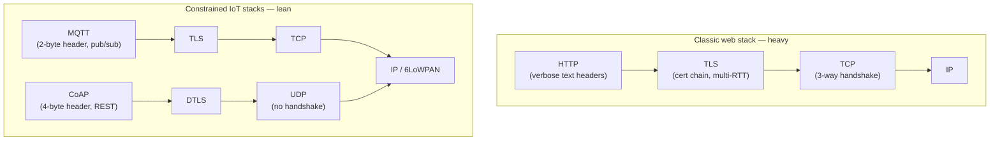

# Module 14 — Constrained & IoT Devices

> **The one idea to keep:** Everything else in this course optimizes for **throughput and
> latency** — get more bits there, faster. Constrained IoT flips the whole priority stack:
> the scarce resources are **battery, coverage, and cost**, and devices happily trade *away*
> speed and instant reachability to buy **years** of life on a coin cell. Once you internalize
> that inversion, every design choice in this module — narrow radios, sleeping for days,
> 12-byte messages — stops looking weird and starts looking obvious.

So far we've spent every module trying to move data *fast*. This one is the opposite corner of
the design space: a soil-moisture sensor buried in a field, a gas meter in a basement, a
shipping-container tracker — devices where nobody changes the battery for a decade, the signal
is terrible, and the "data" is a handful of bytes a day. The networking you know still applies,
but the **objective function changes**, and that changes almost everything.

This module builds directly on ideas you've already met: the DRX radio-sleep mechanics from
[Module 12](12-procedures.md), the transport-layer tradeoffs (TCP vs UDP) from
[Module 05](05-transport-layer.md), and application protocols from
[Module 06](06-application-protocols.md). Its sibling, [Module 15](15-vpns.md), covers
tunneling — another place where a few bytes of overhead per packet matter a lot.

---

## 1. Why IoT flips the usual priorities

A quick term first: **IoT** (Internet of Things) just means networked physical devices —
sensors, meters, trackers, actuators — as opposed to phones and laptops. A **constrained
device** is one where power, bandwidth, compute, or cost is so tight that the normal
networking playbook doesn't fit.

Here's the inversion, side by side:

| Concern | Rest of the course (phone/laptop) | Constrained IoT |
|---|---|---|
| **Top priority** | Throughput + low latency | Battery life + coverage + unit cost |
| **Data volume** | MB–GB per session | Bytes–KB per **day** |
| **Power budget** | Recharge daily | One battery for 5–15 **years** |
| **Reachability** | Always online, instant | Asleep 99.9% of the time |
| **Signal** | Usable → great | Often deep indoor / underground |
| **Acceptable latency** | ms | seconds, minutes, even hours |

Why does this inversion happen? Because the **radio is the single biggest power draw** in the
device, and every byte you send over the air costs energy *and* precious licensed spectrum.
If your product promise is "10-year battery, works in a basement, costs \$5 of silicon," then
throughput and latency are the first things you sacrifice — deliberately.

> ⚡ **Latency note.** Throughout this module, latency isn't the enemy — it's the *currency*.
> Almost every power-saving trick you're about to see buys battery life by **spending
> latency**: the device is unreachable, or slow to respond, precisely because it's asleep.
> The engineering question is never "how do I make it fast" but "how much latency can this
> application tolerate, and how much battery does that buy me?"

---

## 2. Cellular IoT: NB-IoT vs LTE-M

The two dominant *licensed-spectrum* IoT technologies both ride on existing LTE (4G) networks,
so they reuse the towers and SIM infrastructure you already have. They sit at two different
points on the battery-vs-capability curve.

**NB-IoT** (Narrowband IoT, a.k.a. LTE Cat-NB1/NB2) is the extreme low end. It uses a single
**180 kHz** slice of spectrum (narrower than one LTE resource block — that's the "narrowband"
in the name), which is exactly why it reaches so deep: concentrating all your power into a
sliver of bandwidth gives a huge boost in received signal strength per Hz.

**LTE-M** (a.k.a. Cat-M1 / eMTC — enhanced Machine-Type Communication) is the higher-capability
cousin. It uses **1.4 MHz** and supports things NB-IoT can't: real mobility (handover between
towers while moving) and even voice.

| Spec | NB-IoT (Cat-NB1) | LTE-M (Cat-M1) |
|---|---|---|
| Bandwidth | 180 kHz (one narrowband) | 1.4 MHz |
| Peak downlink | ~26–127 kbps | ~1 Mbps |
| Peak uplink | ~66–159 kbps | ~1 Mbps |
| **Coverage (MCL)** | **~164 dB** (deepest) | ~156 dB |
| Mobility | Idle-mode reselection only (best stationary) | Full handover (moves fine) |
| Voice (VoLTE) | ✗ | ✓ |
| Latency | ~1.5–10 s | ~10–100 ms |
| Typical use | Meters, buried/underground sensors | Trackers, wearables, alarms, voice |

That **MCL** figure is the key one. **MCL = Maximum Coupling Loss**: the largest signal
attenuation (in decibels) the link can survive and still work. Plain LTE tops out around
144 dB; NB-IoT's 164 dB is **~20 dB better**, and every 10 dB is roughly a **10×** reduction
in received power you can tolerate. That's the difference between "works outdoors" and "works
in a concrete basement three floors down."

### How they buy that coverage: repetition

There's no free lunch — that extra 20 dB is *bought*, and the currency is (again) throughput,
latency, and power. The main trick is **repetition**: send the same data over and over (up to
**2048×** in NB-IoT, up to **32×** in LTE-M) so the receiver can **combine** all the noisy
copies into one clean one. Sending something 128 times to punch through a wall means it takes
128× longer and burns 128× the transmit energy — a perfect microcosm of this module's whole
thesis.

> ⚡ **Latency note.** In deep coverage, a single NB-IoT message can take **several seconds**
> to deliver, purely because of repetition. This is fine for a meter reading; it's a
> non-starter for anything interactive. Coverage and latency are directly traded here.

---

## 3. Sleeping for years: PSM and eDRX

This is the heart of "10-year battery," and a direct extension of the **DRX** (Discontinuous
Reception) mechanism from [Module 12](12-procedures.md): recall DRX lets an idle modem switch
its receiver *off* between **paging occasions** (the scheduled moments it wakes to check "does
the network want me?"), microsleeping while staying reachable within a second or so. IoT
stretches that idea to two extremes.

### eDRX — extended DRX

**eDRX** (extended DRX) simply makes the DRX cycle *much* longer. Where ordinary idle DRX wakes
every ~1.28–2.56 s, eDRX stretches the gap to up to ~**43.7 minutes** (LTE-M) or ~**2.9 hours**
(NB-IoT). The device still wakes each cycle to listen during a short **Paging Time Window
(PTW)**, so it stays *reachable* — but the network may wait up to one full eDRX cycle to deliver
a downlink. You've traded reachability latency for sleep.

### PSM — Power Saving Mode

**PSM** (Power Saving Mode) goes further. The device stays **registered** (so it avoids the
energy cost of re-attaching) but powers its radio **completely off** and becomes utterly
unreachable — deep hibernation. It wakes only when *it* decides to: it has data to send
(mobile-originated), or its periodic **TAU** (Tracking Area Update — a routine "I'm still here"
check-in) timer fires. Two timers govern it: **T3324 (Active Timer)** = how long it stays
reachable after a connection before dropping into PSM; **T3412 (extended TAU Timer)** = the
maximum sleep, up to **~413 days**. In PSM the modem draws only a **few microamps** —
comparable to the battery's own self-discharge. That's how you reach a decade of life.

Here's the whole spectrum on one timeline. Note the axis is **not to scale** — DRX wakes are
seconds apart, eDRX minutes to hours, PSM hours to days — the point is the *frequency* of
waking, which is what drains the battery:

```mermaid
gantt
    title Radio-on windows over time — bars = awake & listening, gaps = deep sleep (NOT to scale)
    dateFormat X
    axisFormat %S
    section Idle DRX (~seconds, Mod 12)
    wake :0, 1
    wake :2, 1
    wake :4, 1
    wake :6, 1
    wake :8, 1
    section eDRX (~minutes to hours)
    wake :0, 1
    wake :9, 1
    section PSM (~hours to 413 days)
    wake at TAU :0, 1
```



The tradeoff in one table:

| Mode | Wakes to listen | Reachable for downlink? | Sleep current | Downlink latency |
|---|---|---|---|---|
| **Idle DRX** (Mod 12) | Every ~1–2.5 s | Yes, ~instantly | mA range | sub-second |
| **eDRX** | Every few min–hours | Yes, at next PTW | tens of µA | up to one eDRX cycle |
| **PSM** | Only at TAU / when it sends | **No** — dark until it wakes | few µA | up to the TAU period (days) |

> ⚡ **Latency note — the reachability delay.** This is *the* gotcha of constrained IoT. A
> device in PSM literally cannot be reached — send it a command and it queues until the device
> next wakes on its own. If you need to open a smart lock or push a firmware update, PSM's
> "days of latency" is unacceptable; eDRX (bounded, tunable latency) or staying in DRX is the
> price of reachability. **You cannot have both a dark, decade-lasting device and instant
> downlink control.** Pick one per application.

🔧 **Project — see PSM/eDRX in an AT log.** If you have an NB-IoT/LTE-M dev board (e.g. a
Nordic nRF9160, or a SIMCom/Quectel module on a USB adapter), open a serial terminal and try
`AT+CPSMS=1,,,"00100100","00000000"` to request PSM and `AT+CEDRXS=` to request eDRX. Then
watch a current meter (or the board's power profiler) drop from milliamps to microamps as the
modem goes dark. Nothing makes the tradeoff concrete like watching the needle fall.

---

## 4. 5G for IoT: mMTC and RedCap

5G was designed around three usage pillars, and one of them is aimed squarely at this module:

- **eMBB** (enhanced Mobile Broadband) — the fast phones-and-hotspots pillar.
- **URLLC** (Ultra-Reliable Low-Latency Communication) — factory robots, remote surgery.
- **mMTC** (massive Machine-Type Communication) — **this one**: connecting a *massive* number
  of low-power devices, with a target density of up to **~1 million devices per km²**.

Here's a fact that trips people up: in practice, **5G mMTC is delivered by NB-IoT and LTE-M**.
3GPP (the standards body) formally adopted those two LTE technologies as 5G's mMTC solution;
they run happily in-band alongside a 5G network. So "5G IoT for tiny sensors" isn't a new
radio — it's the same NB-IoT/LTE-M you just learned, under the 5G umbrella.

What *is* new is **RedCap** (Reduced Capability NR, sometimes "NR-Light"), introduced in
**3GPP Release 17** (2022) and slimmed further as **eRedCap** in Release 18. RedCap fills the
gap between low-power LPWA (NB-IoT/LTE-M, kbps) and full-fat 5G (Gbps) — for devices that need
*more* than a meter but *less* than a phone:

| | NB-IoT / LTE-M | **RedCap** | Full 5G (eMBB) |
|---|---|---|---|
| Peak rate | kbps–~1 Mbps | ~**150 Mbps** DL / ~50 Mbps UL | Gbps |
| Bandwidth | 0.18–1.4 MHz | up to 20 MHz (FR1) | 100+ MHz |
| Rx antennas | 1 | 1–2 | 4+ |
| Complexity/cost | lowest | reduced | full |
| Target | meters, sensors | wearables, industrial sensors, mid-tier cameras | phones, hotspots |

RedCap is "reduced" on purpose — fewer antennas, less bandwidth, optional half-duplex, lower
modulation — because a wrist wearable or a security camera doesn't need a phone's full radio,
and every deleted capability saves cost and power. It still supports PSM and eDRX.

---

## 5. LPWAN alternatives outside cellular

Cellular isn't the only game. **LPWAN** (Low-Power Wide-Area Network) is the umbrella term for
any tech built for long range + tiny power + tiny data. The two big *unlicensed-spectrum*
options don't need a carrier or a SIM — they run in free **ISM bands** (Industrial/Scientific/
Medical — license-free radio spectrum, e.g. 868 MHz in the EU, 915 MHz in the US).

**LoRa / LoRaWAN.** A crucial distinction: **LoRa** is the *physical layer* — a Semtech-owned
modulation called **CSS** (Chirp Spread Spectrum) that trades data rate for range and
robustness. **LoRaWAN** is the *open network protocol* (MAC + network layer) built on top of
it by the LoRa Alliance. Topology is **star-of-stars**: end devices talk to nearby **gateways**,
which forward everything to a central **network server**. Range is ~2–15 km; data rate
~0.3–50 kbps; payloads ~51–242 bytes. The killer feature: **you can run your own gateway** —
no carrier required — which is why LoRaWAN dominates private/industrial deployments.

LoRaWAN also defines **device classes** that are a pure battery-vs-latency dial:

- **Class A** — most power-efficient; a device only listens in two short windows *right after*
  it uplinks. Downlink is therefore delayed until the device next speaks. Default for battery
  devices.
- **Class B** — adds scheduled receive windows (beacon-synced) for bounded downlink latency.
- **Class C** — receiver almost always on; near-instant downlink, but power-hungry (mains
  power only).

**Sigfox.** **UNB** (Ultra-Narrow-Band) technology run as a managed global network (the Sigfox
operator model; the company was acquired by **UnaBiz** in 2022 and the network continues). It's
the extreme minimalist: uplink limited to **12 bytes** per message and **~140 messages/day**;
downlink just **8 bytes**, ~4 messages/day. In exchange: very long range and years of battery
from truly trivial data. Perfect for "the pallet arrived / the bin is full / the water is
leaking" — one bit of news a day.

> ⚡ **Latency note.** LoRaWAN Class A and Sigfox are *uplink-first* by design: the device
> speaks, then briefly listens. Downlink to the device is only possible in that tiny window,
> so commanding these devices is inherently high-latency — the exact same "asleep = unreachable"
> tradeoff as cellular PSM, just baked into the protocol.

**Cellular vs unlicensed, at a glance:**

| | NB-IoT / LTE-M | LoRaWAN | Sigfox |
|---|---|---|---|
| Spectrum | Licensed (carrier) | Unlicensed ISM | Unlicensed ISM (operator) |
| Infra | Existing cell towers | Your own or community gateways | Sigfox/UnaBiz network |
| Data rate | kbps–Mbps | 0.3–50 kbps | ~100 bps (12 B messages) |
| SIM / subscription | Yes | No | Network subscription |
| Best for | Wide-area, carrier-grade | Private/campus, self-hosted | Ultra-simple, ultra-cheap |

---

## 6. Protocols for constrained links: MQTT, CoAP, and why HTTP is too heavy

You have a device that sleeps for hours and speaks a few bytes over a lossy, expensive radio.
Now — what application protocol do you run over it? Not plain HTTP over TCP, and the reason is
one you've already reasoned through.

### Why HTTP/TCP is too heavy — callback to Signal Log Q05

Recall **[Signal Log Q05](SIGNAL-LOG.md#q05--headers-add-size--why-add-them)**: headers are
pure overhead, and their *cost is a ratio to payload size*. The ~54 bytes of TCP/IP/Ethernet
headers are a negligible ~3.6% of a 1500-byte web packet — but on a **1-byte sensor reading**
they're ~98% waste. Constrained IoT lives entirely in that second regime. On top of the header
bloat, plain HTTPS pays:

- **TCP's 3-way handshake** — a full round-trip *before any data*, and every round-trip on a
  repetition-heavy radio can be seconds of airtime and a gulp of battery.
- **TLS handshake** — several more round-trips and hundreds of bytes of certificates.
- **Verbose text headers** — `GET / HTTP/1.1\r\nHost: ...\r\nUser-Agent: ...` is *hundreds of
  bytes* of ASCII to move a single number.

That same Q05 also introduced the fix cellular already applies at L2: **PDCP/ROHC** (Robust
Header Compression) squashes 40-byte IP/UDP/RTP headers down to 1–3 bytes over the air (Module
11). But header *compression* only softens the blow — for IoT we go further and pick protocols
that are lean by design.

### MQTT — lightweight publish/subscribe

**MQTT** (Message Queuing Telemetry Transport) is the workhorse. It's a **publish/subscribe**
protocol mediated by a central **broker**: devices *publish* messages to named **topics** (e.g.
`sensors/field7/moisture`), and any interested consumer *subscribes* to that topic; the broker
routes messages between them. Devices never address each other directly — which is perfect for
fleets that are asleep at unpredictable times.

- Runs over TCP (default port 1883; 8883 with TLS).
- **Tiny 2-byte fixed header** — the anti-HTTP.
- Three **QoS** (Quality of Service) levels: 0 (fire-and-forget), 1 (at-least-once), 2
  (exactly-once).
- **Last Will and Testament (LWT):** the broker announces a device's death if it drops off —
  great for flaky devices.
- Persistent sessions let a sleeping device catch up on missed messages when it reconnects.

### CoAP — RESTful, over UDP

**CoAP** (Constrained Application Protocol, RFC 7252) takes the opposite tack: it looks like
**HTTP shrunk to the bone**. Same RESTful verbs you know — GET/POST/PUT/DELETE on resource
URIs — but with a **compact 4-byte binary header** running over **UDP** (default port 5683)
instead of TCP, so there's no handshake. Because it mirrors HTTP, a proxy can translate CoAP
↔ HTTP almost mechanically.

- **Confirmable (CON)** messages get a lightweight ACK (opt-in reliability, since UDP gives
  none); **Non-confirmable (NON)** messages don't — you choose per message.
- The **Observe** option gives a publish/subscribe-like "notify me when this resource changes"
  without a broker.

### Securing them: DTLS

You still want encryption and authentication (the confidentiality + identity split from the
TLS deep-dive). MQTT-over-TCP uses ordinary **TLS**. But CoAP runs over UDP, and TLS assumes
TCP's reliable, ordered stream — so CoAP uses **DTLS** (Datagram TLS): TLS re-engineered to
tolerate UDP's lost, reordered, and duplicated packets. Its handshake is still relatively heavy
for a tiny device, so constrained deployments lean on **pre-shared keys (PSK)**, DTLS 1.3 with
**Connection ID** (survives the device's IP changing after a long sleep), or **OSCORE**
(object-level security for CoAP).

### The lean stack vs the classic stack



Rule of thumb: **MQTT** for fleets that push to devices over flaky links (broker, pub/sub, TCP);
**CoAP** for resource-style GET/PUT with no broker and no handshake (REST, UDP); **plain HTTPS**
essentially never on a constrained radio.

---

## 7. Duty cycling and message batching

Two operating disciplines tie the whole module together, and both are the same move: **turn
the expensive radio on as little as possible.**

**Duty cycling** is keeping the fraction of time the radio is active — the *duty cycle* —
brutally low, ideally well under **1%**. The radio dwarfs every other power draw, so a device
that transmits for 5 seconds and then sleeps for an hour (a ~0.14% duty cycle) can last years.
(In unlicensed bands like LoRaWAN's, a duty-cycle cap — e.g. ~1% in the EU — is also a *legal*
requirement to keep the shared spectrum usable for everyone.)

**Message batching** is the other half, and it's [Q05](SIGNAL-LOG.md#q05--headers-add-size--why-add-them)
applied to *time*. Q05's lesson was "big payloads amortize fixed header overhead." Here the
fixed overhead isn't just headers — it's the entire cost of *waking up*: the RRC connection
setup (the "wake the radio from idle" delay from Module 12), the coverage-enhancement
repetitions, the handshake. That per-transmission cost is huge and roughly constant, so:

> **Send 24 readings once a day, not one reading 24 times a day.** Batching amortizes the
> wake-up/setup/header cost across many data points, and lets the radio stay dark far longer.

> ⚡ **Latency note.** Batching is, once more, latency traded for battery: a reading taken at
> 2 a.m. isn't reported until the morning upload. The design question is always the freshness
> your application actually needs — and the honest answer, for a soil sensor, is "once a day is
> fine," which is exactly why the battery lasts.

---

## 8. Misconceptions to kill

- ❌ *"5G IoT means a brand-new radio for sensors."* No — 5G's mMTC pillar is delivered by
  NB-IoT and LTE-M. RedCap is the genuinely new 5G radio, and it's for the *mid-tier*
  (wearables, cameras), not tiny sensors.
- ❌ *"A device on PSM is just idle and I can ping it."* No — PSM powers the radio fully off. It
  is **unreachable** until it wakes on its own. That's the feature, and the catch (§3).
- ❌ *"LoRa and LoRaWAN are the same thing."* No — LoRa is the physical-layer modulation;
  LoRaWAN is the open MAC/network protocol on top of it.
- ❌ *"Better coverage is free."* NB-IoT's deep coverage is *bought* with repetition — more
  airtime, more latency, more transmit energy (§2).

---

## Check your understanding

<div class="quiz">
<p class="q">You need to send a downlink command to an NB-IoT device to open a valve, and it must act within a few seconds. The device is currently configured for PSM with a 24-hour TAU timer. What's the problem?</p>
<ul class="options">
<li data-correct="true">In PSM the radio is off and the device is unreachable — your command queues until the device next wakes on its own (up to 24 h away).</li>
<li>PSM increases throughput but adds jitter, so the command may arrive corrupted.</li>
<li>PSM only affects uplink, so downlink commands are unaffected.</li>
</ul>
<div class="explain">PSM turns the radio fully off to save power; the device becomes dark and
cannot receive anything until it wakes for a TAU or to send its own data. For bounded downlink
latency you'd use eDRX (reachable at the next Paging Time Window) or stay in idle DRX — at the
cost of battery. You can't have a decade-dark device *and* instant reachability.</div>
</div>

<div class="quiz">
<p class="q">Why do constrained IoT devices favor MQTT or CoAP over plain HTTPS?</p>
<ul class="options">
<li>HTTPS can't be encrypted on small devices.</li>
<li data-correct="true">HTTP's verbose headers plus the TCP+TLS handshakes are mostly overhead relative to a few-byte payload — MQTT (2-byte header) and CoAP (4-byte header, over UDP, no handshake) are lean by design.</li>
<li>MQTT and CoAP are faster because they use more bandwidth.</li>
</ul>
<div class="explain">This is Signal Log Q05 in action: header cost is a ratio to payload, and a
few-byte reading under hundreds of bytes of HTTP/TCP/TLS overhead is ~98% waste. Every byte
over the air costs energy and spectrum, so IoT picks protocols with tiny headers and minimal
handshakes. CoAP even drops TCP for UDP to avoid the handshake entirely.</div>
</div>

<div class="quiz">
<p class="q">Your product must work in a deep basement and report once an hour. You choose NB-IoT with heavy repetition for coverage. What did you trade away?</p>
<ul class="options">
<li>Nothing — repetition improves coverage for free.</li>
<li data-correct="true">Throughput, latency, and transmit energy — sending the same data many times to combine copies takes longer and burns more battery per message.</li>
<li>Security — repetition disables DTLS.</li>
</ul>
<div class="explain">Repetition (up to 2048× in NB-IoT) buys ~20 dB of extra coupling loss by
letting the receiver combine many noisy copies — but each message now occupies far more airtime
and transmit energy and arrives seconds later. That's fine for an hourly meter reading and the
whole reason NB-IoT can reach a basement, but it's the central battery/coverage-vs-latency/
throughput trade of this module.</div>
</div>

---

## Exercises

1. **Compare the specs.** Build a one-page table comparing **NB-IoT vs LTE-M** on: bandwidth,
   peak up/downlink rate, MCL (coverage), mobility, voice support, and typical latency. Then
   pick a device — (a) a water meter in a pit, (b) a bike-share GPS tracker, (c) a fall-detector
   pendant with voice — and justify which technology fits each and why.

2. **Estimate battery life.** Assume a 2400 mAh battery (2× AA), a PSM sleep current of ~5 µA
   (≈0.12 mAh/day baseline), and ~0.33 mAh burned per uplink (setup + a few seconds of TX).
   Compute battery life for **1 message/day**, **1/hour**, and **1/minute**. You should find
   roughly *~10+ years → ~10 months → ~5 days*. Write one sentence on what that curve says
   about designing IoT products. (This is the whole module in three numbers.)

3. **Try MQTT with a public broker.** Install `mosquitto` (`brew install mosquitto`). In one
   terminal subscribe: `mosquitto_sub -h test.mosquitto.org -t "yourname/test"`. In another,
   publish: `mosquitto_pub -h test.mosquitto.org -t "yourname/test" -m "hello"`. Watch the
   message arrive. Then run `mosquitto_sub` with `-d` (debug) and note how tiny the wire
   messages are compared to an equivalent HTTP request.

4. **Try CoAP.** Use a CoAP client (`coap-client` from libcoap, or the `aiocoap` Python client)
   against the public test server: `coap-client -m get coap://coap.me/hello`. Compare the
   round-trip and byte count to `curl -v http://example.com/`. Notice: no TCP handshake, tiny
   header.

5. **🔧 Project — measure the overhead yourself.** Capture both a CoAP GET and an HTTP GET with
   Wireshark (or `tcpdump`). Count the total bytes on the wire for each to move the *same* small
   payload, express the header overhead as a percentage of payload for each, and connect the
   result back to [Signal Log Q05](SIGNAL-LOG.md#q05--headers-add-size--why-add-them). Then, for
   a parking-space sensor that must react within ~30 s yet last 5 years, decide between idle DRX,
   eDRX, and PSM and defend the latency-vs-battery tradeoff in a paragraph.

---

## Key terms

- **NB-IoT** — Narrowband IoT (LTE Cat-NB1/NB2). 180 kHz radio, deepest coverage (~164 dB MCL),
  very low data rate, best for stationary meters/sensors. No voice, no in-motion handover.
- **LTE-M** — LTE Cat-M1 / eMTC. 1.4 MHz, up to ~1 Mbps, supports mobility and voice; higher
  capability, slightly less deep coverage than NB-IoT.
- **PSM** — Power Saving Mode. Device stays registered but powers the radio fully off; utterly
  unreachable until it wakes for a TAU or to send data. Enables microamp sleep and years of
  battery — at the cost of downlink reachability.
- **eDRX** — extended DRX. Stretches idle-mode DRX cycles to minutes (LTE-M) or hours (NB-IoT);
  the device stays reachable at each Paging Time Window but with added downlink latency.
- **LPWAN** — Low-Power Wide-Area Network. Umbrella term for long-range, low-power, low-data
  technologies (NB-IoT, LTE-M, LoRaWAN, Sigfox).
- **LoRaWAN** — Open MAC/network protocol over the LoRa (Chirp Spread Spectrum) physical layer;
  unlicensed ISM spectrum, star-of-stars topology, self-hostable gateways, tiny payloads.
- **MQTT** — Message Queuing Telemetry Transport. Lightweight publish/subscribe protocol via a
  central broker, tiny 2-byte header, over TCP. The IoT fleet workhorse.
- **CoAP** — Constrained Application Protocol. RESTful (GET/PUT/POST/DELETE) like HTTP but with
  a 4-byte binary header, running over UDP (no handshake). RFC 7252.
- **DTLS** — Datagram TLS. TLS adapted to run over UDP (tolerates loss/reordering); used to
  secure CoAP (`coaps`). Often paired with pre-shared keys or Connection ID on tiny devices.
- **RedCap** — Reduced Capability NR ("NR-Light", 3GPP Rel-17). New 5G radio for the mid-tier
  between LPWA and full 5G — fewer antennas, less bandwidth, ~150 Mbps — for wearables, sensors,
  mid-tier cameras.
- **mMTC** — massive Machine-Type Communication. The 5G pillar for connecting ~1M devices/km²;
  in practice delivered by NB-IoT and LTE-M.

---

## Cheat-sheet

```
THE INVERSION (the whole module)
  Rest of course:  optimize THROUGHPUT + LATENCY
  Constrained IoT: optimize BATTERY + COVERAGE + COST  → trade AWAY speed & reachability

CELLULAR IoT
  NB-IoT   180 kHz · ~26–127 kbps · MCL ~164 dB (deepest) · stationary · no voice · 1.5–10 s
  LTE-M    1.4 MHz · ~1 Mbps      · MCL ~156 dB · mobility + voice        · 10–100 ms
  Coverage bought with REPETITION (NB-IoT up to 2048×) = more airtime/latency/energy

SLEEP MODES (extends DRX from Module 12)
  Idle DRX  wake ~1–2.5 s   · reachable ~instantly · mA
  eDRX      wake min–hours  · reachable at next PTW · tens of µA · latency ≤ one cycle
  PSM       wake at TAU     · UNREACHABLE until wake · few µA · latency ≤ TAU (≤413 days)
  T3324 = Active Timer (stay reachable) · T3412 = extended TAU (max sleep)

5G IoT
  mMTC pillar  → delivered by NB-IoT & LTE-M (in-band with 5G)
  RedCap (Rel-17) → mid-tier: ~150 Mbps, fewer antennas — wearables, cameras, industrial

UNLICENSED LPWAN
  LoRa = PHY (chirp spread spectrum) · LoRaWAN = open protocol, self-host gateways, classes A/B/C
  Sigfox = ultra-narrow-band, 12 B up / ~140 msgs day, 8 B down (UnaBiz-operated)

PROTOCOLS (why not HTTPS: Q05 header overhead + TCP/TLS handshakes)
  MQTT  pub/sub via broker · 2-byte header · TCP (1883/8883) · TLS
  CoAP  RESTful · 4-byte header · UDP (5683/5684) · no handshake · DTLS/OSCORE

DISCIPLINE
  Duty cycle < 1% (radio is the power hog) · BATCH messages (amortize wake-up + header cost)
  Golden rule: send 24 readings once/day, not 1 reading 24×/day
```

---

**Next up → Module 15: VPNs & Tunneling** — we shift from squeezing bytes onto a sleepy radio
to *wrapping* them: how a tunnel encapsulates one network inside another, what encryption and
overhead that adds per packet, and why "just add a header" (the very move from Signal Log Q05)
is both the magic and the cost of every VPN.
