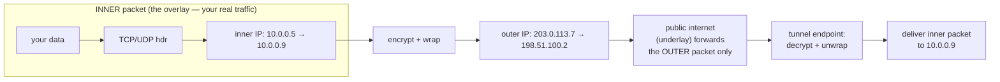
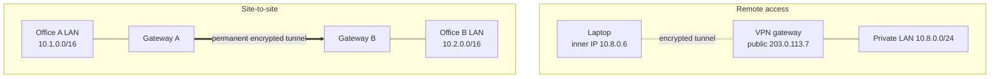

# Module 15 — VPNs & Tunneling

> **The one idea to keep:** A VPN is **encapsulation, weaponized**. Back in
> [Module 01](01-the-layered-model.md) each layer wrapped the layer above in its own header.
> A tunnel does the same trick but *recursively at the same layer*: it takes a whole,
> finished IP packet — headers and all — and stuffs it inside the payload of **another** IP
> packet, usually encrypted. Your "inner" network rides across someone else's "outer"
> network as ordinary-looking traffic. Everything else — IPsec, WireGuard, split tunneling,
> DNS leaks — is detail hanging off that one move.

You already understand encapsulation. This module says: *do it again, on purpose, and add
crypto.* If Module 01 is the map of layers, a VPN is a **secret road drawn on top of the
public map** — an **overlay**. We link back to [Module 01](01-the-layered-model.md)
(encapsulation), [Module 04](04-network-layer.md) (IP, NAT, MTU), and the
[TLS deep-dive](deep-dive-tls-certificates.md) and [DNS deep-dive](deep-dive-dns.md); the
sibling [Module 16](16-rf-underworld.md) picks up the "what rides the airwaves" thread next.

**VPN** = *Virtual* Private Network. "Private" because only your endpoints can read it;
"virtual" because the private network doesn't physically exist — it's *painted on top of*
the public internet with encapsulation and encryption.

---

## 1. What a tunnel really is (encapsulation, again)

In Module 01 a packet grew one header at a time going *down* the stack: `[Eth][IP][TCP][data]`.
Decapsulation reversed it on the far side. A **tunnel** takes a **complete** packet and
treats it as nothing but **payload** for a fresh outer packet:

```
 Normal packet (Module 01):
   [ outer IP ][ TCP ][ your data ]

 Tunneled packet (this module):
   [ outer IP ][ tunnel/crypto hdr ][  INNER IP  ][ TCP ][ your data ]
   └──────── the public internet sees only this ────────┘
                                    └──── the encrypted, invisible cargo ────┘
```

The outer header carries the packet across the real internet (the **underlay**). The inner
header is your *actual* destination inside the private network (the **overlay**). Routers in
between forward the outer packet like any other — they never see, and usually **can't
decrypt**, the inner one.

- **Underlay** = the real, physical network doing the forwarding (your ISP, the public
  internet). It only knows about outer headers.
- **Overlay** = the virtual network that *appears* to exist between your tunnel endpoints. It
  behaves like a private LAN even though its packets are really bouncing across the underlay.

> **The recurring thread:** every VPN is "a packet inside a packet." When something about
> VPNs confuses you — overhead, MTU, why a firewall can't inspect the traffic — return to
> this picture. The confusion almost always dissolves into "oh, right, there's an *inner*
> packet the outer network can't see."



<figure class="anim-fig">
<svg viewBox="0 0 760 240" role="img" aria-label="Animation: an inner IP packet is wrapped in an encrypted outer header at the laptop, crosses the public internet unreadable, and is unwrapped at the VPN server.">
<style>
.m15a-h{font-size:13px;font-weight:700;fill:#2c7be5}
.m15a-ep{fill:#eef5ff;stroke:#2c7be5;stroke-width:2}
.m15a-epl{font-size:12px;font-weight:700;fill:#1f4a7a}
.m15a-sub{font-size:10.5px;fill:#64748b}
.m15a-band{fill:#f8fafc;stroke:#cbd5e1;stroke-width:1.5}
.m15a-bl{font-size:11px;fill:#64748b}
.m15a-inl{font-size:11px;font-weight:700;fill:#fff}
.m15a-outl{font-size:10px;font-weight:700;fill:#fff}
.m15a-pkt{animation:m15amove 8s ease-in-out infinite}
.m15a-wrap{animation:m15awrap 8s ease-in-out infinite}
@keyframes m15amove{0%,18%{transform:translateX(0)}70%,100%{transform:translateX(589px)}}
@keyframes m15awrap{0%,10%{opacity:0}18%,74%{opacity:1}82%,100%{opacity:0}}
</style>
<text class="m15a-h" x="12" y="20">A tunnel = one whole packet sealed inside another</text>
<rect class="m15a-ep" x="20" y="128" width="96" height="52" rx="8"/>
<text class="m15a-epl" x="68" y="150" text-anchor="middle">Your laptop</text>
<text class="m15a-sub" x="68" y="168" text-anchor="middle">wrap + encrypt</text>
<rect class="m15a-ep" x="608" y="128" width="98" height="52" rx="8"/>
<text class="m15a-epl" x="657" y="150" text-anchor="middle">VPN server</text>
<text class="m15a-sub" x="657" y="168" text-anchor="middle">unwrap + decrypt</text>
<rect class="m15a-band" x="124" y="120" width="476" height="70" rx="8"/>
<text class="m15a-bl" x="362" y="150" text-anchor="middle">Public internet (underlay)</text>
<text class="m15a-bl" x="362" y="170" text-anchor="middle">forwards the OUTER header only — inner packet is encrypted 🔒</text>
<g class="m15a-pkt">
<g class="m15a-wrap">
<rect x="20" y="140" width="96" height="46" rx="5" fill="#2c7be5"/>
<rect x="20" y="140" width="26" height="46" rx="5" fill="#1f5bb5"/>
<text class="m15a-outl" x="33" y="166" text-anchor="middle">OUT</text>
<text x="104" y="138" text-anchor="middle" style="font-size:14px">🔒</text>
</g>
<rect x="38" y="150" width="60" height="26" rx="4" fill="#16a34a"/>
<text class="m15a-inl" x="68" y="168" text-anchor="middle">inner</text>
</g>
<text class="m15a-sub" x="362" y="212" text-anchor="middle">Sealed at the laptop • carried across untouched • opened only at the VPN server</text>
</svg>
<figcaption><b>Encapsulation, weaponized.</b> The green <b>inner packet</b> (your real traffic) is wrapped in an encrypted <b>outer header</b> (blue) with a lock as it enters the tunnel. The public internet forwards only that outer header; the inner packet stays unreadable until the VPN server unwraps it — Module 01's nesting-envelopes trick, done again on purpose.</figcaption>
</figure>

---

## 2. Why VPNs exist (five jobs, one mechanism)

The single mechanism (tunnel + crypto) is used for five distinct reasons. Keep them separate;
people conflate them constantly.

| Reason | The problem it solves |
|--------|-----------------------|
| **Confidentiality over untrusted networks** | Coffee-shop Wi-Fi, hotel LAN, a hostile ISP — anyone on the path can read/modify plaintext. The tunnel encrypts so the underlay sees only ciphertext. |
| **Secure remote access** | An employee at home needs to reach the office's internal systems as if sitting at their desk. The tunnel drops them "inside." |
| **Site-to-site connectivity** | Two offices (or two cloud VPCs) want their LANs to behave like one network across the internet. A permanent tunnel between the two gateways stitches them together. |
| **Reaching private (RFC 1918) address space** | Addresses like `10.x`, `172.16–31.x`, `192.168.x` ([Module 04](04-network-layer.md)) are **not routable** on the public internet. A tunnel is the only way to send a packet *to* `10.0.0.9` from outside — it rides inside a public-IP outer packet. |
| **Traversing NAT** | Your device behind home NAT has no public address of its own. A tunnel establishes a path *out* through the NAT that return traffic can follow back (Section 8). |

**RFC 1918** = the standard that reserves those private IP ranges for use inside LANs. They
repeat in millions of homes and offices, so they can never appear as a public destination —
which is exactly why you need a tunnel to reach one remotely.

---

## 3. The two topologies

Almost every deployment is one of these two shapes.

**Remote access** — one client, one gateway. Your laptop builds a tunnel to a VPN
concentrator and inherits an inner IP on the private network.

**Site-to-site** — two gateways, always-on. Neither individual host knows a VPN exists; the
gateways transparently encapsulate any traffic destined for the other site's subnet.



<figure class="anim-fig">
<svg viewBox="0 0 760 300" role="img" aria-label="Animation: remote-access VPN connects one laptop to a gateway, while site-to-site VPN links two whole office networks through a permanent tunnel between two gateways.">
<style>
.m15b-h{font-size:13px;font-weight:700;fill:#2c7be5}
.m15b-cap{font-size:12px;font-weight:700;fill:#1f2d3d}
.m15b-node{fill:#eef5ff;stroke:#2c7be5;stroke-width:2}
.m15b-net{fill:#f0fdf4;stroke:#16a34a;stroke-width:2}
.m15b-nl{font-size:11px;font-weight:700;fill:#1f4a7a}
.m15b-netl{font-size:11px;font-weight:700;fill:#166534}
.m15b-sub{font-size:10px;fill:#64748b}
.m15b-wire{stroke:#cbd5e1;stroke-width:2.5}
.m15b-tun{fill:none;stroke:#7c3aed;stroke-width:2.5;stroke-dasharray:8 6;animation:m15bants 1s linear infinite}
.m15b-tun2{fill:none;stroke:#7c3aed;stroke-width:4;stroke-dasharray:10 7;animation:m15bants 1s linear infinite}
.m15b-d1{animation:m15bflow 3s ease-in-out infinite}
.m15b-d2{animation:m15bs2s1 3s linear infinite}
.m15b-d3{animation:m15bs2s2 3s linear infinite}
@keyframes m15bants{to{stroke-dashoffset:-28}}
@keyframes m15bflow{0%{transform:translateX(0);opacity:0}12%{opacity:1}88%{opacity:1}100%{transform:translateX(232px);opacity:0}}
@keyframes m15bs2s1{0%{transform:translateX(0);opacity:0}12%{opacity:1}88%{opacity:1}100%{transform:translateX(212px);opacity:0}}
@keyframes m15bs2s2{0%{transform:translateX(0);opacity:0}12%{opacity:1}88%{opacity:1}100%{transform:translateX(-212px);opacity:0}}
</style>
<text class="m15b-h" x="12" y="20">Two topologies, one mechanism</text>
<text class="m15b-cap" x="12" y="46">Remote access — one client to one gateway</text>
<rect class="m15b-node" x="28" y="62" width="96" height="44" rx="8"/>
<text class="m15b-nl" x="76" y="82" text-anchor="middle">Laptop</text>
<text class="m15b-sub" x="76" y="98" text-anchor="middle">10.8.0.6</text>
<line class="m15b-tun" x1="124" y1="84" x2="360" y2="84"/>
<rect class="m15b-node" x="360" y="62" width="120" height="44" rx="8"/>
<text class="m15b-nl" x="420" y="82" text-anchor="middle">VPN gateway</text>
<text class="m15b-sub" x="420" y="98" text-anchor="middle">203.0.113.7</text>
<line class="m15b-wire" x1="480" y1="84" x2="560" y2="84"/>
<rect class="m15b-net" x="560" y="62" width="176" height="44" rx="8"/>
<text class="m15b-netl" x="648" y="82" text-anchor="middle">Private LAN</text>
<text class="m15b-sub" x="648" y="98" text-anchor="middle">10.8.0.0/24</text>
<circle class="m15b-d1" cx="128" cy="84" r="6" fill="#ef4444"/>
<text class="m15b-sub" x="242" y="122" text-anchor="middle">encrypted tunnel — laptop inherits an inner IP inside the LAN</text>
<line x1="12" y1="150" x2="748" y2="150" stroke="#e2e8f0" stroke-width="1"/>
<text class="m15b-cap" x="12" y="176">Site-to-site — network to network, always on</text>
<rect class="m15b-net" x="20" y="196" width="120" height="52" rx="8"/>
<text class="m15b-netl" x="80" y="216" text-anchor="middle">Office A LAN</text>
<text class="m15b-sub" x="80" y="234" text-anchor="middle">10.1.0.0/16</text>
<line class="m15b-wire" x1="140" y1="222" x2="180" y2="222"/>
<rect class="m15b-node" x="180" y="200" width="90" height="44" rx="8"/>
<text class="m15b-nl" x="225" y="226" text-anchor="middle">Gateway A</text>
<line class="m15b-tun2" x1="270" y1="222" x2="490" y2="222"/>
<rect class="m15b-node" x="490" y="200" width="90" height="44" rx="8"/>
<text class="m15b-nl" x="535" y="226" text-anchor="middle">Gateway B</text>
<line class="m15b-wire" x1="580" y1="222" x2="620" y2="222"/>
<rect class="m15b-net" x="620" y="196" width="120" height="52" rx="8"/>
<text class="m15b-netl" x="680" y="216" text-anchor="middle">Office B LAN</text>
<text class="m15b-sub" x="680" y="234" text-anchor="middle">10.2.0.0/16</text>
<circle class="m15b-d2" cx="274" cy="216" r="6" fill="#16a34a"/>
<circle class="m15b-d3" cx="486" cy="228" r="6" fill="#f59e0b"/>
<text class="m15b-sub" x="380" y="266" text-anchor="middle">permanent encrypted tunnel — the hosts never know a VPN exists</text>
</svg>
<figcaption><b>Remote access vs site-to-site.</b> Top: a single <b>laptop</b> builds a tunnel to a <b>gateway</b> and inherits an inner IP on the private LAN. Bottom: two <b>gateways</b> hold a permanent tunnel (traffic flowing both ways) so two whole office LANs behave like one network — the individual hosts are oblivious.</figcaption>
</figure>

> ⚡ **Latency note.** A tunnel almost always **adds a hop**. Traffic that would have gone
> `you → server` now goes `you → VPN gateway → server` (and back the same way). If the
> gateway is in another region, you pay that detour on *every* packet. A user in Berlin
> tunneling through a New York exit node to reach a Berlin server can turn a 5 ms round-trip
> into 180 ms. The crypto itself is cheap on modern CPUs; the **geography of the extra hop**
> is usually what hurts.

---

## 4. IPsec — the L3 heavyweight

**IPsec** (IP Security) is a *suite* of protocols that secures IP itself, at
[Module 04](04-network-layer.md)'s network layer. It's the classic enterprise and
site-to-site choice, baked into routers, firewalls, and every OS. It has moving parts worth
naming precisely.

### ESP vs AH — the two "protect the packet" protocols

| | **ESP** (Encapsulating Security Payload) | **AH** (Authentication Header) |
|---|---|---|
| Encrypts payload? | **Yes** (confidentiality) | **No** — plaintext, just signed |
| Authenticates / integrity? | Yes | Yes |
| Survives NAT? | Yes (with NAT-T, Section 8) | **No** — AH hashes fields NAT rewrites |
| Used today? | **Almost always** | Rarely — no encryption makes it niche |

In practice: **ESP is what everyone uses.** AH exists mostly in exam questions and legacy
configs. If you only remember one, remember ESP = "encrypt + authenticate the packet."

### Tunnel mode vs transport mode

This is the packet-in-packet distinction made concrete:

- **Transport mode** — protects only the *payload* of the original packet; the **original IP
  header is reused**. Host-to-host, no new inner packet. Lower overhead, but the endpoints'
  real IPs are exposed.
- **Tunnel mode** — encrypts the **entire original packet** and wraps it in a **brand-new
  outer IP header**. This is the true "packet inside a packet" from Section 1, and it's what
  gateways use for remote-access and site-to-site.

```
 Transport mode:  [ orig IP ][ ESP ][ TCP + data (encrypted) ]
 Tunnel mode:     [ NEW IP  ][ ESP ][ orig IP + TCP + data (encrypted) ]
                                      └──── the whole inner packet ────┘
```

### IKE and Security Associations

Before any data flows, the two peers must agree on keys and algorithms. That negotiation is
**IKE** (Internet Key Exchange, current version **IKEv2**) — IPsec's handshake, conceptually
the cousin of the [TLS handshake](deep-dive-tls-certificates.md): authenticate the peers
(pre-shared key or certificates), then use Diffie-Hellman to derive shared secrets nobody on
the wire can compute.

The result of that negotiation is a **Security Association (SA)** — a one-directional,
agreed-upon bundle of "which keys, which algorithms, which parameters" for the tunnel. Traffic
in each direction uses its own SA, so a working IPsec tunnel has (at least) a pair. Think of an
SA as **the signed contract that says how this half of the tunnel is encrypted.**

> Reuse-of-ideas callback: IKE is *another* authenticate-then-derive-a-shared-key dance, just
> like TLS. Once you've seen the TLS deep-dive, IKE is "the same movie with different
> costumes." That "aha, same idea again" is the fast path the course keeps promising.

---

## 5. TLS-based VPNs — OpenVPN

Instead of securing IP at L3, you can run the tunnel *over* a TLS or DTLS session up at the
application layer. **OpenVPN** is the veteran of this camp.

- It rides over a single **UDP** (default) or **TCP** port — commonly **1194** — which makes
  it firewall- and NAT-friendly: to the underlay it looks like ordinary TLS traffic.
- Authentication and key exchange are **exactly the [TLS](deep-dive-tls-certificates.md)
  machinery** you already studied — X.509 certificates, a CA that vouches for each peer, the
  authenticate-then-encrypt order. OpenVPN essentially says "open a TLS connection, then
  shovel whole IP packets through it."
- **DTLS** (Datagram TLS) = TLS adapted to run over UDP instead of TCP. It gives you TLS's
  security without TCP's ordering guarantees — important because tunneling TCP *inside* TCP
  causes "TCP meltdown" (two retransmit timers fighting each other). This is why UDP-based
  tunnels are strongly preferred.

> ⚡ **Latency note — TCP-over-TCP meltdown.** If you tunnel TCP inside a TCP-based tunnel and
> the underlay drops a packet, *both* the inner and outer TCP stacks try to retransmit and
> back off simultaneously. Their timers stack, throughput collapses, latency spikes. Rule of
> thumb: **run VPNs over UDP** (OpenVPN/UDP, DTLS, WireGuard, IKEv2) unless a restrictive
> firewall forces you to TCP.

---

## 6. WireGuard — the modern default

**WireGuard** is the newest of the three and increasingly the default. It's radically smaller
(the original Linux kernel implementation is ~4,000 lines vs. hundreds of thousands for
IPsec/OpenVPN), which means less to audit and less to get wrong.

Its design choices, each a deliberate simplification:

| Design choice | What it buys you |
|---------------|------------------|
| Runs over **UDP** only | No TCP-meltdown; NAT-friendly; single flow to reason about |
| **Noise protocol framework** for the handshake | A modern, formally-analyzed crypto framework; fixed, opinionated cipher suite (Curve25519, ChaCha20-Poly1305, BLAKE2s) — **no negotiation, no downgrade attacks** |
| **Public-key = identity** ("cryptokey routing") | Each peer is just a public key mapped to the inner IPs it's allowed to use. Config is a handful of lines. |
| **Stateless-ish, silent** | No response to unauthenticated packets — it's invisible to port scanners. |

The **Noise protocol framework** is a toolkit for building handshakes out of Diffie-Hellman
steps; WireGuard picks one specific pattern and hard-codes it. Contrast with TLS/IKE, which
*negotiate* algorithms (flexible, but that flexibility is where downgrade bugs live).

A minimal WireGuard interface config is genuinely this short:

```ini
[Interface]
PrivateKey = <your private key>
Address    = 10.9.0.2/24          # your inner (overlay) IP
ListenPort = 51820

[Peer]
PublicKey  = <server public key>
Endpoint   = 203.0.113.7:51820    # the underlay address to reach
AllowedIPs = 0.0.0.0/0            # route ALL traffic through the tunnel (full tunnel)
```

`AllowedIPs` does double duty: outbound it's the routing table ("send these destinations into
the tunnel"), inbound it's the access-control list ("only accept inner packets from these
ranges, signed by this peer's key"). Change it to `10.9.0.0/24` and you have a **split
tunnel** (Section 7).

🔧 **Project — stand up your first WireGuard tunnel.** On a cheap cloud VM (the "server") and
your laptop (the "client"):
1. Install: `sudo apt install wireguard` (Linux) / `brew install wireguard-tools` (macOS).
2. Generate keys on each side: `wg genkey | tee priv | wg pubkey > pub`.
3. Write the two configs (server + client) exchanging each other's **public** keys.
4. Bring it up: `sudo wg-quick up wg0`. Check `sudo wg` for handshake + transfer counters.
5. `ping 10.9.0.1` across the tunnel, then `curl ifconfig.me` and confirm your public IP is
   now the server's. You just built an overlay network by hand.

---

## 7. Split tunneling

By default a "full tunnel" sends **all** your traffic through the VPN (`AllowedIPs = 0.0.0.0/0`).
**Split tunneling** routes only *some* traffic through the tunnel and lets the rest go out your
normal internet connection directly.

| | Full tunnel | Split tunnel |
|---|---|---|
| Corporate/private subnets | via VPN | via VPN |
| Netflix / general browsing | via VPN (extra hop, exit-node geo) | direct (fast, local) |
| Privacy from local network | total | partial |
| Typical use | privacy, untrusted Wi-Fi | corporate access without tanking everyday latency |

It's a pure routing-table decision: which destination prefixes point at the tunnel interface
vs. the physical one.

<figure class="anim-fig">
<svg viewBox="0 0 760 280" role="img" aria-label="Animation: split tunneling sends corporate traffic through the encrypted VPN tunnel while everyday internet traffic goes out directly.">
<style>
.m15c-h{font-size:13px;font-weight:700;fill:#2c7be5}
.m15c-node{fill:#eef5ff;stroke:#2c7be5;stroke-width:2}
.m15c-nl{font-size:11px;font-weight:700;fill:#1f4a7a}
.m15c-corp{fill:#f0fdf4;stroke:#16a34a;stroke-width:2}
.m15c-corpl{font-size:11px;font-weight:700;fill:#166534}
.m15c-net{fill:#fff7ed;stroke:#f59e0b;stroke-width:2}
.m15c-netl{font-size:11px;font-weight:700;fill:#9a5b00}
.m15c-sub{font-size:10px;fill:#64748b}
.m15c-tun{fill:none;stroke:#7c3aed;stroke-width:2.5;stroke-dasharray:8 6;animation:m15cants 1s linear infinite}
.m15c-wire{fill:none;stroke:#f59e0b;stroke-width:2.5;stroke-dasharray:2 4;animation:m15cants 1s linear infinite}
.m15c-up{animation:m15cup 4s ease-in-out infinite}
.m15c-dn{animation:m15cdn 4s ease-in-out infinite}
@keyframes m15cants{to{stroke-dashoffset:-28}}
@keyframes m15cup{0%{transform:translateX(0);opacity:0}10%{opacity:1}90%{opacity:1}100%{transform:translateX(300px);opacity:0}}
@keyframes m15cdn{0%{transform:translateX(0);opacity:0}10%{opacity:1}90%{opacity:1}100%{transform:translateX(380px);opacity:0}}
</style>
<text class="m15c-h" x="12" y="20">Split tunneling — some flows tunnelled, the rest go direct</text>
<rect class="m15c-node" x="24" y="112" width="100" height="52" rx="8"/>
<text class="m15c-nl" x="74" y="134" text-anchor="middle">Your laptop</text>
<text class="m15c-sub" x="74" y="152" text-anchor="middle">routing decision</text>
<line class="m15c-tun" x1="124" y1="128" x2="170" y2="72"/>
<line class="m15c-wire" x1="124" y1="150" x2="170" y2="210"/>
<line class="m15c-tun" x1="170" y1="72" x2="470" y2="72"/>
<rect class="m15c-node" x="470" y="50" width="110" height="44" rx="8"/>
<text class="m15c-nl" x="525" y="76" text-anchor="middle">VPN gateway</text>
<line x1="580" y1="72" x2="616" y2="72" stroke="#16a34a" stroke-width="2.5"/>
<rect class="m15c-corp" x="616" y="50" width="128" height="44" rx="8"/>
<text class="m15c-corpl" x="680" y="70" text-anchor="middle">Corporate LAN</text>
<text class="m15c-sub" x="680" y="86" text-anchor="middle">10.0.0.0/8 🔒</text>
<text class="m15c-sub" x="300" y="44" text-anchor="middle">via VPN — encrypted, extra hop</text>
<circle class="m15c-up" cx="174" cy="72" r="6" fill="#16a34a"/>
<line class="m15c-wire" x1="170" y1="210" x2="560" y2="210"/>
<rect class="m15c-net" x="560" y="188" width="184" height="44" rx="8"/>
<text class="m15c-netl" x="652" y="208" text-anchor="middle">Public internet</text>
<text class="m15c-sub" x="652" y="224" text-anchor="middle">Netflix • CDN • browsing</text>
<text class="m15c-sub" x="300" y="248" text-anchor="middle">direct — fast, local, no tunnel</text>
<circle class="m15c-dn" cx="174" cy="210" r="6" fill="#f59e0b"/>
</svg>
<figcaption><b>Split tunneling.</b> A pure routing-table choice: corporate destinations (<b>10.0.0.0/8</b>) are pushed into the encrypted tunnel and on to the private LAN, while everyday traffic (Netflix, CDNs, browsing) takes the short direct path. You trade some privacy for far lower everyday latency.</figcaption>
</figure>

> ⚡ **Latency note.** Split tunneling is the direct fix for the Section 3 detour problem.
> Route only `10.0.0.0/8` (the office) through the tunnel and your video calls, downloads, and
> CDN traffic take the short local path instead of a transatlantic round-trip. The trade-off is
> reduced privacy — the local network again sees your non-corporate traffic.

---

## 8. NAT traversal — how tunnels punch through

Recall from [Module 04](04-network-layer.md): **NAT** (Network Address Translation) lets many
devices behind one public IP share it, by rewriting source addresses/ports on the way out and
keeping a table to reverse it on the way back. The catch: an outside host **cannot initiate** a
connection *in*, because there's no mapping until the inside host sends something first.

Tunnels handle this in two ways:

1. **The inside host starts it.** A remote-access client behind NAT sends the first tunnel
   packet outward, which creates a NAT mapping; all return traffic follows that mapping back.
   This is why remote access "just works" from behind home routers.
2. **NAT-T (NAT Traversal) for IPsec.** Raw ESP is a distinct IP protocol (50), not TCP/UDP, so
   NAT boxes (which key on ports) can't track it. **NAT-T wraps ESP inside UDP** (port 4500) so
   NAT has ports to rewrite. Yes — that's *another* layer of encapsulation stacked on the
   tunnel. Packet-in-packet-in-packet.

For **mesh VPNs** (Section 10), two peers *both* behind NAT use **hole punching**: a shared
**coordination server** tells each peer the other's public IP:port, then both fire packets
simultaneously so each side's outbound packet opens a NAT mapping the other's packet can ride
through. Often it works with no relay at all; when the NATs are too strict, traffic falls back
to a relay.

---

## 9. DNS leaks — the classic footgun

You built a tunnel to hide your traffic. But which server resolves your **DNS** queries
([DNS deep-dive](deep-dive-dns.md))? If your device keeps using its *original* resolver
(your ISP's `8.8.8.8`, whatever) instead of one reachable *through* the tunnel, then every
name you look up — `bank.com`, `that-embarrassing-site.net` — is sent **in the clear to your
ISP**, outside the tunnel. That's a **DNS leak**: the packets' *contents* are encrypted, but
the *names you're visiting* leak through the side door.

Why it happens:
- The VPN routes IP traffic but **doesn't override the system DNS resolver**.
- Split-tunnel rules accidentally send DNS to the direct path.
- The OS uses a "fastest responder" strategy and races a non-tunnel resolver (common on
  Windows).
- IPv6 traffic escapes an IPv4-only tunnel entirely.

The fix: force DNS *into* the tunnel. WireGuard has a config line for exactly this:

```ini
[Interface]
DNS = 10.9.0.1        # resolver reachable only through the tunnel
```

> ⚡ **Latency note.** Pushing DNS through the tunnel adds the Section 3 detour to *every*
> name lookup too — and DNS is on the critical path *before* your connection even starts
> (Module 02). A distant resolver can add tens of ms to the very first byte. Caching (DNS
> deep-dive) softens it, but a first-visit lookup pays full freight.

---

## 10. Modern mesh / zero-trust VPNs

The classic model funnels everyone through a central concentrator (a hub-and-spoke bottleneck
and single point of failure). **Mesh VPNs** — **Tailscale**, **Netbird**, Nebula, ZeroTier —
flip it: every device connects **directly** to every other device, peer-to-peer.

Nearly all of them are **WireGuard under the hood** (Section 6) plus a **control plane**:

- A **coordination server** (control plane) distributes public keys and each node's current
  IP:port, and orchestrates the **NAT hole-punching** from Section 8. Crucially it handles
  *key exchange and discovery* — it does **not** see your actual data traffic, which flows
  directly peer-to-peer (the data plane).
- **Zero-trust / identity-based access:** instead of "you're on the VPN, so you're trusted,"
  each connection is authorized per-identity (SSO login) and per-service. Being *on* the
  network grants nothing by itself.
- When two peers genuinely can't reach each other directly (symmetric NAT on both ends),
  traffic falls back to an encrypted **relay** (Tailscale calls these DERP servers).

The result feels like magic — devices across the planet, all behind NAT, appear on one flat
private network with no manual config — but it's just **WireGuard tunnels + a smart directory
+ hole punching.** No new cryptographic idea; a much better control plane.

---

## 11. Performance & overhead — paying for the second header

Every byte of tunnel header is a byte that isn't your data — the same **overhead** point from
[Module 01](01-the-layered-model.md), now doubled because there are *two* IP headers.

| Cost | Where it comes from |
|------|---------------------|
| **Header overhead** | Outer IP (20/40 B) + UDP (8 B) + tunnel/crypto header. WireGuard adds ~60 B/packet; IPsec more. |
| **Crypto CPU** | Encrypt/decrypt every packet. Cheap per-packet on modern AES-NI/ChaCha CPUs, but it caps throughput on small or embedded devices ([Module 14](14-constrained-devices.md) territory). |
| **The extra hop** | Section 3 — geography of the exit node dominates real-world latency. |
| **MTU / fragmentation** | The big one — next. |

### The MTU problem (callback to Module 04)

**MTU** (Maximum Transmission Unit, [Module 04](04-network-layer.md)) is the largest packet a
link will carry — typically **1500 bytes** on Ethernet. Now add ~60 bytes of tunnel headers to
a full-size inner packet and the outer packet **exceeds 1500** — it no longer fits. Something
has to give:

- **Fragmentation** — the outer packet is split in two, doubling packet count and adding
  reassembly cost. Worse, many networks **drop fragments**.
- **Black-holing** — if the "Don't Fragment" bit is set and **ICMP** (the messages that would
  say "too big, shrink it") is filtered — as it often is — the packet is silently dropped.
  Symptom: the tunnel comes up, `ping` works, small requests work, but large downloads or
  TLS handshakes **hang**. A maddening, classic VPN bug.

**The fix:** lower the inner interface's MTU so the *finished outer* packet fits under 1500.
WireGuard commonly uses **1420**; the general move is "MTU minus tunnel overhead." Configure it
explicitly and the black-holing vanishes.

> ⚡ **Latency note.** Fragmentation doesn't just cost bandwidth — a *single* lost fragment
> forces the entire original packet to be resent, and reassembly stalls delivery until all
> fragments arrive. Getting the MTU right is often the difference between a tunnel that "feels
> broken" and one that's indistinguishable from a direct link.

---

## Check your understanding

<div class="quiz">
<p class="q">What fundamentally distinguishes a VPN tunnel from ordinary Module 01 encapsulation?</p>
<ul class="options">
<li data-correct="true">A complete IP packet is placed inside the payload of another (usually encrypted) IP packet, so the underlay forwards it without seeing the inner packet.</li>
<li>It replaces TCP with UDP to make the connection faster.</li>
<li>It removes all headers to reduce overhead on the wire.</li>
</ul>
<div class="explain">A tunnel is encapsulation applied recursively: the whole inner packet
(inner IP header and all) becomes payload for a new outer packet. The public underlay routes
only the outer header and typically can't decrypt the inner one — that's the overlay/underlay
split.</div>
</div>

<div class="quiz">
<p class="q">Your VPN is up and your traffic is encrypted, yet your ISP can still see a list of every domain you visit. What's the most likely cause?</p>
<ul class="options">
<li>The tunnel is using AH instead of ESP.</li>
<li data-correct="true">A DNS leak — name lookups are still going to your original resolver outside the tunnel.</li>
<li>Your MTU is set too high, fragmenting the packets.</li>
</ul>
<div class="explain">A DNS leak: the data payloads are encrypted, but DNS queries are escaping
to the ISP's resolver outside the tunnel, revealing every hostname. Force DNS through the
tunnel (e.g. WireGuard's <code>DNS =</code> line) to fix it.</div>
</div>

<div class="quiz">
<p class="q">A WireGuard tunnel comes up, ping works, small pages load, but large downloads and TLS handshakes hang. Best first suspect?</p>
<ul class="options">
<li data-correct="true">MTU: outer headers push full-size packets past 1500 bytes and fragments are being black-holed — lower the interface MTU.</li>
<li>The Noise handshake failed, so no keys were exchanged.</li>
<li>ESP was blocked by NAT, so nothing can traverse.</li>
</ul>
<div class="explain">Classic MTU black-holing: small packets fit, but full-size ones plus
~60 B of tunnel overhead exceed 1500 and get dropped (often with the ICMP "too big" messages
filtered). Lowering the tunnel MTU (e.g. to 1420) resolves it. If the handshake had failed,
even ping wouldn't work.</div>
</div>

## Exercises

1. 🔧 **Build a WireGuard tunnel** (the Section 6 project). Stand it up between a cloud VM and
   your laptop, confirm the handshake in `sudo wg`, and verify `curl ifconfig.me` returns the
   server's public IP. You've created an overlay by hand.

2. **Watch the packet-in-packet.** With the tunnel up, run Wireshark on your physical interface
   and generate tunnel traffic. Confirm you see only **outer UDP packets** to the server's
   IP:port — the inner IP header and your payload are invisible (encrypted). Then capture on the
   `wg0` interface and watch the *decrypted inner* packets appear. Two captures, two altitudes,
   one truth from Section 1.

3. **Test for a DNS leak.** With the VPN active, visit a DNS-leak-test site (or run
   `dig +short whoami.akamai.net`). Note which resolver answers. Then set the WireGuard
   `DNS =` line to a resolver reachable through the tunnel, reconnect, and re-test. Confirm the
   leak closed.

4. **Observe MTU effects.** Force a large packet with the Don't-Fragment bit through the tunnel:
   `ping -M do -s 1472 10.9.0.1` (Linux) and watch it fail as headers push it over the limit.
   Lower it (`-s 1372`) until it succeeds. Then set the interface MTU explicitly and confirm
   large downloads stop hanging.

5. **Measure the extra-hop tax.** Record `ping <a nearby server>` directly, then again through
   a *distant* VPN exit node. Compare round-trip times and connect the delta back to the
   Section 3 geography argument.

6. **Split vs full tunnel.** Switch `AllowedIPs` between `0.0.0.0/0` (full) and a single private
   subnet (split). Observe via `traceroute` how the path for general internet traffic changes,
   and note the latency difference on everyday browsing.

---

## Key terms

| Term | Meaning |
|------|---------|
| **Tunnel** | A path that carries one network's packets encapsulated inside another network's packets, usually encrypted. |
| **Overlay / underlay** | Overlay = the virtual private network you perceive; underlay = the real physical network actually forwarding the outer packets. |
| **IPsec** | A suite securing IP at L3; the classic enterprise/site-to-site choice. |
| **ESP / AH** | ESP = Encapsulating Security Payload (encrypts + authenticates — the one used). AH = Authentication Header (authenticates only; NAT-incompatible; rare). |
| **IKE** | Internet Key Exchange (IKEv2) — IPsec's handshake that authenticates peers and derives keys, analogous to the TLS handshake. |
| **SA (Security Association)** | The one-directional negotiated bundle of keys/algorithms/parameters for a tunnel; a working IPsec tunnel needs a pair. |
| **WireGuard** | Modern, tiny, UDP-only VPN using the Noise framework and public-key identity; the current default. |
| **OpenVPN** | Mature TLS/DTLS-based VPN; uses X.509 certs and the full TLS machinery over a single UDP/TCP port. |
| **DTLS** | Datagram TLS — TLS security over UDP, avoiding TCP-over-TCP meltdown. |
| **Split tunneling** | Routing only some traffic through the VPN and the rest directly, trading privacy for latency. |
| **NAT traversal** | Techniques (inside-out initiation, NAT-T/UDP 4500, hole punching) that let tunnels work through NAT. |
| **DNS leak** | DNS queries escaping the tunnel to the original resolver, exposing visited hostnames despite encryption. |

---

## Cheat-sheet

```
TUNNEL = encapsulation, recursively:  [outer IP][crypto][ INNER IP ][TCP][data]
  underlay routes the outer packet;  overlay = your perceived private net
  inner packet is encrypted → routers/ISP/firewall can't read it

WHY:  confidentiality · remote access · site-to-site · reach RFC1918 · NAT traversal

PROTOCOLS
  IPsec (L3):  ESP=encrypt+auth (use this) | AH=auth-only (rare, NAT-breaks)
               tunnel mode = new outer IP (packet-in-packet) | transport = reuse IP
               IKEv2 = handshake → derives SAs (one per direction)
  OpenVPN:     TLS/DTLS over UDP 1194 · X.509 certs · TLS deep-dive machinery
  WireGuard:   UDP-only · Noise framework · pubkey = identity · ~4k LoC · DNS= line
  Mesh (Tailscale/Netbird): WireGuard + coordination server + NAT hole punching
                            control plane sees keys, NOT your data (P2P)

ROUTING
  Full tunnel:  AllowedIPs 0.0.0.0/0  (all traffic → VPN, max privacy, extra hop)
  Split tunnel: AllowedIPs 10.0.0.0/8 (only private subnets → VPN, low latency)

GOTCHAS
  TCP-over-TCP meltdown → run VPNs over UDP
  DNS leak → force DNS into the tunnel (WireGuard: DNS = ...)
  MTU: outer headers push packets >1500 → fragment/black-hole → LOWER MTU (~1420)
       symptom: ping ok, small ok, big downloads/TLS HANG

LATENCY = extra hop (geography!) + crypto (cheap) + fragmentation (avoid)
```

---

**Next up → Module 16: The RF Underworld** — we leave the neat world of packets and headers
and drop below the physical layer into the messy reality of radio: spectrum, interference,
jamming, and the hidden signals riding the airwaves your data secretly depends on.
