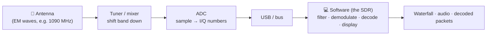
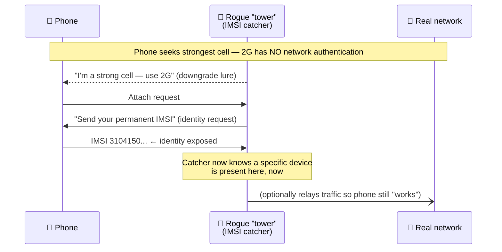

# Module 16 — The RF Underworld (SDR, sniffing, jammers — ethics & defense)

> **The one idea to keep:** Once a radio is *software*, the airwaves stop being a black box
> and become a **data source you can inspect**. That same power is exactly why spectrum is
> licensed and why interception, jamming, and spoofing are crimes. This module teaches you
> to *understand* the attacks — the only way to *defend* against them — while you only ever
> **receive legal signals** and never transmit where you have no right to.

You've spent fifteen modules learning how bits become signals ([Module 02](02-how-data-moves.md)),
how radio actually propagates and why it's hard ([Module 07](07-rf-wireless.md)), and how
the cellular stack encrypts your traffic over the air ([Module 11](11-lte-protocol-stack.md)).
This module points all of that at a single question: *if the air is a shared, open medium,
what stops anyone from reading, faking, or drowning out the signals in it?* The honest
answer is partly **physics**, partly **cryptography**, and partly **the law** — and a good
engineer needs all three in their head at once.

> ⚖️ **Legal & ethics — read this first, it governs the whole module.**
> The radio spectrum is a shared public resource, licensed and regulated everywhere
> (FCC in the US, Ofcom in the UK, your national regulator elsewhere). This module explains
> how attacks work **conceptually, so you can recognize and defend against them.** It does
> **not** give operational recipes. Three hard rules, true in most jurisdictions:
> - **Receiving** signals that are meant for the public (broadcast FM, aircraft beacons,
>   weather satellites) is generally legal. **Intercepting private communications** — even
>   just decoding them — is often a crime (e.g. the US Wiretap Act / ECPA), *even if the
>   signal lands on your antenna.*
> - **Transmitting** on almost any band without a license is illegal. **Jamming is a
>   serious federal crime everywhere** and endangers lives (aviation, 911, medical).
> - **Spoofing** identities or signals (GPS, base stations) is illegal and dangerous.
>
> When in doubt: **receive-only, public signals, your own network.** That's the entire
> sandbox for this module, and it's more than enough to learn deeply.

---

## 1. What "software-defined radio" actually means

A traditional radio is a **fixed-function circuit**: an FM tuner is built in hardware to do
one job — demodulate FM in the 88–108 MHz band. Want to receive something else? Different
hardware.

A **Software-Defined Radio (SDR)** moves as much of that work as possible *out of hardware
and into software*. The hardware shrinks to a minimal front end:

1. an **antenna** grabs a slice of the electromagnetic spectrum,
2. a **tuner** shifts a chosen frequency band down to a lower ("intermediate/baseband")
   frequency the electronics can handle,
3. an **ADC** (analog-to-digital converter — the same idea you met sampling audio in
   [Module 02](02-how-data-moves.md)) samples that analog waveform into a stream of numbers,
4. and then **software** does everything else: filtering, demodulation, decoding.

Those numbers are **I/Q samples** (in-phase and quadrature) — a pair of values per sample
that together capture both the *amplitude* and the *phase* of the wave. Recall from
[Module 02](02-how-data-moves.md) that amplitude + phase is exactly what a constellation
diagram plots; I/Q is the raw material a modem's demodulator (and now your software) reads
symbols out of. Whether it's AM, FM, QPSK, or 256-QAM is now a **matter of which code you
run**, not which chip you bought.



> **Mental model.** A regular radio is an appliance. An SDR is a **general-purpose radio
> peripheral** — a microphone for the entire radio spectrum — whose behavior is a program.
> That generality is the whole point, and also why it deserves respect.

> ⚡ **Latency note.** Because demodulation happens in a general-purpose CPU/GPU, SDR adds
> **buffering latency** (samples must be queued, filtered, FFT'd in blocks). It's wonderful
> for analysis but this is why production radios (your phone's baseband, Module 11) still
> use dedicated DSP/ASIC silicon: hardware pipelines hit microsecond-scale, deterministic
> timing that a general-purpose software stack can't guarantee.

---

## 2. The hardware tiers (and what "transmit" changes legally)

You do not need expensive gear to learn. The single most important distinction is
**receive-only vs transmit-capable**, because that line is also a legal line.

| Device | ~Price (2025) | Freq range | TX? | What it's for |
|--------|---------------|-----------|-----|----------------|
| **RTL-SDR** (RTL2832U dongle) | ~$30 | ~24 MHz–1.7 GHz | ❌ RX only | The learner's default. ADS-B, FM, NOAA, ISM. |
| **HackRF One** | ~$150–320 | 1 MHz–6 GHz | ✅ half-duplex | Wide-range RX; **TX is heavily regulated** |
| **LimeSDR / USRP / BladeRF** | ~$300–$2000+ | wide, full-duplex | ✅ | Research, labs, licensed dev work |

The RTL-SDR is a happy accident of history: a cheap DVB-T TV-tuner chip that hobbyists
discovered could be told to hand over **raw I/Q samples**. It **cannot transmit** — which
makes it the perfect, and safest, learning tool. Everything in this module's projects uses
it.

> ⚖️ **Owning a transmit-capable SDR is legal; keying it up is where the law bites.**
> A HackRF or USRP is a legitimate research and educational instrument. But the moment it
> **transmits** outside a band and power level you're licensed for, you're in violation —
> and potentially endangering others. Treat TX-capable gear the way you'd treat a
> tablesaw: fine to own, dangerous to use carelessly. For this course we stay **receive-only**.

---

## 3. Seeing the invisible: spectrum, the FFT, and the waterfall

The first magic moment with an SDR isn't decoding anything — it's *seeing* radio.

Software runs an **FFT (Fast Fourier Transform)** over the incoming I/Q stream to answer:
"how much energy is present at each frequency, right now?" Plot that and you get a
**spectrum** (a live graph of power vs frequency). Stack each spectrum row on top of the
last, scrolling downward with color = intensity, and you get a **waterfall** (a.k.a.
**spectrogram**) — a scrolling picture of the airwaves over time.

```
 power
   ▲        ╱╲            FM stations (88–108 MHz)
   │   ╱╲  ╱  ╲   ╱╲      each bump = one carrier
   │  ╱  ╲╱    ╲ ╱  ╲
   └──────────────────────► frequency
   waterfall = this graph, one row per instant, scrolling down over time
```

Suddenly you can literally *watch* the phenomena from earlier modules: a Wi-Fi channel's
20 MHz block lighting up, a garage remote's brief chirp, an FM station's steady pillar, the
frequency-hopping smear of Bluetooth skipping across the 2.4 GHz ISM band. This is the best
intuition-builder in all of RF.

> 🔧 **Project — your first waterfall (fully legal).** With an RTL-SDR and free software
> (e.g. SDR++, GQRX, or SDRangel), open a waterfall and slowly tune across the FM broadcast
> band (88–108 MHz). Identify stations as bright vertical pillars, then demodulate one and
> listen. You are *receiving a public broadcast* — squarely legal — and you've just used
> every stage of the Section 1 pipeline.

---

## 4. Decoding real, legal signals (the fun, lawful part)

Receiving **public, unencrypted, broadcast-intended** signals is where SDR learning lives.
Four classics, all receive-only and legal in most places:

| Signal | Band | What you get | Why it's legal to RX |
|--------|------|--------------|----------------------|
| **FM broadcast radio** | 88–108 MHz | Music/voice + RDS station text | Public broadcast |
| **ADS-B** (aircraft) | 1090 MHz | Live plane positions, altitude, callsign | Aircraft *broadcast* this openly, unencrypted |
| **NOAA APT weather sats** | ~137 MHz | Live cloud-cover images from polar satellites | Public, unencrypted downlink |
| **Unencrypted ISM telemetry** | 433/868/915 MHz | Weather stations, some sensors | Public, license-free ISM band |

**ADS-B** is the showpiece: every airliner overhead continuously broadcasts its GPS
position and ID in the clear so air traffic control and other aircraft can see it. Point an
antenna up and a decoder turns those 1090 MHz bursts into a live map of the sky above you.
It's legal precisely *because it's designed to be received by everyone* — the opposite of
private traffic.

> ⚖️ **The bright line.** "The signal reached my antenna" is **not** permission to decode
> it. Public broadcasts (above) are meant for all receivers. Your neighbor's baby monitor,
> a pager network, or someone's phone call is **not** — decoding those can be a wiretapping
> offense even if you never act on the contents. Legality tracks the *intent and privacy of
> the communication*, not whether your hardware can physically hear it.

> ⚡ **Latency note.** ADS-B is a great felt example of propagation vs processing delay
> ([Module 02](02-how-data-moves.md)): the 1090 MHz burst reaches you at light speed
> (microseconds for line-of-sight), but the *decode-and-plot* pipeline in software adds tens
> to hundreds of milliseconds. The plane on your screen lags reality by your software stack,
> not by the radio.

---

## 5. Passive sniffing — and why cellular defeats it

On a wired LAN you saw ([Module 03](03-link-layer.md)) that a switch mostly limits what you
can overhear. On **radio**, there is no such barrier: the medium is *broadcast by nature*.
Anyone in range receives every frame; the only real protection is **encryption**.

**Wi-Fi monitor mode.** A Wi-Fi adapter in **monitor mode** captures *all* 802.11 frames in
the air, not just those addressed to you, and hands them to a tool like **Wireshark**. Even
without the network password you can see **management frames** in the clear: SSIDs, the
device MAC addresses that are talking, beacon intervals, signal strength. The *payload* of a
WPA2/WPA3 network is encrypted, but the **metadata** — who is present, which networks phones
are probing for — leaks. This is the radio-world sequel to the ARP/MAC spoofing preview from
[Module 03](03-link-layer.md): unauthenticated, broadcast identifiers are cheap to observe
and to forge.

**Why you cannot casually sniff a phone call or LTE data.** Here's the payoff from
[Module 11](11-lte-protocol-stack.md): in LTE/5G the **PDCP layer ciphers user-plane traffic
over the air** with keys derived during authentication. So while an SDR can *see* the LTE
signal on the waterfall and even decode the *structure* of some broadcast/control channels,
the actual content is **AES-encrypted**. Sniffing gives you noise, not conversations. Radio
is wide open; **ciphering is what makes it private.**

> **Mental model.** On radio, *confidentiality is never provided by the medium* — the
> medium leaks everything. It's provided by **cryptography on top**. Every "why is X
> encrypted?" question in wireless has the same answer: because anyone with a $30 dongle can
> hear the raw bits.

---

## 6. IMSI catchers ("stingrays") — how they work and how modern networks defend

An **IMSI catcher** (street name **stingray**) is a **rogue base station**: a device that
pretends to be a legitimate cell tower to trick nearby phones into connecting to it. The
name comes from the **IMSI** (International Mobile Subscriber Identity) — the permanent
identifier of a SIM. Understanding these conceptually is essential *defensive* knowledge.

**The two weaknesses they exploit (both by design flaws in older generations):**

1. **Weak/one-way authentication.** In **2G (GSM)**, the phone authenticates to the network
   but the **network does not prove itself to the phone**. So a phone will happily attach to
   the strongest "tower" it sees — even a fake one. (This is the radio-scale version of
   ARP's "anyone can claim to be the gateway" from [Module 03](03-link-layer.md): an
   unauthenticated peer.)
2. **Downgrade attacks.** Even a 4G/5G phone can be **forced down to 2G**: the rogue station
   jams or refuses the modern bands and advertises a compelling 2G cell, and the phone falls
   back to the weaker protocol where step 1 applies. A **downgrade attack** deliberately
   pushes a victim onto an older, weaker standard.



**What an IMSI catcher can reveal:** primarily **presence and identity** — *which specific
devices are in a location at a time* (attendance at a protest, a building, a border). By
forcing 2G it may also expose weakly-encrypted or unencrypted call/SMS content. Its power is
mostly **identification and tracking**, not deep content interception on modern networks.

**The defenses — this is why 5G matters:**

- **Mutual authentication.** From 4G onward, and hardened in 5G, the **network must prove
  itself to the phone** (via keys tied to the SIM's secret) — a fake tower can't complete
  the handshake.
- **Encrypted identifiers (SUCI).** 5G stops broadcasting the permanent identity in the
  clear: the permanent **SUPI** is sent as an **encrypted SUCI** using the carrier's public
  key, so a passive catcher can't harvest a stable ID.
- **Downgrade protection & disabling 2G.** Modern OSes let you turn off 2G entirely
  ("2G toggle"), which removes the whole legacy attack surface. Networks and phones also
  detect and resist forced fallback.
- **Rogue-base-station detection.** Apps and network-side analytics watch for the tell-tale
  signs (a cell with no neighbors, odd identity requests, sudden downgrades).

> ⚖️ **Note the framing.** The material above is *how the attack is structured and how the
> standards defeat it* — deliberately not a build guide. Operating an IMSI catcher is
> illegal (unlicensed transmission + interception) essentially everywhere outside authorized
> law-enforcement use. The defensive takeaway: **keep devices on 4G/5G-only where possible,
> and understand that 5G's crypto — not the airwaves — is what protects you.**

---

## 7. Jamming — how it works, and why it is never yours to do

**Jamming** is conceptually the crudest attack: **flood a band with enough noise or a
strong carrier that legitimate signals can't be received.** Recall Shannon's law from
[Module 02](02-how-data-moves.md): capacity = Bandwidth × log₂(1 + **SNR**). A jammer simply
**collapses the SNR** by adding overwhelming interference, driving usable capacity toward
zero. No decoding, no cleverness — just brute-force denial of service on the physical layer.

That simplicity is exactly why it's treated so severely:

> ⚖️ **Jamming is illegal — full stop — and dangerous to life.** In the US, operating,
> marketing, or even *selling* a jammer violates the Communications Act; penalties run to
> six-figure fines and prison, and the same is true across most of the world. It is not a
> gray area. Jammers don't respect boundaries: knocking out "just Wi-Fi" can also take down
> **911 calls, aircraft navigation, medical telemetry, and emergency responders.** People
> have been federally prosecuted for using a cheap jammer to block phones in their car.
> **There is no legitimate civilian use.** This section exists so you can *recognize
> interference and reason about resilience* — nothing more.

**Defensive / resilience concepts** (how systems are designed to survive interference —
legitimate engineering):

- **Spread spectrum** — **FHSS** (frequency-hopping, as Bluetooth does) and **DSSS**
  (direct-sequence) spread energy across many frequencies so a narrowband jammer only dents
  part of the signal.
- **Error-correction coding** (from the cellular survival stack, [Module 11](11-lte-protocol-stack.md))
  tolerates partial corruption.
- **Interference detection & geolocation** — regulators and operators can *hunt* a jammer by
  triangulating the noise source; persistent jamming is quite findable.

---

## 8. GPS spoofing and replay attacks

**GPS** works by trusting tiny, **unauthenticated, extremely weak** signals from satellites.
Your receiver computes position from the timing of these public signals. Two problems follow.

**GPS spoofing** — transmitting *counterfeit* satellite signals, slightly stronger than the
real ones, so a receiver computes a **false position or time**. Because civilian GPS has
historically had **no authentication** (the signal format is public and unsigned), a
receiver can't tell a genuine satellite from a convincing fake. This has been used to
misdirect drones and ships, and to spoof the precise *time* many systems (including cellular
and financial networks) depend on.

**Replay attack** — the general pattern, and a cousin you already met: **capture a valid
transmission and re-transmit it later** to get an effect without ever understanding the
contents. The classic illustration is a **fixed-code** garage/car remote: record the button
press, play it back, the gate opens. This is the RF twin of the ARP/MAC trust problems in
[Module 03](03-link-layer.md) — a system that trusts a message *just because it's
well-formed*, with no proof of freshness or origin.

**Defenses (all about adding authentication + freshness):**

| Attack | Root cause | Defense |
|--------|-----------|---------|
| GPS spoofing | Unauthenticated, weak signals | **Signal authentication** (Galileo **OSNMA** signs civilian nav messages); multi-constellation cross-checks; inertial (IMU) sanity checks; detecting abnormal signal strength |
| Replay (remotes, etc.) | Static, reusable codes | **Rolling codes** (KeeLoq-style) & cryptographic **challenge-response** — each transmission is single-use and time/counter-bound |
| Replay (protocols) | No freshness | **Nonces, timestamps, sequence numbers** inside authenticated messages |

> **Mental model — the unifying lesson of Sections 5–8.** Every RF attack here exploits
> the same gap: **the airwaves authenticate nothing.** Sniffing beats *no encryption*;
> catchers beat *no mutual authentication*; spoofing/replay beat *no origin/freshness
> proof*. The fix is always the same shape — **put cryptography on top of the open medium.**
> That's why [Module 11](11-lte-protocol-stack.md)'s ciphering and 5G's mutual auth exist,
> and why "the medium is broadcast, trust nothing it doesn't prove" is the correct default.

---

## 9. The legal & ethical framework (carry this with you)

- **Spectrum is licensed and regulated.** Bands are allocated for specific uses; operating
  outside your rights (transmitting, especially) is an offense. Know your national regulator.
- **Receive public, don't intercept private.** Broadcasts intended for all (FM, ADS-B, NOAA)
  are fair game to receive. Private communications are protected by wiretap/interception law
  *even if your hardware can hear them.*
- **Never transmit without authorization.** No jamming, no rogue base stations, no spoofing —
  these are crimes and safety hazards, not experiments.
- **Test only what's yours, or where you have written permission.** Your own Wi-Fi, your own
  lab, a licensed range. "It's for learning" is not a legal defense.
- **Responsible disclosure.** If you discover a real vulnerability (in a product, a network,
  a protocol), report it privately to the vendor/operator and give them time to fix it before
  going public. That is how the defensive-security community operates — and it's the
  difference between a researcher and an offender.

> ⚖️ **The professional's stance.** The goal of studying attacks is to **build and operate
> systems that resist them.** You now understand *why* your traffic is encrypted, *why* 5G
> authenticates the network, *why* remotes use rolling codes, and *why* GPS is getting
> signed. That understanding is the deliverable — not a demonstration.

---

## Check your understanding

<div class="quiz">
<p class="q">Why can a $30 RTL-SDR let you watch live aircraft on a map, but <em>not</em> let you listen in on someone's 4G phone call?</p>
<ul class="options">
<li data-correct="true">ADS-B is broadcast unencrypted by design; LTE user traffic is ciphered at the PDCP layer, so the SDR only sees encrypted bits.</li>
<li>The RTL-SDR can't tune to cellular frequencies at all.</li>
<li>Phone calls travel through fiber, never over the air.</li>
</ul>
<div class="explain">Radio is a broadcast medium — the SDR physically hears both. The
difference is cryptography: ADS-B is meant to be received by everyone and is sent in the
clear, while LTE/5G encrypt the user plane (Module 11's PDCP ciphering), so the payload is
unreadable. Confidentiality on radio comes from encryption, never from the medium.</div>
</div>

<div class="quiz">
<p class="q">A modern 5G phone gets tricked into revealing its identity to a rogue base station. What did the attacker most likely rely on?</p>
<ul class="options">
<li>Breaking AES encryption in real time.</li>
<li data-correct="true">A downgrade attack that forced the phone onto 2G, which lacks network authentication.</li>
<li>Guessing the SIM's secret key.</li>
</ul>
<div class="explain">5G adds mutual authentication and encrypts the subscriber identity (SUCI),
so a fake tower can't complete the handshake or harvest a stable ID. The practical attack is
to <em>downgrade</em> the phone to 2G, where the network never proves itself. Disabling 2G on
the device removes that attack surface.</div>
</div>

<div class="quiz">
<p class="q">Which of these is a <em>legal</em> way to learn RF with an SDR?</p>
<ul class="options">
<li data-correct="true">Receiving and decoding ADS-B aircraft beacons and public FM broadcasts.</li>
<li>Transmitting a strong carrier to see which nearby devices stop working.</li>
<li>Decoding your neighbor's baby monitor because the signal reaches your antenna.</li>
</ul>
<div class="explain">Receiving public broadcasts (ADS-B, FM, NOAA) is legal. Transmitting to
disrupt devices is jamming — a serious crime that endangers safety systems. And "the signal
reached my antenna" is not consent: intercepting private communications can be a wiretapping
offense regardless of what your hardware can hear.</div>
</div>

---

## Exercises

*All exercises are passive, receive-only, and legal. Do not transmit.*

1. **Build the waterfall.** Set up an RTL-SDR with SDR++ / GQRX / SDRangel and open the FM
   broadcast band (88–108 MHz). Identify three stations as vertical pillars, tune one, and
   listen. Note how the waterfall makes each carrier visible.

2. **See the pipeline.** For the station you tuned, write down which stage of the Section 1
   pipeline (antenna → tuner → ADC → software) is doing each job: tuning, sampling, FM
   demodulation, audio output. Which of these are software?

3. **🔧 Track the sky (ADS-B).** Point an antenna up and run an ADS-B decoder (e.g.
   `dump1090`) on 1090 MHz. Watch aircraft appear on a live map with callsign and altitude.
   Explain in one sentence *why this is legal* using the "broadcast vs private" rule.

4. **🔧 Weather from space (NOAA APT, optional).** During a NOAA polar satellite pass
   (~137 MHz), record and decode an APT image. Note that this is a public, unencrypted
   downlink — the same legality principle as ADS-B.

5. **Scan your own Wi-Fi (metadata only).** On a network you own, use a Wi-Fi scanner or
   Wireshark in monitor mode to observe *management frames*: SSIDs, beacon intervals, device
   MACs, signal strength. Note what's visible **without** the password — and connect it to
   the ARP/MAC "unauthenticated identifiers" preview from Module 03.

6. **Reason about a defense.** Pick one attack from this module (IMSI catcher, jamming, GPS
   spoofing, or replay) and write a short paragraph: what gap it exploits, and which
   specific defense closes it. If your answer mentions "the airwaves authenticate nothing,"
   you've internalized the module.

---

## Key terms

- **SDR (Software-Defined Radio)** — a radio whose demodulation/decoding is done in software
  over raw I/Q samples, making one piece of hardware handle many signal types.
- **RTL-SDR** — a ~$30 **receive-only** USB dongle (repurposed DVB-T tuner); the standard
  learning tool. Cannot transmit.
- **HackRF / LimeSDR / USRP** — wider-range, **transmit-capable** SDRs for research/labs;
  transmitting is heavily regulated.
- **I/Q samples** — paired in-phase/quadrature values capturing a wave's amplitude *and*
  phase; the raw data an SDR processes.
- **Waterfall / spectrogram** — a scrolling plot of signal power vs frequency over time; how
  you *see* the airwaves.
- **IMSI catcher / stingray** — a rogue base station impersonating a real cell tower to
  identify and track nearby phones, exploiting weak authentication (2G) and downgrade lures.
- **Downgrade attack** — forcing a device onto an older, weaker protocol (e.g. 4G→2G) where
  security is missing.
- **Jamming** — flooding a band with noise/carrier to collapse SNR and deny service.
  **Illegal and dangerous everywhere.**
- **GPS spoofing** — transmitting counterfeit satellite signals to induce a false
  position/time in a receiver.
- **Replay attack** — capturing a valid transmission and re-sending it later to trigger an
  effect (e.g. fixed-code remotes); beaten by rolling codes / freshness proofs.

---

## Cheat-sheet

```
SDR PIPELINE
  antenna → tuner (shift band down) → ADC (→ I/Q samples) → SOFTWARE (filter/demod/decode)
  radio becomes a program; I/Q = amplitude + phase (the constellation, Module 02)

HARDWARE
  RTL-SDR ~$30  RX-ONLY        ← learn here, always safe
  HackRF/LimeSDR/USRP  TX-capable ← TX heavily regulated; owning ok, keying up ≠ ok

LEGAL SIGNALS TO RECEIVE (RX-only, public)
  FM 88–108 MHz | ADS-B 1090 MHz (planes) | NOAA APT ~137 MHz | ISM 433/868/915 MHz

THE BRIGHT LINE
  RX public broadcast  = generally legal
  Intercept private    = wiretapping crime, EVEN IF it reaches your antenna
  TRANSMIT unlicensed  = illegal | JAM = serious crime + safety hazard | SPOOF = illegal

WHY YOU CAN'T CASUALLY SNIFF CELLULAR
  radio is broadcast (everyone hears) → privacy comes ONLY from crypto
  LTE/5G cipher the user plane at PDCP (Module 11) → SDR sees encrypted bits

ATTACK → GAP → DEFENSE
  IMSI catcher  → no network auth (2G) + downgrade → 5G mutual auth, SUCI, disable 2G
  jamming       → collapses SNR (Shannon)          → spread spectrum, FEC, jammer hunting
  GPS spoofing  → unauthenticated weak signals      → signed nav (Galileo OSNMA), IMU cross-check
  replay        → static/reusable codes             → rolling codes, nonces, challenge-response

ONE LESSON: the airwaves authenticate NOTHING. Put cryptography on top.
```

---

**Next up → Capstone Projects** — see the roadmap in the [course home](README.md) for hands-on build-along projects combining hardware + software.
