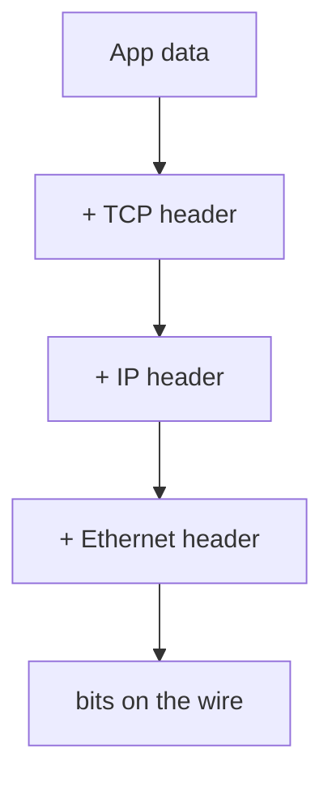

# Contributing

Thanks for helping make this the clearest networking course on the internet. 🎉

This course is **plain markdown + a tiny Docsify wrapper** — no build step, no framework
to learn. If you can write markdown, you can contribute.

## Ways to contribute

- **Fix errors / typos** — open a PR directly.
- **Improve an explanation** — clarity beats cleverness. If a section confused you, it
  confuses others.
- **Add a diagram** — Mermaid preferred (see below); ASCII is welcome too.
- **Add quizzes** — see the format below.
- **Write / expand a module** — grab a `*(soon)*` item from `_sidebar.md`. Open an issue
  first so we don't duplicate work.

## Running the site locally

No install needed — it's static. Any static server works:

```bash
# Option A: docsify-cli (nice live reload)
npm i -g docsify-cli
docsify serve .

# Option B: plain Python
python3 -m http.server 3000
# then open http://localhost:3000
```

## Style guide

- **Audience:** a strong software engineer who is weak on networking. Assume programming
  fluency; explain every networking term the first time it appears (and add it to
  `GLOSSARY.md`).
- Open each module with a `>` **mental-model** callout — the one idea to keep.
- Use `⚡ Latency note` blocks to tie concepts back to real latency.
- Label hands-on projects `🔧 Project`.
- End every module with **Exercises** and a **Cheat-sheet**.
- Prefer short sentences and concrete examples over abstraction.

## Adding a diagram (Mermaid)

Fenced ```mermaid blocks render both on the live site **and** in GitHub's file view:

````

````

## Adding an interactive quiz

Quizzes are just HTML that the site turns interactive (click an option → instant
feedback + explanation). Drop this into any module:

```html
<div class="quiz">
<p class="q">Which layer gets a packet to the right <em>machine</em>?</p>
<ul class="options">
<li data-correct="true">Network layer (L3 / IP)</li>
<li>Transport layer (L4)</li>
<li>Link layer (L2)</li>
</ul>
<div class="explain">IP addresses identify machines. Ports (L4) pick the program;
MAC (L2) only reaches the next hop.</div>
</div>
```

- Mark correct option(s) with `data-correct="true"` (multiple allowed).
- The `.explain` block is revealed after answering.

## Adding a new module

1. Create `NN-title.md` (zero-padded number).
2. Turn its `_sidebar.md` line from `*(soon)*` text into a `[link](NN-title.md)`.
3. Tick the box in the `README.md` progress tracker.
4. Add new terms to `GLOSSARY.md`.

## PR checklist

- [ ] New terms added to the glossary
- [ ] Sidebar / roadmap updated if you added a module
- [ ] Links work (`docsify serve .` and click through)
- [ ] Tone matches the style guide
