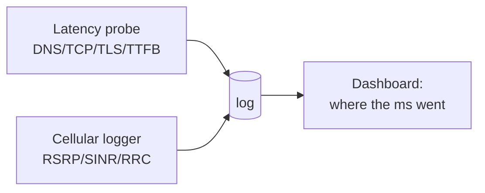

# 🛠️ Capstone Projects

> **The one idea to keep:** You don't *know* networking until you've watched it happen on
> your own machine and built something that pokes at it. These projects turn the whole course
> from "things I read" into "things I've seen and made." Each one names the modules it draws
> on, so it doubles as a review.

Six build-along projects, roughly easiest → hardest, each combining **software** and (for the
last two) **hardware**. Do them in any order, but Project 1 is the best warm-up. Every project
lists: **what you build**, **modules it exercises**, **tools**, **milestones**, and **stretch
goals**.

> ⚖️ **Before the RF projects (5–6):** only ever *receive/observe*. Transmitting, jamming, or
> intercepting others' traffic is illegal in most places — see [Module 16](16-rf-underworld.md).

<figure class="anim-fig">
<svg viewBox="0 0 720 210" role="img" aria-label="Animation: a captured packet being peeled layer by layer — Ethernet, IP, TCP, then the application data — as a packet analyzer dissects it.">
<style>
.capx-t{font-size:12px;font-weight:700;fill:#1f2d3d}
.capx-s{font-size:10px;fill:#8595a7}
.capx-wire{stroke:#cbd5e1;stroke-width:3}
.capx-pkt{animation:capxmove 7s linear infinite}
.capxL1{animation:capxr1 7s linear infinite}
.capxL2{animation:capxr2 7s linear infinite}
.capxL3{animation:capxr3 7s linear infinite}
.capxL4{animation:capxr4 7s linear infinite}
@keyframes capxmove{0%{opacity:0;transform:translateX(0)}6%{opacity:1}26%{opacity:1;transform:translateX(250px)}30%,100%{opacity:0;transform:translateX(250px)}}
@keyframes capxr1{0%,30%{opacity:0}35%,100%{opacity:1}}
@keyframes capxr2{0%,45%{opacity:0}50%,100%{opacity:1}}
@keyframes capxr3{0%,60%{opacity:0}65%,100%{opacity:1}}
@keyframes capxr4{0%,75%{opacity:0}80%,100%{opacity:1}}
</style>
<text x="12" y="20" class="capx-t" fill="#2c7be5">Project 1 — capture a packet, then peel it layer by layer</text>
<line class="capx-wire" x1="20" y1="60" x2="300" y2="60"/>
<text class="capx-s" x="20" y="48">the wire</text>
<rect x="300" y="44" width="90" height="32" rx="6" fill="#1f2d3d"/><text x="345" y="65" text-anchor="middle" style="font-size:11px;font-weight:700;fill:#fff">capture</text>
<g class="capx-pkt"><rect x="24" y="48" width="26" height="24" rx="4" fill="#ef4444"/></g>
<!-- peeled layers -->
<g class="capxL1"><rect x="420" y="44" width="280" height="26" rx="5" fill="#f59e0b"/><text x="560" y="61" text-anchor="middle" style="font-size:11px;font-weight:700;fill:#fff">Ethernet — src/dst MAC, EtherType</text></g>
<g class="capxL2"><rect x="440" y="76" width="260" height="26" rx="5" fill="#16a34a"/><text x="570" y="93" text-anchor="middle" style="font-size:11px;font-weight:700;fill:#fff">IP — src/dst address, TTL</text></g>
<g class="capxL3"><rect x="460" y="108" width="240" height="26" rx="5" fill="#2c7be5"/><text x="580" y="125" text-anchor="middle" style="font-size:11px;font-weight:700;fill:#fff">TCP — ports, seq/ack, flags</text></g>
<g class="capxL4"><rect x="480" y="140" width="220" height="26" rx="5" fill="#7c3aed"/><text x="590" y="157" text-anchor="middle" style="font-size:11px;font-weight:700;fill:#fff">HTTP — GET / …</text></g>
<text class="capx-s" x="420" y="188">Exactly the encapsulation from Module 01 — but from a real packet you captured.</text>
</svg>
<figcaption>Every project makes an abstract idea <b>tangible</b>: you capture, measure, or build the thing you read about.</figcaption>
</figure>

---

## Project 1 — Layer X-Ray: a packet dissector
**Difficulty:** ⭐ beginner · **Modules:** [01](01-the-layered-model.md) [03](03-link-layer.md) [04](04-network-layer.md) [05](05-transport-layer.md) [06](06-application-protocols.md)

**What you build:** a tiny tool that captures live packets and prints each layer's headers —
seeing encapsulation for real.

**Tools:** Wireshark (GUI) and Python with `scapy` (`pip install scapy`), or `tcpdump`.

**Milestones:**
1. In Wireshark, capture while loading a plain `http://` site; pick one packet and expand
   `Ethernet → IP → TCP → HTTP`. Confirm the nesting from Module 01.
2. Write a ~20-line scapy sniffer that prints, per packet: src/dst MAC, src/dst IP, TCP ports,
   and flags. (`sniff(prn=..., count=20)`.)
3. Add a column that labels each packet's highest layer (ARP? DNS? TLS? HTTP?).
4. Compute and print the header **overhead ratio** (header bytes ÷ total) — see Signal Log Q05
   come alive.

**Stretch:** reassemble a full TCP stream; flag retransmissions; detect the TLS `ClientHello`
and extract the SNI (ties to the [TLS deep-dive](deep-dive-tls-certificates.md)).

---

## Project 2 — The Latency Budget Probe
**Difficulty:** ⭐⭐ · **Modules:** [02](02-how-data-moves.md) [05](05-transport-layer.md) [06](06-application-protocols.md) [13](13-latency.md) + [google.com deep-dive](deep-dive-loading-google.md)

**What you build:** a script that measures and **attributes** each phase of a request — DNS,
TCP connect, TLS, time-to-first-byte, download — then charts it across sites and networks.

**Tools:** `curl` with a timing format, or Python `requests`/`httpx` + `matplotlib`.

The one-liner that starts it all:
```bash
curl -w "dns=%{time_namelookup} connect=%{time_connect} tls=%{time_appconnect} ttfb=%{time_starttransfer} total=%{time_total}\n" -o /dev/null -s https://example.com
```

**Milestones:**
1. Run the `curl -w` probe against 5 sites; tabulate the phases.
2. Wrap it in a script that runs each site N times and reports p50/p95 (tail latency, Module 13).
3. Compare the **same** target over Wi-Fi vs a phone hotspot (4G/5G) — watch the mobile
   RRC/setup tax appear ([Module 12](12-procedures.md)).
4. Plot a stacked bar per site (like the Module 13 budget animation) — DNS + TCP + TLS + TTFB.

**Stretch:** add a warm-vs-cold run (second request reuses DNS cache + connection — see how the
budget collapses); test HTTP/2 vs HTTP/3 with `--http3`.

---

## Project 3 — Mini DNS Resolver
**Difficulty:** ⭐⭐⭐ · **Modules:** [04](04-network-layer.md) [06](06-application-protocols.md) + [DNS deep-dive](deep-dive-dns.md)

**What you build:** an **iterative** resolver that walks the hierarchy yourself — root → TLD →
authoritative — instead of asking `8.8.8.8`.

**Tools:** Python `dnspython` (`pip install dnspython`), or raw UDP sockets if you're brave.

**Milestones:**
1. Query a public resolver for `A`, `AAAA`, `MX`, `NS` of a domain; print the TTLs.
2. Hard-code the root server IPs; send the query to a root, read the referral to the `.com`
   servers, then to the domain's authoritative servers — following glue records.
3. Print each step ("asked root → referred to .com → referred to ns1 → answer") — you've
   reproduced `dig +trace`.
4. Add a simple cache honoring TTLs; show the second lookup is instant.

**Stretch:** implement negative caching (NXDOMAIN); add DNSSEC signature checking; expose it as
a tiny local resolver your OS can point at.

---

## Project 4 — Build a Tiny VPN / Tunnel
**Difficulty:** ⭐⭐⭐ · **Modules:** [01](01-the-layered-model.md) [04](04-network-layer.md) [15](15-vpns.md)

**What you build:** a working encrypted tunnel between two machines, then (stretch) a toy
userspace tunnel so you *see* packet-in-packet encapsulation.

**Tools:** WireGuard (`wg`, `wg-quick`); optionally Python with a TUN interface.

**Milestones:**
1. Set up WireGuard between two devices (a laptop and a cloud VM, or two VMs). Generate keys,
   configure peers, bring the tunnel up, `ping` across it.
2. In Wireshark, capture on the *physical* interface: you'll see only opaque UDP (encrypted).
   Capture on the *tunnel* interface: you'll see the real inner packets. That contrast **is**
   the tunnel.
3. Turn on **split tunneling** (route only one subnet through the VPN) and confirm with
   `traceroute` which traffic goes where.
4. Deliberately break the MTU (lower it) and watch fragmentation/black-holing (Module 04 + 15).

**Stretch:** build a minimal TUN-based tunnel in Python that reads IP packets, wraps them in a
UDP datagram to a peer, and unwraps on the other side — encapsulation you wrote yourself.

---

## Project 5 — SDR Spectrum Explorer & ADS-B Receiver
**Difficulty:** ⭐⭐⭐ hardware · **Modules:** [02](02-how-data-moves.md) [07](07-rf-wireless.md) [16](16-rf-underworld.md)

**What you build:** turn ~$30 of hardware into a radio you can *see*, then decode real aircraft
transponder signals — all **receive-only and legal**.

**Tools:** an **RTL-SDR** USB dongle + antenna; `SDR++`/`GQRX` (waterfall), `dump1090` (ADS-B),
`rtl_433` (ISM sensors).

**Milestones:**
1. Install the SDR software; watch the **waterfall** — tune to the FM broadcast band and
   *see* stations as bright columns (Module 07 spectrum made visible).
2. Run `dump1090` on 1090 MHz and decode **ADS-B** — live aircraft positions on a map.
3. Run `rtl_433` and watch it decode unencrypted 433 MHz sensors (weather stations, tyre
   pressure) — real modulation from Module 02 being demodulated.
4. Note *why* you can read these but not your phone's cellular traffic: it's **encrypted**
   (PDCP ciphering, [Module 11](11-lte-protocol-stack.md)).

**Stretch:** decode NOAA weather-satellite images; view a live constellation diagram of a
signal and connect it to the [Module 02](02-how-data-moves.md) QAM animation.

---

## Project 6 — Cellular Signal & RRC Logger (the modem, live)
**Difficulty:** ⭐⭐⭐⭐ · **Modules:** [09](09-cellular-architecture.md) [10](10-lte-air-interface.md) [11](11-lte-protocol-stack.md) [12](12-procedures.md) [13](13-latency.md)

**What you build:** a log of your phone's real radio behaviour — signal quality, RRC state,
cell changes — correlated with latency. This is the "modem" heart of the whole course.

**Tools:** an Android phone + **NetMonster** or **Network Signal Guru** (or the built-in field-
test/engineering mode); a `ping`/HTTP latency logger.

**Milestones:**
1. Open the app and read live **RSRP / RSRQ / SINR / CQI** and the serving cell (Module 10).
2. Watch the **RRC state** flip IDLE ↔ CONNECTED as you start/stop traffic — and time the
   first ping after idle (the ~50–100 ms wake tax, Module 12).
3. Walk around and log **cell reselection / handover** and how signal metrics change (Module 12).
4. Run continuous `ping` while moving; correlate latency spikes with weak SINR and handovers —
   attribute them using the [Module 13](13-latency.md) budget.

**Stretch:** compare NB-IoT/LTE-M behaviour if you have such a device (Module 14); log PSM/eDRX
sleep and measure downlink reachability delay.

---

## Capstone of capstones — the End-to-End Latency Observatory

Combine **Project 2** (latency probe) and **Project 6** (cellular logger) into one small
dashboard: for each request, record the per-layer timing *and* the radio conditions at that
moment, then visualize "where the milliseconds went" across Wi-Fi vs mobile, cold vs warm.
That single artifact demonstrates you can attribute latency across **every layer of this
course** — which was the whole point.



---

## Where to go beyond the course

- **Read real specs:** 3GPP TS 36.300 (LTE overview), 38.300 (5G NR) — dense but authoritative.
- **CS144** (Stanford) — build a TCP implementation from scratch.
- **Contribute back:** add a project or fix a module — see [Contributing](CONTRIBUTING.md).
- **Keep asking:** every question you bring becomes a permanent entry in the
  [📡 Signal Log](SIGNAL-LOG.md).

**You've gone from "what is a layer?" to building tunnels and reading the airwaves. That's the
zero-to-hero arc — congratulations.** 🎓
