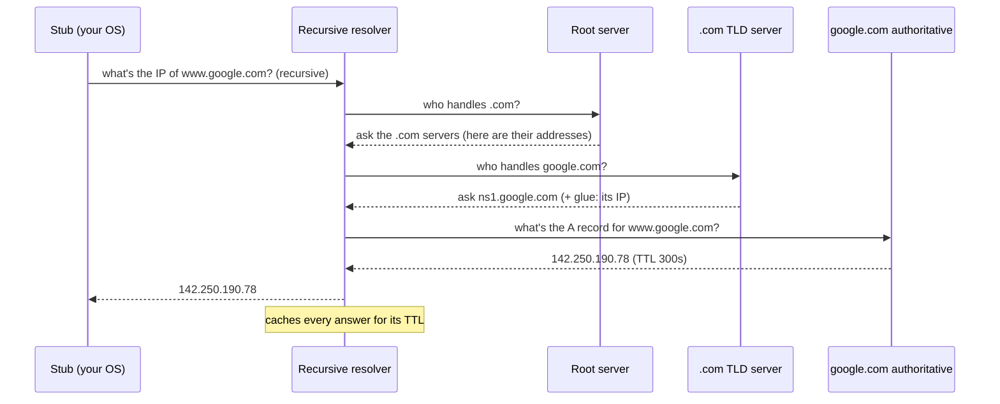

# 🔎 Deep Dive: How DNS *really* works

> **The one idea to keep:** DNS is a **distributed, hierarchical, cached database** — the
> internet's phone book — engineered so that **no single machine ever holds the whole thing**,
> yet almost any name on Earth resolves to an address in milliseconds. Its three superpowers
> are **hierarchy** (split the work), **delegation** (nobody's in charge of everything), and
> **caching** (answer most queries without asking anyone). Miss those three and DNS looks
> like magic; understand them and it looks inevitable.

This page answers, in depth, exactly what you asked:
- How does DNS work, and how is it *not* a single step?
- How does it handle *this many* requests and domains?
- How does it resolve and map everything?
- If "the map" is wiped, does everything go null?
- How is the map secured?
- What are the hidden things behind the scenes?

📚 This is the full version of DNS Phase 2–3 from the
[google.com deep-dive](deep-dive-loading-google.md). Module 06 will formalize it.

---

## 1. The problem DNS solves (and why one server can't)

Humans want **names** (`google.com`); machines route to **IP addresses** (`142.250.190.78`,
Module 01). So we need a lookup service: name → IP. Simple in principle. Brutal at scale:

- **Hundreds of millions** of registered domains.
- **Trillions** of lookups per day, globally.
- New domains and IP changes happen constantly.
- It must be **fast** (it's the *first* thing before any connection — Module 02 latency).

You cannot put that in one server, or even one data center. A single machine would be a
performance bottleneck, a single point of failure, and a juicy attack target. So DNS is
built as the opposite of "one big map." This is the "component-divided thing" you suspected.

---

## 2. The core trick: a hierarchy of delegated responsibility

The domain namespace is a **tree**, read **right to left**:

```
                         . (root)
                         │
        ┌────────────┬───┴────┬──────────────┐
      com          org       net     ...   uk  (TLDs — Top-Level Domains)
        │                                    │
     google                               co.uk
        │                                    │
   ┌────┴────┐                            bbc
  www      mail                            │
                                          www
   www.google.com.                    www.bbc.co.uk.
```

The magic word is **delegation**: each level hands off responsibility for everything below
it to someone else.

- The **root** doesn't know where `google.com` is. It only knows *"for anything ending in
  `.com`, go ask the `.com` servers."*
- The **`.com` servers** don't know `www.google.com`. They only know *"for `google.com`, go
  ask Google's nameservers."*
- **Google's nameservers** are **authoritative** for `google.com` — they hold the actual
  records.

> **Why this is the whole answer to "how does it scale?"** Responsibility is *partitioned*.
> Google manages its own records; Verisign manages `.com`'s delegations; the root manages the
> list of TLDs. Nobody has to know everything, so the system grows without any central
> bottleneck. Add a billion domains and the root's job doesn't get any bigger — it still just
> points at the ~1,500 TLDs.

---

## 3. The players (the components you intuited)

| Component | Who runs it | Job |
|-----------|-------------|-----|
| **Stub resolver** | Your OS (in your device) | The tiny client that just asks "resolve this for me" |
| **Recursive resolver** | Your ISP, or `8.8.8.8` / `1.1.1.1` | Does all the legwork on your behalf; **caches** heavily |
| **Root name servers** | 12 orgs, 13 "letters" (a–m), thousands of instances | Point to the right TLD servers |
| **TLD name servers** | Registries (e.g. Verisign for `.com`) | Point to the authoritative servers for each domain |
| **Authoritative name servers** | The domain owner (or their DNS provider) | Hold the actual records (A, MX, …) |
| **Registrar / Registry** | e.g. GoDaddy / Verisign; governed by ICANN/IANA | How a name gets *into* the system in the first place |

The critical split: the **recursive resolver** does the hunting and remembers answers; the
**authoritative servers** are the source of truth but are only asked when nobody has a cached
answer.

---

## 4. How a name actually resolves (the multi-step walk)

Here's the "not a single step" process, end to end. Say nothing is cached anywhere:



Two modes of asking, and the distinction matters:
- **Recursive query** (stub → resolver): *"Give me the final answer; do whatever it takes."*
- **Iterative queries** (resolver → root/TLD/auth): each server replies *"I don't have it,
  but here's who to ask next."* The resolver walks the chain itself.

**Glue records** solve a chicken-and-egg problem: the `.com` server says "ask
`ns1.google.com`" — but to ask it you need *its* IP, which is itself under `google.com`. So
the TLD server also ships the IP of `ns1.google.com` directly ("glue"), breaking the loop.

The first time, this takes several round-trips. **Every subsequent time, caching collapses it
to ~zero** (Section 6).

---

## 5. What's actually stored: the "map" is many record types

A domain's authoritative data (its **zone**) isn't just name→IP. It's a set of typed
records:

| Record | Maps / means |
|--------|--------------|
| **A** | name → IPv4 address |
| **AAAA** | name → IPv6 address |
| **CNAME** | name → *another name* (an alias; "look this up instead") |
| **MX** | name → mail servers (with priorities) |
| **NS** | which nameservers are authoritative for this zone |
| **SOA** | "Start of Authority" — zone metadata: primary NS, serial, timers, **negative-cache TTL** |
| **TXT** | arbitrary text (used for SPF/DKIM email auth, domain verification) |
| **PTR** | IP → name (reverse DNS) |
| **SRV** | service location (host+port for a service) |
| **CAA** | which Certificate Authorities may issue certs for this domain |

So "the map" is really millions of small **zone files**, each owned and served by whoever
runs that domain — not one global table.

---

## 6. How it handles *this many* requests — the real mechanisms

You asked the killer question. Here's how DNS absorbs planetary load:

### a) Caching — by far the biggest lever
Every answer carries a **TTL** (time-to-live, in seconds). Anyone who learns it may reuse it
until the TTL expires, at *multiple* layers:
- **Browser cache** → **OS stub cache** → **recursive resolver cache**.
- Result: the *overwhelming majority* of lookups are answered from cache without ever
  touching root/TLD/authoritative servers. The root servers see a tiny fraction of the
  world's queries precisely because `.com`'s location is cached almost everywhere, almost
  always.
- **Negative caching too:** "this name doesn't exist" (**NXDOMAIN**) is cached (per the SOA's
  timer), so typos and dead names don't hammer the servers repeatedly.

### b) Hierarchy + delegation — distributes the *work itself* (Section 2)
No server is on the path for more than its slice.

### c) Anycast — one IP, thousands of servers
The same IP address is **announced from many locations worldwide** (via BGP routing, Module
04). The network delivers your query to the *topologically nearest* instance. So `8.8.8.8`
isn't one machine — it's thousands, all over the planet, sharing an address. Same for the
root servers: 13 *identities* (a–m) but **well over a thousand physical instances** via
anycast.

### d) Massive redundancy
Every zone must have **at least two** authoritative nameservers (usually more, in different
locations/networks). Big providers run huge fleets.

### e) Lightweight protocol
Queries are tiny **UDP** packets (port 53) — no connection setup, stateless, cheap to serve
at enormous rates.

> **Net effect:** caching answers most queries locally; hierarchy keeps any one server's job
> small; anycast + redundancy spread the rest across thousands of machines. That combination
> is how a "single lookup service" serves the entire internet.

---

## 7. "If the map is wiped, does everything go null?"

Brilliant question — and the answer reveals the whole resilience design. **No, not
instantly, and not globally — because there is no single map to wipe.**

- **There's no central copy.** The data lives in millions of independently-operated zones.
  You'd have to wipe them all — there's no one place to attack.
- **Caches keep things alive.** If an authoritative server goes down, cached answers
  everywhere keep resolving that domain **until their TTLs expire** (seconds to days). Short
  outages are invisible to most users.
- **Redundancy per zone.** Multiple authoritative servers mean one dying doesn't break the
  domain. They stay in sync via **zone transfers** (AXFR/IXFR) from a primary to secondaries.
- **The root is extraordinarily hardened.** 13 identities × anycast = thousands of instances
  across the globe. Attacks on the root have happened and barely registered.
- **What *does* break:** if a specific domain's authoritative servers *all* go down **and**
  its cache entries expire, *that domain* becomes unresolvable — but only that domain, and
  only after TTL. This is what happened in outages like **Dyn (2016)** and **Facebook (2021)**:
  not "DNS died," but "a big provider's authoritative servers became unreachable, so the names
  they served stopped resolving once caches lapsed." DNS as a *system* kept running fine.

> **Takeaway:** DNS degrades **locally and gradually** (per-domain, on TTL expiry), never
> "everything goes null at once." Decentralization + caching + redundancy is exactly what
> makes wiping it impossible.

---

## 8. How is the map secured?

DNS was designed in a trusting era, so security was bolted on later. There are **two
different problems** people constantly conflate — keep them separate:

### Problem A: "Is this answer authentic?" → **DNSSEC**
Classic attack: **cache poisoning** (the **Kaminsky attack**, 2008) — trick a resolver into
caching a forged answer, sending users to an attacker's IP.

- **First-line defenses:** randomize the 16-bit **query ID** *and* the source port, so an
  attacker can't easily guess and forge a matching reply.
- **The real fix — DNSSEC (DNS Security Extensions):** authoritative servers
  **cryptographically sign** their records (`RRSIG`), publish public keys (`DNSKEY`), and each
  parent zone signs a hash of its child's key (`DS` record). This builds a **chain of trust
  from the root down** — resolvers can verify an answer genuinely came from the real zone owner
  and wasn't tampered with.
- **Important:** DNSSEC provides **authenticity + integrity, NOT confidentiality.** It proves
  the answer is real; it does **not** hide it. And it's still only partially deployed.

### Problem B: "Can others *see* my lookups?" → **encrypted transport**
Plain DNS is unencrypted, so your ISP (or anyone on the path) can read every domain you look
up. Fixes:
- **DoT (DNS over TLS)** — DNS inside a TLS tunnel, port 853.
- **DoH (DNS over HTTPS)** — DNS inside HTTPS, port 443 (indistinguishable from web traffic).
- These give **privacy** between you and your resolver. (They don't verify the *data's*
  authenticity — that's DNSSEC's job. You often want both.)

### Problem C: taking the domain itself
- **Domain hijacking** — stealing control at the **registrar** (via phished credentials).
  Defenses: **registrar/registry locks**, 2FA on the account. This is an account-security
  problem, not a protocol one.
- **DDoS** on nameservers — absorbed via anycast, over-provisioning, and **Response Rate
  Limiting**.

> **One-line memory:** **DNSSEC = "is it real?"** (signatures). **DoH/DoT = "is it private?"**
> (encryption). **Registry lock = "is it still mine?"** (account security). Three different
> guarantees.

---

## 9. The hidden things behind the scenes

The stuff that makes DNS quietly powerful and that most people never see:

- **TTL & caching layers** — the unsung hero (Section 6). Tuning TTL is a real ops tradeoff:
  low TTL = fast change propagation but more load; high TTL = less load but slow to update.
- **Anycast** — "one IP, everywhere" (Section 6c). Foundational and invisible.
- **GeoDNS / latency-based routing** — *this is the big one.* Authoritative servers can return
  **different answers to different users** based on where the query comes from. Ask for
  `google.com` in India vs the US and you get **different IPs** — the nearest data center.
  **This is how CDNs and global load balancing work**: the "map" is dynamic and
  location-aware, not a fixed lookup. (Helped by **EDNS Client Subnet**, which passes a hint
  about the client's network to the authoritative server.)
- **CNAME chains** — big sites point their name at a CDN's name (`example.com` → CNAME →
  `example.cdn.com`), so the CDN controls the final IP. Lots of real-world DNS is chasing
  these aliases.
- **EDNS(0)** — an extension mechanism that lets DNS carry bigger messages and new features
  (like DNSSEC and Client Subnet) over the original tiny protocol.
- **Root KSK rollover** — the root's master signing key is periodically, very carefully
  rotated globally (a genuinely high-stakes internet-governance event).
- **Registrar → Registry → ICANN/IANA** — the governance chain that makes names unique and
  delegable in the first place; **WHOIS/RDAP** exposes registration data.
- **Browser prefetching & "Happy Eyeballs"** — browsers pre-resolve links you might click,
  and race IPv4 vs IPv6 (AAAA vs A) to use whichever connects first.

---

## The latency angle (ties to your motivation)

- A **cold** resolution can cost several round-trips (root → TLD → auth). On a distant path
  that's real milliseconds *before your connection even starts* (Module 02's propagation
  delay applies to each DNS hop too).
- **Caching + anycast + nearby resolvers** exist largely to crush that first-connection
  latency. Choosing a fast resolver (`1.1.1.1`, `8.8.8.8`) and DNS prefetching are concrete
  latency wins.
- On **mobile**, a cold DNS lookup can also be preceded by RRC radio wake-up (Module 12) —
  stacking delays. This is why aggressive DNS caching matters even more on cellular.

---

## Check your understanding

<div class="quiz">
<p class="q">Why do the root DNS servers <em>not</em> get overwhelmed despite the internet's scale?</p>
<ul class="options">
<li>They are the most powerful supercomputers on Earth.</li>
<li data-correct="true">Caching + hierarchy mean most queries never reach them, and anycast spreads the rest across thousands of instances.</li>
<li>They only run at night.</li>
</ul>
<div class="explain">The root only needs to point at ~1,500 TLDs, and that information is
cached almost everywhere, so the vast majority of lookups never touch the root. What remains
is spread across 13 identities × thousands of anycast instances worldwide.</div>
</div>

<div class="quiz">
<p class="q">An authoritative server for example.com goes completely offline. What happens?</p>
<ul class="options">
<li>example.com instantly becomes unreachable for everyone worldwide.</li>
<li data-correct="true">It keeps resolving from caches until TTLs expire (and from any redundant authoritative servers); only then does it fail — and only for that domain.</li>
<li>The entire .com TLD goes down.</li>
</ul>
<div class="explain">There's no single map to wipe. Cached answers keep working until their
TTL lapses, redundant authoritative servers cover for the dead one, and the failure is scoped
to that one domain — never "everything goes null." This is the caching+redundancy resilience
design.</div>
</div>

<div class="quiz">
<p class="q">What's the difference between DNSSEC and DNS-over-HTTPS (DoH)?</p>
<ul class="options">
<li>They're two names for the same thing.</li>
<li data-correct="true">DNSSEC cryptographically proves an answer is authentic (integrity); DoH encrypts the query for privacy. Different guarantees — you may want both.</li>
<li>DNSSEC encrypts queries; DoH signs records.</li>
</ul>
<div class="explain">DNSSEC = "is this answer real and untampered?" (signatures, chain of trust
from the root) — but it's <em>not</em> encrypted. DoH/DoT = "can eavesdroppers see my
lookups?" (encryption between you and the resolver) — but it doesn't validate the data.
They solve orthogonal problems.</div>
</div>

---

## Exercises

1. **Watch the hierarchy walk.** Run `dig +trace www.google.com`. You'll see the resolver go
   root → `.com` → Google's nameservers, step by step — Section 4 live in your terminal.

2. **See caching & TTL.** Run `dig google.com` twice. Note the **TTL** field counting down on
   the second call (served from cache). Try different record types: `dig google.com MX`,
   `dig google.com AAAA`, `dig google.com NS`.

3. **See GeoDNS in action.** Resolve a big CDN-hosted site and note the IP; compare with a
   public resolver in another region (e.g. `dig @8.8.8.8` vs a regional resolver) — you may
   get different IPs. That's location-aware DNS steering you to the nearest edge.

4. **Check DNSSEC.** Run `dig +dnssec cloudflare.com` and look for `RRSIG` records — signed
   answers. Compare a domain that isn't signed.

5. **Inspect the chain of aliases.** Run `dig www.github.com` and follow any `CNAME` records
   to see how the name delegates to a hosting/CDN provider.

6. **Explain it back.** In a note: *"Why is DNS able to serve the whole internet without a
   central server, and why doesn't wiping one server break it?"* If you hit hierarchy,
   delegation, caching, and redundancy, you've mastered this page.

---

## Cheat-sheet

```
DNS = distributed, hierarchical, cached name→IP database (the internet's phone book)
  3 superpowers: HIERARCHY (split work) · DELEGATION (nobody owns all) · CACHING (skip the ask)

HIERARCHY (read right→left):  root(.) → TLD(.com) → domain(google.com) → host(www)
  each level DELEGATES the level below (root knows TLDs; TLD knows domains; auth knows records)

PLAYERS:
  stub (your OS) → recursive resolver (does legwork, CACHES) → root → TLD → authoritative
  recursive query = "get me the answer"; iterative = "here's who to ask next"
  glue record = ships the nameserver's IP to break the chicken/egg loop

RECORDS: A(v4) AAAA(v6) CNAME(alias) MX(mail) NS(nameservers) SOA(zone meta) TXT PTR SRV CAA

SCALE (how it handles the load):
  CACHING (TTL, multi-layer, + negative/NXDOMAIN)  ← biggest lever
  HIERARCHY/DELEGATION (small job per server)
  ANYCAST (one IP = thousands of servers; picks nearest)
  REDUNDANCY (≥2 authoritative per zone; zone transfer AXFR/IXFR)
  UDP/53 (tiny, stateless)

RESILIENCE ("map wiped?"):  no central map. caches survive outages till TTL; redundant
  servers cover; failure is PER-DOMAIN after TTL, never global-instant. (Dyn'16, FB'21.)

SECURITY (3 different guarantees):
  DNSSEC   = authenticity/integrity (RRSIG/DNSKEY/DS, chain of trust from root) — NOT encrypted
  DoH/DoT  = privacy (encrypt query to resolver, port 443/853) — NOT authenticity
  registry lock + 2FA = anti-hijack (account security)

HIDDEN GEMS: TTL tuning · anycast · GeoDNS/latency routing (=CDN & load balancing!) ·
  EDNS Client Subnet · CNAME chains · root KSK rollover · registrar/registry/ICANN · Happy Eyeballs
```

---

**Related:** [🌐 hitting google.com](deep-dive-loading-google.md) · Module 04 (routing/anycast
mechanics) · Module 06 (DNS/TLS/HTTP formalized).
