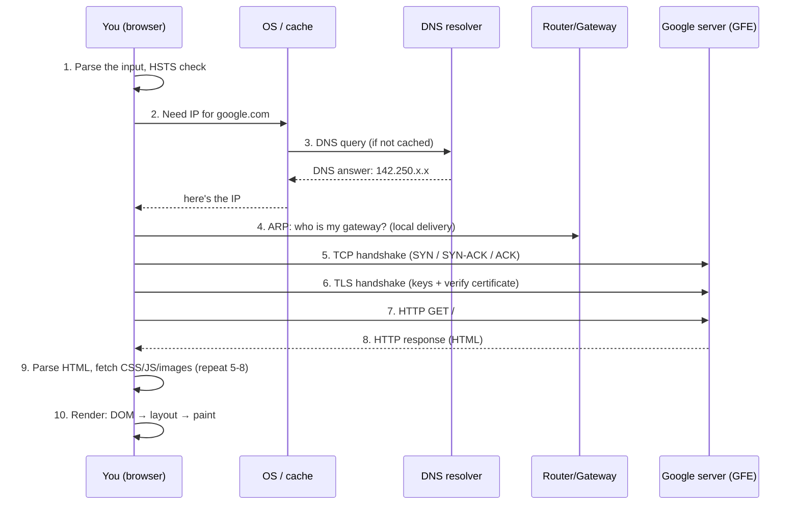

# 🌐 Deep Dive: What *actually* happens when you hit `google.com`

> **The one idea to keep:** "Loading a web page" is not one action — it's a *relay race*
> across every layer you're learning, run several times over. Before a single pixel of
> Google appears, your machine has looked up an address, woken up a radio (on mobile),
> found a path across the planet, proven the server's identity with cryptography, and
> exchanged a dozen packets — often in well under a second.

This is the famous interview question *"what happens when you type google.com and press
Enter?"* We'll answer it **in depth**, and each phase links to the module that covers it
fully. Think of this page as the **map with a real journey drawn on it** — come back to it
after each module and you'll understand a little more.

We'll assume the realistic modern case: **HTTPS, HTTP/2 or HTTP/3, on a laptop over Wi-Fi**
(with a note on what changes on a 4G phone).

---

## The whole journey at a glance



Now let's walk each step slowly.

---

## Phase 1 — The browser processes what you typed

Before any network activity at all:

1. **Is this a URL or a search?** The browser decides whether `google.com` is an address
   or a search term. A bare word triggers a search; `google.com` (has a dot, valid host)
   is treated as a URL and gets `https://` prepended.
2. **HSTS check.** Google is on the browser's **HSTS preload list** — a built-in list of
   sites that must *only* be visited over HTTPS. So the browser never even tries plain
   HTTP; it goes straight to `https://google.com`. (HSTS = HTTP Strict Transport Security;
   it prevents downgrade attacks.)
3. **Is it already open?** The browser checks whether it already has a live, reusable
   connection to Google (connection pooling) — if so, it can skip much of what follows.

> Nothing has left your machine yet. This is all local, sub-millisecond work.

---

## Phase 2–3 — Turn the name into an address: DNS
📚 *Full coverage: Module 06 (Application protocols).*

Computers route to **IP addresses**, not names (Module 01: "IP → the machine"). So the
first real task is translating `google.com` → an IP like `142.250.190.78`. This is **DNS**
(the Domain Name System) — essentially the internet's phone book.

Your machine checks a **cascade of caches** first, stopping at the first hit:

1. **Browser cache** — did this browser resolve it recently?
2. **OS cache** — the operating system's resolver cache (`getaddrinfo`).
3. **`hosts` file** — a local manual override file (`/etc/hosts`).
4. If all miss → ask a **recursive resolver** (usually your ISP's, or `8.8.8.8` /
   `1.1.1.1`).

If it reaches the recursive resolver and *it* has no cached answer, the resolver does the
real hunt, walking the DNS hierarchy from the top:

```
resolver → Root servers:  "who handles .com?"        → "ask the .com TLD servers"
resolver → .com TLD:      "who handles google.com?"  → "ask Google's nameservers (ns1.google.com)"
resolver → Google's NS:   "what's the A record for google.com?" → "142.250.190.78"
```

- These queries typically travel over **UDP on port 53** (small, fast, fire-and-forget —
  Module 05 explains why UDP suits DNS). Larger answers or secure variants use TCP,
  **DoH** (DNS-over-HTTPS), or **DoT** (DNS-over-TLS).
- Every answer comes with a **TTL** (time-to-live) so it can be cached — which is why the
  *second* time you visit, DNS is often instant (0 RTT).
- **`A` record** = IPv4 address; **`AAAA`** = IPv6. Google publishes both.
- Google uses **Anycast** — the same IP is announced from many data centers worldwide, and
  the network routes you to the nearest one. So "the IP of google.com" isn't one machine;
  it's the closest of thousands.

> ⚡ **Latency note.** A cold DNS lookup can cost a full round-trip (or several, if the
> resolver has to walk the hierarchy). A warm cache costs ~0. This is why DNS caching and
> low-latency resolvers materially affect how fast pages *feel*.

---

## Phase 4 — Getting the first packet out the door: ARP & local delivery
📚 *Full coverage: Module 03 (Link layer) & Module 04 (Network layer).*

You now have Google's IP — but Google isn't on your local network. Recall from Module 01:
**IP is end-to-end, but L2 delivery is one hop at a time.** Your packet's *final* IP is
Google's, but its *immediate* destination is your **default gateway** (your router), which
will forward it onward.

To hand the frame to the router, your machine needs the router's **MAC address**. It finds
it with **ARP** (Address Resolution Protocol): a broadcast on the local network — *"who has
IP 192.168.1.1? tell me your MAC."* The router replies, and now your machine can build the
Ethernet/Wi-Fi frame:

- **Destination MAC** = the router (next hop)
- **Destination IP** = Google (final target)

This is the Module 01 rule in action: **the MAC changes at every hop; the IP stays the
same end-to-end.** At each router along the way, this L2 step repeats with fresh MACs.

> 📱 **On a 4G phone this phase is very different** — there's no ARP/Ethernet. Instead the
> phone must have (or establish) a radio connection to the tower. If the radio was idle,
> an **RRC connection setup** happens first (Module 12), adding ~50–100 ms *before packet
> one*. That's a big chunk of mobile latency that Wi-Fi doesn't have.

---

## Phase 5 — Establishing a reliable pipe: the TCP handshake
📚 *Full coverage: Module 05 (Transport layer).*

HTTP needs a reliable, ordered byte stream, so first we open a **TCP connection** with the
famous **three-way handshake**:

```
You  ── SYN ─────────────►  Google     "let's talk, my starting seq = X"
You  ◄──── SYN-ACK ───────  Google     "ok, ack X+1, my starting seq = Y"
You  ── ACK ─────────────►  Google     "ack Y+1 — connected"
```

- This costs **one full round-trip** before you can send any data.
- It's where **ports** (Module 01: "ports → the program") come in: your side picks a random
  high port; the destination port is **443** (HTTPS).
- TCP also begins **congestion control** here (slow start), which limits how fast the
  connection ramps up — relevant to throughput, Module 05.

---

## Phase 6 — Proving it's really Google: the TLS handshake
📚 *Full coverage: Module 06.*

Because it's HTTPS, before any HTTP is exchanged we negotiate **encryption** with **TLS**.
This does two things: agree on encryption keys, and **verify the server's identity**.

With modern **TLS 1.3** it's a **1-RTT** handshake (roughly):

```
You  ── ClientHello ──────►  Google   "here are ciphers I support + my key share"
You  ◄── ServerHello ──────  Google   "chosen cipher + my key share + CERTIFICATE + Finished"
You  ── Finished ─────────►  Google   "I verified you; here's encrypted data"
```

The crucial security step is **certificate validation**. Your browser checks Google's
certificate:
- **Chain of trust:** the cert is signed by a Certificate Authority (CA), which chains up
  to a **root CA** your OS/browser already trusts.
- **Hostname match:** the cert is actually for `google.com`.
- **Validity:** not expired, not revoked (OCSP/CRL, often via OCSP stapling).
- **Certificate Transparency:** proof the cert was publicly logged.

If any check fails, you get the scary "Your connection is not private" warning. If all
pass, both sides derive shared keys and everything from here is **encrypted**.

> ⚡ **Latency note.** So far, before *any* HTTP: DNS (~0–1 RTT) + TCP (1 RTT) + TLS (1 RTT)
> ≈ **2–3 round-trips of pure setup**. On a 200 ms-RTT link that's ~half a second before the
> request even goes out. This is *exactly* the "3+ round-trips before the first byte" point
> from Module 01 — and the whole reason **HTTP/3 / QUIC** exists (next note).

---

## Phase 7 — Finally, the request: HTTP
📚 *Full coverage: Module 06.*

Now the actual request goes over the encrypted connection:

```
GET / HTTP/2
Host: www.google.com
User-Agent: ...
Accept: text/html,...
Cookie: ...            ← your existing Google cookies ride along
Accept-Encoding: gzip, br
```

Modern versions matter here:
- **HTTP/1.1** — one request at a time per connection (head-of-line blocking).
- **HTTP/2** — **multiplexing**: many requests in parallel over one TCP connection, plus
  header compression (HPACK).
- **HTTP/3** — runs over **QUIC** (on **UDP** 443, not TCP!). QUIC *merges* the transport
  and TLS handshakes, so connection setup is **1-RTT, or 0-RTT on resumption** — and it
  fixes TCP's head-of-line blocking. **Google invented QUIC**, and `google.com` uses HTTP/3
  where supported. This is the industry's answer to the "too many setup round-trips" problem.

---

## Phase 8 — The server side: what Google does
📚 *Related: Module 09+ (large-scale infrastructure themes).*

Your request doesn't hit "a server." It hits a **GFE (Google Front End)** — the nearest
edge of Google's global network (thanks to Anycast + load balancing):

1. **Edge / CDN / load balancer** terminates your connection close to you (low latency) and
   may serve cached content directly.
2. If needed, it forwards to backend services over Google's private global network.
3. The backend builds the response (for a search, that's a whole distributed system; for
   the bare homepage, mostly cached).
4. The response travels back: **HTTP response** →

```
HTTP/2 200 OK
Content-Type: text/html; charset=UTF-8
Content-Encoding: br
Set-Cookie: ...
... the HTML body ...
```

Every packet of this response makes the same layered journey in reverse — encapsulated down
Google's stack, routed hop-by-hop across the internet (routers using **BGP**-learned paths,
Module 04), and decapsulated up your stack.

---

## Phase 9–10 — The browser builds the page
📚 *Beyond core networking, but essential to "what happens".*

Getting the HTML is just the start. The browser now:

1. **Parses HTML → DOM** (Document Object Model, a tree of elements).
2. **Discovers subresources** — CSS, JavaScript, fonts, images. **Each one may require its
   own DNS/TCP/TLS/HTTP** (or reuse the connection via HTTP/2 multiplexing). A real page can
   trigger *dozens* of these — the relay race runs many times, in parallel.
3. **Parses CSS → CSSOM**, runs JavaScript (which can block parsing).
4. **Builds the render tree**, computes **layout** (where everything goes), then **paints**
   pixels and **composites** layers to the screen.
5. Progressive rendering means you often see content before *everything* has arrived.

---

## Putting the whole latency budget together

For a **cold** load over TCP+TLS1.3 (RTT = one round-trip time):

| Phase | Cost |
|-------|------|
| DNS (cold) | ~0–1 RTT |
| TCP handshake | 1 RTT |
| TLS 1.3 handshake | 1 RTT |
| HTTP request → first byte | 1 RTT + server processing |
| **Total before content** | **~3–4 RTT + server time** |

- **Warm** connection (cached DNS, resumed TLS, or HTTP/3 0-RTT) can cut this to **~1 RTT
  or less**.
- On **mobile**, add **RRC setup (~50–100 ms)** if the radio was idle (Module 12).
- The **RTT floor is physics** (propagation delay, Module 02) — you can't beat the speed of
  light to a distant server, which is why Google puts servers (GFEs/CDNs) physically close
  to you.

> This table is the entire course in miniature. By Module 13 you'll be able to attribute
> every millisecond of a real page load to a specific layer — and know which ones you can
> actually fix.

---

## The one-paragraph version (for interviews)

*You type `google.com`; the browser normalizes it to `https://` (HSTS forces HTTPS) and
resolves the name to an IP via DNS — checking browser/OS caches, then a recursive resolver
that walks root → .com → Google's nameservers (Anycast returns the nearest server). To send
the first packet, the machine ARPs for the gateway's MAC (the IP stays Google's, the MAC is
the next hop). It opens a TCP connection (three-way handshake, port 443), then a TLS
handshake that exchanges keys and verifies Google's certificate against a trusted CA. Over
that encrypted connection it sends an HTTP GET; the request hits a nearby Google Front End,
which serves or fetches the response. The browser parses the returned HTML into a DOM,
fetches subresources (often reusing the connection via HTTP/2/3 multiplexing), builds the
CSSOM and render tree, and lays out and paints the page. Modern HTTP/3 over QUIC collapses
the transport+TLS setup to 1-RTT (or 0-RTT), cutting the several round-trips of setup latency
that dominate a cold load.*

---

## Exercises

1. **Watch it happen.** Open your browser's **DevTools → Network** tab, tick "Disable
   cache," and load a site. Look at the timing breakdown of the first request: you'll see
   **DNS Lookup, Initial Connection (TCP), SSL (TLS), Waiting (TTFB), Content Download** —
   the exact phases above, with real milliseconds. Screenshot it.
2. **Prove the protocol.** In the Network tab, add the "Protocol" column — you'll see `h2`
   (HTTP/2) or `h3` (HTTP/3/QUIC) next to Google's requests.
3. **See DNS caching.** Run `dig google.com` (or `nslookup`) twice; note the TTL and that
   the answer is instant the second time. Try `dig +trace google.com` to watch the resolver
   walk root → TLD → authoritative.
4. **Count the round-trips.** Compare this to your Module 01 prediction of "how many
   round-trips before the first byte." Were you close?

---

**Where to go next:** each phase above is a full module — **DNS/TLS/HTTP → Module 06**,
**TCP → Module 05**, **ARP/routing → Modules 03–04**, **the mobile RRC twist → Module 12**.
Come back and re-read this page after each; it gets deeper every time.
