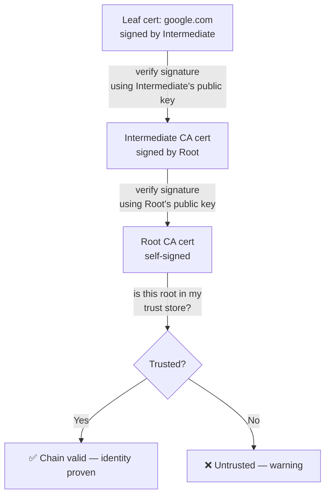
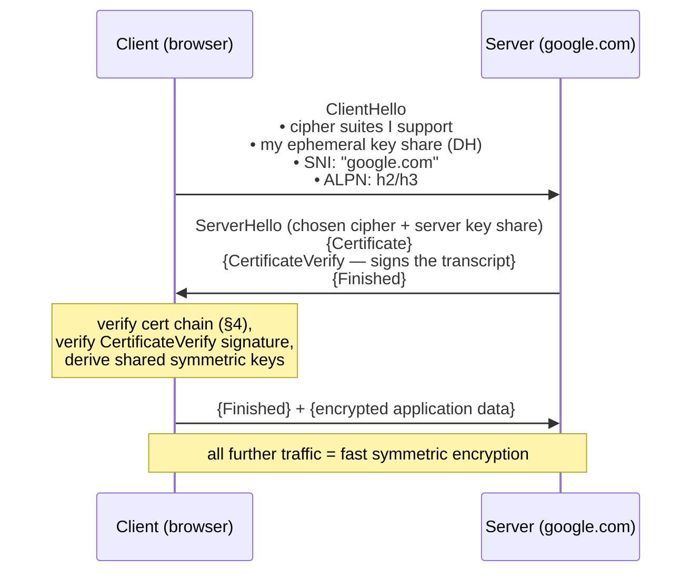

# 🔐 Deep Dive: TLS, Certificates & the Chain of Trust

> **The one idea to keep:** A certificate doesn't encrypt anything. It answers a single
> question — **"is the machine I'm talking to *really* who it claims to be?"** — by having a
> party your device already trusts (a **Certificate Authority**) cryptographically **vouch**
> that a specific public key belongs to `google.com`. Encryption is a *separate* step the
> handshake does afterward. Keep "**identity** (certificates) vs **secrecy** (encryption)"
> apart and TLS stops being mysterious.

This continues the certificate thread from the [DNS deep-dive](deep-dive-dns.md) and
[google.com Phase 6](deep-dive-loading-google.md). We'll build from "what problem are we even
solving" up through the handshake, chaining, SNI, revocation, and transparency. Module 06 will
formalize it.

---

## 1. Two problems, don't confuse them

When you connect to `google.com` over an untrusted internet, you need **two** guarantees:

1. **Confidentiality** — nobody on the path can read your traffic. → solved by **encryption**.
2. **Authentication** — you're actually talking to Google, not an impostor who intercepted
   you. → solved by **certificates**.

Here's why #2 matters even if you have #1: encryption alone is useless if you encrypted your
data *to an attacker*. A man-in-the-middle could happily establish an encrypted channel with
you while pretending to be Google. **Certificates exist to stop exactly that** — to prove
identity *before* you trust the encryption keys.

TLS (Transport Layer Security — the "S" in HTTPS, successor to SSL) does both, in that order:
**authenticate, then encrypt.**

---

## 2. The crypto you must know first (just enough)

Everything rests on two building blocks.

### Symmetric encryption
One shared secret key encrypts *and* decrypts (e.g. **AES**, **ChaCha20**). Fast, great for
bulk data — but both sides need the *same* key, and how do you agree on it over a wire an
attacker is watching?

### Asymmetric (public-key) crypto
A **key pair**: a **public key** (shareable with the world) and a **private key** (kept
secret). Their mathematical relationship gives two magic properties:

- **Encryption:** anything encrypted with the *public* key can only be decrypted with the
  *private* key. → anyone can send *you* a secret.
- **Signatures:** anything signed with the *private* key can be *verified* by anyone using the
  *public* key. → proves the holder of the private key produced it, and it wasn't altered.

> **The combination TLS uses:** asymmetric crypto is slow, so it's used only briefly — to
> **authenticate** (signatures) and to **agree on a shared symmetric key**. Then all the
> actual data uses fast **symmetric** encryption. Best of both worlds.

The signature property is the foundation of certificates: a CA **signs** a statement, and
anyone can verify that signature with the CA's public key.

---

## 3. What a certificate actually *is*

A TLS certificate (format: **X.509**) is essentially a **signed statement**:

> *"The public key `ABC123…` belongs to `google.com`. — signed, [a Certificate Authority]"*

Its real contents:

| Field | Meaning |
|-------|---------|
| **Subject** | who this cert is for (the domain / entity) |
| **Subject Public Key** | the entity's public key |
| **Subject Alternative Names (SAN)** | all hostnames this cert is valid for (the modern source of truth, replacing the old "Common Name") |
| **Issuer** | which CA issued & signed it |
| **Validity period** | not-before / not-after dates |
| **Serial number** | unique ID (used for revocation) |
| **Key usage / Extended Key Usage** | what the key may be used for (e.g. "server auth") |
| **CA signature** | the issuer's cryptographic signature over all the above |

That last line is everything: the certificate is only meaningful because a CA **signed** it.
Anyone can *make* a certificate claiming to be Google (a "self-signed" cert); what they can't
do is get a *trusted CA* to sign it.

---

## 4. The trust problem and the chain of trust

So a CA vouches for Google. But **why do you trust the CA?** And who vouches for *them*? This
is where the **chain** comes in — your specific question.

There are three tiers of certificate:

```
   ROOT CA cert  (self-signed; pre-installed & trusted by your OS/browser)
        │  signs
        ▼
   INTERMEDIATE CA cert  (signed by the root)
        │  signs
        ▼
   LEAF / end-entity cert  (signed by the intermediate) ── this is google.com's cert
```

- **Root CA:** the anchor of trust. Its certificate is **self-signed** (it vouches for
  itself) — and that's fine *because it's pre-loaded into your device's trust store* by your
  OS/browser vendor. There are ~100–150 trusted roots on a typical machine. The root's
  private key is kept **offline in a vault (HSM)** and almost never used directly.
- **Intermediate CA:** the root signs one or more intermediates, which do the day-to-day
  signing of customer certs. Why the extra layer? So the precious **root key stays offline** —
  if an intermediate is compromised, you revoke *it* without having to replace the root (which
  would be catastrophic, since it's baked into billions of devices).
- **Leaf (end-entity) cert:** the actual `google.com` certificate, signed by an intermediate.

### How chaining is verified

When you connect, the server sends its **leaf cert + the intermediate(s)** (but *not* the
root — you already have that). Your browser then verifies the chain **bottom-up**:



1. Is the **leaf** correctly signed by the **intermediate**? (check with the intermediate's
   public key)
2. Is the **intermediate** correctly signed by the **root**? (check with the root's public key)
3. Is that **root** in my **trusted store**? If yes → the whole chain is trustworthy.

<figure class="anim-fig">
<svg viewBox="0 0 720 300" role="img" aria-label="Animation: verifying the certificate chain bottom-up — leaf signed by intermediate, intermediate by root, root trusted — then the chain turns valid.">
<style>
.t1-card{stroke-width:2}
.t1-l{font-size:12px;font-weight:700}
.t1-s{font-size:9.5px;fill:#8595a7}
.t1-ok{font-size:16px;font-weight:700;fill:#16a34a}
.t1-g1{animation:t1g1 7s linear infinite}
.t1-g2{animation:t1g2 7s linear infinite}
.t1-g3{animation:t1g3 7s linear infinite}
.t1-b1{animation:t1g1 7s linear infinite}
.t1-b2{animation:t1g2 7s linear infinite}
.t1-b3{animation:t1g3 7s linear infinite}
.t1-fin{animation:t1fin 7s linear infinite}
.t1-c1{animation:t1c1 7s linear infinite}
.t1-c2{animation:t1c2 7s linear infinite}
.t1-c3{animation:t1c3 7s linear infinite}
@keyframes t1g1{0%,26%{opacity:0}30%,100%{opacity:1}}
@keyframes t1g2{0%,50%{opacity:0}54%,100%{opacity:1}}
@keyframes t1g3{0%,74%{opacity:0}78%,100%{opacity:1}}
@keyframes t1fin{0%,82%{opacity:0}88%,100%{opacity:1}}
@keyframes t1c1{0%,4%{opacity:1}28%,100%{opacity:0}}
@keyframes t1c2{0%,30%{opacity:0}34%,52%{opacity:1}56%,100%{opacity:0}}
@keyframes t1c3{0%,56%{opacity:0}60%,78%{opacity:1}82%,100%{opacity:0}}
</style>
<text x="12" y="18" style="font-size:13px;font-weight:700;fill:#2c7be5">Verify the chain bottom-up, until you reach a root you already trust</text>
<!-- trust store tag -->
<rect x="500" y="34" width="200" height="24" rx="6" fill="#dcfce7" stroke="#16a34a" stroke-width="1.5"/><text x="600" y="51" text-anchor="middle" style="font-size:10.5px;font-weight:700;fill:#166534">🔒 your trust store (pre-installed)</text>
<!-- Root -->
<rect class="t1-card" x="230" y="66" width="240" height="52" rx="9" fill="#fef9c3" stroke="#f59e0b"/>
<rect class="t1-g3 t1-card" x="230" y="66" width="240" height="52" rx="9" fill="#dcfce7" stroke="#16a34a"/>
<text class="t1-l" x="350" y="88" text-anchor="middle" fill="#a16207">Root CA — self-signed</text><text class="t1-s" x="350" y="104" text-anchor="middle">trusted because it's in your store</text>
<text class="t1-ok t1-b3" x="452" y="98" text-anchor="middle">✓</text>
<!-- Intermediate -->
<rect class="t1-card" x="230" y="140" width="240" height="52" rx="9" fill="#e0e7ff" stroke="#6366f1"/>
<rect class="t1-g2 t1-card" x="230" y="140" width="240" height="52" rx="9" fill="#dcfce7" stroke="#16a34a"/>
<text class="t1-l" x="350" y="162" text-anchor="middle" fill="#4338ca">Intermediate CA</text><text class="t1-s" x="350" y="178" text-anchor="middle">signed by the Root</text>
<text class="t1-ok t1-b2" x="452" y="172" text-anchor="middle">✓</text>
<!-- Leaf -->
<rect class="t1-card" x="230" y="214" width="240" height="52" rx="9" fill="#dbeafe" stroke="#2c7be5"/>
<rect class="t1-g1 t1-card" x="230" y="214" width="240" height="52" rx="9" fill="#dcfce7" stroke="#16a34a"/>
<text class="t1-l" x="350" y="236" text-anchor="middle" fill="#1d4ed8">Leaf — google.com</text><text class="t1-s" x="350" y="252" text-anchor="middle">signed by the Intermediate</text>
<text class="t1-ok t1-b1" x="452" y="246" text-anchor="middle">✓</text>
<!-- upward arrows -->
<line x1="200" y1="240" x2="200" y2="192" stroke="#94a3b8" stroke-width="2"/><polygon points="196,196 204,196 200,188" fill="#94a3b8"/>
<line x1="200" y1="166" x2="200" y2="118" stroke="#94a3b8" stroke-width="2"/><polygon points="196,122 204,122 200,114" fill="#94a3b8"/>
<line x1="480" y1="92" x2="498" y2="60" stroke="#16a34a" stroke-width="2"/>
<!-- step captions -->
<text class="t1-c1" x="360" y="288" text-anchor="middle" style="font-size:11px;font-weight:700;fill:#2c7be5">① Leaf signed by Intermediate? verify with Intermediate's public key ✓</text>
<text class="t1-c2" x="360" y="288" text-anchor="middle" style="font-size:11px;font-weight:700;fill:#4338ca">② Intermediate signed by Root? verify with Root's public key ✓</text>
<text class="t1-c3" x="360" y="288" text-anchor="middle" style="font-size:11px;font-weight:700;fill:#a16207">③ Is that Root in my trust store? yes ✓</text>
<text class="t1-fin" x="360" y="288" text-anchor="middle" style="font-size:12px;font-weight:700;fill:#16a34a">✅ chain valid — identity proven</text>
</svg>
<figcaption>Each cert is checked against the one above it, until the chain reaches a <b>root you already trust</b>. Break any link — bad signature, missing intermediate, untrusted root — and the whole thing fails.</figcaption>
</figure>

> **This is exactly like a chain of vouching in real life:** you trust a stranger's ID because
> it's signed by a notary, whom you trust because they're licensed by a state authority you
> already recognize. Break any link (a bad signature, an untrusted root, a missing
> intermediate) and the whole chain fails. **A very common real-world bug is a server
> forgetting to send the intermediate** — it works in some clients (which cache intermediates)
> and fails in others, a classic "works on my machine" TLS headache.

---

## 5. The TLS handshake, step by step

Now the full sequence. This is **TLS 1.3** (the modern default — **1 round-trip**); I'll note
how 1.2 differs.



<figure class="anim-fig">
<svg viewBox="0 0 720 300" role="img" aria-label="Animation: the TLS 1.3 handshake — ClientHello, ServerHello with certificate, verification, then encrypted data in one round-trip.">
<style>
.h3-line{stroke:#cbd5e1;stroke-width:2}
.h3-h{font-size:13px;font-weight:700;fill:#1f2d3d}
.h3-req{stroke:#2c7be5;stroke-width:2.5}
.h3-res{stroke:#16a34a;stroke-width:2.5}
.h3-txt{font-size:10px;font-weight:600;fill:#334155}
.h3-1{animation:h3f1 8s linear infinite}
.h3-2{animation:h3f2 8s linear infinite}
.h3-3{animation:h3f3 8s linear infinite}
.h3-4{animation:h3f4 8s linear infinite}
.h3-5{animation:h3f5 8s linear infinite}
@keyframes h3f1{0%,6%{opacity:0}11%,100%{opacity:1}}
@keyframes h3f2{0%,30%{opacity:0}35%,100%{opacity:1}}
@keyframes h3f3{0%,54%{opacity:0}59%,100%{opacity:1}}
@keyframes h3f4{0%,70%{opacity:0}75%,100%{opacity:1}}
@keyframes h3f5{0%,86%{opacity:0}91%,100%{opacity:1}}
</style>
<text x="12" y="18" class="h3-h" fill="#2c7be5">TLS 1.3 handshake — authenticate, then encrypt (1 round-trip)</text>
<text class="h3-h" x="150" y="42" text-anchor="middle">Client</text>
<text class="h3-h" x="580" y="42" text-anchor="middle">Server (google.com)</text>
<line class="h3-line" x1="150" y1="50" x2="150" y2="270"/>
<line class="h3-line" x1="580" y1="50" x2="580" y2="270"/>
<!-- 1 ClientHello -->
<g class="h3-1">
<line class="h3-req" x1="150" y1="76" x2="580" y2="76"/><polygon points="580,71 580,81 589,76" fill="#2c7be5"/>
<text class="h3-txt" x="360" y="70" text-anchor="middle" fill="#2c7be5">ClientHello — ciphers · key share · SNI · ALPN</text>
</g>
<!-- 2 ServerHello + cert -->
<g class="h3-2">
<line class="h3-res" x1="580" y1="118" x2="150" y2="118"/><polygon points="150,113 150,123 141,118" fill="#16a34a"/>
<text class="h3-txt" x="360" y="104" text-anchor="middle" fill="#16a34a">ServerHello · key share</text>
<text class="h3-txt" x="360" y="132" text-anchor="middle" fill="#16a34a">Certificate + CertificateVerify (signs transcript) + Finished</text>
</g>
<!-- 3 verify note -->
<g class="h3-3">
<rect x="30" y="150" width="240" height="46" rx="8" fill="#eff6ff" stroke="#2c7be5" stroke-width="1.5"/>
<text class="h3-txt" x="150" y="168" text-anchor="middle" fill="#1d4ed8">Client: verify cert chain +</text>
<text class="h3-txt" x="150" y="184" text-anchor="middle" fill="#1d4ed8">signature, derive shared keys</text>
</g>
<!-- 4 Finished + data -->
<g class="h3-4">
<line class="h3-req" x1="150" y1="224" x2="580" y2="224"/><polygon points="580,219 580,229 589,224" fill="#2c7be5"/>
<text class="h3-txt" x="360" y="218" text-anchor="middle" fill="#2c7be5">Finished + 🔒 encrypted application data</text>
</g>
<!-- 5 secure banner -->
<g class="h3-5">
<rect x="150" y="248" width="430" height="30" rx="6" fill="#f0fdf4" stroke="#16a34a" stroke-width="1.5"/>
<text x="365" y="268" text-anchor="middle" style="font-size:12px;font-weight:700;fill:#166534">🔒 secure channel — all further traffic is fast symmetric encryption</text>
</g>
</svg>
<figcaption>One round-trip: the client offers keys + SNI, the server proves its identity with a <b>certificate + a signature</b> (CertificateVerify), the client verifies and derives keys, and encrypted data flows. Ephemeral keys give <b>forward secrecy</b>.</figcaption>
</figure>

Walking it:

1. **ClientHello** — the client offers: the cipher suites it supports, an **ephemeral
   Diffie-Hellman key share** (its half of the key agreement), **SNI** (which site it wants —
   Section 6), and **ALPN** (which app protocol, e.g. HTTP/2 vs HTTP/3).
2. **ServerHello** — the server picks a cipher and sends **its** key share. From this point,
   both sides can compute the shared secret, so *everything after is already encrypted*. Inside
   that it sends:
   - **Certificate** — its leaf + intermediate chain (Section 3–4).
   - **CertificateVerify** — the server **signs a hash of the entire handshake so far** with
     its certificate's **private key**. This is the linchpin: it *proves the server actually
     holds the private key* matching the public key in the cert. Without this, anyone could
     replay a copied certificate. (Having the cert is public; proving you hold its private key
     is the real authentication.)
   - **Finished** — a check that the handshake wasn't tampered with.
3. **Client verifies** the certificate chain, checks the CertificateVerify signature, and
   derives the same shared keys.
4. **Client Finished + application data** — done. All further traffic uses fast **symmetric**
   encryption (e.g. AES-GCM) with the freshly agreed key.

### Key agreement & forward secrecy
The shared symmetric key is created via **(Elliptic-Curve) Diffie-Hellman Ephemeral —
(EC)DHE**: both sides mix their key shares to derive a secret **that never travels on the
wire**. Because the keys are **ephemeral** (fresh per session, then discarded), even if the
server's private key is stolen *later*, past recorded sessions **cannot be decrypted**. This
property is **forward secrecy**, and it's why TLS 1.3 *mandates* ephemeral DH.

### TLS 1.2 vs 1.3 (why 1.3 is better)
- **1.2** took **2 round-trips** and allowed old **RSA key transport** (client encrypts the
  secret to the server's public key) — which has *no* forward secrecy and was a footgun.
- **1.3** removed the legacy/insecure options, cut it to **1-RTT**, encrypts more of the
  handshake, and supports **0-RTT resumption** (send data on the very first packet when
  reconnecting to a known server — fast, with a replay-risk caveat).

> ⚡ **Latency note.** This handshake is 1 extra round-trip on top of TCP (Module 02/the
> google.com budget). **Session resumption** and **0-RTT** exist to eliminate it on repeat
> visits, and **QUIC/HTTP-3** folds TLS 1.3 *into* the transport handshake so setup is
> 1-RTT total. Certificates and their verification are on the critical path of every new
> connection — which is why so much engineering goes into avoiding *extra* lookups (see OCSP
> stapling, Section 7).

---

## 6. SNI — Server Name Indication (your specific question)

**The problem:** one server IP often hosts *hundreds* of HTTPS sites (shared hosting, CDNs).
When the `ClientHello` arrives, the server must send *a* certificate — but **which site's
cert?** It can't know yet, because the request ("GET google.com") comes *after* the TLS
handshake, inside the encryption.

**SNI** solves this: the client puts the **hostname it wants right in the ClientHello**
("I'm here for `google.com`"), so the server knows which certificate to present. It's the TLS
equivalent of HTTP's `Host` header — "which of your many sites do I want."

<figure class="anim-fig">
<svg viewBox="0 0 720 230" role="img" aria-label="Animation: SNI. The ClientHello names the wanted host so a server hosting many sites picks the matching certificate.">
<style>
.sn-t{font-size:11px;font-weight:700;fill:#1f4a7a}
.sn-card{fill:#f1f5f9;stroke:#cbd5e1;stroke-width:1.5}
.sn-ch{animation:snch 6s linear infinite}
.sn-sel{animation:snsel 6s linear infinite}
.sn-cert{animation:sncert 6s linear infinite}
.sn-c1{animation:snc1 6s linear infinite}
.sn-c2{animation:snc2 6s linear infinite}
@keyframes snch{0%{opacity:0;transform:translate(0,0)}6%{opacity:1}34%{opacity:1;transform:translate(280px,0)}38%,100%{opacity:0;transform:translate(280px,0)}}
@keyframes snsel{0%,38%{opacity:0}44%,100%{opacity:1}}
@keyframes sncert{0%,50%{opacity:0;transform:translate(0,0)}55%{opacity:1}86%{opacity:1;transform:translate(-300px,-53px)}90%,100%{opacity:0;transform:translate(-300px,-53px)}}
@keyframes snc1{0%,40%{opacity:1}44%,100%{opacity:0}}
@keyframes snc2{0%,42%{opacity:0}46%,100%{opacity:1}}
</style>
<text x="12" y="18" style="font-size:13px;font-weight:700;fill:#2c7be5">SNI: the ClientHello names the site, so the server picks the right cert</text>
<!-- client -->
<rect x="30" y="92" width="90" height="46" rx="8" fill="#eef5ff" stroke="#2c7be5" stroke-width="2"/><text class="sn-t" x="75" y="119" text-anchor="middle">Client</text>
<!-- server holding many certs -->
<rect x="400" y="40" width="300" height="170" rx="10" fill="#f8fafc" stroke="#64748b" stroke-width="2"/><text class="sn-t" x="550" y="60" text-anchor="middle" style="fill:#334155">One server IP : 443</text>
<rect class="sn-card" x="420" y="72" width="260" height="34" rx="6"/><text class="sn-t" x="550" y="94" text-anchor="middle" style="fill:#8595a7">cert: a-shop.com</text>
<rect class="sn-card" x="420" y="114" width="260" height="34" rx="6"/><text class="sn-t" x="550" y="136" text-anchor="middle" style="fill:#8595a7">cert: blog.net</text>
<rect class="sn-card" x="420" y="156" width="260" height="34" rx="6"/><text class="sn-t" x="550" y="178" text-anchor="middle" style="fill:#8595a7">cert: google.com</text>
<!-- selection highlight on google.com card -->
<rect class="sn-sel" x="420" y="156" width="260" height="34" rx="6" fill="#dcfce7" stroke="#16a34a" stroke-width="2.5"/><text class="sn-sel sn-t" x="550" y="178" text-anchor="middle" style="fill:#166534">cert: google.com ✓ selected</text>
<!-- ClientHello token -->
<g class="sn-ch"><rect x="122" y="100" width="120" height="26" rx="5" fill="#2c7be5"/><text x="182" y="117" text-anchor="middle" style="font-size:10px;font-weight:700;fill:#fff">SNI: google.com</text></g>
<!-- returning cert token -->
<g class="sn-cert"><rect x="415" y="160" width="90" height="24" rx="5" fill="#16a34a"/><text x="460" y="177" text-anchor="middle" style="font-size:9px;font-weight:700;fill:#fff">google cert</text></g>
<!-- captions -->
<text class="sn-c1" x="360" y="222" text-anchor="middle" style="font-size:11px;font-weight:700;fill:#2c7be5">① ClientHello announces the wanted host — in plaintext (the privacy leak ECH fixes)</text>
<text class="sn-c2" x="360" y="222" text-anchor="middle" style="font-size:11px;font-weight:700;fill:#166534">② server matches it and returns the google.com certificate ✓</text>
</svg>
<figcaption>Without SNI a multi-site server couldn't know which certificate to present. The tradeoff: classic SNI is <b>plaintext</b>, so observers learn which site you're visiting — which is exactly what <b>ECH</b> encrypts.</figcaption>
</figure>

**The catch — a privacy leak:** classic SNI is sent **in plaintext** (it has to be, to select
the cert *before* keys exist). So anyone watching the wire — your ISP, a network censor — can
see **which sites you visit**, even though the *content* is encrypted. (DNS can leak this too;
encrypted DNS closes that half.)

**The modern fix — ECH (Encrypted Client Hello):** the client fetches a public key for the
server (published via a DNS `HTTPS` record) and uses it to **encrypt the sensitive part of the
ClientHello**, including SNI. An observer then sees only a generic "fronting" name, not the
real destination. ECH is the successor to the earlier, abandoned **ESNI**. This is an active
frontier of web privacy.

---

## 7. Certificate validation — everything the browser checks

Verifying the chain (Section 4) is necessary but not sufficient. The browser also checks:

1. **Hostname match** — does the cert's **SAN** list actually include the site you asked for?
   (A valid cert for `evil.com` can't authenticate `google.com`.)
2. **Validity dates** — not expired, not "not yet valid." (Expired certs are the #1 cause of
   real-world outages — a forgotten renewal.)
3. **Revocation** — has this cert been *revoked* before its expiry (e.g. its key was stolen)?
   Three mechanisms, each with tradeoffs:
   - **CRL (Certificate Revocation List):** the CA publishes a big list of revoked serials.
     Bulky, slow to update.
   - **OCSP (Online Certificate Status Protocol):** the browser asks the CA "is serial X still
     good?" in real time. Problem: it's an *extra network round-trip on every connection* (bad
     for latency) and leaks which sites you visit to the CA.
   - **OCSP stapling:** the *server* periodically fetches a signed "still valid" proof from the
     CA and **staples it into the handshake** — so the client gets fresh revocation info with
     **no extra lookup**. This is the preferred approach.
   - The industry is increasingly moving to **short-lived certificates** (days, not a year) so
     revocation matters less — an expired-soon cert limits the damage window automatically.
4. **Certificate Transparency (CT)** — every legitimately-issued cert must be logged in public,
   append-only **CT logs**. The cert carries **SCTs (Signed Certificate Timestamps)** proving
   it was logged; Chrome and others **reject certs without CT**. Why it matters: if a CA
   mis-issues a cert for your domain (maliciously or by mistake), it shows up in the public log
   and you can *detect* it. CT turned CA misbehavior from invisible to auditable.

---

## 8. Types of certificates & the ecosystem

- **Validation levels** (how hard the CA checked you):
  - **DV (Domain Validated):** proves you control the domain (e.g. via a DNS/HTTP challenge).
    Fast, free, automated. The vast majority of the web.
  - **OV (Organization Validated):** CA also verifies the organization exists.
  - **EV (Extended Validation):** heaviest vetting. (The green company name in the URL bar is
    largely gone from browsers now — EV's UX advantage faded.)
- **Coverage:**
  - **Single-name**, **wildcard** (`*.example.com`), and **multi-domain (SAN)** certs.
- **Self-signed:** you sign your own cert (no CA). Fine for internal/testing, but browsers
  won't trust it → the "not private" warning. Adding it to a trust store manually is how
  internal tools work.
- **How certs get issued today — ACME / Let's Encrypt:** the **ACME protocol** automates the
  whole DV issuance/renewal via a challenge that proves domain control. **Let's Encrypt** made
  HTTPS free and automatic, which is *the* reason the web went ~fully HTTPS. Tools like
  Certbot/Caddy renew certs with zero human involvement.
- **Governance:** the **CA/Browser Forum** sets the rules (the "Baseline Requirements") that
  CAs and browsers agree on. **PKI (Public Key Infrastructure)** is the umbrella term for this
  whole system of keys, certs, CAs, and policies.

---

## 9. Other must-know concepts

- **mTLS (mutual TLS):** normally only the *server* proves identity. In mTLS the **client also
  presents a certificate**, so both sides authenticate. Heavily used in **service-to-service**
  communication (microservices, zero-trust networks, banking APIs).
- **HSTS** (met in the google.com dive): a header telling the browser "only ever use HTTPS for
  me," preventing downgrade attacks. **HSTS preload** bakes this into the browser.
- **Cipher suite:** the negotiated bundle of algorithms, e.g. `TLS_AES_128_GCM_SHA256` (key
  exchange is separate in 1.3; the suite names the symmetric cipher + hash).
- **Certificate pinning:** an app hard-codes which cert/CA it will accept, so even a rogue-but-
  trusted CA can't MITM it. (Browser-level HPKP was deprecated as too dangerous; pinning lives
  on in mobile apps.)
- **Root store management:** OS/browser vendors curate which roots are trusted and *distrust*
  CAs that misbehave (this has really happened — e.g. Symantec, DigiNotar), instantly
  invalidating their certs across the internet.

### The threats this all defends against
- **Man-in-the-middle:** defeated by cert authentication + forward secrecy.
- **Rogue / compromised CA (mis-issuance):** defeated/detected by CT, pinning, and root-store
  distrust.
- **Downgrade attacks:** defeated by HSTS and TLS 1.3's cleanups.
- **Stolen server key → decrypt past traffic:** defeated by forward secrecy.

---

## Check your understanding

<div class="quiz">
<p class="q">During the handshake the server sends its certificate. Why does it <em>also</em> send a "CertificateVerify" that signs the handshake transcript?</p>
<ul class="options">
<li>To encrypt the application data.</li>
<li data-correct="true">To prove it actually holds the private key matching the certificate's public key — otherwise anyone could replay a copied certificate.</li>
<li>To compress the certificate for speed.</li>
</ul>
<div class="explain">A certificate is public — anyone can copy Google's cert. What an impostor
can't do is produce a valid signature with the matching <em>private</em> key. CertificateVerify
signs the handshake so far with that private key, proving possession. That's the actual moment
of authentication.</div>
</div>

<div class="quiz">
<p class="q">Your browser trusts a Root CA whose certificate is self-signed. Isn't self-signing insecure?</p>
<ul class="options">
<li>Yes, root certs are a known vulnerability.</li>
<li data-correct="true">No — the root is trusted because it's pre-installed in your device's trust store by the OS/browser, not because of its signature. The self-signature just completes the format.</li>
<li>No, because roots use stronger math than other certs.</li>
</ul>
<div class="explain">Trust in a root comes from it being <em>distributed in advance</em> by
your OS/browser vendor and stored in the trust store. The self-signature is expected; what
matters is whether that root is in your trusted set. Everything chains up to those pre-trusted
anchors.</div>
</div>

<div class="quiz">
<p class="q">What does SNI reveal to a network observer, even over HTTPS?</p>
<ul class="options">
<li>Your password.</li>
<li>The full URL and page content.</li>
<li data-correct="true">The hostname you're connecting to — because classic SNI is sent in plaintext in the ClientHello (which is what ECH aims to fix).</li>
</ul>
<div class="explain">SNI must name the site before encryption keys exist (so the server can
pick the right cert), so it travels in plaintext. An observer learns <em>which site</em> you
visit (not the content). Encrypted Client Hello (ECH) encrypts it using a key published via
DNS, closing that leak.</div>
</div>

---

## Exercises

1. **See a real chain.** Run:
   `openssl s_client -connect google.com:443 -servername google.com` and read the
   "Certificate chain" section — you'll see leaf → intermediate, with subjects and issuers.
   Notice the issuer of each cert is the subject of the next one up.

2. **Inspect a cert in the browser.** Click the padlock → certificate details. Find the
   **SAN** list, the **issuer**, the **validity dates**, and walk the **chain** tabs
   (leaf/intermediate/root).

3. **Prove SNI matters.** Try `openssl s_client -connect <shared-host-IP>:443` *without*
   `-servername`, then *with* it — on shared hosting you'll get different (or wrong) certs,
   showing the server needs SNI to choose.

4. **Watch the handshake in Wireshark.** Filter `tls.handshake` and load an HTTPS site. Find
   the **ClientHello** (expand it to see the SNI and cipher list) and the **ServerHello +
   Certificate**. In TLS 1.3 you'll see how little is in the clear.

5. **Check Certificate Transparency.** Look up a domain on a public CT log search (e.g.
   crt.sh) — you'll see *every* cert ever issued for it. Great for spotting unexpected certs.

6. **Explain it back.** In a note: *"Why doesn't encryption alone make HTTPS safe, and what
   exactly does a certificate add?"* Nail "authentication vs confidentiality" and you've got
   this module.

---

## Cheat-sheet

```
TLS = authenticate (certificates) THEN encrypt.  Two different guarantees:
  CONFIDENTIALITY (encryption)  vs  AUTHENTICATION (certificates)

CRYPTO:
  symmetric (AES/ChaCha): one shared key, fast → bulk data
  asymmetric (pub/priv):  encrypt-to-public / sign-with-private → auth + key agreement
  TLS uses asymmetric briefly to authenticate + agree a symmetric key, then symmetric for data

CERTIFICATE (X.509) = signed statement: "public key K belongs to google.com" — signed by a CA
  fields: Subject · Public Key · SAN (valid hostnames) · Issuer · Validity · Serial · Signature

CHAIN OF TRUST (verify bottom-up):
  Leaf (google.com) —signed by→ Intermediate CA —signed by→ Root CA (self-signed, pre-trusted)
  server sends leaf + intermediate; client already has the root in its TRUST STORE
  intermediates exist to keep the root key OFFLINE (revoke an intermediate, not the root)

HANDSHAKE (TLS 1.3, 1-RTT):
  ClientHello (ciphers, DH key share, SNI, ALPN)
  ServerHello (cipher + key share) + Certificate + CertificateVerify(sign transcript) + Finished
  client verifies chain + signature, derives keys; Finished + encrypted data
  CertificateVerify = PROOF the server holds the cert's private key (the real auth moment)
  (EC)DHE ephemeral keys → FORWARD SECRECY (stolen key can't decrypt past sessions)
  1.2 = 2-RTT + optional RSA (no fwd secrecy); 1.3 = 1-RTT, 0-RTT resume

SNI = hostname in ClientHello so a multi-site server picks the right cert
  plaintext → leaks which site you visit → ECH encrypts it (key via DNS)

VALIDATION checks: chain-to-trusted-root · hostname (SAN) · dates · REVOCATION · CT
  revocation: CRL (lists) / OCSP (live query) / OCSP STAPLING (server attaches proof, no extra RTT)
  Certificate Transparency: certs logged publicly (SCTs) → mis-issuance is detectable

ECOSYSTEM: DV/OV/EV levels · wildcard/SAN · self-signed · ACME/Let's Encrypt (free+auto) ·
  mTLS (client cert too) · HSTS · pinning · PKI (the whole system) · CA/Browser Forum
```

---

**Related:** [🔎 How DNS works](deep-dive-dns.md) (ECH keys ride in DNS; DNSSEC vs TLS) ·
[🌐 hitting google.com](deep-dive-loading-google.md) (Phase 6) · Module 05 (TCP, the transport
under TLS) · Module 06 (HTTP/TLS formalized).
